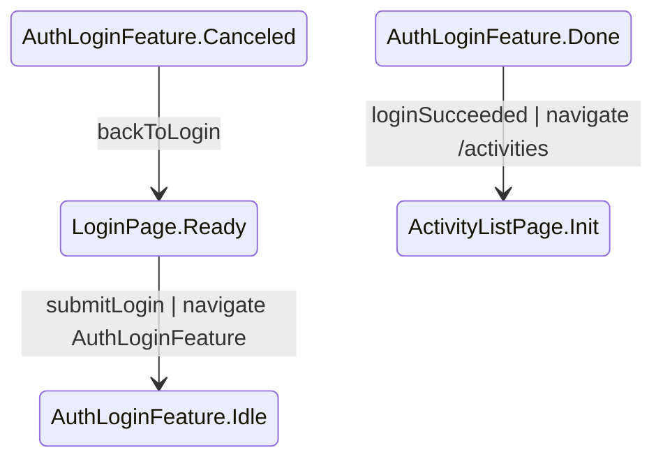
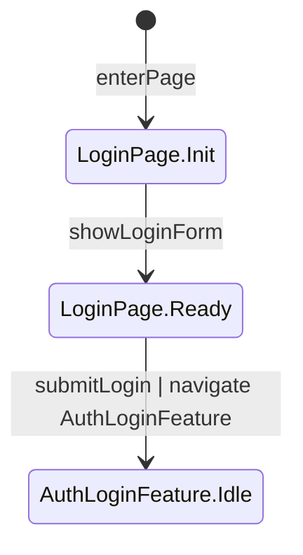
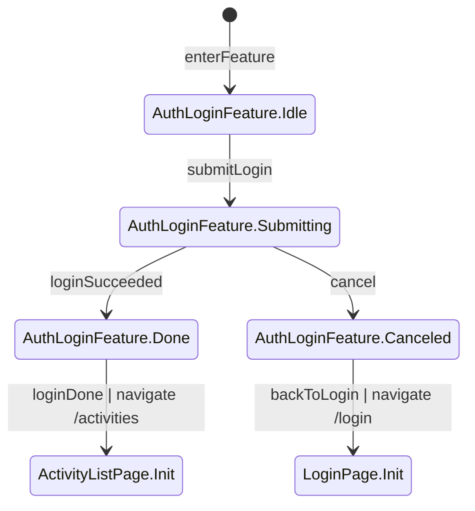

## 目標
根據 Step 1 完整 Spec（含主動補齊的功能/角色/流程），輸出分層 Mermaid stateDiagram-v2，並確保層級關係正確且可追溯。

- 本步驟只產出「純 Step 2 diagrams」，**不得**加入 `%% verify:`。
- Step 2 產物是後續 `spec-step3-verify` 的唯一 diagram 來源；若圖本身需要重做，必須先修正 Step 2，再進入 Step 3。

## 輸入定義（必須包含）
- Step 1 完整 Spec
- Spec 中的頁面名稱、角色、狀態與主要操作

## 輸出位置（必須寫檔）
- 將結果寫入工作目錄：/outputs/step2-diagrams.md
- 回覆中僅提供完成訊息與檔案連結

## 固定分層結構
```
[Entry State]
        ↓
[Page State Machine]
        ↓
[Role-specific Page State]
        ↓
[Feature / Function State Machine]
        ↓
[回到 Page 或跳轉其他 Page，或跳轉到其他 Feature]
```

## Entry 概念（必遵守）
- 不使用 Global App State 概念。
- 系統唯一入口為 Entry Diagram（`## ① Entry State Machine`）。
- Entry 必須定義「進站」會看到什麼、做什麼，並在一開始就**決定身分（identity）**，再導向對應的第一個 Page Diagram。
- **不允許** 在 Entry 內做任何「Session / token 既有登入狀態」的前提假設或自動分流（例如 `detectSessionMember`、`detectSessionAdmin`、`resolveRoleFromSession` 這類轉移）。
        - 本規範下：Entry 的「非 Guest 身分」必須透過 **Step 1 Spec 定義的身分取得流程（Authentication Onboarding）** 才能成立（例如 login、register、單一 auth page、login→register、register→login、或其他被 Step 1 Spec 明確定義的設計）。
        - 因此 Step 2 **不得**硬性假設系統一定存在 `register`，也不得假設 `login` 與 `register` 一定是兩個獨立頁面。
- Entry **必須提供**「取得非 Guest 身分」的起始路徑（至少 1 條），且其目標（Page/route/Feature）必須**完全依 Step 1 Spec 的 Page Inventory / Route Access Control / User Flow 定義**。
        - 若 Step 1 Spec 定義有獨立 `LoginPage`：Entry 可提供 `chooseLogin --> LoginPage.Init : ... | navigate /login`。
        - 若 Step 1 Spec 定義有獨立 `RegisterPage`：Entry 可提供 `chooseRegister --> RegisterPage.Init : ... | navigate /register`。
        - 若 Step 1 Spec 定義為單一 `AuthPage`（同頁可切換 login/register）：Entry 只需導向該 `AuthPage.Init`（`navigate <authRoute>`）。
        - 若 Step 1 Spec 定義必須先到 login 才能去 register（或反之）：Entry 只需導向「第一個被定義的入口頁」，後續頁間導向由 Page diagram 自行描述。
- Entry 導向規則：
        - `Guest`（對外公開身分）：可直接導向 Step 1 Spec 定義的「公開首頁/公開清單頁」（例如 `/activities`）。
        - `Member/Admin`：不得在 Entry 直接成立；必須先走 Step 1 Spec 定義的身分取得流程，並在對應的 Auth Feature 成功後才導向對應 landing page。
- Entry.Init 的概念建議（不強制 state 名稱，但需符合可追溯）：
        - `Entry.Init` 連到所有「公開可見選項」：例如 `continueAsGuest`、`chooseLogin`、`chooseRegister`。
        - `continueAsGuest` → 導向公開頁（例如 `/activities`）。
        - `chooseLogin/chooseRegister/chooseAuth` → 先完成 Step 1 Spec 定義的身分取得流程，再由結果（角色）導向對應第一頁。
- 所有系統狀態轉移都必須可由 Entry 開始追溯。
- Entry 不承擔各頁內部流程；頁面流程由各 Page Diagram 自行管理。

## 身分檢查與登入可追溯性（必遵守）

當任何一條 transition（或該 action）在 Step 1 Spec 中被限制為「特定身分/角色才可執行」（例如 Member-only、Admin-only），Step 2 必須滿足以下可追溯性：


### A) 未登入/角色不足的處理要在「路由/頁面入口」明確化
- 若使用者未登入就進入受保護頁（或觸發受保護導覽），必須導向 Step 1 Spec 定義的「身分取得入口頁」（例如 `LoginPage.Init`、`AuthPage.Init`）（`navigate <authRoute>`）並保留 returnTo；身分取得成功後「倒回」原本目標路由/頁面。
- 若已登入但角色不足（例如 Member 進入 Admin-only），必須在「頁面入口」或「導覽跳轉」上明確收斂：
        - 顯示 Forbidden（可用頁面內 state 表達，例如 `<PageId>.Forbidden`），或
        - 導回公開頁（例如 `/activities`）並提示無權限。
        - 不得反覆導向身分取得頁。

### B) returnTo（倒回當前頁面）的畫法（建議採用）
- 在「Step 1 Spec 定義的身分取得 Feature」diagram 內，用 `<AuthFeature>.Done --> <TargetPage>.Init : authSucceededReturn | navigate <route>` 表示身分取得成功後回到原本目標（以 Page diagram 的 Entry State 作為 target）。
- 若目標路由有參數（例如 `/activities/:activityId`），仍以該 Page 的 Entry State（例如 `ActivityDetailPage.Init`）作為 target。

## Diagram 內 State 所屬權（State Ownership）與隔離（必遵守）

### A) 一個 state 只能屬於一張 diagram
- Page diagram 的 state：只能使用該頁面的 state（建議命名 `<PageId>.<State>`，例如 `LoginPage.Ready`）。
- Feature diagram 的 state：只能使用該功能的 state（建議命名 `<FeatureName>.<State>`，例如 `AuthLoginFeature.Done`）。
- **禁止** 在某張 diagram 中「定義/混入」另一張 diagram 的 state 群組（例如在 `Login Page` diagram 內出現 `AuthLoginFeature.Done` 作為流程節點）。

### B) transition 必須寫在「source state 所屬的 diagram」內
- **硬性規則：任何 transition 的 source state 屬於哪張 diagram，就必須寫在那張 diagram 內。**
  - 例：`AuthLoginFeature.Done --> ActivityListPage.Init ...` 的 source 是 `AuthLoginFeature.Done`，所以這條 transition **只能**寫在 `AuthLoginFeature` 那張 Feature diagram。
  - 例：`LoginPage.Ready --> AuthLoginFeature.Idle ...` 的 source 是 `LoginPage.Ready`，所以這條 transition **只能**寫在 `Login Page` 那張 Page diagram。
- 這個規則的目的：避免把不同 diagram 的流程「混畫在同一張圖」，並且讓每個 state 的責任邊界清楚。

### C) 外部 state 只能出現在 target（跨圖導向）
- 在一張 diagram 中，允許把「其他 diagram 的 Entry State（路口）」當作 target 來表示跨圖導向。
- **禁止** 外部 state 出現在 source（出去的點）。
- 這樣可以保留「跨圖可達性」同時維持「source 所屬權」。

### D) 例子：正確/錯誤寫法

錯誤（混入外部 source state，不可）：


正確（`Login Page` 只保留以 `LoginPage.*` 為 source 的 transition）：


正確（`AuthLoginFeature` 內寫回跳與完成後導向，因為 source state 是 `AuthLoginFeature.*`）：
> 注意：以下範例以 `LoginPage`/`/login` 示意「身分取得流程」的一種常見拆法；實際專案是否存在 `register`、是否有獨立 `login` 頁、以及路由命名，**必須以 Step 1 Spec 的 Page Inventory / User Flow 定義為準**。


> 若確實需要「回到同頁特定狀態」（例如不重新載入，直接回 `LoginPage.Ready`），必須符合「跨 Diagram 進入非 Entry State」的例外規範，並在該 diagram 標題下方用文字註明例外原因（例如：取消登入回到既有表單狀態）。

### 跨 Diagram「進入點」硬性規範（必遵守）
- 跳轉一律是 **state 到 state** 的轉換，source 與 target 都必須是 state。
- transition label 一律使用：`<Action> | navigate <Target>`

**定義：Diagram Entry State（路口）**
- 每一張 diagram 都必須有且只有一個「入口 state」，也就是該 diagram 內 `[ * ] --> <SomeState> : enterPage/enterFeature/...` 的 target state。
- 下文稱此 `<SomeState>` 為該 diagram 的 **Entry State（路口）**。

**跨 diagram transition 的 target 限制**
- **從其他 diagram 跳進來（跨圖進入）時，target 必須是目的 diagram 的 Entry State（路口）**。
        - 例：任何外部 state 若要進入 `Login Page` 圖，只能指向 `LoginPage.Init`（假設 `[ * ] --> LoginPage.Init`）。
- **跨 diagram transition 的 source（出去的點）可以是任何 state**（不限制只能從特定 state 跳出）。

**例外（特殊狀況）— 允許跨圖進入非 Entry State**
- 只有在 Step 1 Spec 明確定義「完成彈跳視窗/子流程後要回到原畫面特定 state」等需求時，才允許跨圖進入非 Entry State。
- 這類例外必須同時滿足：
        - 在該 diagram 標題下方用文字註明「例外原因」與「回接 state」來源（對應 Spec 的段落/需求點）。
        - 仍遵守 `state --> state : <Action> | navigate <Target>` 格式（不得省略 `navigate`）。
        - 建議使用語意清楚的 action 名稱（例如 `closeModalReturn`、`verifyDoneReturn`），並且 target state 必須可讀且是「狀態」而非「動作」。

> 重要（新增）：例外只能作為「額外的回接路徑」。除 `## ① Entry State Machine` 外，每張 diagram 仍必須至少存在一條「跨圖進入」transition，且其 target 必須是該 diagram 的 Entry State（路口）(也就是 `[ * ] --> <SomeState>` 的 `<SomeState>`）；不得用例外回接取代 Entry State 的可達性。

**最低可達性（Reachability）硬性規範（必遵守，新增）**
- 除了 `## ① Entry State Machine` 之外，**每一張 diagram 都必須同時滿足：**
        1) **至少一條跨 diagram transition 進入該 diagram 的 Entry State（路口）**（也就是 `[ * ] --> <SomeState>` 的 `<SomeState>`）。
                 - 允許另外再有「例外」的跨圖進入非 Entry State（例如彈窗驗證完成回原畫面特定 state），但不可取代本條。
        2) **至少一條跨 diagram transition 從該 diagram 跳出**（到其他 Page 或 Feature）。
- 若某張圖（非 Entry）找不到任何合理的「跨圖進入」來源，視為 Step 2 不合格：代表該頁/功能在 Spec 中不可被使用或漏畫來源。

> 判定（新增）：如果某張 diagram（非 Entry）無法被任何其他 diagram 以 `... --> <SomeState> : <Action> | navigate <route|FeatureName>` 形式進入其 Entry State，代表該 diagram 定義有問題：必須重新修改 Step 2 產出內容（補齊來源/重新拆圖或合併圖），或重新定義該 diagram；否則視為不合格，若判定為不合格則立即中止生成，並回報問題來源，簡述 spec 中的定義問題。

1) page 之間跳轉
- `PageState --> PageState : <pageAction> | navigate <route>`

        - **限制（新增）：** 目標 `PageState` 預設必須是目的 Page diagram 的 Entry State（路口）。

2) page 到 feature
- `PageState --> FeatureState : <pageAction> | navigate <FeatureName>`

        - **限制（新增）：** 目標 `FeatureState` 預設必須是目的 Feature diagram 的 Entry State（路口）。

3) feature 到 page
- `FeatureState --> PageState : <featureAction> | navigate <route>`

        - **限制（新增）：** 目標 `PageState` 預設必須是目的 Page diagram 的 Entry State（路口）。

4) feature 之間跳轉
- `FeatureState --> FeatureState : <featureAction> | navigate <FeatureName>`

        - **限制（新增）：** 目標 `FeatureState` 預設必須是目的 Feature diagram 的 Entry State（路口）。

## 錯誤/例外排除規範（必遵守）

本步驟的 Transition Diagram **不處理「行為失敗」與「意外/錯誤處理」**，因此：

- **禁止** 建立任何「錯誤/失敗專屬的 diagram」（例如 Error Page Diagram、HttpError Diagram、NetworkError Diagram、Exception Diagram）。
- **允許** 在既有的 Page/Feature diagram 內出現「錯誤/失敗」作為 **state**（例如 `Failed`、`Error`），但需遵守：
        - 該 state 必須是收斂用途（不展開錯誤原因/類型），且應能回到該 Page/Feature diagram 的 Entry State（路口）或回到可繼續操作的正常 state。
        - 不得新增任何「錯誤處理流程」的細節分支（例如 retry/backoff、錯誤碼判斷）。
- **禁止** 描述任何 HTTP / API error（例如 4xx/5xx）、timeout、network error、exception 等技術性錯誤類型；若 Step 1 Spec 有提到，Step 2 一律視為「失敗」的單一收斂結果即可。
- 只描繪「功能本身的正常行為」中會出現的分支結果。
        - 例如搜尋結果可能為空：請使用語意為 **Empty** 的 state（代表正常但無資料），並用 transition **回到該 Page/Feature diagram 的 Entry State（路口）**（例如回到 `Init`），而不是建立 error state 或 error diagram。

## State 粒度規範（必遵守，新增）

本步驟的 Transition Diagram 以「可驗證的主要狀態」為主，**禁止過度細分 state**。

- **禁止** 預設拆出純瞬態、純技術性或可被包含的 state（典型例子：`Init --> Loading`）。
        - 預設認定：`Loading` 被包含在 `Init`（或同等入口 state）之中，不需要額外拉出一個 state。
- 只有在 Step 1 Spec **明確定義** 下列任一情況時，才允許把 `Loading`（或類似瞬態）獨立成 state：
        - 需要呈現「可互動差異」或「不同可用操作」的可觀測狀態（例如載入中仍可取消、或載入中禁止任何操作且需顯示特定 UI）
        - 需要被其他 state/diagram 回接到該狀態（例如返回頁面必須回到 Loading 中的特定子流程）
- 若 Spec 未明確定義，請用更粗的主狀態直接表達結果分支，例如：
        - `Init --> Ready/Empty/Error/Failed`（不插入 `Loading`）
        - 非同步行為用 transition label 表達（例如 `loadActivities`），而不是新增猜測 state。

## Page 自主管理規範（必遵守）
每個 Page Diagram 都必須自行完整描述並管理以下三類 transition：

1) 本頁內部狀態流轉
- 必須包含頁面自身 state transition，具體 state 項目完全依 Step 1 Spec 定義。
- 不強制指定固定 state 名單（例如 Init / Ready / Empty / Error）。

2) Page ↔ Page 雙向關聯
- 必須明確標示（但需遵守 State Ownership）：
        - 本頁哪個 state 觸發哪個 action 會跳到哪個 Page Diagram 的 Entry State（路口）。
        - 不需要、也不允許在本頁 diagram 內寫「其他頁面 state 作為 source」的回跳 transition；回跳必須寫在對方頁面 diagram（因為 source state 屬於對方頁面）。
- 寫法必須符合：`PageState --> PageState : <pageAction> | navigate <route>`。

> 補充（新增）：跨頁進入對方 Page 時，target 必須落在對方 Page 的 Entry State（路口），除非 Step 1 Spec 明確要求回到對方特定狀態（例外規則同「跨 Diagram 進入點硬性規範」）。

3) Page ↔ Feature 雙向關聯
- 必須明確標示（且需遵守 State Ownership）：
        - 本頁哪個 state 觸發哪個 action 會進入哪個 Feature Diagram 的 Entry State（路口）。
        - Feature 完成/取消/失敗如何回到 Page 的哪個 state：**必須畫在 Feature diagram 內**（因為 source state 屬於 Feature），不得混寫在 Page diagram。
- 寫法必須符合：
        - Page → Feature：`PageState --> FeatureState : <pageAction> | navigate <FeatureName>`（此 transition 寫在 Page diagram）
        - Feature → Page：`FeatureState --> PageState : <featureAction> | navigate <route>`（此 transition 寫在 Feature diagram）
- 禁止只寫「進 Feature」而 Feature diagram 沒有任何回 Page/跨頁的外部影響。

> 補充（新增）：Page 進入 Feature 時，target `FeatureState` 預設必須是 Feature 的 Entry State（路口）；Feature 回 Page 時，target `PageState` 預設必須是 Page 的 Entry State（路口），除非 Spec 明確要求回到原頁特定 state（例如 modal 關閉回原狀態）。

## Feature 自主管理規範（必遵守）

每個 Feature Diagram 都必須自行完整描述並管理以下三類 transition：

1) Feature 內部狀態流轉
- 必須完整描述該功能自身 state transition（例如 Idle / Validating / Submitting / Succeeded），具體 state 項目完全依 Step 1 Spec 定義。
- 具體 state 項目完全依 Step 1 Spec 定義，不強制指定固定 state 名單。
- 不得只畫單一步驟；需依 Spec 呈現可驗證的主要流程與正常分支收斂路徑（例如取消、返回、Empty 結果）。

2) Feature ↔ Feature 雙向關聯（若有）
- 若某 Feature 會觸發或依賴另一個 Feature，必須明確標示：
        - 本 Feature 哪個 state 觸發哪個 action 會跳到哪個 Feature Diagram 的哪個 state。
        - 對方 Feature 哪個 state 觸發哪個 action 會回到本 Feature Diagram 的哪個 state。
- 寫法必須符合：`FeatureState --> FeatureState : <featureAction> | navigate <FeatureName>`。
- 若 Spec 未定義跨 Feature 關聯，不得強行新增，但可透過合理的推導新增，不過還是要以 Step 1 Spec 定義為主 。

3) Feature ↔ Page 雙向關聯
- 必須明確標示：
        - 本 Feature 哪個 state 觸發哪個 action 會回到哪個 Page Diagram 的哪個 state。
        - 哪個 Page Diagram 的哪個 state 觸發哪個 action 會進入本 Feature 的哪個 state。
- 寫法必須符合：
        - `FeatureState --> PageState : <featureAction> | navigate <route>`
        - `PageState --> FeatureState : <pageAction> | navigate <FeatureName>`
- 禁止只寫 Feature 內部 `done` 而未定義回 Page 的外部影響。
- 不得省略 `navigate` 區段。

> 補充（新增）：跨圖進入 Page/Feature 時，target 預設必須落在目的 diagram 的 Entry State（路口）；若要回到特定 state（例如驗證彈窗結束回原頁 state），需符合例外規範並在標題下文字註明原因。

## Page 與 Feature 關聯規範（必遵守）

### A) Feature 必須隸屬至少一個 Page
- 每一個 Feature / Function State Machine 都必須可追溯到至少一個 PageId。
- 禁止「孤立 Feature 圖」：若無法指出來源 Page 的 action，就不得獨立產出該 Feature。

### B) Page 圖必須明確畫出「進入 Feature」
- 在對應 Page State Machine（或該頁的 Role Delta 圖）中，必須存在至少一條由 page state 進入 feature 的 transition。
- 進入 Feature 的 trigger 必須是 page action（例如 `clickRegister`、`submitForm`、`clickExport`、`openEditor`）。
- 寫法採一致命名：
        - `PageState --> FeatureState : <pageAction> | navigate <FeatureName>`

### C) Feature 圖必須明確畫出「回到 Page 狀態」
- Feature 完成、取消或失敗收斂後，必須至少有一條 transition 回到來源頁面狀態，或跳轉到其他頁面。
- 若是回到原頁，需使用 page-state 語意（例如 `ActivityDetailPage.Ready`、`AdminActivityListPage.Ready`）。
- 若是跨頁，仍遵守 `FeatureState --> PageState : <featureAction> | navigate <route>`。
- 禁止只停在 Feature 內部 `Idle/done` 而沒有對外部頁面影響。

### D) 一個 Feature 可被多個 Page 觸發，但需可追溯
- 若同一 Feature 可由多頁共用，Page 圖中每個來源頁都要畫出對應 action 進入該 Feature。
- Feature 圖需在標題下方或說明段落註明 `Source Pages`（例如 `ActivityListPage, ActivityDetailPage`）。

### E) 最低驗收條件（Page-Feature 閉環）
- 對每個 Feature，至少能在 diagrams 中形成以下可追溯閉環：
  - `Page State --(action)--> Feature`
  - `Feature --(done|failed|canceled|navigate)--> Page State 或 Other Page`
- 若閉環缺任一段，視為 Step 2 不合格。

### F) State 級回接要求（新增）
- Page 與 Feature 的回接必須落到明確 state（不得只寫回到「某頁」而無 state）。
- 建議命名：`<PageId>.<State>`（例如 `ActivityDetailPage.Ready`）。

## 跨 Diagram 跳轉（Navigation Action）標記（必遵守）
當 transition 代表跨 Diagram 跳轉（Page↔Page、Page↔Feature、Feature↔Feature）時，標記規則如下：

- transition 必須是 state 到 state。
- label 必須是：`<Action> | navigate <Target>`。
- `<Target>` 僅允許兩種：
        - `route`（例如 `/activities`、`/activities/:activityId`、`/admin/activities`）
        - `<FeatureName>`（Feature Diagram 名稱）
- 禁止使用其他形式（例如 `go(...)`、`goto`、`routeTo`、`redirect(...)`）。
- 需要表達「進入頁面」時，Page-level diagram 仍使用 `enterPage`（不使用 `navigate ...`）。

### 跨圖進入點限制（必遵守，新增）
- 跨 diagram transition 的 **target state 預設必須是目的 diagram 的 Entry State（路口）**，也就是 `[ * ] --> X` 所指到的 `X`。
- 僅在 Step 1 Spec 明確要求「回到原畫面特定 state」等特殊狀況時，才允許 target 不是 Entry State，且必須在該圖標題下方文字註明例外原因。
## Role 標註與「同頁不同角色」畫法（必遵守）

本章節定義「同一 PageId 在不同角色下」要如何輸出 diagrams，並且強制要求採用 **Shared / Base+Delta / Separate** 三種策略之一。

### A) Mermaid 區塊 Role 標註（依需要填寫；Role-specific 必填）

`role` 只用來標註「此圖所屬的角色視角」；**角色清單不包含 Global**。

**每一個 Mermaid code block 的第一行都必須加 `%% role: ...`**：

- 若該圖不屬於特定角色（例如 Entry State、Page Base 圖、通用 Feature 圖）：使用 `%% role: none`
- 若該圖屬於特定角色：使用 `%% role: <Role>`

`%% role: ...` 的值只能是：

- `none`
- Step 1 Spec 內定義的角色名稱（單一或多個，用 `|` 分隔）

- `%% role: Guest` / `%% role: Member` / `%% role: Admin`：單一角色
- `%% role: Guest|Member`：多角色共用（用 `|` 分隔）

若該圖屬於「Base + Delta」策略（見下一節），需額外加：

- Base 圖：`%% base: <PageId>`
- Delta 圖：`%% extends: <PageId>`

> 注意：Mermaid stateDiagram-v2 沒有真正的 extends/import 機制；`base/extends` 是本規範的文件語意，用於一致標記與可讀性。

---

### B) Role 圖策略選擇（Shared vs Base+Delta vs Separate）（必遵守，新增）

針對「同一個 PageId 在多個角色下」的 diagram，必須先做差異判定並採用其中一種策略：

1) **Shared（多角色共用同一張圖）**
        - 使用時機：不同角色在該 PageId 的「可用狀態與可用 action / transition」完全相同。
        - 寫法：只產生 **一張** Mermaid block。
        - Role 標註：`%% role: RoleA|RoleB|...`
        - 若不屬於特定角色、任何角色看到都一樣：`%% role: none`

2) **Base + Delta（共同基底 + 角色差異圖）**
        - 使用時機：共同流程/狀態大部分相同，但不同角色只在少數 action/區塊上有差異（例如多一個按鈕、少一條導覽、或多一段子流程）。
        - 必須輸出：
                - 一張 Base 圖：`%% base: <PageId>`（並同時標 `%% role: none` 或 `%% role: RoleA|RoleB` 表示基底適用的角色集合）
                - 若干張 Delta 圖：`%% extends: <PageId>`，且每張 Delta 只針對其適用角色（可單一或多角色共用，用 `|`）。
        - Delta 圖內容限制：只畫「差異新增/差異改動」的 state/transition，不重複 Base 已涵蓋的共同流程。

        - **跨 diagram transition（硬性要求，新增）**：
                - Base 圖內必須至少存在一條 transition 進入每一張 Delta 圖（從 Base 的某個 state 導向 Delta 的 Entry State）。
                - 每一張 Delta 圖也必須至少存在一條 transition 離開 Delta（回到 Base 的 Entry State，或導向其他 Page/Feature）。
                - 目的：讓讀者從 Base 能追溯到 Delta，Delta 也不會成為「孤立圖」。

        - **navigate 標記例外（僅限 Base/Delta 互跳，新增）**：
                - Base ↔ Delta 的 transition label 仍需使用 `| navigate <Target>`。
                - 此處 `<Target>` 允許使用文件語意的 DiagramId（例如 `navigate ActivityListPage.Admin`）來表示「跳到 Delta 圖」，不強制是 route 或 FeatureName。
                - Delta 回到 Base 時，建議以 `navigate <route>` 回到同一頁路由（例如 `/activities`），target state 以 Base 的 Entry State（路口）為主。

3) **Separate（各角色各一張完整圖，不用 Base+Delta）**
        - 使用時機：不同角色在該 PageId 的流程/狀態/可用操作「幾乎不相同」，Base + Delta 會造成閱讀困難。
        - 寫法：為每個角色各產生一張完整 Mermaid block（仍使用同一 PageId 語意，但圖標題需清楚標示 role 視角）。
        - Role 標註：每張各自標 `%% role: <Role>`。

---

### C) 同一 Page 在不同 Role 的畫法（預設採用 Base + Delta）

當 `ActivityListPage`、`AdminActivityListPage` 這種情境其實是「同一個頁面概念」，只是 Guest/Member/Admin 看到不同版面或可用操作時，**不得用完全不同的 PageId 來誤導讀者**。

**預設策略（建議）— Base + Role Delta**

- 先產出一張共用 Base 圖：`<PageId>`
-        - Mermaid block 需含：`%% role: none`
-        - 只有當此 `<PageId>` 真的有對應 Delta 圖時，Base 圖才需要額外加：`%% base: <PageId>`
- 只在「有差異的角色」才補 Delta 圖：`<PageId>.<Role>`
  - Mermaid block 需含：`%% role: <Role>` + `%% extends: <PageId>`
- Delta 圖只畫「差異新增/差異流程」，不重複 Base 已涵蓋的共同流程。

**例外策略（可用）— 每角色完整圖**

- 只有在角色差異非常大（例如超過一半狀態/轉移不同），Base + Delta 會更難讀時，才允許把同一 PageId 依角色拆成多張「完整圖」。
- 仍必須在 Mermaid block 用 `%% role: ...` 清楚標註，且圖的標題/命名必須明確指出是同一 PageId 的不同角色視角。

### D) 命名約定（PageId 與 Role Variant）

- 同一個「頁面概念」：使用同一個 `PageId`（例如 `ActivityListPage`）。
- Role 變體圖：使用 `<PageId>.<Role>` 命名（例如 `ActivityListPage.Admin`）。
- 若路由/資訊架構本質上就是獨立的 Admin 專區（例如 `/admin/*` 且功能語意不同），才可用獨立 PageId（例如 `AdminRegistrationsPage`）。

---

## State 命名規範（必遵守）
- State 名稱必須可讀、可追溯
- State 名稱必須是「狀態」而不是「動作」，避免使用含糊的跳板狀態。
---

## Diagram 結構限制（必遵守）

### 禁止巢狀（Nested）state 區塊
- **禁止** 使用 Mermaid 的巢狀寫法：`state X { ... }`。
- 所有 diagrams 必須是「平面（flat）state machine」：
        - 若需要表達層級，請用「分層 diagrams」來拆分（Global / Page / Role / Feature），而不是用巢狀 state。
        - 若同一頁面在不同角色下有差異，請用 Base + Delta（`%% base:` / `%% extends:`）產生多張圖，而不是用巢狀 state。

## 輸出格式（動態生成，不限固定數量）

檔案開頭必須先輸出以下說明文字：

全體結構說明
```
[Entry State]
        ↓
[Page State Machine]
        ↓
[Role-specific Page State]
        ↓
[Feature / Function State Machine]
        ↓
[回到 Page 或跳轉其他 Page，或跳轉到其他 Feature]
```

以下將照這個層級排序。

### Diagram 標題格式（必遵守）
- 每一張 diagram 的標題必須是 **Markdown 二級標題**（統一使用 `##`）。
        - 格式：`## ① ...`、`## ② ...`
- 標題文字只包含「圓圈編號 + 名稱」，不要在標題後面追加路由、括號補充或 routine 資訊（例如不要寫 `② Login Page（/login）`）。
- 若需要補充路由或說明：
        - 放在標題下方的段落文字，或
        - 放在 Mermaid diagram 的 transition label（例如 `navigate <route>`）。

---

### 動態生成規則（依 Spec 內容展開，不是固定數量）

Diagram 數量與內容必須根據 Step 1 Spec 動態決定，不可套用固定模板。請依以下層級順序展開：

#### Layer 1：Entry State（必出 1 張）
- 描述使用者首次進站後的入口決策與第一跳頁面
- 包含：初始 session 判斷、首次可見頁、第一個 `navigate <route>` 導向
- 命名：`## ① Entry State Machine`

#### Layer 2：Page State Machine（每個頁面各 1 張）
- 從 Spec「功能需求 > 頁面清單」逐一展開
- 每頁 state 項目依 Step 1 Spec 定義，不強制固定 state 名單
- 每頁必須明確描述 Page ↔ Page 互跳的狀態節點（state）與 action（含回跳到本頁哪個 state）
- 每頁必須明確描述 Page ↔ Feature 的進入與回接狀態節點（state）
- 命名：`## ② <PageName> Page`、`## ③ <PageName> Page`…依序編號

#### Layer 3：Role-specific Page State（每頁 × 每角色各 1 張，若有差異）

- 若同一頁面在不同角色下有不同操作/可見範圍，必須在此層呈現「差異」
- **預設採用 Base + Delta**：
- **預設採用 Base + Delta**：
        - Base：沿用 Layer 2 的 `<PageId>` 圖
        - 只有當此 `<PageId>` 真的存在 Delta 圖時，Base 圖才需要標示 `%% base: <PageId>`；若沒有任何 Delta 圖，禁止標 `%% base:`
        - Delta：只為有差異的角色產生 `<PageId>.<Role>` 圖（並標 `%% extends:`）
- 若角色無差異，可省略此層
- 命名建議：
        - Base：`## ④ <PageId> Page`（或維持 Layer 2 的命名與編號）
        - Delta：`## ⑤ <PageId>.<Role>（<Role> 視角）`

#### Layer 4：Feature / Function State Machine（每個獨立功能各 1 張）
- 從 Spec「功能需求」的每個子節（CRUD、表單、狀態機、匯出、圖表…）逐一展開
- 若功能跨頁共用（例如：同一個「建立/編輯表單」可在多頁開啟），只產一張並註明可複用
- 每張 Feature 圖都必須標註來源頁（Source Pages），並可在 Layer 2/3 找到對應 `PageState --> Feature` 的 action transition
- 每張 Feature 圖都必須有離開 Feature 的外部影響：回到明確 Page state 或 `navigate <route>` 跳轉
- 必須涵蓋：
  - 核心 CRUD / 表單（新增、編輯、刪除流程）
  - 業務狀態機（若有狀態流轉，例如訂單狀態、審核流程）
  - 資料聚合/同步（若有統計、報表、圖表一致性要求）
  - 匯出/匯入（若 Spec 有）
- 命名：`## ⑥ Feature: <FeatureName>`…依序編號

---

### 編號與命名規則
- 使用圓圈數字（①②③…）依序編號，不限數量
- 每張 diagram 標題格式：`## ⑧ <層級說明>`（標題不附加括號補充；補充資訊放在標題下方段落或 Mermaid 內）
- 若 Spec 有 N 個頁面 × M 個角色 × K 個功能，就應該產出對應數量的 diagram

---

### 範例結構（僅供參考，實際數量、內容依 Spec 決定）

```
## ① Entry State Machine
## ② Login Page
## ③ Register Page
## ④ <EntityList> Page（頁面層）
## ⑤ <EntityList> Page（<RoleA> 視角）
## ⑥ <EntityDetail> Page（頁面層）
## ⑦ <EntityDetail> Page（<RoleA> 視角）
## ⑧ Feature: <Entity> Create / Update（若 Spec 允許）
## ⑨ Feature: <Entity> Delete Confirm（若 Spec 允許）
## ⑩ Feature: <Entity> Status Machine（若 Spec 有狀態機）
## ⑪ Feature: <ExportOrIntegration>（若 Spec 有）
```

（以上僅為示意；若 Spec 有更多頁面/角色/功能，diagram 數量應更多）

## 規則
- Entry Diagram 只描述入口決策與第一跳頁面。
- Page-level Diagram 的 state 項目需依 Step 1 Spec 定義，不強制固定 state 名單。
- Feature Diagram 必須掛在對應 Page 狀態下，且要同時滿足：
        - Page 圖可看到 `PageState --> FeatureState : <pageAction> | navigate <FeatureName>`
        - Feature 圖可看到 `FeatureState --> PageState : <featureAction> | navigate <route>`
- 每個 transition 需可對應 Spec。
- 角色必須作為 Guard/Context（Member/Admin 分流）。
- 動作（Action）作為 Trigger（例如 click / submit / publish）。
- 跨 diagram 跳轉必須遵守統一格式：`<Action> | navigate <Target>`，且 source/target 皆為 state。
- 每個 Mermaid block 第一行必須包含 `%% role: ...`（不屬於特定角色則用 `none`）。
- Step 2 檔案內 **不得**出現任何 `%% verify:`。
- 採 Base + Delta 時：
        - Delta 必須補 `%% extends:`。
        - Base 只有在「真的有 Delta 子圖」時才可補 `%% base:`；若該張圖沒有子圖（沒有任何 Delta），禁止標 `%% base:`。
- 禁止模板污染：若 Spec 未出現對應名詞，不得在 diagram 標題、state、transition label 中出現（例如 Transaction/Order/Cart/Chart/CSV/Category…）。
- 一致性要求：diagram 中出現的角色/頁面路徑/狀態名稱，必須與 Step 1 完全一致（含大小寫與 enum 值）。
- 若 Step 1 Spec 定義了「路由存取控制」與「導覽可見性規則」，Step 2 必須以 Guard 反映：
    - Guest 不可達的頁面，不應在 Guest 狀態下出現可直接觸發的導覽 transition。
    - 允許「點了才導登入」的行為，必須是 Spec 明確允許（否則以「不顯示該選項」為準）。
- 若 Spec 沒有某頁面或功能，則該段落可刪除。
- 若 Spec 有額外頁面或功能，必須新增對應段落，並維持分層順序。

## 自動檢查提示（供產圖時自我驗證）
- 檢查每個 Feature 標題是否都能列出至少一個 Source Page。
- 逐一比對：是否每個 Source Page 圖都有 action 指向該 Feature。
- 逐一比對：是否每個 Feature 結束後都有回到明確 Page state 或跨頁 `navigate <route>`。
- 若任一 Feature 僅有內部循環（Idle/Processing/Done）而無外部頁面影響，必須補齊。
- 逐一比對：每張 Page 圖是否同時包含「本頁內 transition / Page↔Page / Page↔Feature」三類資訊。
