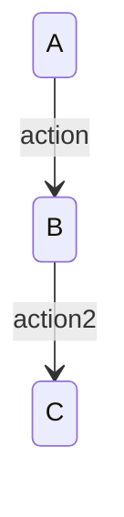
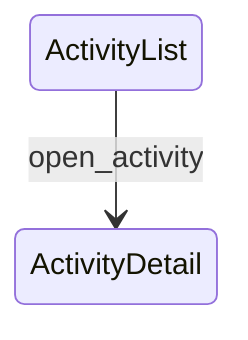

## 目標
基於既有 Step 1 Spec 與舊版 verified-diagrams，先重建一份符合新版規範的 Step 2，再據此產出完整的新版 Step 3。

生成流程必須分成兩段：
1. 先依 `spec-step2-diagrams` 的規範，從 Step 1 Spec 產出新版分層 diagrams。
2. 再依 `spec-step3-verify` 的規範，對上述 diagrams 逐一補上 `%% verify:`。

這個 skill 允許重做 diagram 的分圖方式、state 命名與 transition 呈現，以滿足新版規範；但不得修改 Step 1 Spec，也不得因猜測新增 Step 1 未定義的功能、頁面、角色、狀態或名詞。

## 適用時機
- 已有舊版 `/outputs/step3-verified-diagrams.md`
- 舊版 Step 3 的格式、分圖方式、state 命名或 verify 寫法已不符合新版 `spec-step2-diagrams` 與 `spec-step3-verify`
- 需要在不修改舊版 Step 1 Spec 的前提下，重新產出完整新版 Step 3
- 舊版 diagram 可作為參考，但最終輸出不要求保留原本的 state 與分圖長相

## 非目標
- 不修改 Step 1 Spec
- 不重新定義 Step 1 未定義的功能流程
- 不因猜測而新增 Step 1 未定義的功能、頁面、角色、狀態或名詞
- 不把 Step 1 補成新版完整 spec

## 輸入
- Step 1 完整 Spec（優先使用 `/outputs/step1-spec.md`）
- 舊版 verified-diagrams（優先使用 `/outputs/step3-verified-diagrams.md`，或使用者貼上的內容）
- 若工作區中存在舊版或新版 Step 2 diagrams，可用來交叉檢查 transition 對應；若不存在，仍可依 Step 1 Spec 直接重建新版 Step 2 與 Step 3

## 輸出位置（必須寫檔）
- 先將新版 Step 2 覆寫到工作目錄：`/outputs/step2-diagrams.md`
- 再將新版 Step 3 覆寫到工作目錄：`/outputs/step3-verified-diagrams.md`
- 回覆中僅提供完成訊息與檔案連結

## 升級原則
1. 以 Step 1 Spec 作為唯一語意約束來源。
2. 舊版 verified-diagrams 只作為參考素材，不作為新需求來源。
3. 先生成符合 `spec-step2-diagrams` 的新版 diagrams，再生成符合 `spec-step3-verify` 的 verification 版本。
4. 最終輸出可以重做 diagram 結構、state 命名、transition 與 verify，只要仍然完整對應 Step 1 Spec。
5. 優先做最小必要重建：只為了符合新版 `spec-step2-diagrams` / `spec-step3-verify` 規範或消除與 Step 1 Spec 的衝突而改動。
6. 若舊版 diagram 與 Step 1 Spec 明顯矛盾，必須以 Step 1 Spec 為準重做對應區段，但不得擴寫成 Step 1 未定義的新流程。
7. 不得修改 `/outputs/step1-spec.md`。
8. 若 Step 1 Spec 資訊不足，僅可做「保守收斂」的表達，不可腦補缺漏需求。

## 產出流程（必須遵守）
1. 先依 `spec-step2-diagrams` 的所有結構與約束，從 Step 1 Spec 重新生成一份新版 Step 2 diagrams。
2. 生成 Step 2 時，舊版 verified-diagrams 只能作為參考，不得覆蓋 `spec-step2-diagrams` 的規範。
3. 生成完成後，必須先將該份新版 Step 2 寫入 `/outputs/step2-diagrams.md`。
4. 再以剛生成並寫檔的 Step 2 diagrams 為唯一 diagram 來源，依 `spec-step3-verify` 規範補上所有 `%% verify:`。
5. 最終寫入 `/outputs/step3-verified-diagrams.md` 的內容，必須是「沿用新版 Step 2 圖骨架後補上 verify」的結果，而不是直接對舊版 Step 3 做局部修補。

## 必須對齊的新版 Step 2 / Step 3 規範

### Step 2 對齊要求
- Step 2 圖的結構、Entry 概念、Page / Role / Feature 分層、state ownership、跨圖導向、可達性與命名方式，必須依 `spec-step2-diagrams` 定義。
- 若舊版 Step 3 的圖結構不符合新版 `spec-step2-diagrams`，必須先重做圖，再做 verify。
- 不可直接沿用舊版 diagram 結構而跳過新版 Step 2 規範。

### 檔案開頭固定說明
輸出檔案開頭必須先有以下文字：

```text
全體結構說明
[Entry State]
        ↓
[Page State Machine]
        ↓
[Role-specific Page State]
        ↓
[Feature / Function State Machine]
        ↓
[回到 Page 或跳轉其他 Page，或跳轉到其他 Feature]

以下將照這個層級排序。
```

### transition 與 verify 的固定格式
每個 transition 後面都必須緊接一行 `%% verify:`，且每個 transition 區塊之間必須空一行。



### verify 內容要求
每個 verify 至少要覆蓋以下其中一類，通常應同時覆蓋多類：
- API 回應（例如 200/401/403/404）
- UI 顯示是否正確（按鈕、錯誤訊息、狀態提示）
- 權限 / 角色限制
- 資料一致性（名額、狀態、關聯資料）

若 Step 1 Spec 有定義導覽可見性、Layout、CTA 去重規則，verify 也必須涵蓋：
- Guest 狀態下不得出現 User/Admin 專屬導覽項
- 同頁面不得重複出現相同動作入口

### verify 不可模糊
- 禁止使用「一切正常」、「應正確」、「資料已更新」這類空泛描述
- 若一個 transition 影響多個欄位 / 狀態 / 畫面，必須在同一個 verify 逐項列出受影響項目

## Legacy 升級流程（必須遵守）
1. 先讀取 Step 1 Spec，整理出角色、頁面、功能、權限、狀態與資料一致性規則。
2. 盤點舊版 verified-diagrams 中的所有 diagram、state、transition、verify。
3. 以 Step 1 Spec 為主，依 `spec-step2-diagrams` 規範重新設計新版 Step 2 的 diagram 結構。
4. 舊版 diagram 中與 Step 1 Spec 一致的內容可作為重建參考；不一致的部分必須捨棄並重做。
5. 完成新版 Step 2 後，必須先寫入 `/outputs/step2-diagrams.md`，確認目前的純 diagrams 已固定下來。
6. 再依 `spec-step3-verify` 規範，對 `/outputs/step2-diagrams.md` 中的每個 transition 加上新版 `%% verify:`。
7. 若舊版 verify 過於簡略，補成可檢查條件，但只能使用 Step 1 Spec 已定義的名詞與規則。
8. 若舊版沒有某些新版 Step 2 / Step 3 必需的 transition、入口或分層表達，可依 Step 1 Spec 補出完整新版結果；但不得補出 Step 1 未定義的功能。
9. 若 Step 1 Spec 缺少足以命名某個細部 state 的資訊，使用保守且通用的 state 命名，不可引入新業務概念。

## 可修正項目
- 補上固定開頭說明
- 依新版規範重做 Mermaid block、section 標題、diagram 分層與排序
- 重做 state 命名與 transition 呈現，使其符合新版 Step 2 規範
- 補齊 `%% verify:` 註記
- 將模糊 verify 改寫成可檢查條件
- 修正空行、排列順序、註解位置與一致性
- 依 Step 1 Spec 補齊新版 Step 2 / Step 3 必要但 legacy 缺失的 transition / diagram 組織

## 不可修正項目
- 不可擅自新增 Step 1 未定義的頁面、角色、功能、資料欄位或錯誤情境
- 不可把 Step 1 缺漏的業務流程整套腦補出來
- 不可改寫 Step 1 Spec 的定義來配合 diagram
- 不可把新版 Step 3 寫成依賴新版完整 spec 才會存在的內容

## 驗收清單
- `/outputs/step2-diagrams.md` 已先被重建，且內容符合 `spec-step2-diagrams`
- 最終 diagrams 本身符合 `spec-step2-diagrams` 的結構與約束
- 每個 transition 都有對應 `%% verify:`
- 每個 verify 都是可檢查條件，不含模糊詞
- verify 內容與 Step 1 Spec 一致
- 輸出檔案開頭有固定層級說明文字
- transition 區塊之間有空行
- Step 3 的 diagram 標題、排序、state/transition 骨架與 `/outputs/step2-diagrams.md` 一致，只新增 verify
- 允許 diagram 與 state 長相和 legacy 不同，但不得新增 Spec 未定義的功能/頁面/角色/狀態/名詞
- 沒有修改 Step 1 Spec 本身

## 範例

### 舊版寫法（legacy）


### 升級後寫法（new Step 3 format）


## 最終要求
- 這是一個「由舊版 Step 1 / Step 3 重做新版 Step 3」的 skill，不是重新產生 Spec 的 skill。
- 目標是沿用既有 Step 1 Spec，先產出並寫入符合 `spec-step2-diagrams` 的新版 Step 2 圖，再依該圖產出符合 `spec-step3-verify` 的新版 Step 3。
- legacy diagrams 只作為參考，不需要在輸出中保留原樣。
- 若輸入不足以安全判斷細部 state 或 verify，應以 Step 1 Spec 為上限保守表達，不得擴張需求。