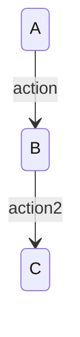

## 目標
基於 Step 1 完整 Spec（含主動補齊項目）與 Step 2 分層 Diagrams，為每個 transition 加上可檢查的驗證點（%% verify），確保狀態變化正確且可驗證。

## 執行順序（必遵守）
1. 先取得已完成的 Step 2 diagrams（依 `spec-step2-diagrams` 產出的內容）。
2. 以該份 Step 2 diagrams 為唯一 diagram 骨架，逐張圖、逐條 transition 補上 `%% verify:`。
3. 不得在 Step 3 階段重畫 diagrams、改寫 state 命名、改變 diagram 順序、增刪 diagram，或引入 Step 2 不存在的 transition。
4. 若發現 Step 2 圖本身不符合規範，必須先回到 `spec-step2-diagrams` 重生成，再重新執行 Step 3；不得在 Step 3 一邊重畫圖一邊補 verify。

## 輸出位置（必須寫檔）
- 將結果寫入工作目錄：/outputs/step3-verified-diagrams.md
- 回覆中僅提供完成訊息與檔案連結

## 輸入
- Step 1 完整 Spec（定義業務規則與角色限制）
- Step 2 分層 Transition Diagrams（所有 states / transitions）

## 輸出格式（必須完整）

檔案開頭必須先輸出以下說明文字：

全體結構說明
[Entry State]
        ↓
[Page State Machine]
        ↓
[Role-specific Page State]
        ↓
[Feature / Function State Machine]
        ↓
[回到 Page 或跳轉其他 Page，或跳轉到其他 Feature]

以下將照這個層級排序。

以 Step 2 的分層 Diagram 為主，逐一在每個 transition 後加入 `%% verify:`，且每個 transition 區塊之間必須空一行。

- Step 3 必須完整保留 Step 2 的 diagram 標題、排序、Mermaid block 結構、state 命名、transition 文案，以及 `%% role:` / `%% base:` / `%% extends:` 等註記；唯一允許新增的是對應 transition 的 `%% verify:` 行與必要空行。

### 驗證標記格式（固定）

### 驗證內容必須涵蓋（至少一項）
- API 回應（例如 200/401/403/404）
- UI 顯示是否正確（按鈕、錯誤訊息、狀態提示）
- 權限/角色限制（是否阻擋或允許）
- 資料一致性（名額、狀態、關聯資料）

若 Step 1 Spec 有定義「導覽可見性 / Layout / CTA 去重」規則，verify 必須額外涵蓋：
- Guest 狀態下 Header/導航不得出現 User/Admin 專屬選項（不是點了才導登入）。
- 同頁面不得重複出現同一動作的入口（例如 Header 已有登入按鈕，頁面內不應再出現第二顆登入按鈕）。

### 驗證必須「完整列出所有受影響項目」
- 若一個操作會影響多個欄位/狀態，必須在同一個 transition 的 verify 中逐項列出。
- 禁止使用概括詞（例如「一切正常」、「應該正確」）。

#### 範例（通用）
當「送出表單建立/更新某 Entity」觸發 transition 時，verify 必須包含：
- API 回應碼與回傳 payload 符合（成功/失敗）
- 受影響欄位實際變更（例如 status/updated_at/assignee_id 等，依 Spec）
- UI 狀態正確（loading → success/inline error，按鈕 disable、防重送）
- 權限檢查生效（不符角色/guard 時回 401/403/404，依 Spec）
- 列表/詳情/統計一致（若該操作會影響）

### 產出規則
- 只處理 Step 2 提供的 Diagram；不得新增或刪除 Diagram。
- 每個 transition 必須有對應 verify。
- 若 Step 2 有新增頁面或功能，Step 3 必須同步覆蓋。
- 若缺少 Step 2 輸入，或 Step 2 不是 `spec-step2-diagrams` 產物，應先要求/重做 Step 2，而不是直接由 Step 1 自行重畫 Step 3。

## 規則
- 每個 transition 必須有 verify。
- verify 必須是可檢查的條件（API 回應 / UI 顯示 / 權限 / 資料一致性）。
- verify 內容需對應 Spec。
- 每個 verify 必須能對應到明確事件或狀態變化結果（不可使用「應該正常」等模糊詞）。
- 禁止模板污染：verify 內容不得出現 Step 1 未定義的功能/名詞（例如 Transaction/Order/Cart/Chart/CSV…），且不得引入 Step 2 沒有的 transition。
- Step 3 不得自行新增、刪除、重命名或重排 Step 2 diagrams；若需要這類修改，必須先修正 Step 2。
