全體結構說明
[Entry State]
        ↓
[Page State Machine]
        ↓
[Role-specific Page State]
        ↓
[Feature / Function State Machine]
        ↓
[回到 Page 或跳轉其他 Page，或跳轉到其他 Feature]

以下將照這個層級排序。

## ① Entry State Machine
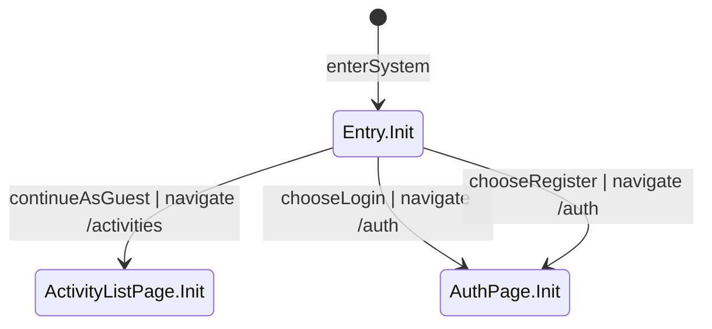

## ② Page State Machine

### AuthPage
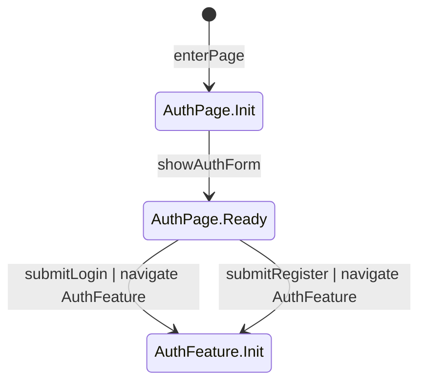

### ActivityListPage
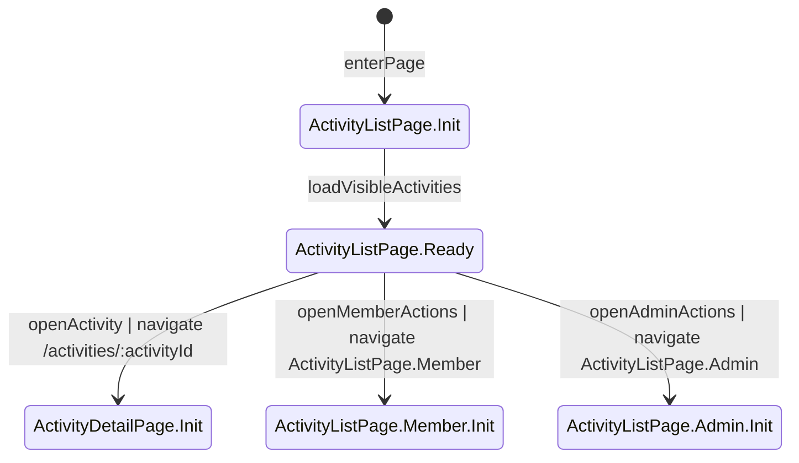

### ActivityDetailPage
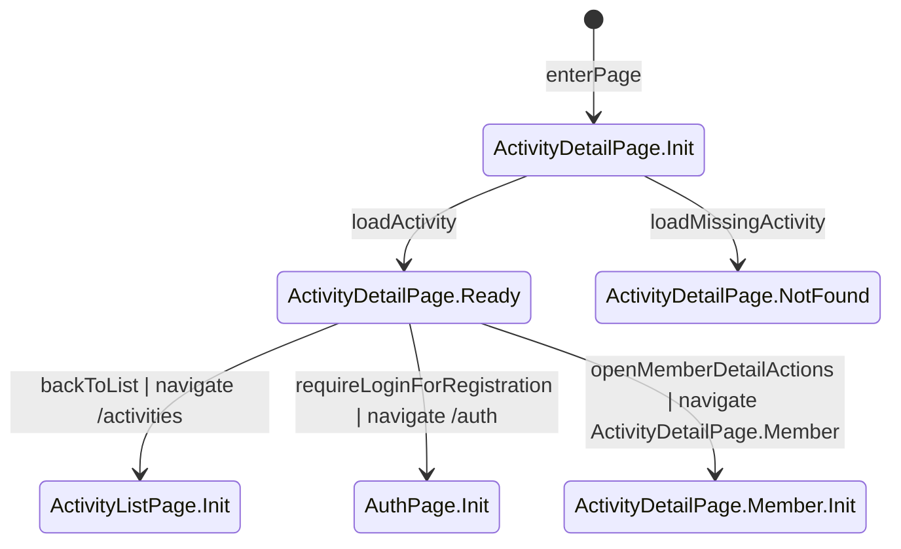

### MyActivitiesPage
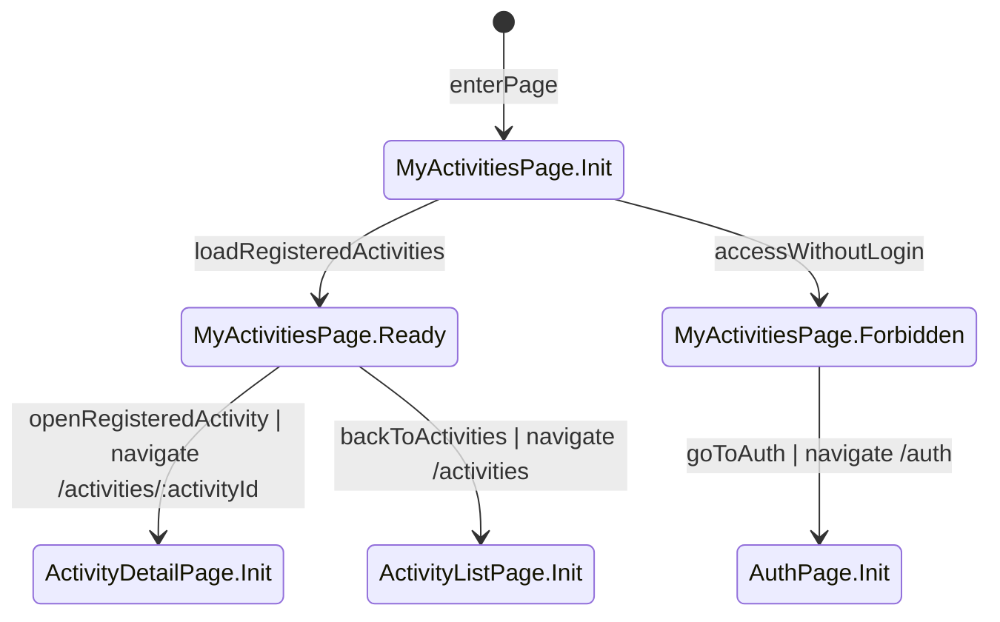

### AdminPanelPage
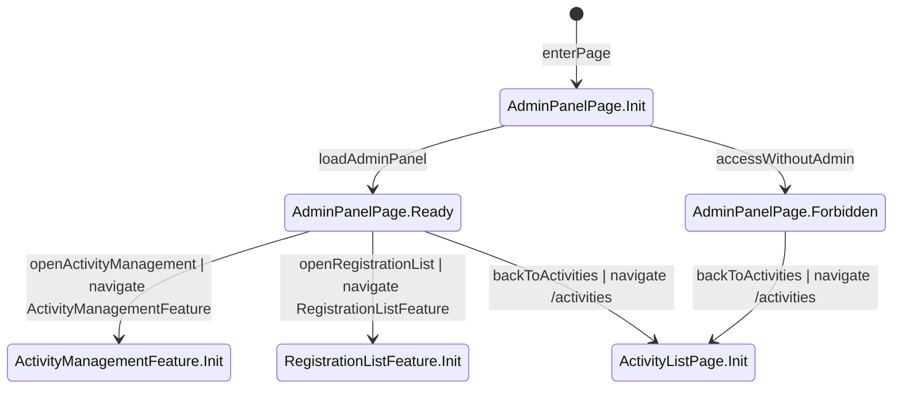

## ③ Role-specific Page State

### ActivityListPage.Member
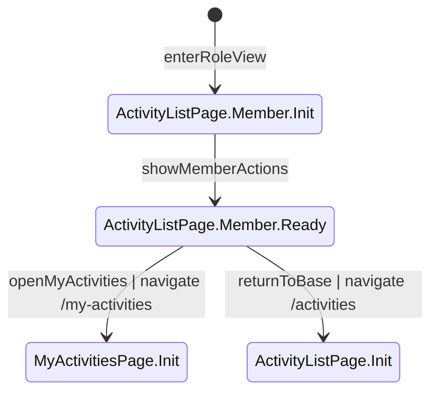

### ActivityListPage.Admin
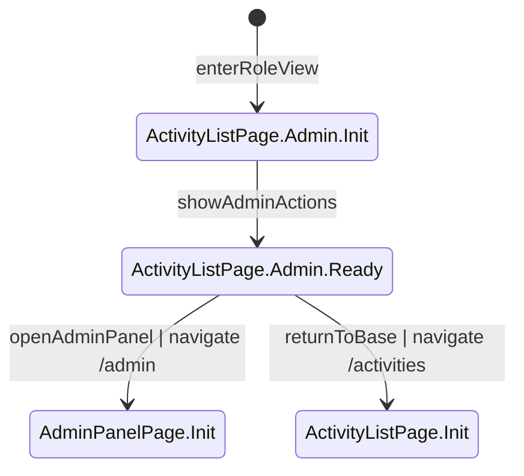

### ActivityDetailPage.Member
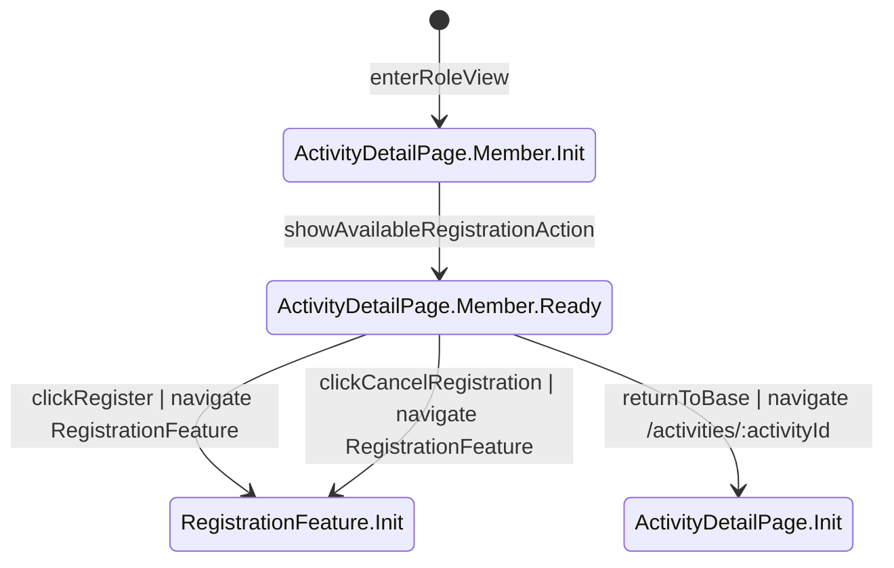

## ④ Feature / Function State Machine

### AuthFeature
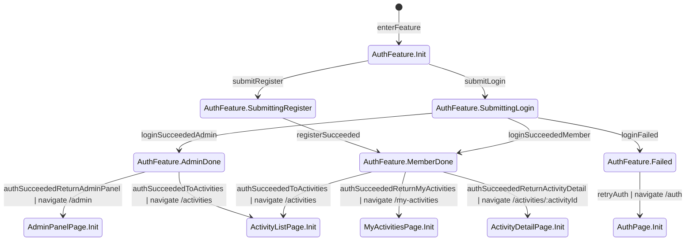

### RegistrationFeature
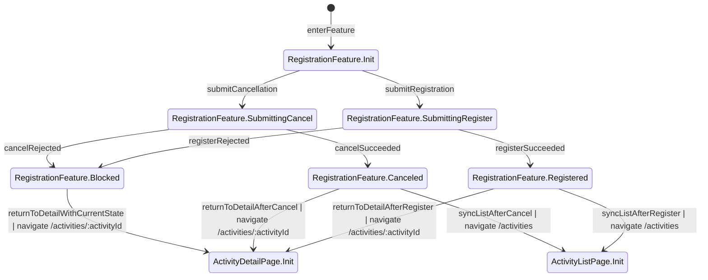

### ActivityManagementFeature
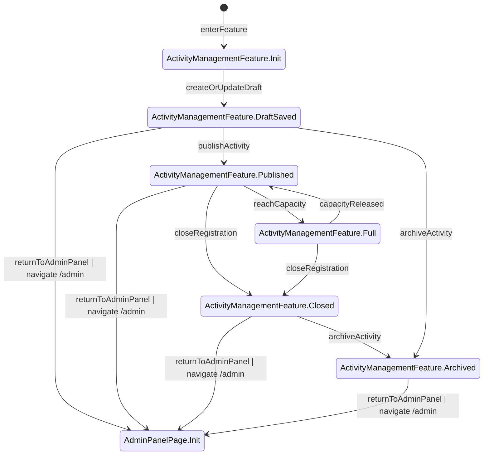

### RegistrationListFeature
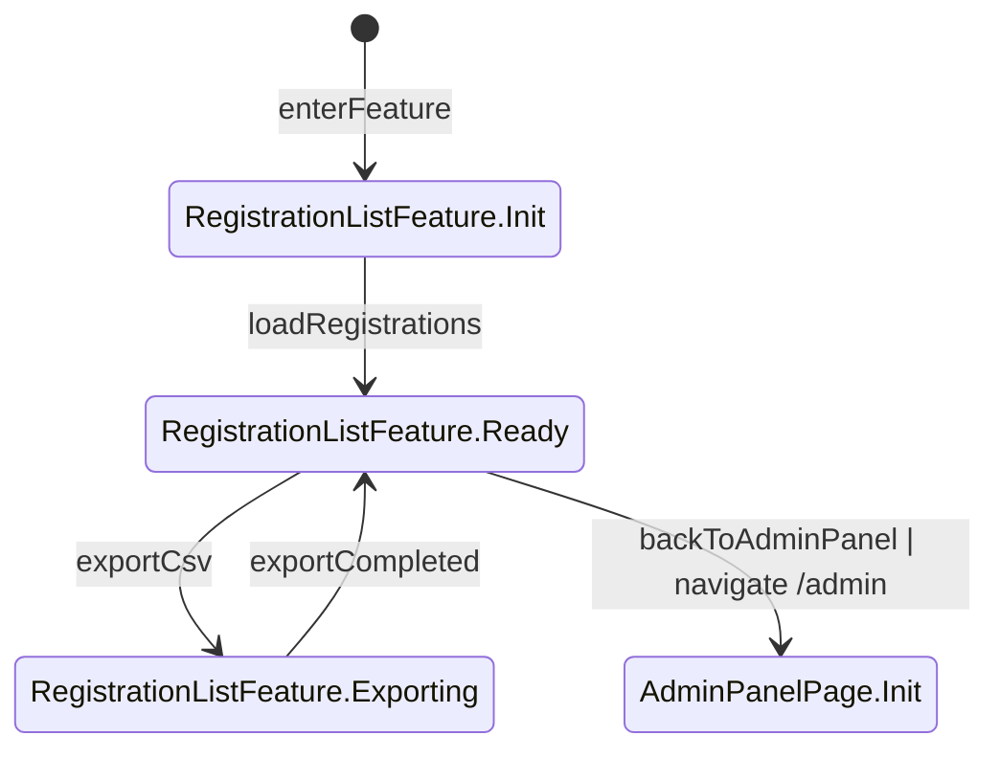
