全體結構說明
[Entry State]
        ↓
[Page State Machine]
        ↓
[Role-specific Page State]
        ↓
[Feature / Function State Machine]
        ↓
[回到 Page 或跳轉其他 Page，或跳轉到其他 Feature]

以下將照這個層級排序。

## ① Entry State Machine
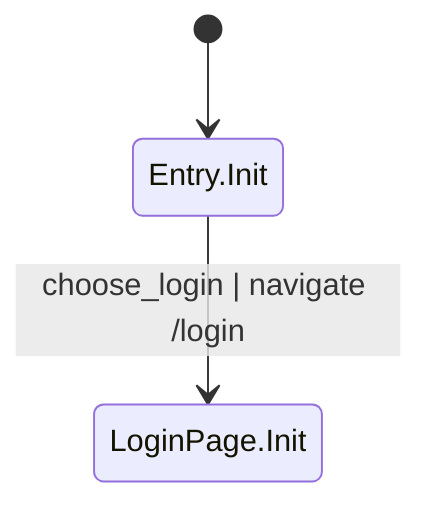

## ② Login Page
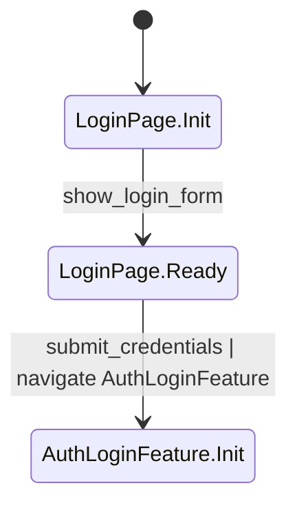

## ③ Auth Login Feature
Source Pages: LoginPage

```mermaid
stateDiagram-v2
    %% role: none
    [*] --> AuthLoginFeature.Init
    %% verify: AuthLoginFeature.Init is reachable only from LoginPage and starts with no persisted employee or manager leave data in feature state

    AuthLoginFeature.Init --> AuthLoginFeature.Submitting: start_login
    %% verify: POST /auth/login is issued once with email and password, loading indicator remains visible, and duplicate submits are blocked until a response returns

    AuthLoginFeature.Submitting --> AuthLoginFeature.EmployeeAuthenticated: login_success_employee
    %% verify: POST /auth/login returns 200, session or token is stored, response role=employee, and no manager-only permission is granted in client state

    AuthLoginFeature.Submitting --> AuthLoginFeature.ManagerAuthenticated: login_success_manager
    %% verify: POST /auth/login returns 200, session or token is stored, response role=manager, and manager approval scope metadata is available for later guarded pages

    AuthLoginFeature.Submitting --> AuthLoginFeature.Failed: login_failed
    %% verify: POST /auth/login returns 401 for invalid credentials or a failure response, error message is shown inline, password field is cleared or masked, and no session is stored

    AuthLoginFeature.Failed --> LoginPage.Init: back_to_login | navigate /login
    %% verify: Login page is restored with email retained when allowed, previous auth error remains visible until the next submit, and no protected page is entered

    AuthLoginFeature.EmployeeAuthenticated --> MyLeavePage.Init: login_done_employee | navigate /my-leaves
    %% verify: authenticated employee lands on My Leave page, GET my leave list returns only the employee's own requests, and manager-only navigation stays hidden

    AuthLoginFeature.ManagerAuthenticated --> MyLeavePage.Init: login_done_manager | navigate /my-leaves
    %% verify: authenticated manager lands on My Leave page, own leave list loads successfully, and manager-only navigation for pending approvals and department calendar is visible exactly once

    AuthLoginFeature.EmployeeAuthenticated --> LeaveRequestDetailPage.Init: login_return_detail | navigate /leave-requests/:id
    %% verify: when returnTo targets an owned request detail, GET /leave-requests/:id returns 200, detail data belongs to the authenticated employee, and unauthorized requests do not load

    AuthLoginFeature.EmployeeAuthenticated --> LeaveBalancePage.Init: login_return_balance | navigate /leave-balance
    %% verify: when returnTo targets Leave Balance, GET /leave-balance returns 200 and each leave type shows quota, used, reserved, and available values for the employee

    AuthLoginFeature.ManagerAuthenticated --> PendingApprovalsPage.Init: login_return_approvals | navigate /manager/approvals
    %% verify: when returnTo targets Pending Approvals, GET pending approvals returns 200 and only submitted requests inside the manager scope are returned

    AuthLoginFeature.ManagerAuthenticated --> DepartmentCalendarPage.Init: login_return_calendar | navigate /manager/calendar
    %% verify: when returnTo targets Department Calendar, GET calendar returns 200 with in-scope submitted or approved events only and employee-private out-of-scope events are not exposed
```

## ④ 我的請假頁（My Leave Page）Base
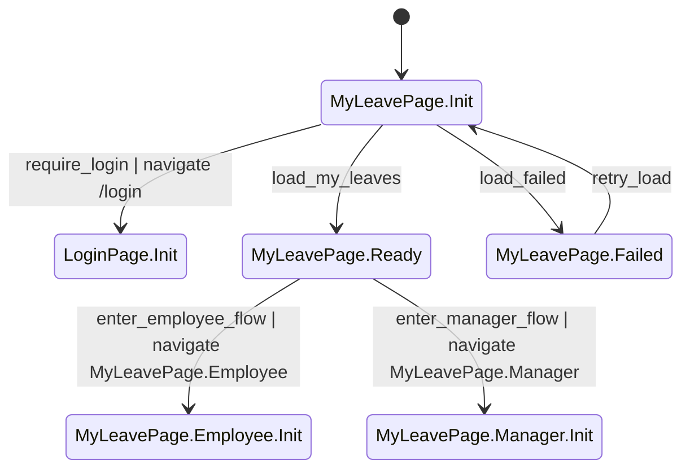

## ⑤ 我的請假頁（My Leave Page）Employee Delta
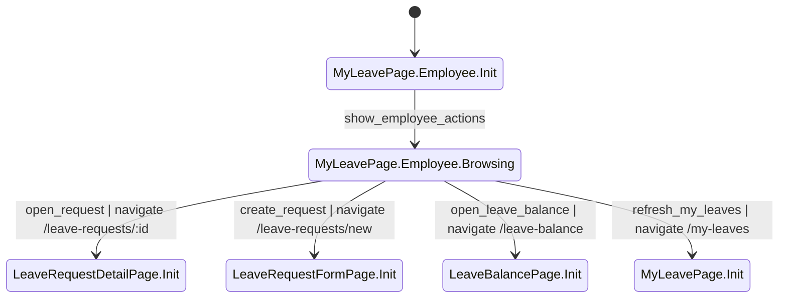

## ⑥ 我的請假頁（My Leave Page）Manager Delta
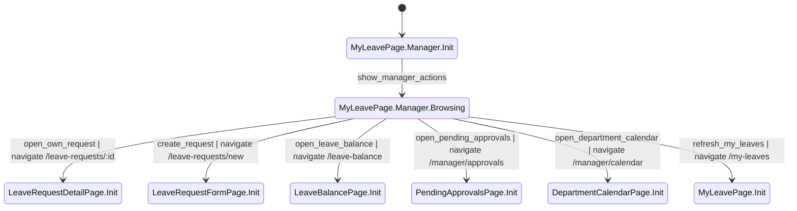

## ⑦ 請假詳情頁（Leave Request Detail Page）Base
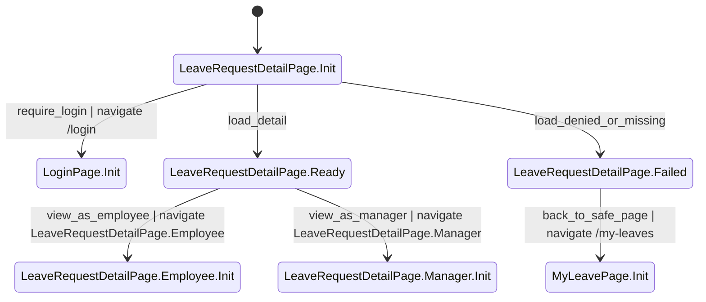

## ⑧ 請假詳情頁（Leave Request Detail Page）Employee Delta
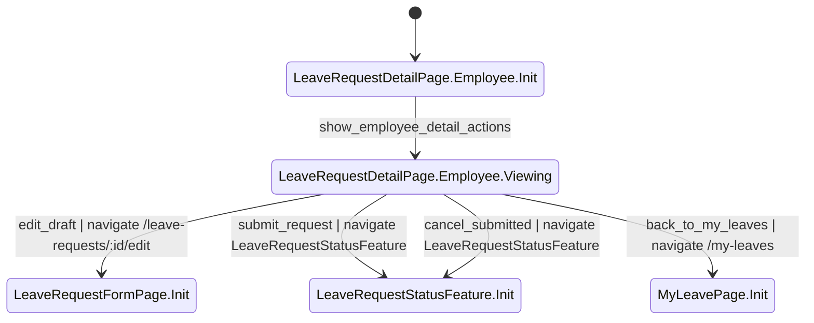

## ⑨ 請假詳情頁（Leave Request Detail Page）Manager Delta
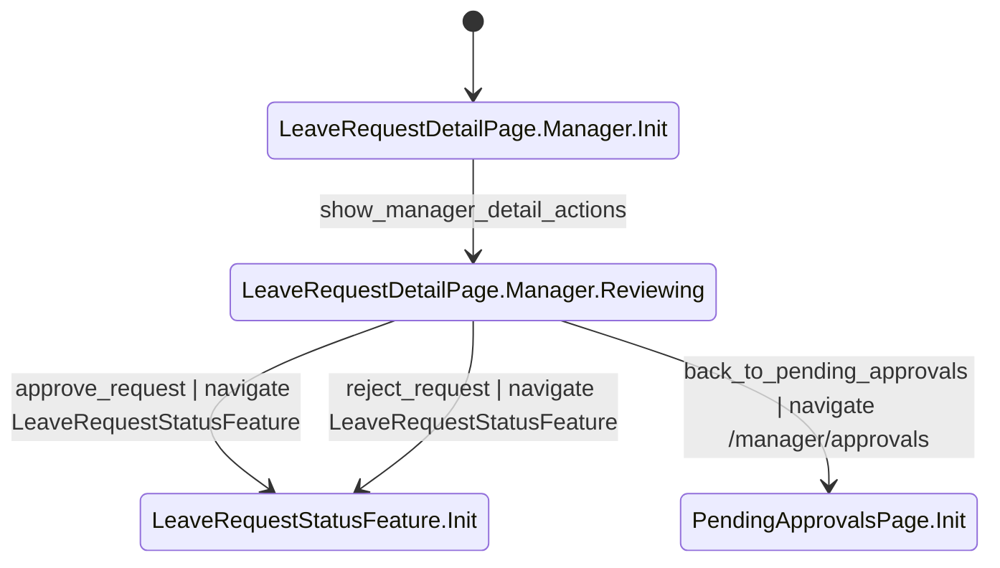

## ⑩ 請假表單頁（Leave Request Form Page）
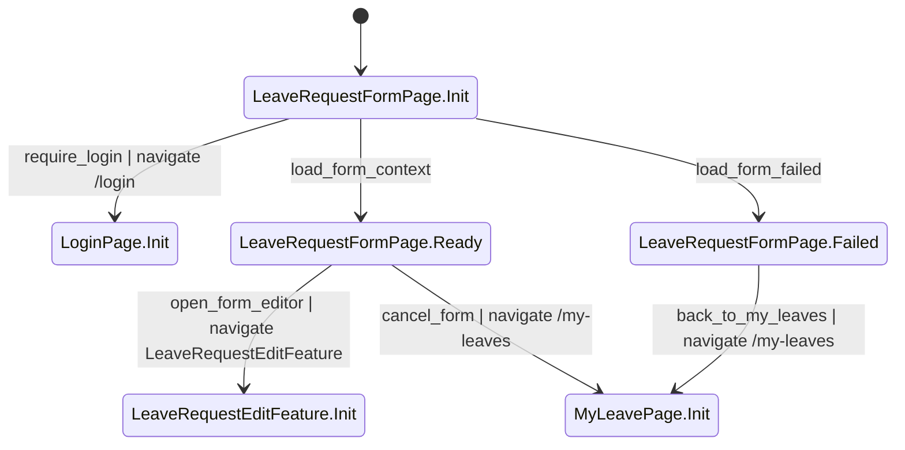

## ⑪ 請假表單編輯功能（Leave Request Edit Feature）
Source Pages: LeaveRequestFormPage

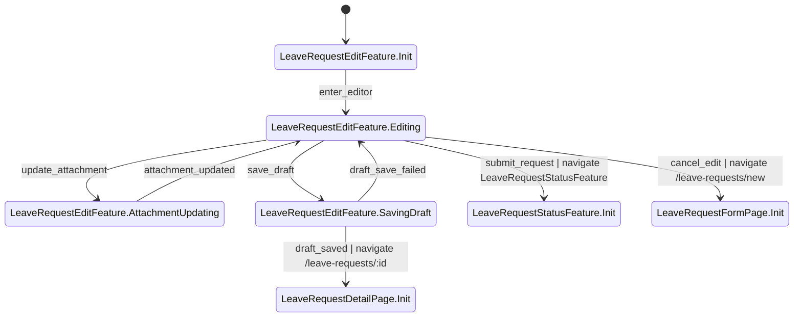

## ⑫ 剩餘假期頁（Leave Balance Page）
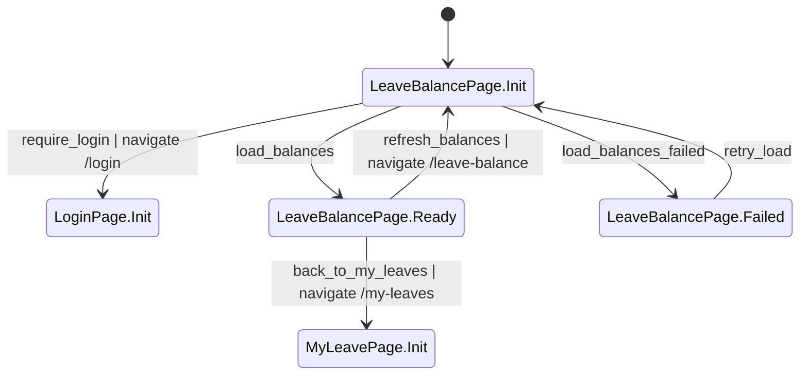

## ⑬ 待審核頁（Pending Approvals Page）
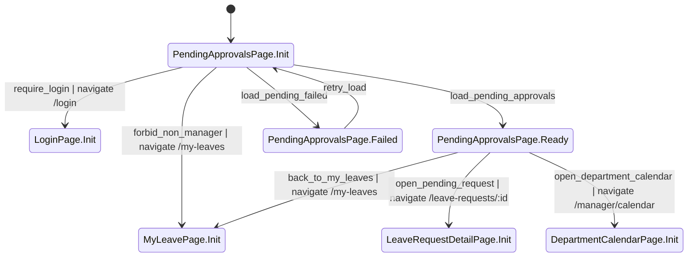

## ⑭ 部門請假日曆頁（Department Calendar Page）
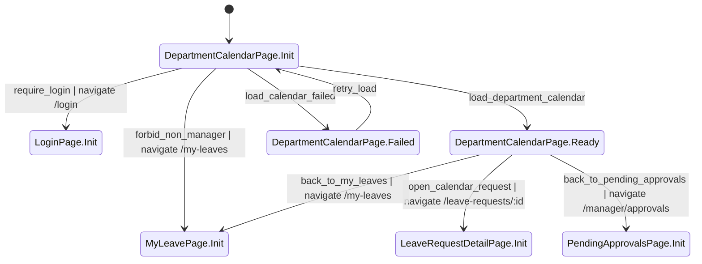

## ⑮ 請假狀態功能（Leave Request Status Feature）
Source Pages: LeaveRequestDetailPage.Employee, LeaveRequestDetailPage.Manager, LeaveRequestEditFeature

```mermaid
stateDiagram-v2
    %% role: Employee|Manager
    [*] --> LeaveRequestStatusFeature.Init
    %% verify: LeaveRequestStatusFeature.Init is entered only from a page or feature action that intends to submit, cancel, approve, or reject a single leave request

    LeaveRequestStatusFeature.Init --> LeaveRequestStatusFeature.Submitting: begin_submit
    %% verify: submit path applies only to draft requests, server validates end_date >= start_date, overlap against draft or submitted or approved requests for the same employee, available quota >= requested days, and required attachments are present

    LeaveRequestStatusFeature.Init --> LeaveRequestStatusFeature.Cancelling: begin_cancel
    %% verify: cancel path applies only to submitted requests owned by the current employee, approved or rejected requests are blocked, and request state is unchanged until cancellation succeeds

    LeaveRequestStatusFeature.Init --> LeaveRequestStatusFeature.Approving: begin_approve
    %% verify: approve path applies only to status=submitted and an in-scope manager, irreversible-decision rules are enforced, and repeated approval requests are rejected rather than double-processing

    LeaveRequestStatusFeature.Init --> LeaveRequestStatusFeature.Rejecting: begin_reject
    %% verify: reject path applies only to status=submitted and an in-scope manager, a non-empty rejection reason is required, and no partial decision is stored before validation passes

    LeaveRequestStatusFeature.Submitting --> LeaveBalanceSyncFeature.Init: submit_persisted | navigate LeaveBalanceSyncFeature
    %% verify: request status becomes submitted, submitted_at is set, approval log records action=submit, and balance synchronization starts for reserve processing in the same business flow

    LeaveRequestStatusFeature.Submitting --> LeaveRequestDetailPage.Init: submit_denied | navigate /leave-requests/:id
    %% verify: validation failure returns 409 or 422, status remains draft, submitted_at is not set, reserved_days is unchanged, and detail page shows actionable validation errors

    LeaveRequestStatusFeature.Cancelling --> LeaveBalanceSyncFeature.Init: cancel_persisted | navigate LeaveBalanceSyncFeature
    %% verify: request status becomes cancelled, cancelled_at is set, approval log records action=cancel, and balance synchronization starts for releasing reserved quota

    LeaveRequestStatusFeature.Cancelling --> LeaveRequestDetailPage.Init: cancel_denied | navigate /leave-requests/:id
    %% verify: denied cancellation returns 409 or 403, status remains submitted, cancelled_at stays empty, and reserved quota is not released

    LeaveRequestStatusFeature.Approving --> LeaveBalanceSyncFeature.Init: approve_persisted | navigate LeaveBalanceSyncFeature
    %% verify: request status becomes approved, approver_id and decided_at are set, approval log records action=approve, and balance synchronization starts for reserved-to-used conversion

    LeaveRequestStatusFeature.Approving --> LeaveRequestDetailPage.Init: approve_denied | navigate /leave-requests/:id
    %% verify: denied approval returns 403 or 409, request remains submitted, approver_id and decided_at remain unchanged, and no quota conversion occurs

    LeaveRequestStatusFeature.Rejecting --> LeaveBalanceSyncFeature.Init: reject_persisted | navigate LeaveBalanceSyncFeature
    %% verify: request status becomes rejected, rejection_reason and decided_at are set, approval log records action=reject, and balance synchronization starts for releasing reserved quota

    LeaveRequestStatusFeature.Rejecting --> LeaveRequestDetailPage.Init: reject_denied | navigate /leave-requests/:id
    %% verify: denied rejection returns 403, 409, or 422, request remains submitted, rejection_reason is not stored, and reserved quota is not released
```

## ⑯ 額度同步功能（Leave Balance Sync Feature）
Source Features: LeaveRequestStatusFeature

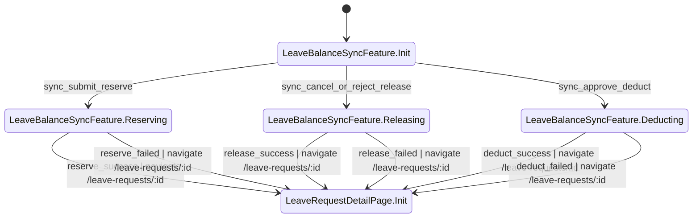