全體結構說明
[Entry State]
        ↓
[Page State Machine]
        ↓
[Role-specific Page State]
        ↓
[Feature / Function State Machine]
        ↓
[回到 Page 或跳轉其他 Page，或跳轉到其他 Feature]

以下將照這個層級排序。

# 分層 Transition Diagrams（含 Verify）
個人記帳＋月報表網站

---

## ① Entry State Machine

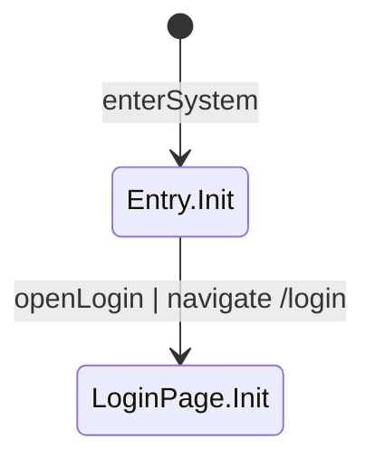

---

## ② Login Page State Machine

例外回接：依 Step 1 的登入頁定義，登入驗證失敗後需留在登入頁並顯示錯誤，因此允許 AuthLoginFeature 回接到 LoginPage.Failed。

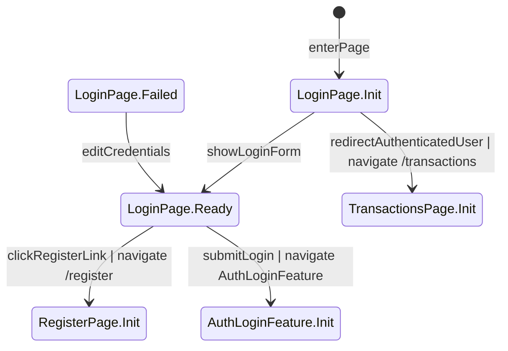

---

## ③ Register Page State Machine

例外回接：依 Step 1 的註冊頁定義，註冊驗證失敗後需留在註冊頁並顯示錯誤，因此允許 AuthRegisterFeature 回接到 RegisterPage.Failed。

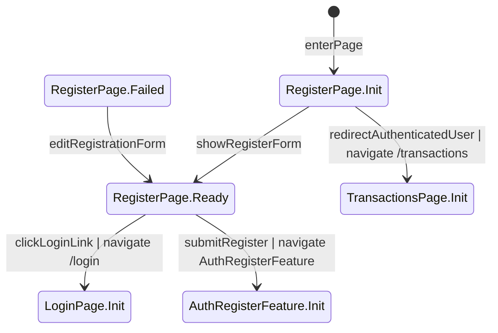

---

## ④ Transactions Page State Machine

```mermaid
stateDiagram-v2
    %% role: User
    [*] --> TransactionsPage.Init: enterPage
    %% verify: 進入 /transactions 時檢查登入狀態並準備載入帳務列表；Header 顯示帳務列表、月報表、類別管理、登出；Header 不顯示登入與註冊

    TransactionsPage.Init --> LoginPage.Init: authRequired | navigate /login
    %% verify: 未登入或 Session/Token 過期時導向 /login；保留 returnTo=/transactions；401 時清除無效 Session/Token；Guest 不可看到受保護導覽

    TransactionsPage.Init --> TransactionsPage.Ready: loadTransactionsDone
    %% verify: 帳務列表 API 回傳 200 且有資料；列表依日期分組且最新日期在最上方；每個日期區塊顯示當日總收入與總支出；同日帳務依時間倒序；新增帳務按鈕只出現在本頁而不出現在 Header

    TransactionsPage.Init --> TransactionsPage.Empty: loadTransactionsEmpty
    %% verify: 帳務列表 API 回傳 200 且無資料；顯示空狀態提示與新增帳務入口；Header 仍只顯示使用者導覽；頁面沒有重複的新增帳務 CTA

    TransactionsPage.Init --> TransactionsPage.Failed: loadTransactionsFailed
    %% verify: 帳務列表 API 回傳 5xx 或非授權外的失敗時顯示錯誤訊息與重試按鈕；既有日期分組與統計不顯示過期資料

    TransactionsPage.Ready --> ReportsPage.Init: clickReportsNav | navigate /reports
    %% verify: URL 變更為 /reports；開始載入所選年月報表；Header 導覽維持使用者狀態

    TransactionsPage.Ready --> CategoriesPage.Init: clickCategoriesNav | navigate /categories
    %% verify: URL 變更為 /categories；開始載入類別清單；Header 導覽維持使用者狀態

    TransactionsPage.Ready --> TransactionFormFeature.Init: clickAddTransaction | navigate TransactionFormFeature
    %% verify: 開啟新增帳務 Modal；表單類別選項僅包含 is_active=true 且符合帳務類型的類別；Modal 開啟前列表資料不變

    TransactionsPage.Ready --> TransactionFormFeature.Init: clickEditTransaction | navigate TransactionFormFeature
    %% verify: 開啟編輯帳務 Modal；表單預填 type、amount、category_id、date、note；仍僅能編輯自己的帳務資料

    TransactionsPage.Ready --> TransactionDeleteFeature.Init: clickDeleteTransaction | navigate TransactionDeleteFeature
    %% verify: 開啟刪除確認流程；顯示帳務摘要；尚未確認前列表、每日統計與月報表資料均不變

    TransactionsPage.Ready --> LogoutFeature.Init: clickLogout | navigate LogoutFeature
    %% verify: 觸發登出流程；準備清除 Session/Token；登出入口只在 Header 右側出現一次

    TransactionsPage.Ready --> TransactionsPage.Ready: loadMoreTransactions
    %% verify: 載入下一頁 30 筆或更多帳務時，新資料追加到正確日期分組；日統計仍與列表資料一致；舊資料順序不被破壞

    TransactionsPage.Empty --> ReportsPage.Init: clickReportsNav | navigate /reports
    %% verify: 即使沒有帳務資料仍可前往報表頁；URL 變更為 /reports；報表頁依資料量決定顯示 Empty 或 Ready

    TransactionsPage.Empty --> CategoriesPage.Init: clickCategoriesNav | navigate /categories
    %% verify: URL 變更為 /categories；類別管理頁可正常載入；使用者導覽不變

    TransactionsPage.Empty --> TransactionFormFeature.Init: clickAddTransaction | navigate TransactionFormFeature
    %% verify: 從空狀態開啟新增帳務 Modal；表單初始值為空白；類別選項只顯示可用類別

    TransactionsPage.Empty --> LogoutFeature.Init: clickLogout | navigate LogoutFeature
    %% verify: 觸發登出流程；空狀態畫面在登出後不可再存取

    TransactionsPage.Failed --> TransactionsPage.Init: retryLoad
    %% verify: 點擊重試後重新發送帳務列表 API；Loading、Ready、Empty 或 Failed 依最新回應更新；不會重複新增任何帳務項目
```

---

## ⑤ Reports Page State Machine

例外回接：依 Step 1 的月報表頁定義，匯出 CSV 完成或失敗後仍停留在目前報表畫面，因此允許 CsvExportFeature 回接到 ReportsPage.Ready。

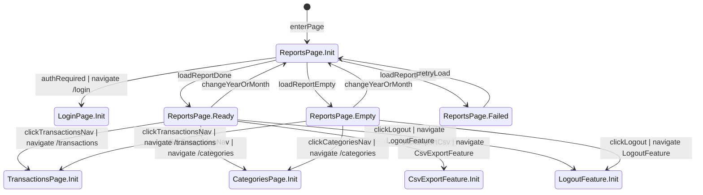

---

## ⑥ Categories Page State Machine

例外回接：依 Step 1 的類別管理頁定義，新增/編輯/停用/啟用操作完成後需回到目前類別管理畫面，因此允許 CategoryFormFeature 與 CategoryToggleFeature 回接到 CategoriesPage.Ready 或 CategoriesPage.Empty。

```mermaid
stateDiagram-v2
    %% role: User
    [*] --> CategoriesPage.Init: enterPage
    %% verify: 進入 /categories 時檢查登入狀態並準備載入類別清單；Header 顯示使用者導覽；頁面內提供新增、編輯、停用或啟用入口

    CategoriesPage.Init --> LoginPage.Init: authRequired | navigate /login
    %% verify: 未登入或 Session/Token 過期時導向 /login；保留 returnTo=/categories；Guest 不可看到類別管理導覽項

    CategoriesPage.Init --> CategoriesPage.Ready: loadCategoriesDone
    %% verify: 類別 API 回傳 200 且存在自訂類別；列表同時顯示預設類別與自訂類別；每個類別顯示名稱、狀態、類型；預設類別不可刪除

    CategoriesPage.Init --> CategoriesPage.Empty: loadCustomCategoriesEmpty
    %% verify: 類別 API 回傳 200 且沒有自訂類別；頁面仍顯示預設類別；可從空自訂類別狀態新增第一個自訂類別

    CategoriesPage.Init --> CategoriesPage.Failed: loadCategoriesFailed
    %% verify: 類別 API 回傳 5xx 或其他失敗時顯示錯誤訊息與重試按鈕；不顯示不一致的舊類別狀態

    CategoriesPage.Ready --> TransactionsPage.Init: clickTransactionsNav | navigate /transactions
    %% verify: URL 變更為 /transactions；帳務列表頁載入成功；Header 導覽維持使用者狀態

    CategoriesPage.Ready --> ReportsPage.Init: clickReportsNav | navigate /reports
    %% verify: URL 變更為 /reports；月報表頁載入成功；Header 導覽維持使用者狀態

    CategoriesPage.Ready --> CategoryFormFeature.Init: clickAddCategory | navigate CategoryFormFeature
    %% verify: 開啟新增類別 Modal；名稱為空；type 可選 income、expense、both；新增入口只在頁面內容區出現

    CategoriesPage.Ready --> CategoryFormFeature.Init: clickEditCategory | navigate CategoryFormFeature
    %% verify: 開啟編輯類別 Modal；預填名稱與 type；仍只能操作自己的類別資料

    CategoriesPage.Ready --> CategoryToggleFeature.Init: clickToggleCategoryStatus | navigate CategoryToggleFeature
    %% verify: 開啟停用或啟用流程；若為停用需顯示歷史資料保留的提示；尚未確認前類別狀態不變

    CategoriesPage.Ready --> LogoutFeature.Init: clickLogout | navigate LogoutFeature
    %% verify: 觸發登出流程；登出入口只在 Header 右側出現一次

    CategoriesPage.Empty --> TransactionsPage.Init: clickTransactionsNav | navigate /transactions
    %% verify: URL 變更為 /transactions；使用者可回到帳務列表頁

    CategoriesPage.Empty --> ReportsPage.Init: clickReportsNav | navigate /reports
    %% verify: URL 變更為 /reports；使用者可前往月報表頁

    CategoriesPage.Empty --> CategoryFormFeature.Init: clickAddCategory | navigate CategoryFormFeature
    %% verify: 從無自訂類別狀態開啟新增類別 Modal；表單為初始值；預設類別區塊仍保留可見

    CategoriesPage.Empty --> LogoutFeature.Init: clickLogout | navigate LogoutFeature
    %% verify: 觸發登出流程；空狀態畫面在登出後不可再存取

    CategoriesPage.Failed --> CategoriesPage.Init: retryLoad
    %% verify: 點擊重試後重新發送類別 API；若成功則 Ready 或 Empty 依資料量更新；若再次失敗則維持 Failed 並顯示最新錯誤
```

---

## ⑦ Feature: AuthLoginFeature

例外回接：依 Step 1 的登入頁定義，登入表單驗證失敗或登入被拒絕時需回到 LoginPage.Failed，而不是重新進入 LoginPage.Init。

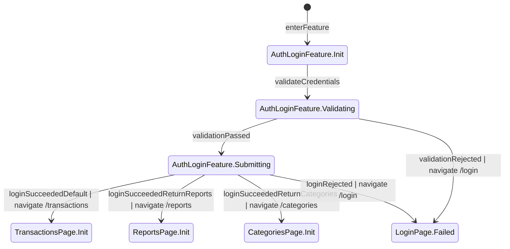

---

## ⑧ Feature: AuthRegisterFeature

例外回接：依 Step 1 的註冊頁定義，註冊驗證失敗或註冊被拒絕時需回到 RegisterPage.Failed，而不是重新進入 RegisterPage.Init。

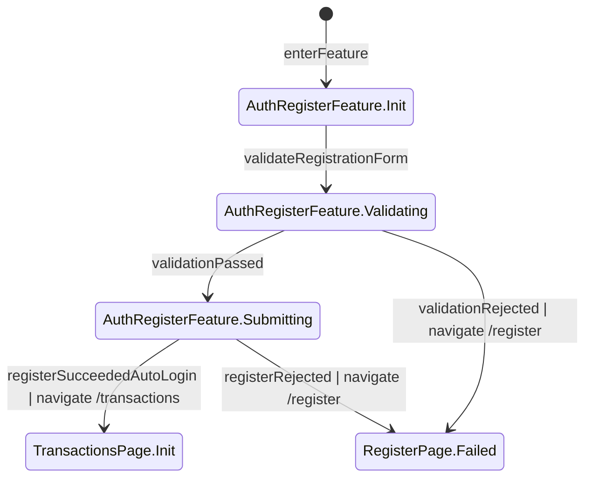

---

## ⑨ Feature: LogoutFeature

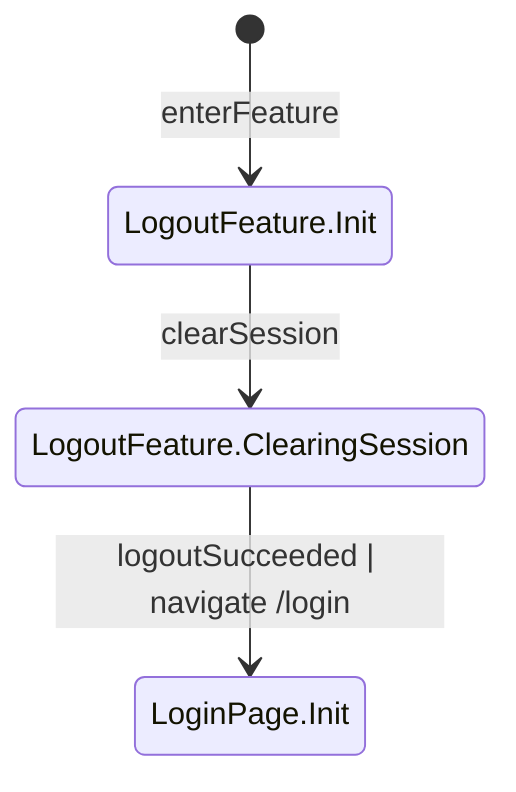

---

## ⑩ Feature: TransactionFormFeature

例外回接：依 Step 1 的帳務列表頁定義，新增或編輯帳務使用 Modal，取消或送出後要回到目前的帳務列表狀態，因此允許回接到 TransactionsPage.Ready 或 TransactionsPage.Empty。

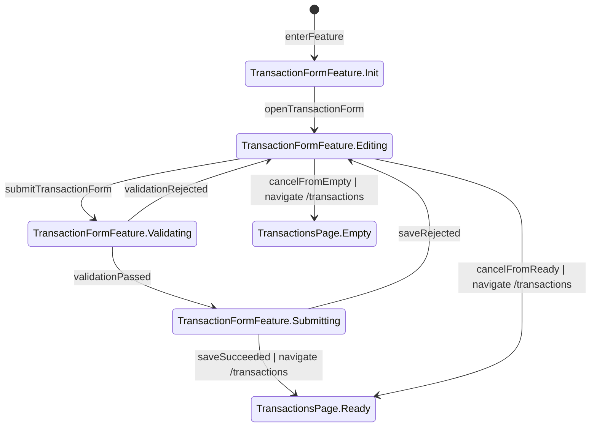

---

## ⑪ Feature: TransactionDeleteFeature

例外回接：依 Step 1 的帳務列表頁定義，刪除確認使用 Modal，取消或刪除後需回到目前列表狀態，因此允許回接到 TransactionsPage.Ready 或 TransactionsPage.Empty。

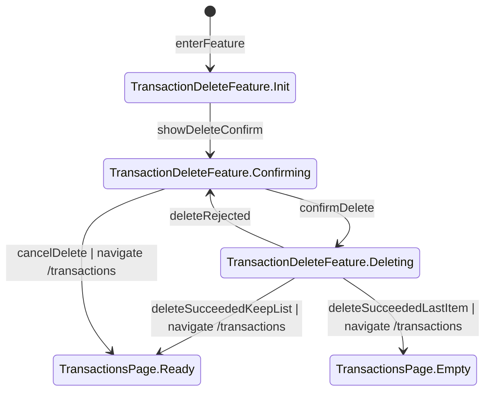

---

## ⑫ Feature: CategoryFormFeature

例外回接：依 Step 1 的類別管理頁定義，新增或編輯類別使用 Modal，取消或送出後要回到目前的類別管理狀態，因此允許回接到 CategoriesPage.Ready 或 CategoriesPage.Empty。

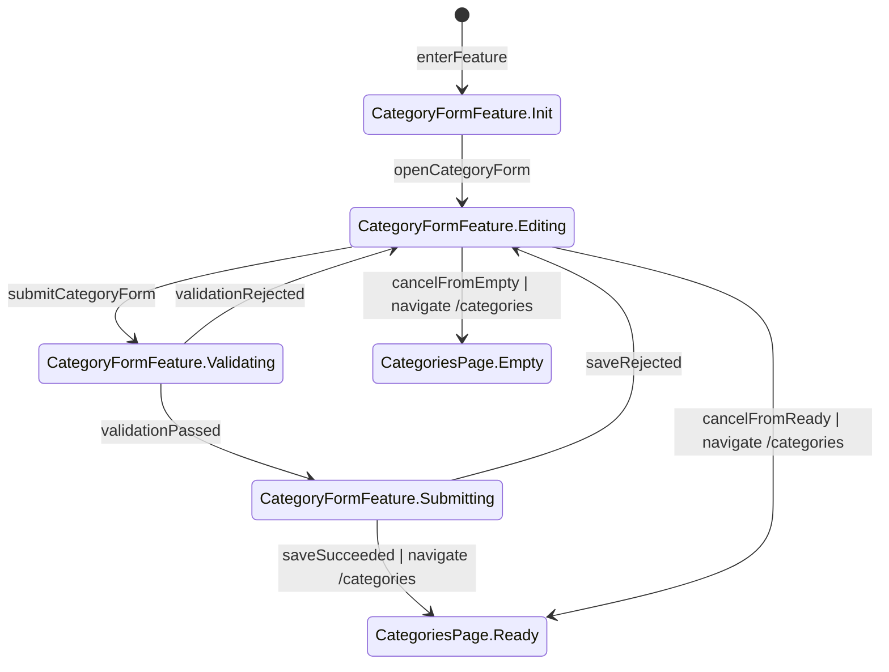

---

## ⑬ Feature: CategoryToggleFeature

例外回接：依 Step 1 的類別管理頁定義，停用或啟用類別完成後需回到目前的類別管理畫面，因此允許回接到 CategoriesPage.Ready。

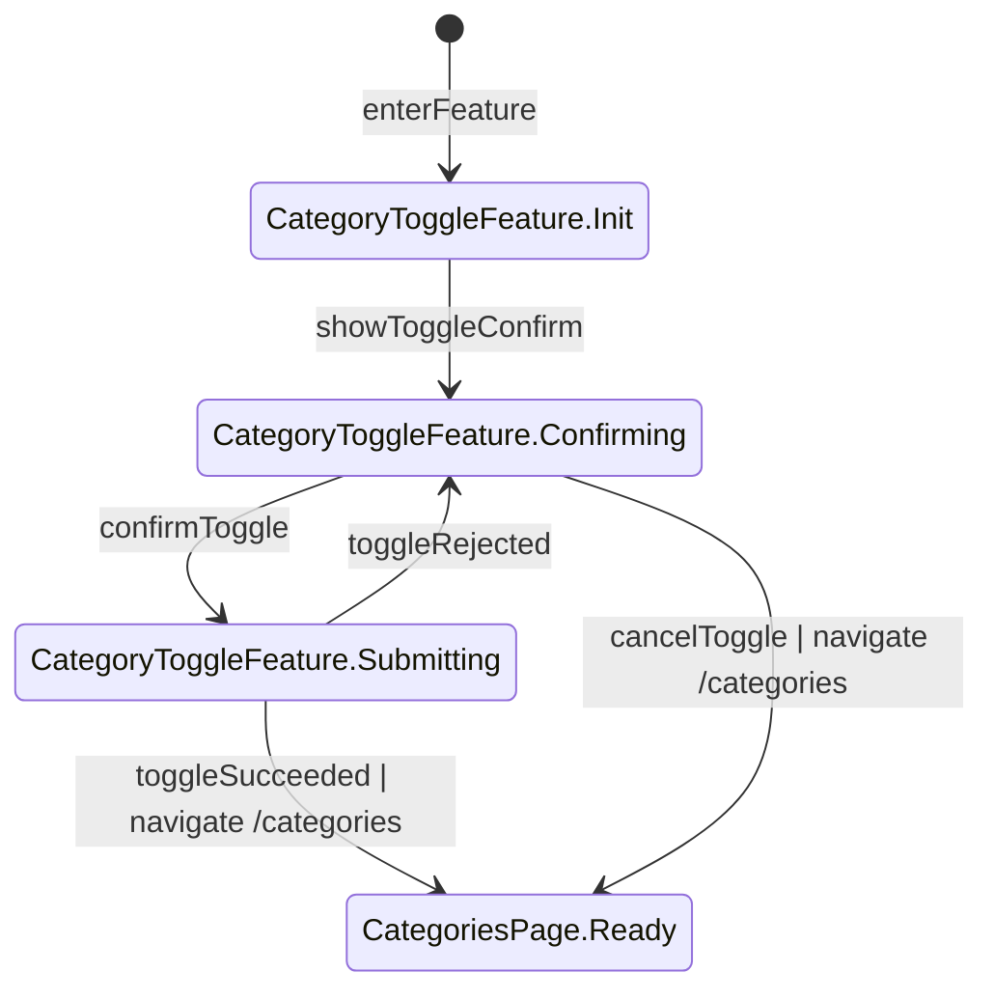

---

## ⑭ Feature: CsvExportFeature

例外回接：依 Step 1 的月報表頁定義，匯出完成或失敗後需留在目前報表頁，因此允許回接到 ReportsPage.Ready。

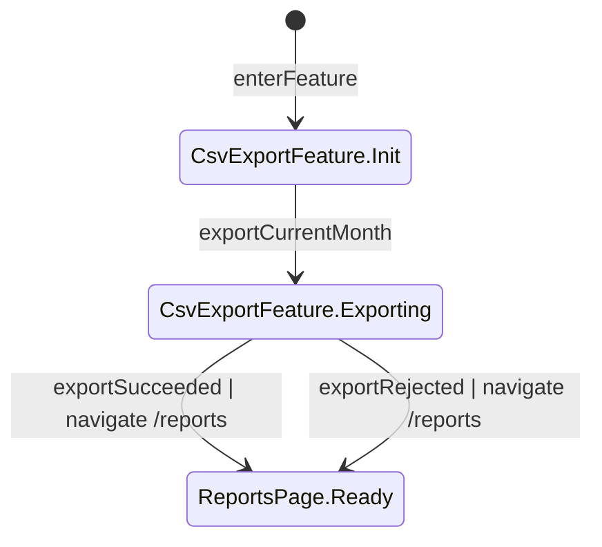
