全體結構說明
[Entry State]
        ↓
[Page State Machine]
        ↓
[Role-specific Page State]
        ↓
[Feature / Function State Machine]
        ↓
[回到 Page 或跳轉其他 Page，或跳轉到其他 Feature]

以下將照這個層級排序。

---

## ① Entry State Machine
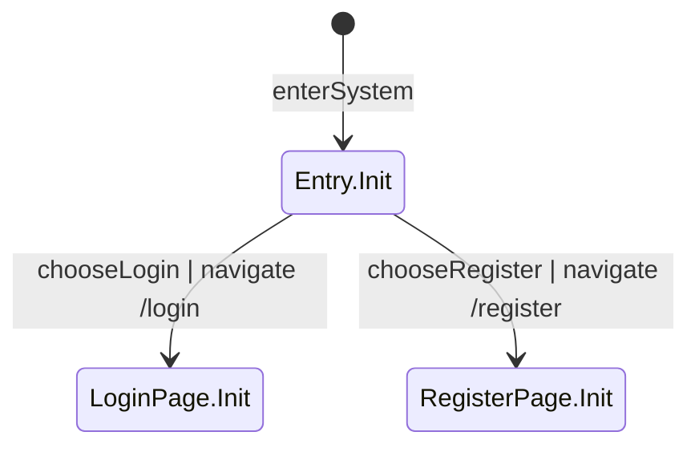

## ② Login Page State Machine
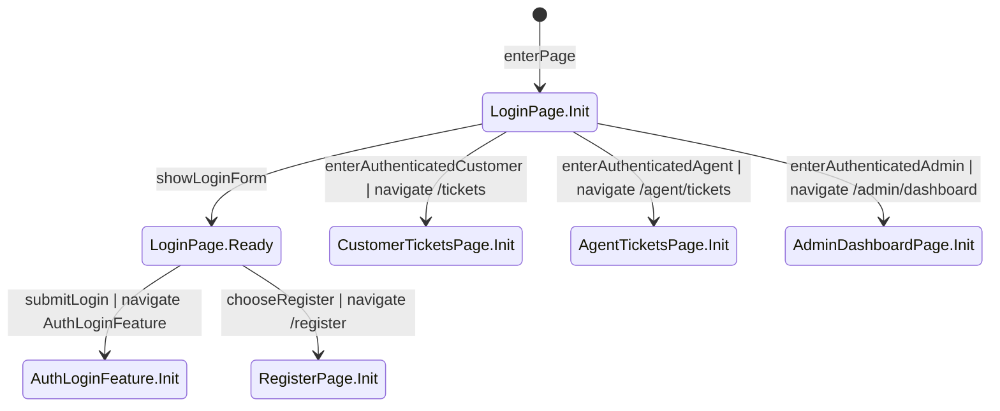

## ③ Register Page State Machine
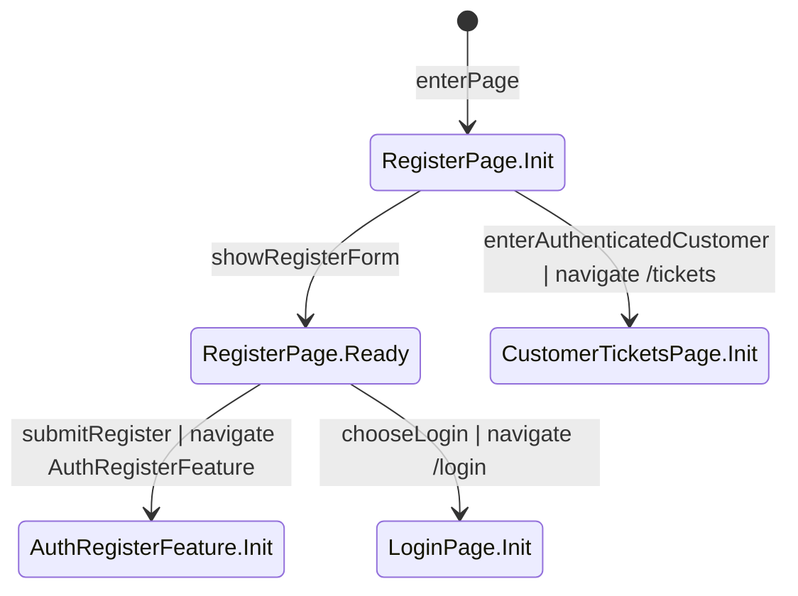

## ④ Customer Tickets Page State Machine
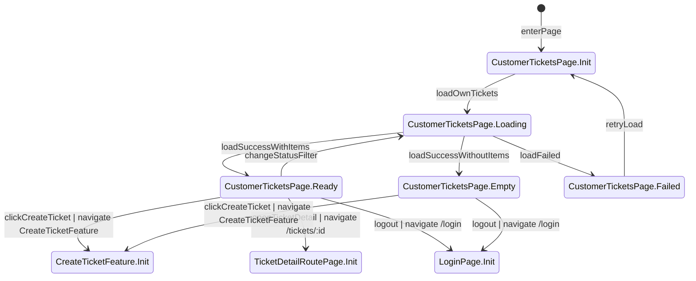

## ⑤ Agent Tickets Page State Machine
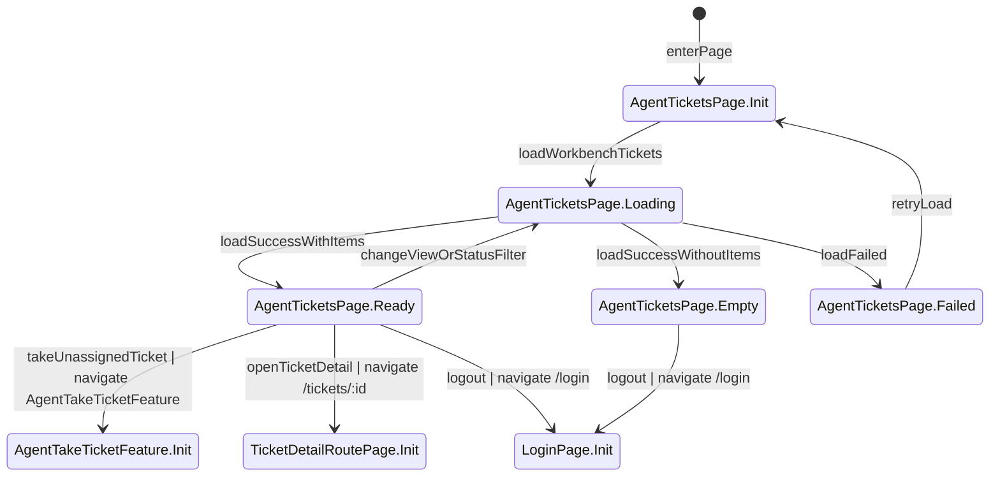

## ⑥ Admin Dashboard Page State Machine
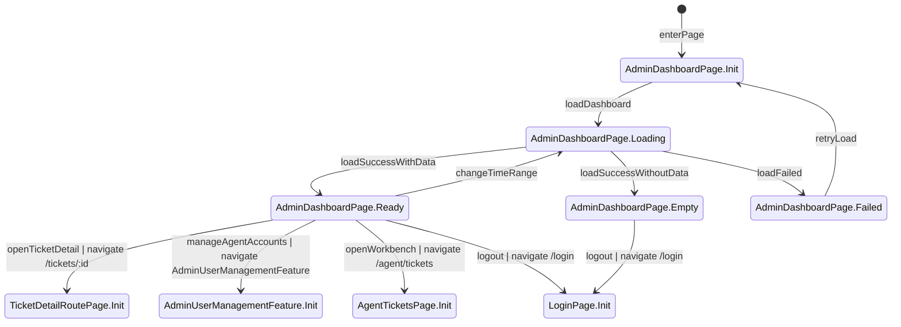

## ⑦ Ticket Detail Route Page State Machine
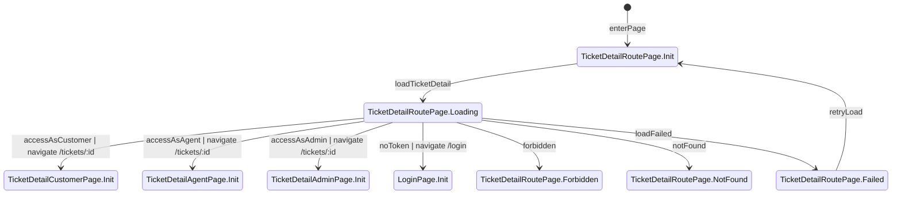

## ⑧ Ticket Detail Page State Machine（Customer）
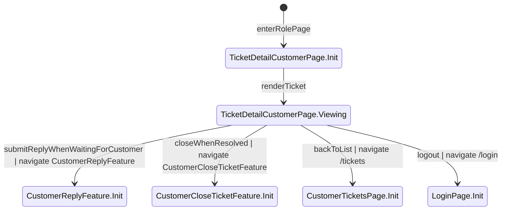

## ⑨ Ticket Detail Page State Machine（Agent）
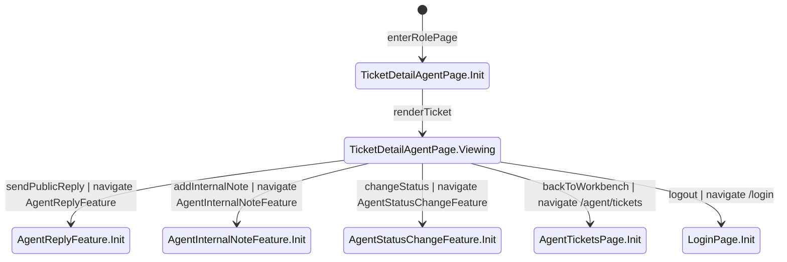

## ⑩ Ticket Detail Page State Machine（Admin）
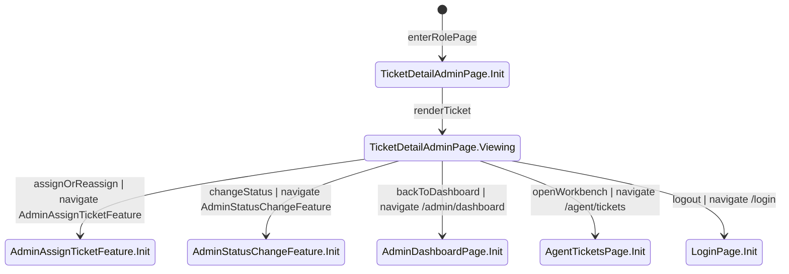

## ⑪ Feature: AuthLoginFeature
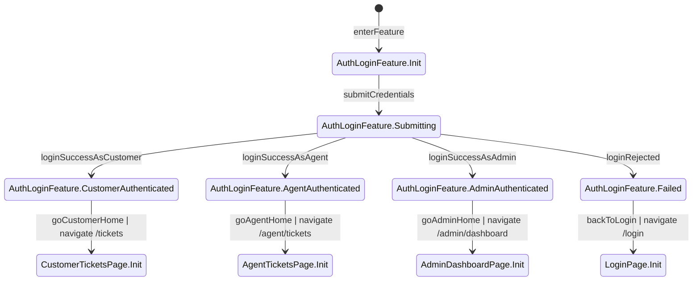

## ⑫ Feature: AuthRegisterFeature
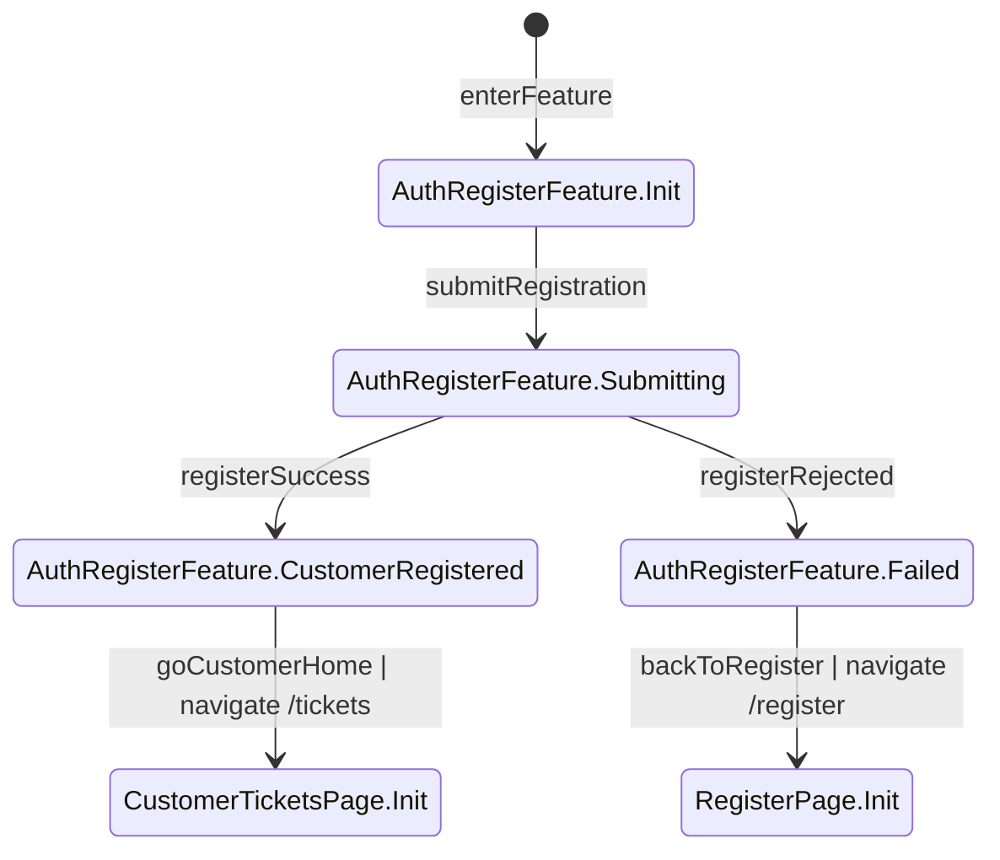

## ⑬ Feature: CreateTicketFeature
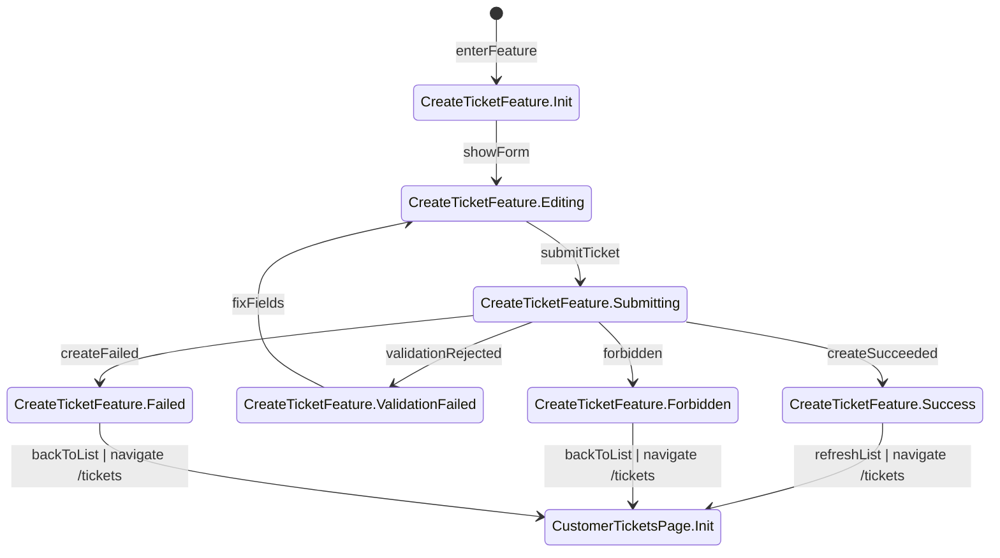

## ⑭ Feature: AgentTakeTicketFeature
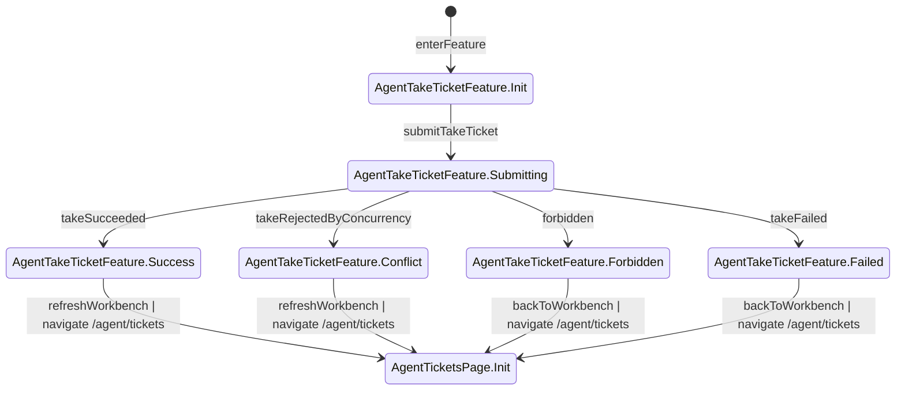

## ⑮ Feature: CustomerReplyFeature
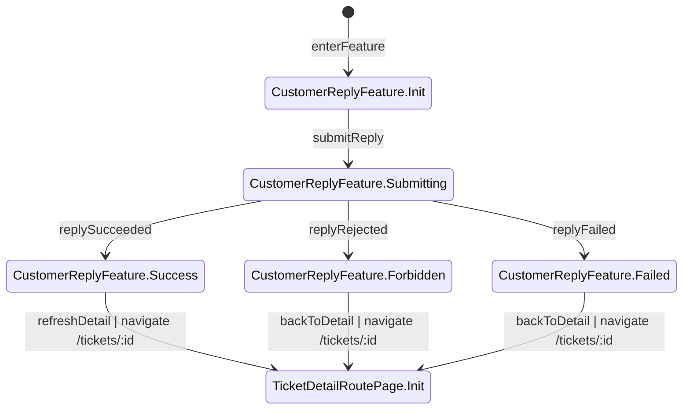

## ⑯ Feature: CustomerCloseTicketFeature
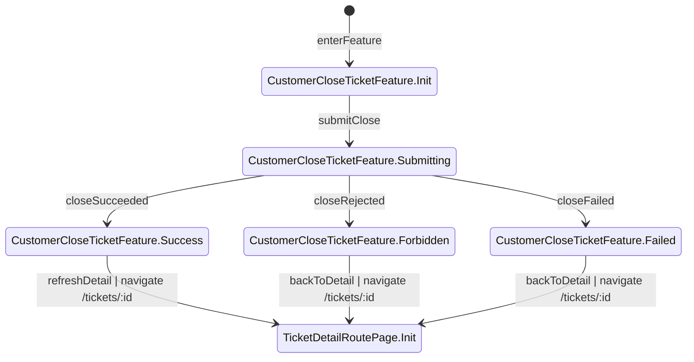

## ⑰ Feature: AgentReplyFeature
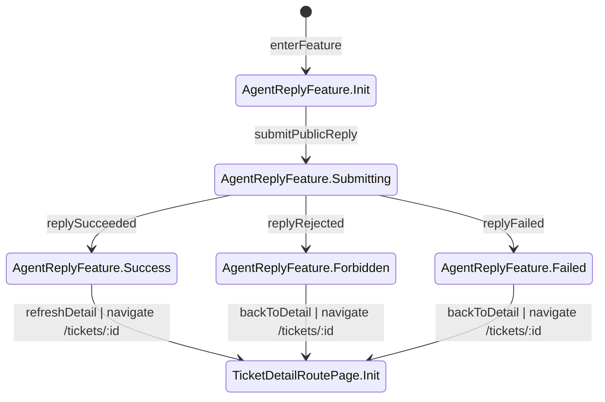

## ⑱ Feature: AgentInternalNoteFeature
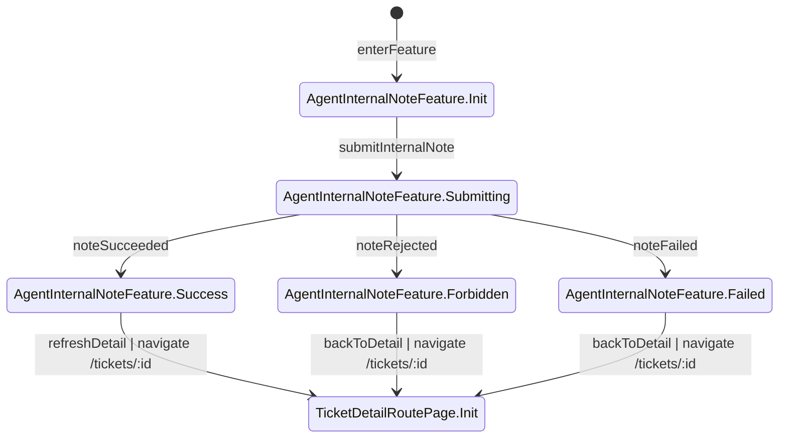

## ⑲ Feature: AgentStatusChangeFeature
```mermaid
%% role: Agent
stateDiagram-v2
    [*] --> AgentStatusChangeFeature.Init: enterFeature
    %% verify: 只有 Agent 在可見範圍內的 ticket 可進入狀態變更流程；Closed 工單不得進入任何狀態變更

    AgentStatusChangeFeature.Init --> AgentStatusChangeFeature.SubmittingWaitingForCustomer: setWaitingForCustomer
    %% verify: 只有當前狀態為 In Progress 時才允許送出；請求需以目前 status 做條件避免非法轉換

    AgentStatusChangeFeature.Init --> AgentStatusChangeFeature.SubmittingResolved: setResolved
    %% verify: 只有當前狀態為 In Progress 時才允許送出；成功後 Customer 才可看到關閉工單 CTA

    AgentStatusChangeFeature.Init --> AgentStatusChangeFeature.SubmittingReopen: reopenToInProgress
    %% verify: 只有當前狀態為 Resolved 時才允許送出；Closed 工單不得重新開啟

    AgentStatusChangeFeature.SubmittingWaitingForCustomer --> AgentStatusChangeFeature.Success: setWaitingForCustomerSucceeded
    %% verify: API 回 200；ticket.status=Waiting for Customer，並寫入 STATUS_CHANGED Audit Log

    AgentStatusChangeFeature.SubmittingResolved --> AgentStatusChangeFeature.Success: setResolvedSucceeded
    %% verify: API 回 200；ticket.status=Resolved，列表與詳情需同步更新 status 與 updated_at

    AgentStatusChangeFeature.SubmittingReopen --> AgentStatusChangeFeature.Success: reopenSucceeded
    %% verify: API 回 200；ticket.status=In Progress，表示重新開啟處理並寫入 STATUS_CHANGED Audit Log

    AgentStatusChangeFeature.SubmittingWaitingForCustomer --> AgentStatusChangeFeature.Forbidden: waitingForCustomerRejected
    %% verify: 當前狀態不是 In Progress 或角色不符時回 400 或 403；不得改變 status

    AgentStatusChangeFeature.SubmittingResolved --> AgentStatusChangeFeature.Forbidden: resolvedRejected
    %% verify: 當前狀態不是 In Progress 或角色不符時回 400 或 403；不得改變 status

    AgentStatusChangeFeature.SubmittingReopen --> AgentStatusChangeFeature.Forbidden: reopenRejected
    %% verify: 當前狀態不是 Resolved、角色不符或工單已 Closed 時回 400 或 403；不得改變 status

    AgentStatusChangeFeature.SubmittingWaitingForCustomer --> AgentStatusChangeFeature.Failed: waitingForCustomerFailed
    %% verify: 其他失敗時顯示明確錯誤；不得出現前端顯示已切換但伺服器未更新的情況

    AgentStatusChangeFeature.SubmittingResolved --> AgentStatusChangeFeature.Failed: resolvedFailed
    %% verify: 其他失敗時顯示明確錯誤；列表與詳情資料不得失去一致性

    AgentStatusChangeFeature.SubmittingReopen --> AgentStatusChangeFeature.Failed: reopenFailed
    %% verify: 其他失敗時顯示明確錯誤；不得改壞現有 assignee 或 updated_at

    AgentStatusChangeFeature.Success --> TicketDetailRoutePage.Init: refreshDetail | navigate /tickets/:id
    %% verify: 返回詳情後顯示最新 status；若切到 Waiting for Customer，Customer 回覆入口才會啟用

    AgentStatusChangeFeature.Forbidden --> TicketDetailRoutePage.Init: backToDetail | navigate /tickets/:id
    %% verify: 返回詳情後仍維持原狀態；UI 不得誤顯示成功訊息

    AgentStatusChangeFeature.Failed --> TicketDetailRoutePage.Init: backToDetail | navigate /tickets/:id
    %% verify: 返回詳情後可重新載入最新狀態；失敗不應破壞時間軸與狀態一致性
```

## ⑳ Feature: AdminAssignTicketFeature
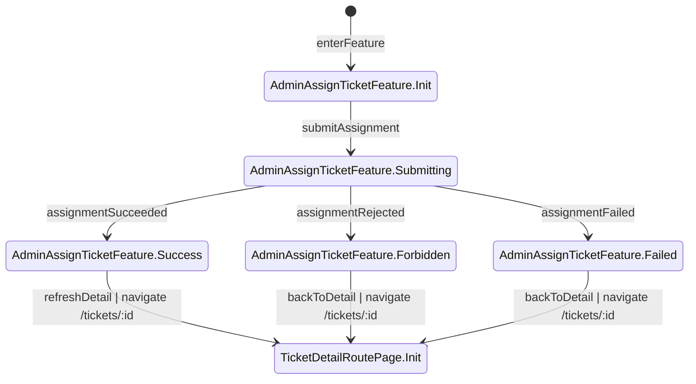

## ㉑ Feature: AdminStatusChangeFeature
```mermaid
%% role: Admin
stateDiagram-v2
    [*] --> AdminStatusChangeFeature.Init: enterFeature
    %% verify: 只有 Admin 可進入此流程；可用操作僅限 Open→In Progress、Resolved→In Progress、Resolved→Closed

    AdminStatusChangeFeature.Init --> AdminStatusChangeFeature.SubmittingStart: setInProgressFromOpen
    %% verify: 只有當前狀態為 Open 時才允許送出；請求需以目前 status 做條件避免競態

    AdminStatusChangeFeature.Init --> AdminStatusChangeFeature.SubmittingReopen: setInProgressFromResolved
    %% verify: 只有當前狀態為 Resolved 時才允許重新開啟；不得對 Closed 工單送出

    AdminStatusChangeFeature.Init --> AdminStatusChangeFeature.SubmittingClose: setClosedFromResolved
    %% verify: 只有當前狀態為 Resolved 時才允許關閉；成功後 closed_at 必須寫入

    AdminStatusChangeFeature.SubmittingStart --> AdminStatusChangeFeature.Success: startSucceeded
    %% verify: API 回 200；ticket.status=In Progress 並寫入 STATUS_CHANGED Audit Log

    AdminStatusChangeFeature.SubmittingReopen --> AdminStatusChangeFeature.Success: reopenSucceeded
    %% verify: API 回 200；ticket.status=In Progress，closed_at 仍應為空且資料一致

    AdminStatusChangeFeature.SubmittingClose --> AdminStatusChangeFeature.Success: closeSucceeded
    %% verify: API 回 200；ticket.status=Closed、closed_at 有值，後續任何留言與狀態變更都需被拒絕

    AdminStatusChangeFeature.SubmittingStart --> AdminStatusChangeFeature.Forbidden: startRejected
    %% verify: 當前狀態不是 Open 或角色不符時回 400 或 403；status 不得被改動

    AdminStatusChangeFeature.SubmittingReopen --> AdminStatusChangeFeature.Forbidden: reopenRejected
    %% verify: 當前狀態不是 Resolved 或角色不符時回 400 或 403；status 不得被改動

    AdminStatusChangeFeature.SubmittingClose --> AdminStatusChangeFeature.Forbidden: closeRejected
    %% verify: 當前狀態不是 Resolved 或角色不符時回 400 或 403；closed_at 不得被錯誤填入

    AdminStatusChangeFeature.SubmittingStart --> AdminStatusChangeFeature.Failed: startFailed
    %% verify: 其他失敗時顯示明確錯誤；不得讓工作台與詳情顯示不同 status

    AdminStatusChangeFeature.SubmittingReopen --> AdminStatusChangeFeature.Failed: reopenFailed
    %% verify: 其他失敗時顯示明確錯誤；不得改壞現有 assignee 或 updated_at

    AdminStatusChangeFeature.SubmittingClose --> AdminStatusChangeFeature.Failed: closeFailed
    %% verify: 其他失敗時顯示明確錯誤；前端不得誤判為已 Closed

    AdminStatusChangeFeature.Success --> TicketDetailRoutePage.Init: refreshDetail | navigate /tickets/:id
    %% verify: 返回詳情後顯示最新 status；若關閉成功，所有互動入口必須消失

    AdminStatusChangeFeature.Forbidden --> TicketDetailRoutePage.Init: backToDetail | navigate /tickets/:id
    %% verify: 返回詳情後仍維持原狀態；不得顯示成功提示或錯誤更新後的統計

    AdminStatusChangeFeature.Failed --> TicketDetailRoutePage.Init: backToDetail | navigate /tickets/:id
    %% verify: 返回詳情後可重新載入最新資料；失敗不應破壞詳情、列表、統計一致性
```

## ㉒ Feature: AdminUserManagementFeature
```mermaid
%% role: Admin
stateDiagram-v2
    [*] --> AdminUserManagementFeature.Init: enterFeature
    %% verify: 只有 Admin 可進入客服帳號管理流程；功能涵蓋建立、停用與角色設定

    AdminUserManagementFeature.Init --> AdminUserManagementFeature.SubmittingCreateAgent: createAgentAccount
    %% verify: 送出建立客服帳號時需驗證 email 唯一與資料完整；新帳號角色必須是 Agent 才符合客服帳號管理用途

    AdminUserManagementFeature.Init --> AdminUserManagementFeature.SubmittingDeactivate: deactivateAccount
    %% verify: 送出停用時需明確指定目標帳號；停用後該帳號下一次 token 驗證應被拒絕並回 401 或 403

    AdminUserManagementFeature.Init --> AdminUserManagementFeature.SubmittingChangeRole: changeUserRole
    %% verify: 送出角色變更時僅允許 Customer、Agent、Admin 三種互斥角色；更新後需反映在權限與導覽可見性

    AdminUserManagementFeature.SubmittingCreateAgent --> AdminUserManagementFeature.Success: createAgentSucceeded
    %% verify: API 回 200；新 Agent 帳號可登入 /agent/tickets，且資料庫不得以明碼保存密碼

    AdminUserManagementFeature.SubmittingDeactivate --> AdminUserManagementFeature.Success: deactivateSucceeded
    %% verify: API 回 200；目標帳號 is_active=false，既有 session 在下一次驗證時被拒絕，不得再繼續存取受保護頁

    AdminUserManagementFeature.SubmittingChangeRole --> AdminUserManagementFeature.Success: changeRoleSucceeded
    %% verify: API 回 200；新角色立即影響路由存取與 Header 導覽可見性，且每位使用者僅有一個 role

    AdminUserManagementFeature.SubmittingCreateAgent --> AdminUserManagementFeature.Failed: createAgentFailed
    %% verify: API 回 400 或其他失敗時顯示欄位或系統錯誤；不得建立半完成帳號

    AdminUserManagementFeature.SubmittingDeactivate --> AdminUserManagementFeature.Failed: deactivateFailed
    %% verify: 停用失敗時帳號狀態維持原值；不得發生畫面顯示已停用但實際仍可登入

    AdminUserManagementFeature.SubmittingChangeRole --> AdminUserManagementFeature.Failed: changeRoleFailed
    %% verify: 角色更新失敗時不得留下部分權限變更；導覽與路由權限需維持舊值

    AdminUserManagementFeature.Success --> AdminDashboardPage.Init: returnDashboard | navigate /admin/dashboard
    %% verify: 返回管理後台後可繼續檢視統計；若變更影響客服負載或可見使用者，畫面應以最新資料為準

    AdminUserManagementFeature.Failed --> AdminDashboardPage.Init: returnDashboard | navigate /admin/dashboard
    %% verify: 返回管理後台後可重新進入帳號管理；失敗不應破壞現有管理資料顯示
```