全體結構說明
[Entry State]
        ↓
[Page State Machine]
        ↓
[Role-specific Page State]
        ↓
[Feature / Function State Machine]
        ↓
[回到 Page 或跳轉其他 Page，或跳轉到其他 Feature]

以下將照這個層級排序。

---

## ① Entry State Machine
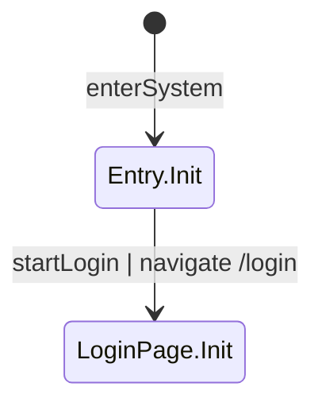

---

## ② /login Page
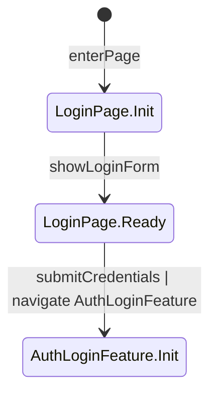

## ③ /documents Page (User)
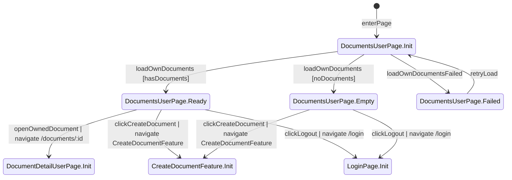

## ④ /documents Page (Admin)
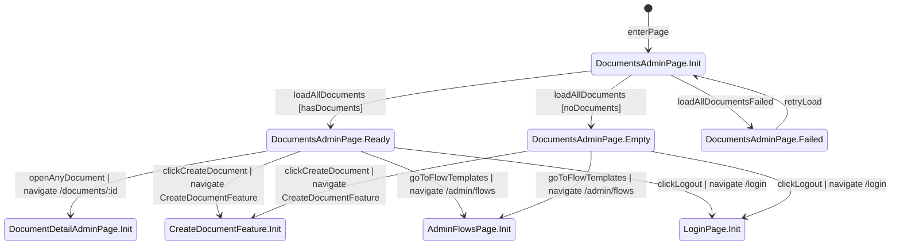

## ⑤ /documents/:id Page (User)
```mermaid
%% role: User
stateDiagram-v2
    [*] --> DocumentDetailUserPage.Init : enterPage
    %% verify: 進入文件詳情時先以 document_id 載入資料；沒有有效 token 或不是 owner 的情況不得先渲染文件內容。

    DocumentDetailUserPage.Init --> DocumentDetailUserPage.DraftReady : loadOwnedDocument [status=Draft]
    %% verify: 詳情 API 回 200 且 status=Draft；UI 顯示 title、content、versions、attachments，並只顯示「編輯」「上傳附件」「送出簽核」這些 Draft 專屬 CTA。

    DocumentDetailUserPage.Init --> DocumentDetailUserPage.RejectedReady : loadOwnedDocument [status=Rejected]
    %% verify: 詳情 API 回 200 且 status=Rejected；畫面顯示退回結果與唯一本頁「退回後修改」入口，不顯示 Draft 編輯或 Reviewer/Admin CTA。

    DocumentDetailUserPage.Init --> DocumentDetailUserPage.Readonly : loadOwnedDocument [status=Submitted|In Review|Approved|Archived]
    %% verify: 詳情 API 回 200 且 current_version_id 指向目前可展示版本；畫面隱藏編輯、上傳附件、送出簽核與退回後修改入口，保持只讀。

    DocumentDetailUserPage.Init --> DocumentDetailUserPage.NotFound : loadOwnedDocumentNotFound
    %% verify: 他人文件或不存在的 document_id 應回 404；畫面顯示 Not Found，且不得透露文件 title、owner 或狀態。

    DocumentDetailUserPage.Init --> DocumentDetailUserPage.Failed : loadOwnedDocumentFailed
    %% verify: 詳情載入失敗時顯示 Error 與 Retry；不保留前一份文件的 versions、attachments 或審核紀錄。

    DocumentDetailUserPage.Failed --> DocumentDetailUserPage.Init : retryLoad
    %% verify: Retry 重新請求同一 document_id；成功後只會進入 DraftReady、RejectedReady、Readonly 或 NotFound 其中一種可觀測狀態。

    DocumentDetailUserPage.DraftReady --> EditDraftFeature.Init : clickEditDraft | navigate EditDraftFeature
    %% verify: 只有 status=Draft 才能進入編輯流程；點擊後不應存在第二個同功能入口，且 Reviewer/Admin 操作不會出現在此頁。

    DocumentDetailUserPage.DraftReady --> UploadAttachmentFeature.Init : clickUploadAttachment | navigate UploadAttachmentFeature
    %% verify: 只有 Draft 允許新增附件；點擊上傳會綁定目前 current_version_id，不允許覆寫既有附件內容。

    DocumentDetailUserPage.DraftReady --> SubmitDocumentFeature.Init : clickSubmitForReview | navigate SubmitDocumentFeature
    %% verify: 送出簽核入口僅在 Draft 顯示一次；點擊後進入送審流程，按鈕需防重送。

    DocumentDetailUserPage.DraftReady --> DocumentsUserPage.Init : backToDocuments | navigate /documents
    %% verify: 返回列表後該文件的 status、updated_at 應與詳情一致，且列表仍只包含目前 User 的文件。

    DocumentDetailUserPage.DraftReady --> LoginPage.Init : clickLogout | navigate /login
    %% verify: 從 Draft 詳情登出後，任何保存、上傳或送審 API 再次呼叫都應回 401，並導回 /login。

    DocumentDetailUserPage.RejectedReady --> ReopenRejectedDocumentFeature.Init : clickReopenAsDraft | navigate ReopenRejectedDocumentFeature
    %% verify: 只有 status=Rejected 顯示「退回後修改」；點擊後進入建立新 Draft 版本流程，而不是直接修改被退回的鎖定版本。

    DocumentDetailUserPage.RejectedReady --> DocumentsUserPage.Init : backToDocuments | navigate /documents
    %% verify: 返回列表時該文件仍顯示 Rejected；列表與詳情的 status、updated_at 需一致。

    DocumentDetailUserPage.RejectedReady --> LoginPage.Init : clickLogout | navigate /login
    %% verify: 登出後不得再對 Rejected 文件執行 reopen；重新進站需先重新登入。

    DocumentDetailUserPage.Readonly --> DocumentsUserPage.Init : backToDocuments | navigate /documents
    %% verify: 從只讀詳情返回列表後，status 與 current_version_id 對應的展示資料保持一致，且列表不會錯誤顯示可編輯狀態。

    DocumentDetailUserPage.Readonly --> LoginPage.Init : clickLogout | navigate /login
    %% verify: 從只讀詳情登出後，重新整理 /documents/:id 應回 401 並導向 /login，不保留文件內容。

    DocumentDetailUserPage.NotFound --> DocumentsUserPage.Init : returnToDocuments | navigate /documents
    %% verify: 從 Not Found 返回列表後只看到自己的文件清單；不存在或未授權文件不會被補進列表。
```

## ⑥ /documents/:id Page (Reviewer)
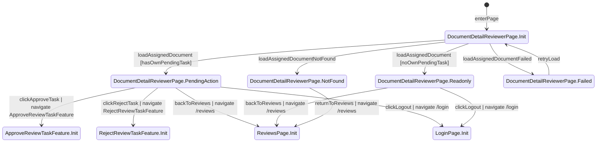

## ⑦ /documents/:id Page (Admin)
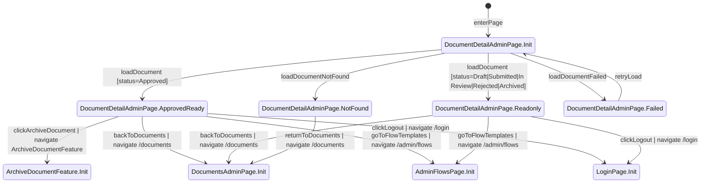

## ⑧ /reviews Page
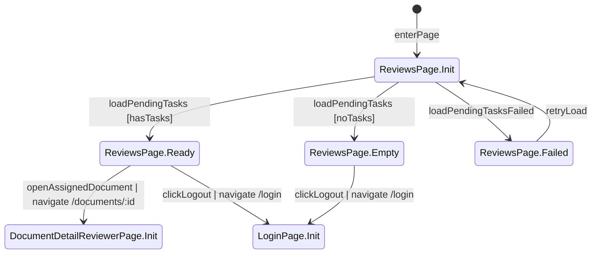

## ⑨ /admin/flows Page
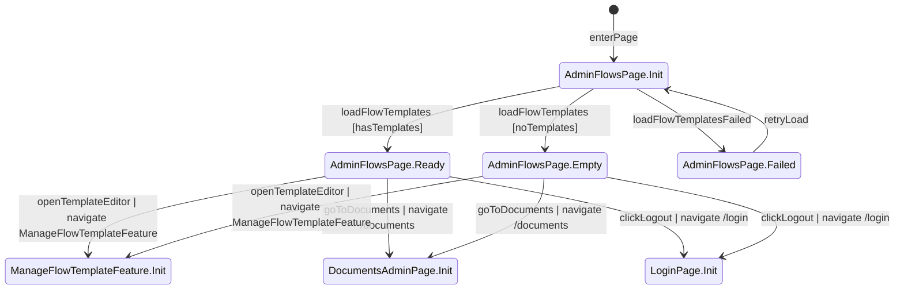

---

## ⑩ Feature: AuthLoginFeature
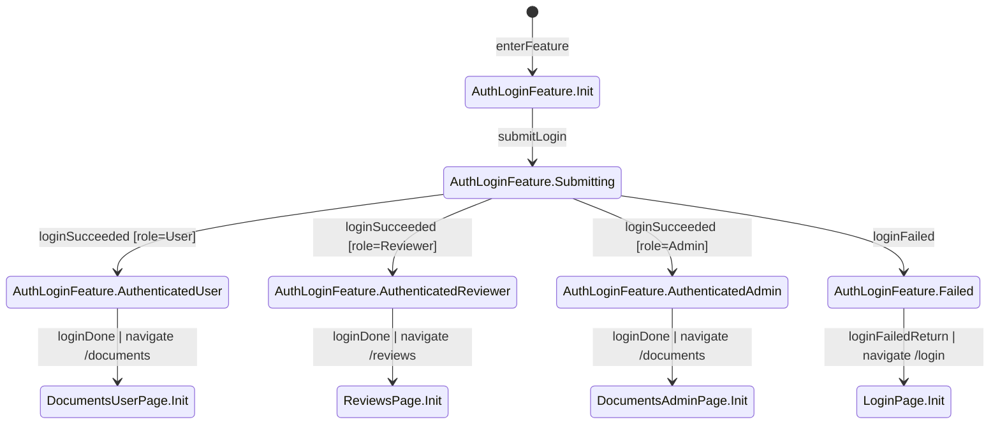

## ⑪ Feature: CreateDocumentFeature
Source Pages: DocumentsUserPage, DocumentsAdminPage

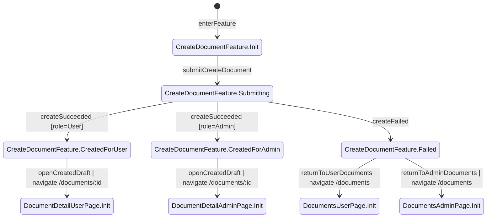

## ⑫ Feature: EditDraftFeature
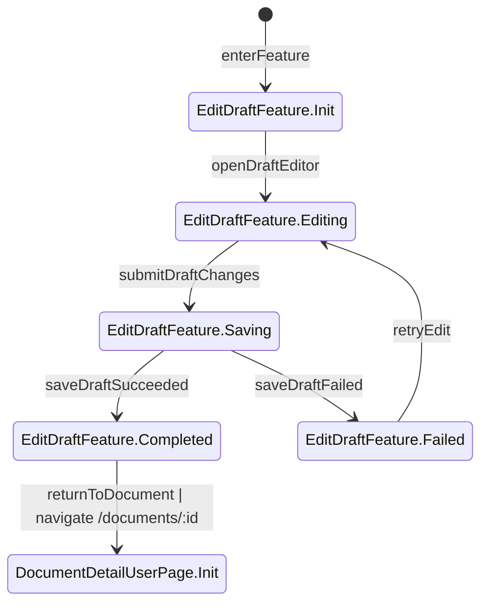

## ⑬ Feature: UploadAttachmentFeature
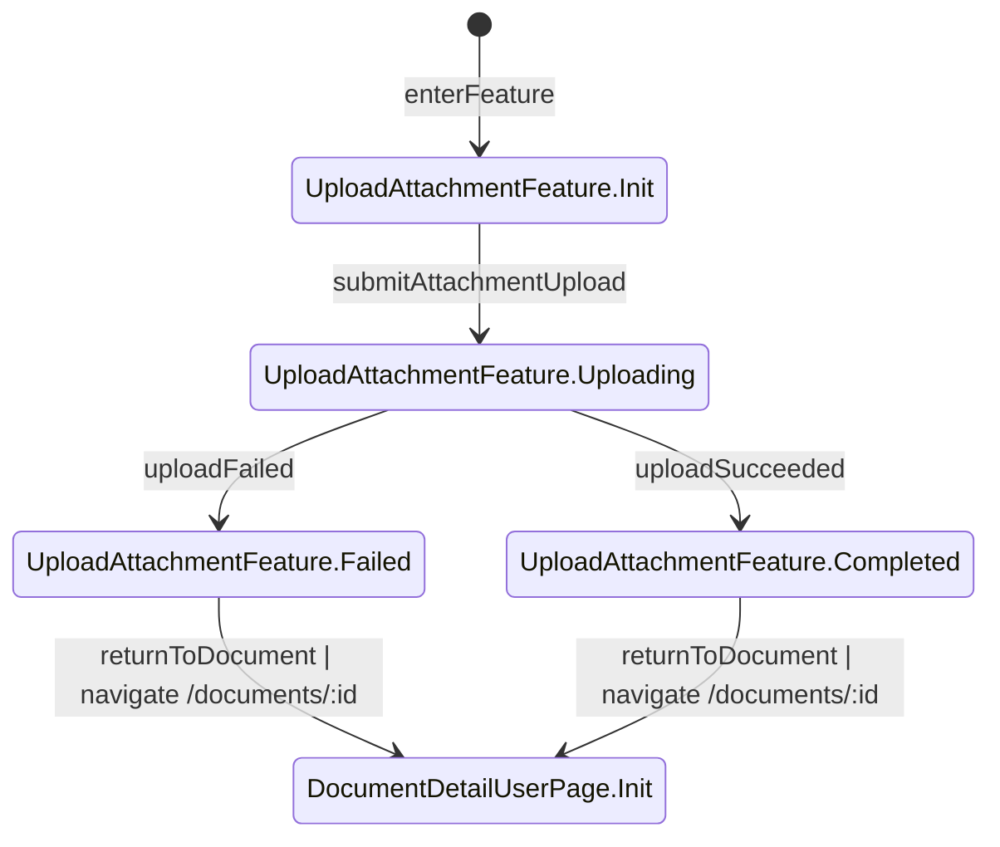

## ⑭ Feature: SubmitDocumentFeature
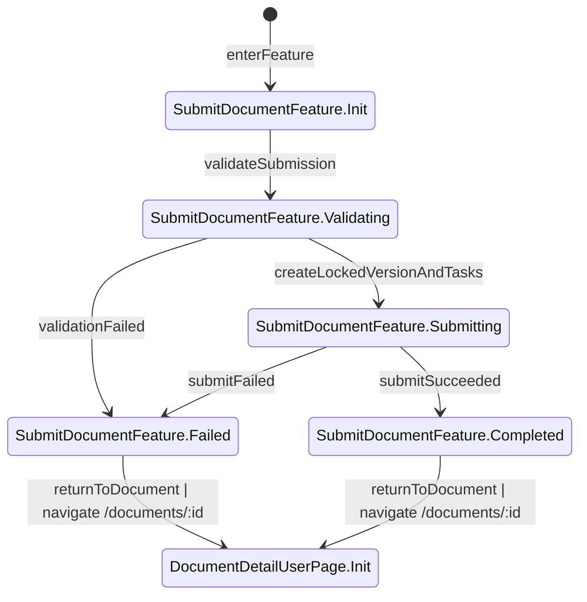

## ⑮ Feature: ReopenRejectedDocumentFeature
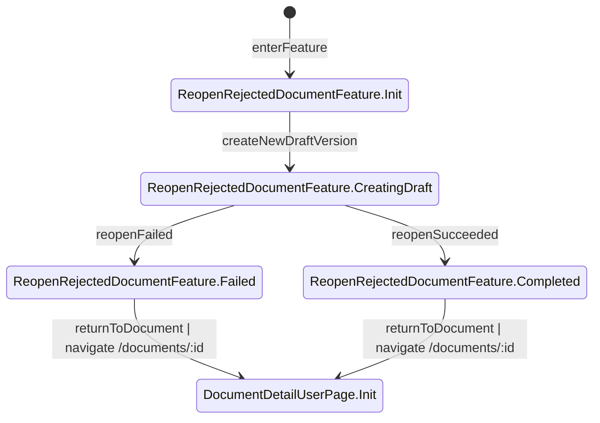

## ⑯ Feature: ApproveReviewTaskFeature
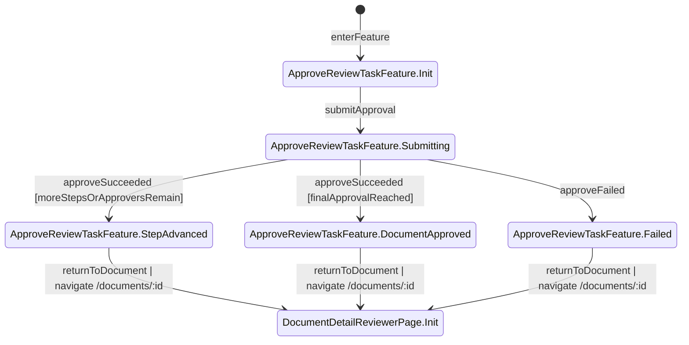

## ⑰ Feature: RejectReviewTaskFeature
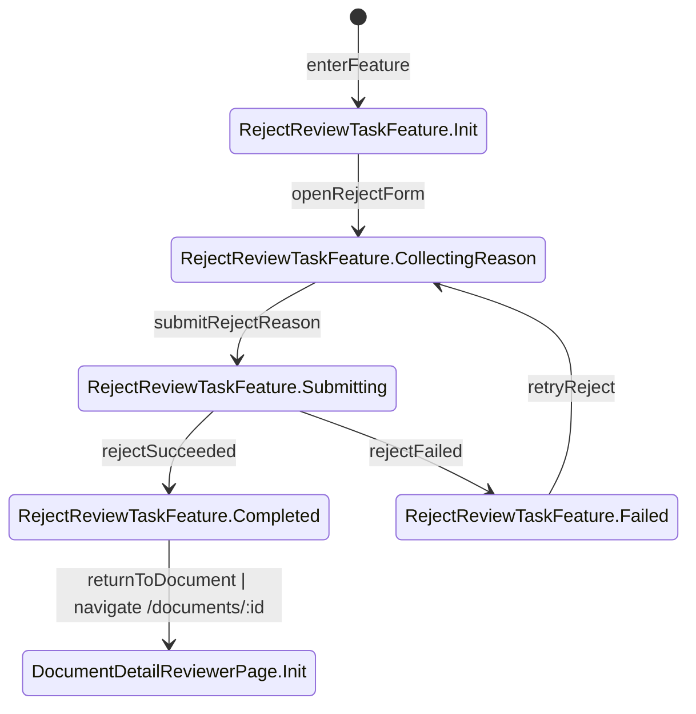

## ⑱ Feature: ManageFlowTemplateFeature
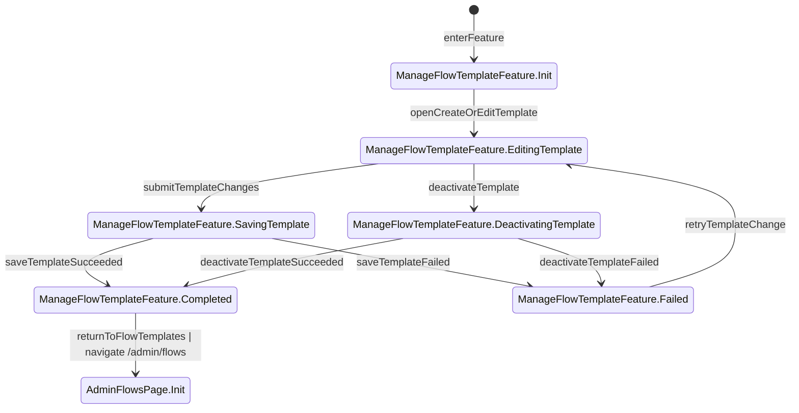

## ⑲ Feature: ArchiveDocumentFeature
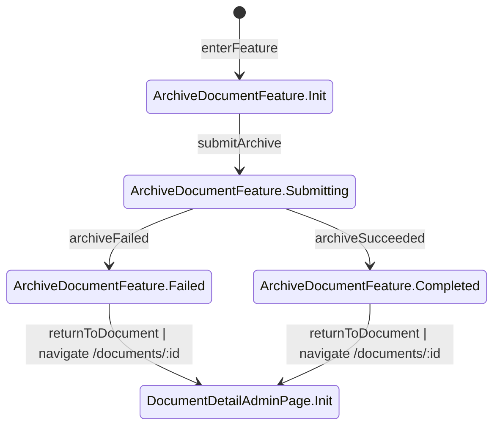