全體結構說明
[Entry State]
        ↓
[Page State Machine]
        ↓
[Role-specific Page State]
        ↓
[Feature / Function State Machine]
        ↓
[回到 Page 或跳轉其他 Page，或跳轉到其他 Feature]

以下將照這個層級排序。

---

## ① Entry State Machine
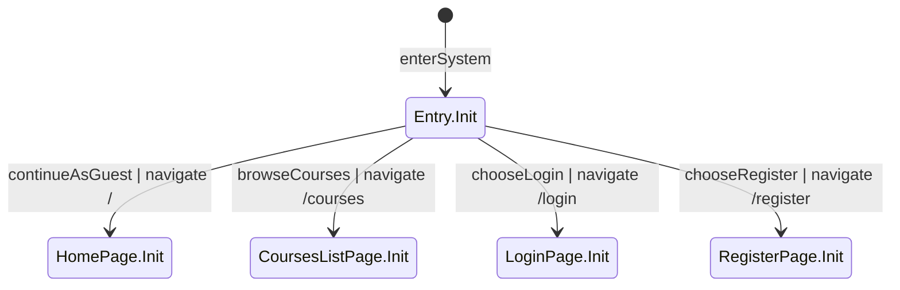

---

## ② Home Page State Machine
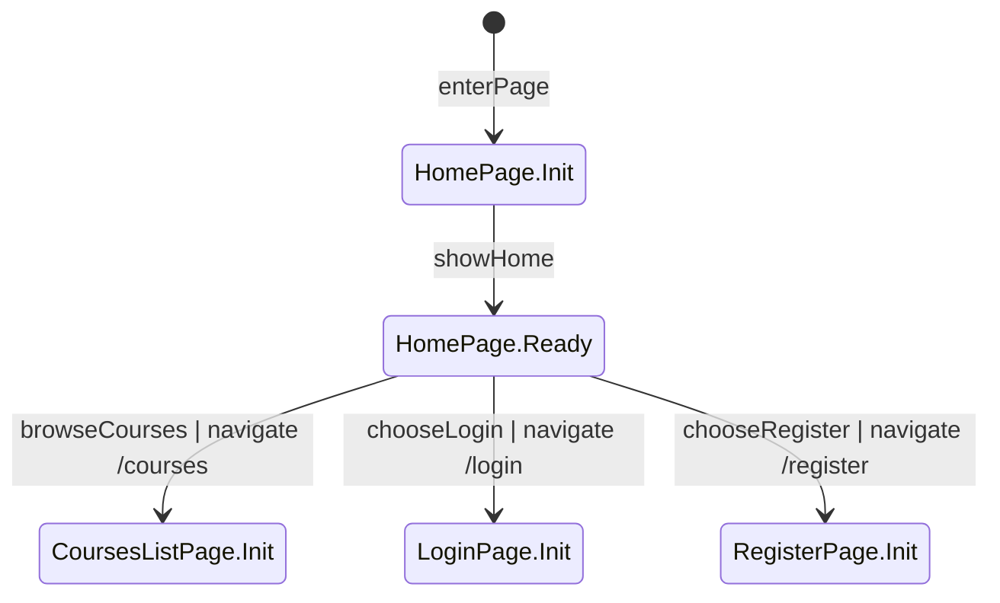

## ③ Login Page State Machine
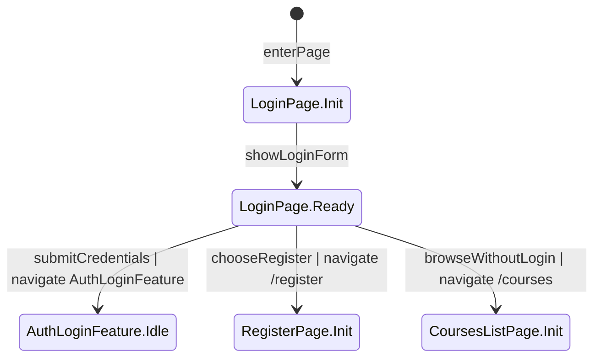

## ④ Register Page State Machine
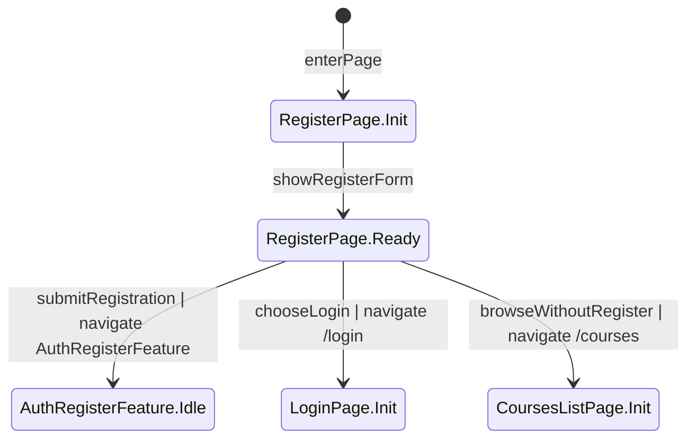

## ⑤ Courses List Page State Machine
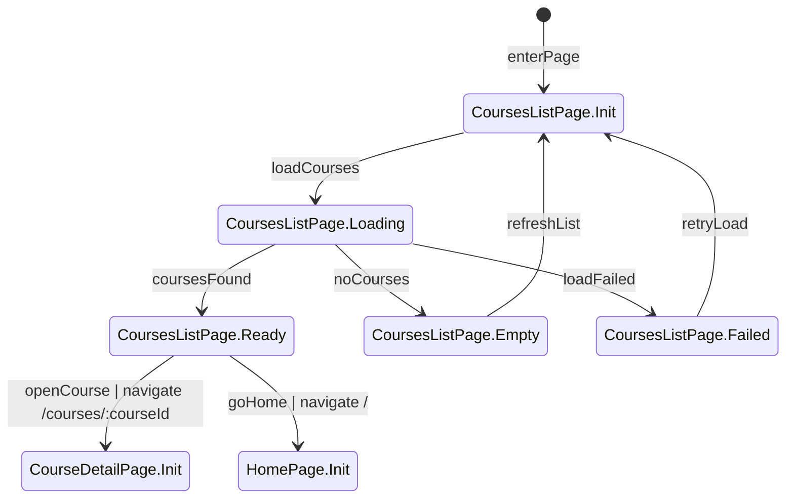

## ⑥ Course Detail Page State Machine
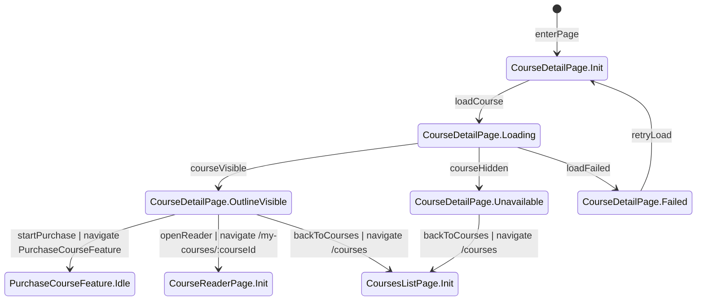

## ⑦ My Courses Page State Machine
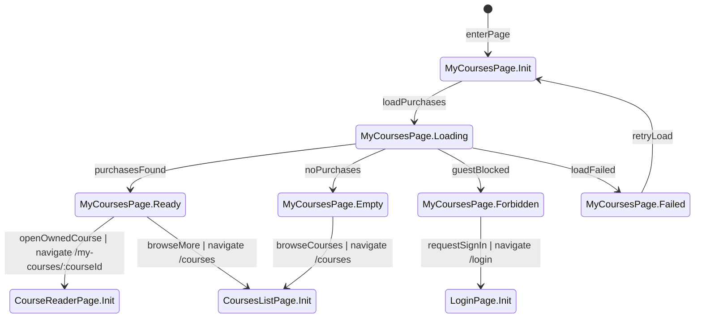

## ⑧ Course Reader Page State Machine
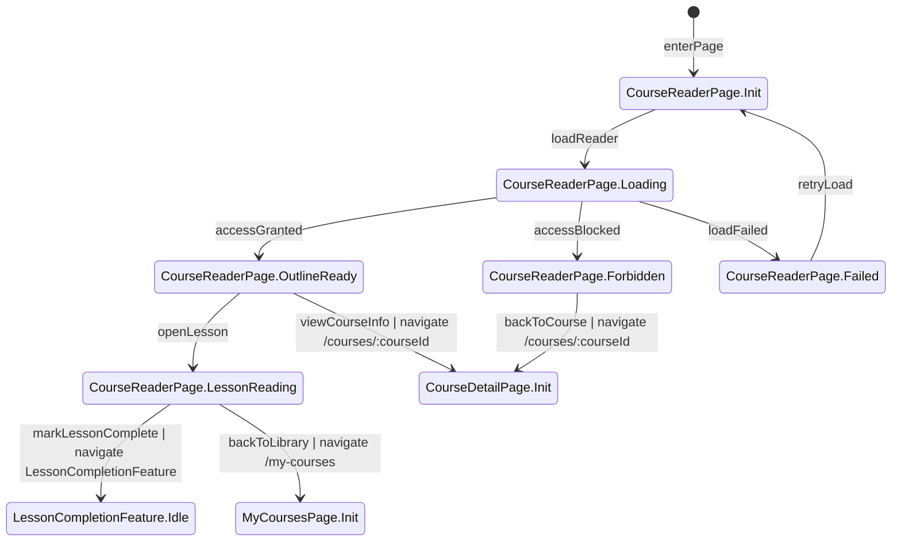

## ⑨ Instructor Courses Page State Machine
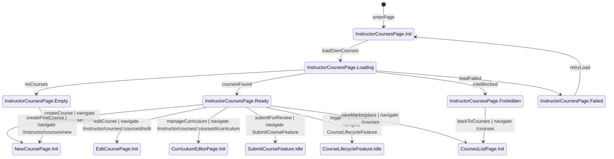

## ⑩ New Course Page State Machine
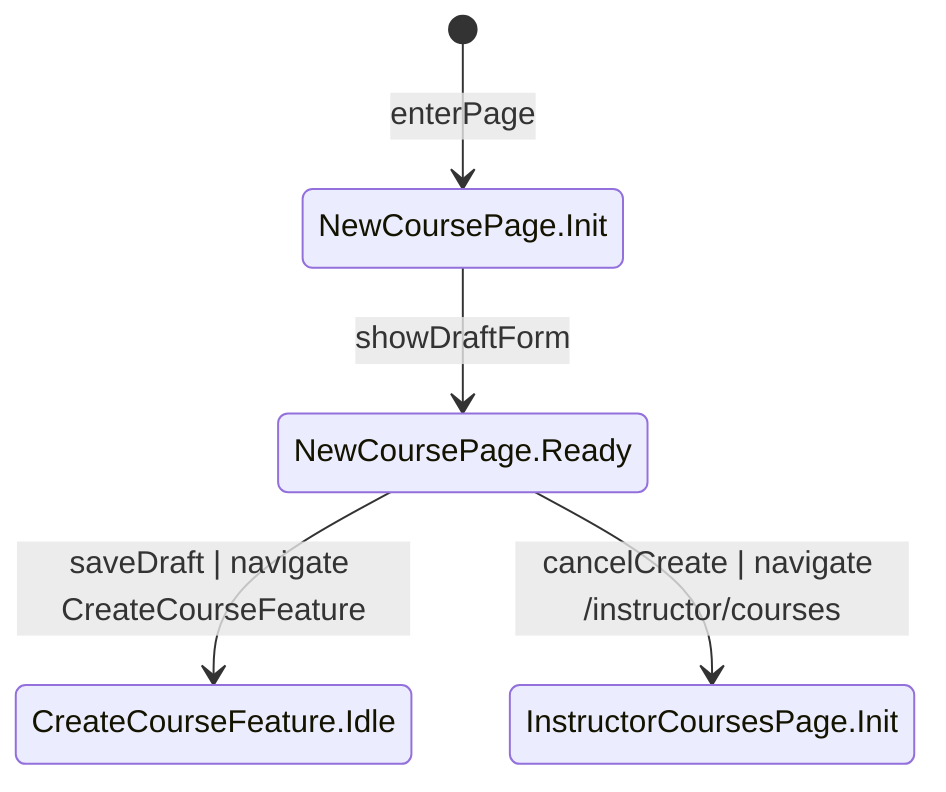

## ⑪ Edit Course Page State Machine
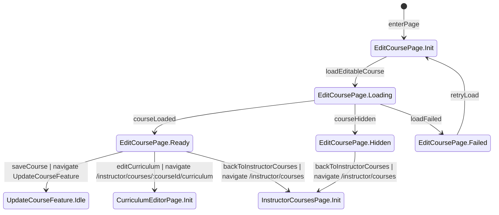

## ⑫ Curriculum Editor Page State Machine
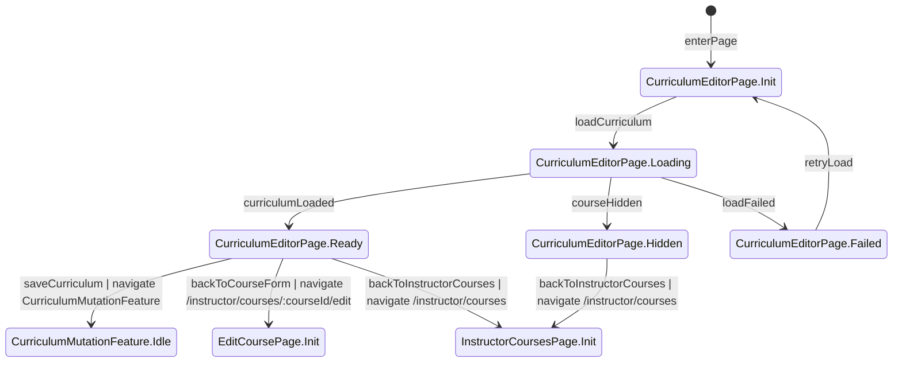

## ⑬ Admin Review Page State Machine
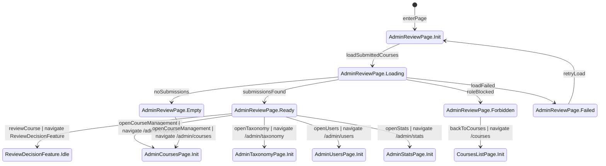

## ⑭ Admin Courses Page State Machine
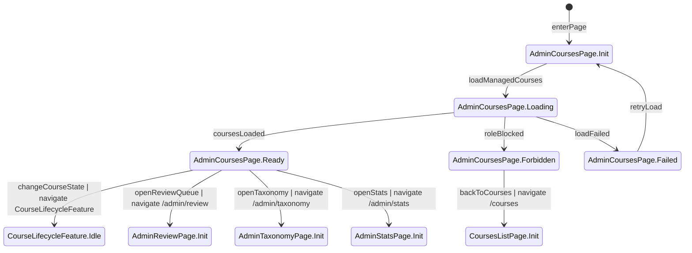

## ⑮ Admin Taxonomy Page State Machine
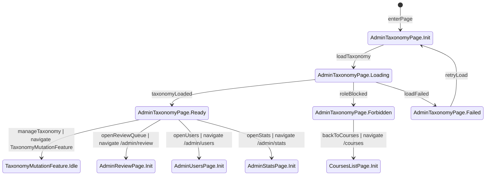

## ⑯ Admin Users Page State Machine
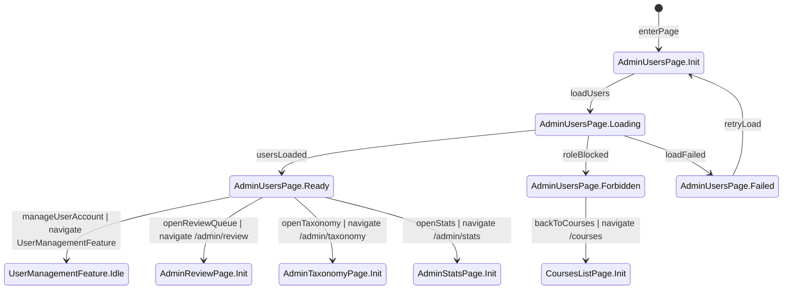

## ⑰ Admin Stats Page State Machine
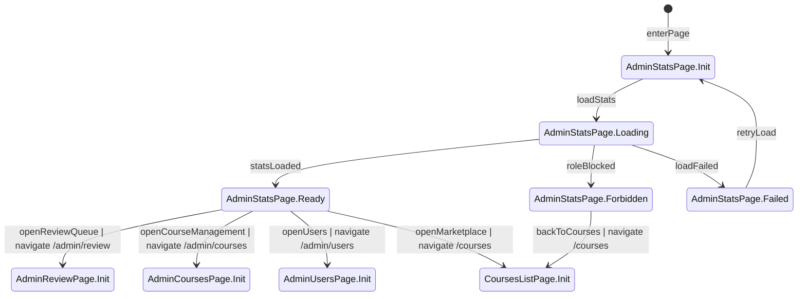

---

## ⑱ Auth Login Feature State Machine
Source Pages: LoginPage, MyCoursesPage, InstructorCoursesPage, AdminReviewPage

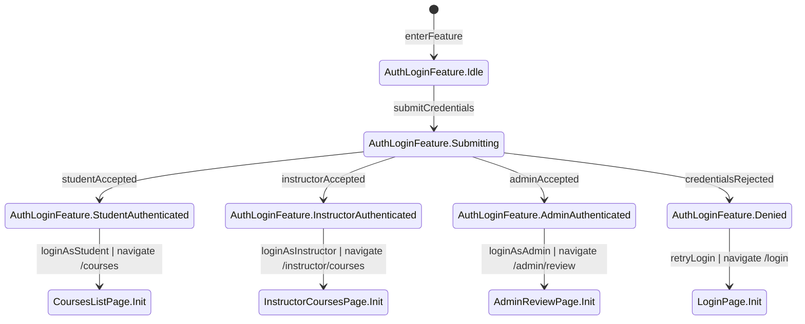

## ⑲ Auth Register Feature State Machine
Source Pages: RegisterPage

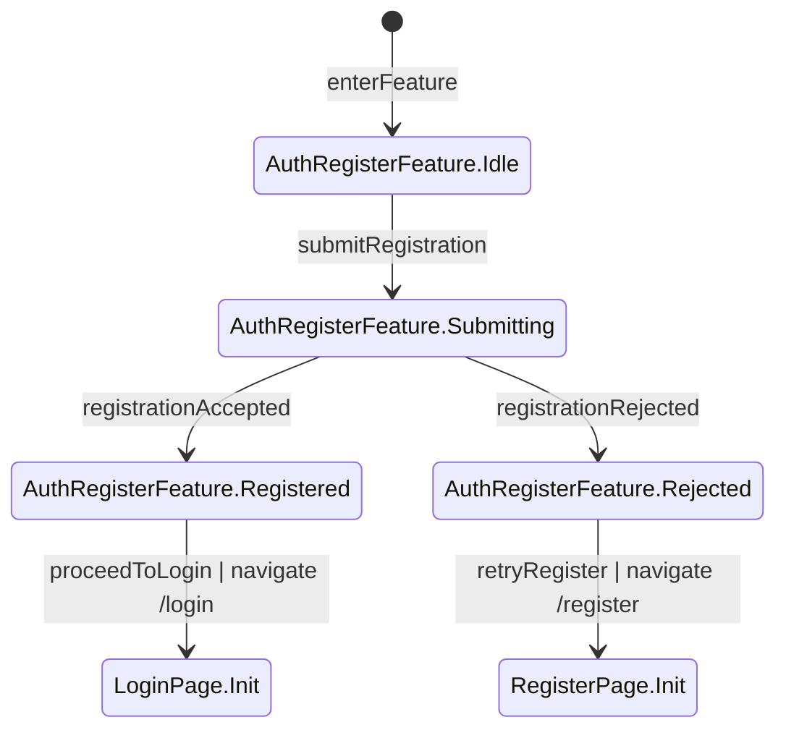

## ⑳ Purchase Course Feature State Machine
Source Pages: CourseDetailPage

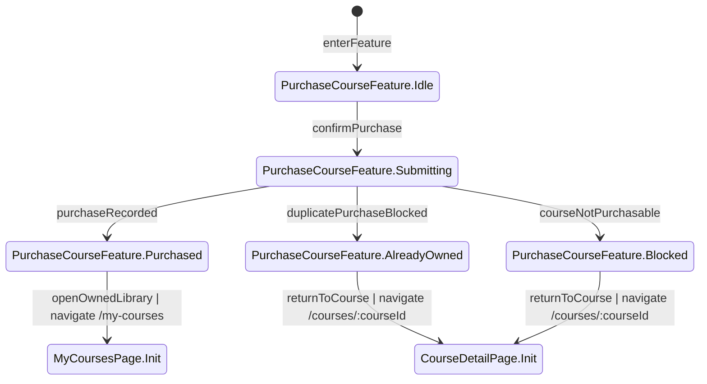

## ㉑ Lesson Completion Feature State Machine
Source Pages: CourseReaderPage

```mermaid
%% role: Student|Instructor
stateDiagram-v2
    [*] --> LessonCompletionFeature.Idle : enterFeature
    %% verify: 只有可標記進度的已登入使用者會進入完成流程；未授權角色不應進入此功能。

    LessonCompletionFeature.Idle --> LessonCompletionFeature.Submitting : confirmLessonCompletion
    %% verify: 送出完成標記時發送 LessonProgress 更新請求；按鈕 disabled 並避免重複送出。

    LessonCompletionFeature.Submitting --> LessonCompletionFeature.Completed : progressRecorded
    %% verify: API 回 200 並將對應 LessonProgress.is_completed 設為 true，completed_at 更新，課程進度計數同步增加。

    LessonCompletionFeature.Submitting --> LessonCompletionFeature.Blocked : completionBlocked
    %% verify: 無權限或資料不一致時請求被拒絕；LessonProgress 不應被錯誤改寫為已完成。

    LessonCompletionFeature.Completed --> CourseReaderPage.Init : returnToReader | navigate /my-courses/:courseId
    %% verify: 返回閱讀頁後最新完成狀態已呈現；同一單元不會再被當成未完成。

    LessonCompletionFeature.Blocked --> CourseReaderPage.Init : returnToReader | navigate /my-courses/:courseId
    %% verify: 返回閱讀頁後顯示失敗訊息且完成狀態維持原值；進度總數不被誤增。
```

## ㉒ Create Course Feature State Machine
Source Pages: NewCoursePage

```mermaid
%% role: Instructor|Admin
stateDiagram-v2
    [*] --> CreateCourseFeature.Idle : enterFeature
    %% verify: 進入建立課程功能時尚未寫入資料；只有 Instructor 或 Admin 可操作。

    CreateCourseFeature.Idle --> CreateCourseFeature.Submitting : createDraft
    %% verify: 送出建立草稿請求時帶入 title、description、category、tags、price、cover image 等欄位；按鈕 disabled 防重送。

    CreateCourseFeature.Submitting --> CreateCourseFeature.DraftCreated : draftStored
    %% verify: API 回 201 並建立 Course，status=draft，instructor_id 正確綁定建立者，價格非負且資料欄位完整保存。

    CreateCourseFeature.Submitting --> CreateCourseFeature.Rejected : draftRejected
    %% verify: 驗證失敗時顯示欄位錯誤訊息；不建立半成品課程，也不產生錯誤狀態的 Course。

    CreateCourseFeature.DraftCreated --> EditCoursePage.Init : openCreatedCourse | navigate /instructor/courses/:courseId/edit
    %% verify: 建立成功後導向該新課程的編輯頁；courseId 正確且可繼續編輯基本資訊與課綱。

    CreateCourseFeature.Rejected --> NewCoursePage.Init : retryDraft | navigate /instructor/courses/new
    %% verify: 返回新增頁後保留必要錯誤提示；使用者可修正後再次建立草稿。
```

## ㉓ Update Course Feature State Machine
Source Pages: EditCoursePage

```mermaid
%% role: Instructor|Admin
stateDiagram-v2
    [*] --> UpdateCourseFeature.Idle : enterFeature
    %% verify: 進入課程更新功能時只有作者或管理員可送出；尚未更新資料庫內容。

    UpdateCourseFeature.Idle --> UpdateCourseFeature.Submitting : saveCourse
    %% verify: 送出更新請求時包含可編輯欄位；按鈕 disabled 並避免重複送出同一批修改。

    UpdateCourseFeature.Submitting --> UpdateCourseFeature.Saved : courseStored
    %% verify: API 回 200 並更新課程基本欄位與 updated_at；不會非法改變課程生命週期狀態。

    UpdateCourseFeature.Submitting --> UpdateCourseFeature.Rejected : saveRejected
    %% verify: 驗證失敗或權限不符時顯示錯誤訊息；既有課程資料維持原值且不產生部分寫入。

    UpdateCourseFeature.Saved --> EditCoursePage.Init : reopenEditor | navigate /instructor/courses/:courseId/edit
    %% verify: 返回編輯頁後表單顯示最新儲存內容；封面、分類、標籤與價格一致更新。

    UpdateCourseFeature.Rejected --> EditCoursePage.Init : retryEdit | navigate /instructor/courses/:courseId/edit
    %% verify: 返回編輯頁後保留必要錯誤提示；使用者可繼續修正並重新送出。
```

## ㉔ Curriculum Mutation Feature State Machine
Source Pages: CurriculumEditorPage

```mermaid
%% role: Instructor|Admin
stateDiagram-v2
    [*] --> CurriculumMutationFeature.Idle : enterFeature
    %% verify: 進入課綱更新功能時僅限作者或管理員；尚未變更章節與單元資料。

    CurriculumMutationFeature.Idle --> CurriculumMutationFeature.Submitting : saveCurriculum
    %% verify: 送出課綱更新時包含章節、單元、order、content_type 與對應內容欄位；按鈕 disabled 防止重複提交。

    CurriculumMutationFeature.Submitting --> CurriculumMutationFeature.Saved : curriculumStored
    %% verify: API 回 200 並正確保存 Section、Lesson 排序與內容型態；課程閱讀頁之後可依新順序顯示內容。

    CurriculumMutationFeature.Submitting --> CurriculumMutationFeature.Rejected : saveRejected
    %% verify: 驗證失敗時顯示錯誤訊息；Section、Lesson 與附件關聯保持更新前的一致性。

    CurriculumMutationFeature.Saved --> CurriculumEditorPage.Init : reopenCurriculum | navigate /instructor/courses/:courseId/curriculum
    %% verify: 返回課綱頁後顯示最新章節與單元順序；新增、編輯、刪除結果已反映在畫面上。

    CurriculumMutationFeature.Rejected --> CurriculumEditorPage.Init : retryCurriculum | navigate /instructor/courses/:courseId/curriculum
    %% verify: 返回課綱頁後保留必要錯誤提示；未成功的變更不應污染既有課綱資料。
```

## ㉕ Submit Course Feature State Machine
Source Pages: InstructorCoursesPage

```mermaid
%% role: Instructor|Admin
stateDiagram-v2
    [*] --> SubmitCourseFeature.Idle : enterFeature
    %% verify: 只有 draft 或 rejected 課程可進入送審流程；submitted、published、archived 課程不應進入此功能。

    SubmitCourseFeature.Idle --> SubmitCourseFeature.Submitting : submitCourse
    %% verify: 送出審核請求時按鈕 disabled 並發送狀態變更；請求對象必須是作者自己的課程或管理員可管理課程。

    SubmitCourseFeature.Submitting --> SubmitCourseFeature.Submitted : reviewQueued
    %% verify: API 回 200 並將課程狀態改為 submitted；待審清單可看到該課程且作者仍不可直接改回 draft。

    SubmitCourseFeature.Submitting --> SubmitCourseFeature.Blocked : submissionBlocked
    %% verify: 非法狀態轉換或權限不足時請求被拒絕；課程狀態維持原值且不進入待審清單。

    SubmitCourseFeature.Submitted --> InstructorCoursesPage.Init : returnWithSubmittedCourse | navigate /instructor/courses
    %% verify: 返回教師課程列表後該課程顯示 submitted；提交審核入口消失直到有新的合法狀態轉換。

    SubmitCourseFeature.Blocked --> InstructorCoursesPage.Init : returnWithDraftCourse | navigate /instructor/courses
    %% verify: 返回列表後課程仍維持 draft 或 rejected；畫面顯示阻擋原因且資料一致。
```

## ㉖ Course Lifecycle Feature State Machine
Source Pages: InstructorCoursesPage, AdminCoursesPage

```mermaid
%% role: Instructor|Admin
stateDiagram-v2
    [*] --> CourseLifecycleFeature.Idle : enterFeature
    %% verify: 只有 published 或 archived 課程可進入上下架流程；draft、submitted、rejected 不應進入此功能。

    CourseLifecycleFeature.Idle --> CourseLifecycleFeature.SubmittingArchive : archiveCourse
    %% verify: 發送下架請求時只允許作者或管理員操作；按鈕 disabled 並避免重複下架。

    CourseLifecycleFeature.Idle --> CourseLifecycleFeature.SubmittingPublish : republishCourse
    %% verify: 發送重新上架請求時只允許作者或管理員操作；按鈕 disabled 並避免重複上架。

    CourseLifecycleFeature.SubmittingArchive --> CourseLifecycleFeature.Archived : archiveStored
    %% verify: API 回 200 並將課程狀態改為 archived，同步更新 archived_at；公開課程列表不再顯示該課程。

    CourseLifecycleFeature.SubmittingArchive --> CourseLifecycleFeature.Blocked : archiveBlocked
    %% verify: 非法狀態轉換或權限不足時請求被拒絕；課程狀態與公開可見性維持原值。

    CourseLifecycleFeature.SubmittingPublish --> CourseLifecycleFeature.Published : publishStored
    %% verify: API 回 200 並將課程狀態改為 published；公開課程列表恢復顯示該課程，published_at 與狀態一致。

    CourseLifecycleFeature.SubmittingPublish --> CourseLifecycleFeature.Blocked : publishBlocked
    %% verify: 非法狀態轉換或權限不足時請求被拒絕；課程仍維持 archived 或原本狀態，不錯誤出現在公開列表。

    CourseLifecycleFeature.Archived --> InstructorCoursesPage.Init : returnAsInstructor | navigate /instructor/courses
    %% verify: 以教師視角返回列表後該課程顯示 archived；可用操作改為重新上架而非再次下架。

    CourseLifecycleFeature.Archived --> AdminCoursesPage.Init : returnAsAdmin | navigate /admin/courses
    %% verify: 以管理員視角返回列表後該課程顯示 archived；全站課程管理資料與公開可見性一致。

    CourseLifecycleFeature.Published --> InstructorCoursesPage.Init : returnAsInstructor | navigate /instructor/courses
    %% verify: 以教師視角返回列表後該課程顯示 published；可用操作改為下架，且公開課程列表可瀏覽。

    CourseLifecycleFeature.Published --> AdminCoursesPage.Init : returnAsAdmin | navigate /admin/courses
    %% verify: 以管理員視角返回列表後該課程顯示 published；全站管理與公開課程列表資料一致。

    CourseLifecycleFeature.Blocked --> InstructorCoursesPage.Init : returnBlockedInstructor | navigate /instructor/courses
    %% verify: 教師視角被阻擋返回列表後課程狀態保持原值；畫面顯示阻擋原因且無半成功狀態。

    CourseLifecycleFeature.Blocked --> AdminCoursesPage.Init : returnBlockedAdmin | navigate /admin/courses
    %% verify: 管理員視角被阻擋返回列表後課程狀態保持原值；全站資料不出現不一致更新。
```

## ㉗ Review Decision Feature State Machine
Source Pages: AdminReviewPage

```mermaid
%% role: Admin
stateDiagram-v2
    [*] --> ReviewDecisionFeature.Idle : enterFeature
    %% verify: 只有 submitted 課程可進入審核決策流程；非 submitted 課程不應被核准或駁回。

    ReviewDecisionFeature.Idle --> ReviewDecisionFeature.Approving : approveCourse
    %% verify: 管理員選擇核准後發送審核請求；操作期間按鈕 disabled 並避免重複核准。

    ReviewDecisionFeature.Idle --> ReviewDecisionFeature.Rejecting : rejectCourse
    %% verify: 管理員選擇駁回後必填理由再送出；未提供理由不得完成駁回。

    ReviewDecisionFeature.Approving --> ReviewDecisionFeature.Approved : approvalStored
    %% verify: API 回 200 並將課程狀態由 submitted 改為 published；CourseReview 紀錄寫入 admin_id、decision、reason 或備註、created_at。

    ReviewDecisionFeature.Approving --> ReviewDecisionFeature.Blocked : approvalBlocked
    %% verify: 非 submitted 或權限不足時核准請求被拒絕；不建立錯誤的 CourseReview 紀錄。

    ReviewDecisionFeature.Rejecting --> ReviewDecisionFeature.Rejected : rejectionStored
    %% verify: API 回 200 並將課程狀態由 submitted 改為 rejected，rejected_reason 寫入，CourseReview 紀錄保存駁回理由。

    ReviewDecisionFeature.Rejecting --> ReviewDecisionFeature.Blocked : rejectionBlocked
    %% verify: 缺少駁回理由、非法狀態或權限不足時請求被拒絕；課程狀態與 rejected_reason 維持原值。

    ReviewDecisionFeature.Approved --> AdminReviewPage.Init : returnToQueue | navigate /admin/review
    %% verify: 返回待審清單後已核准課程不再出現在 submitted 清單；公開課程列表可見該課程。

    ReviewDecisionFeature.Rejected --> AdminReviewPage.Init : returnToQueue | navigate /admin/review
    %% verify: 返回待審清單後已駁回課程不再出現在 submitted 清單；教師列表中該課程顯示 rejected 並可再修正送審。

    ReviewDecisionFeature.Blocked --> AdminReviewPage.Init : returnToQueue | navigate /admin/review
    %% verify: 被阻擋後返回待審清單時資料維持原值；不出現重複或缺漏的 submitted 課程紀錄。
```

## ㉘ Taxonomy Mutation Feature State Machine
Source Pages: AdminTaxonomyPage

```mermaid
%% role: Admin
stateDiagram-v2
    [*] --> TaxonomyMutationFeature.Idle : enterFeature
    %% verify: 只有 Admin 可進入 taxonomy 更新流程；尚未修改分類或標籤資料。

    TaxonomyMutationFeature.Idle --> TaxonomyMutationFeature.Submitting : saveTaxonomy
    %% verify: 送出新增、編輯或停用請求時按鈕 disabled；請求會攜帶 name 與 is_active 等必要欄位。

    TaxonomyMutationFeature.Submitting --> TaxonomyMutationFeature.Saved : taxonomyStored
    %% verify: API 回 200 或 201 並正確建立或更新分類或標籤；名稱唯一性與 is_active 狀態保存成功。

    TaxonomyMutationFeature.Submitting --> TaxonomyMutationFeature.Rejected : taxonomyRejected
    %% verify: 驗證失敗或名稱衝突時顯示錯誤訊息；不建立重複名稱或錯誤停用狀態。

    TaxonomyMutationFeature.Saved --> AdminTaxonomyPage.Init : returnToTaxonomy | navigate /admin/taxonomy
    %% verify: 返回 taxonomy 頁後可見最新分類或標籤與啟用狀態；課程編輯頁之後可使用更新後資料。

    TaxonomyMutationFeature.Rejected --> AdminTaxonomyPage.Init : returnToTaxonomy | navigate /admin/taxonomy
    %% verify: 返回 taxonomy 頁後保留必要錯誤提示；既有分類與標籤資料保持一致。
```

## ㉙ User Management Feature State Machine
Source Pages: AdminUsersPage

```mermaid
%% role: Admin
stateDiagram-v2
    [*] --> UserManagementFeature.Idle : enterFeature
    %% verify: 只有 Admin 可進入使用者管理流程；尚未修改任何使用者角色或啟用狀態。

    UserManagementFeature.Idle --> UserManagementFeature.SubmittingRoleChange : changePrimaryRole
    %% verify: 發送主要角色變更請求時只接受 student、instructor、admin 三種合法值；按鈕 disabled 防止重複送出。

    UserManagementFeature.Idle --> UserManagementFeature.SubmittingActivation : changeActivation
    %% verify: 發送啟用或停用請求時只更新指定使用者的 is_active；按鈕 disabled 防止重複送出。

    UserManagementFeature.SubmittingRoleChange --> UserManagementFeature.Saved : roleStored
    %% verify: API 回 200 並更新該使用者主要角色；後續 Header 與路由權限將依新角色生效。

    UserManagementFeature.SubmittingRoleChange --> UserManagementFeature.Rejected : roleRejected
    %% verify: 非法角色值或權限不足時請求被拒絕；使用者原角色維持不變。

    UserManagementFeature.SubmittingActivation --> UserManagementFeature.Saved : activationStored
    %% verify: API 回 200 並更新該使用者 is_active；被停用帳號之後無法正常登入受保護功能。

    UserManagementFeature.SubmittingActivation --> UserManagementFeature.Rejected : activationRejected
    %% verify: 權限不足或資料不一致時請求被拒絕；使用者啟用狀態維持原值。

    UserManagementFeature.Saved --> AdminUsersPage.Init : returnToUsers | navigate /admin/users
    %% verify: 返回使用者列表後顯示最新角色與啟用狀態；使用者數量統計與列表一致。

    UserManagementFeature.Rejected --> AdminUsersPage.Init : returnToUsers | navigate /admin/users
    %% verify: 返回使用者列表後顯示錯誤提示且資料維持更新前狀態；不出現部分更新。
```