全體結構說明
[Entry State]
        ↓
[Page State Machine]
        ↓
[Role-specific Page State]
        ↓
[Feature / Function State Machine]
        ↓
[回到 Page 或跳轉其他 Page，或跳轉到其他 Feature]

以下將照這個層級排序。

## ① Entry State Machine
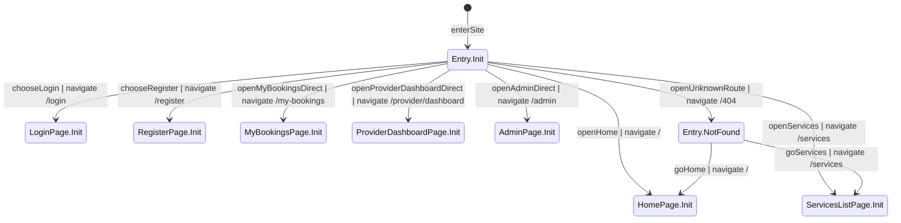

## ② Page State Machine

### Home Page
Route: `/`
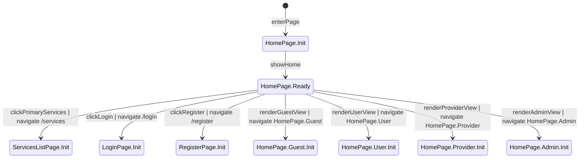

### Services List Page
Route: `/services`
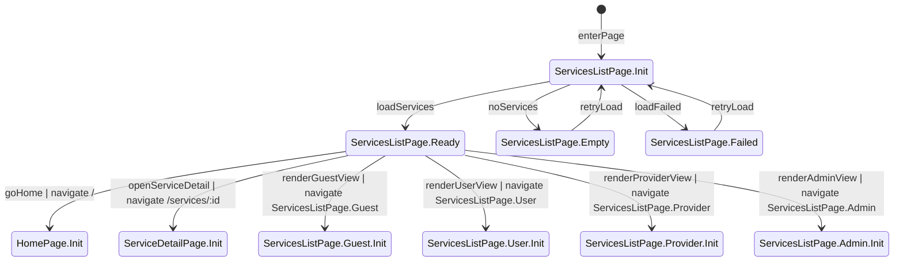

### Service Detail Page
Route: `/services/:id`
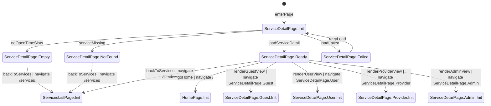

### Login Page
Route: `/login`
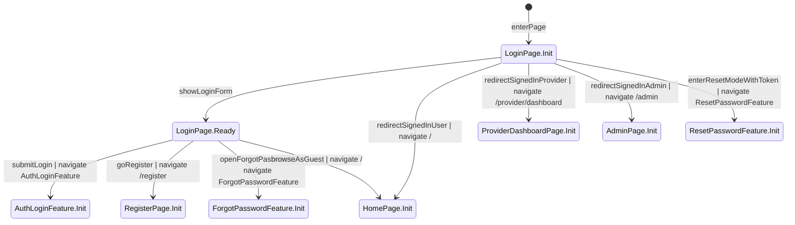

### Register Page
Route: `/register`
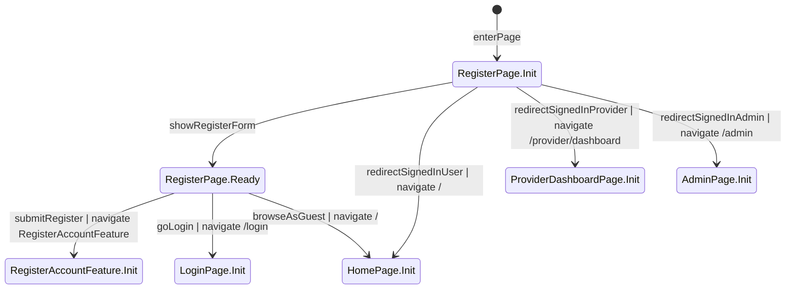

### My Bookings Page
Route: `/my-bookings`
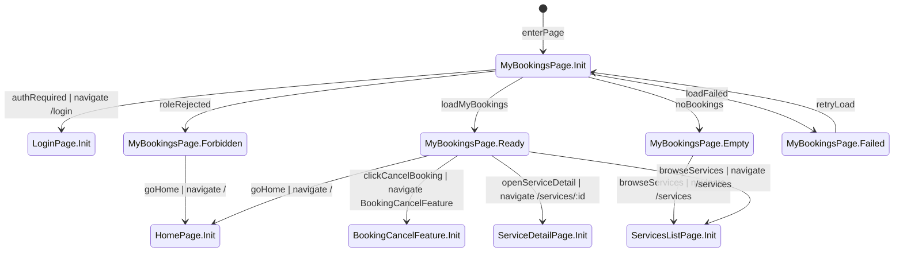

### Provider Dashboard Page
Route: `/provider/dashboard`
```mermaid
%% role: Provider
stateDiagram-v2
    [*] --> ProviderDashboardPage.Init : enterPage
    %% verify: 進入 `/provider/dashboard` 時先執行 Provider 路由控管，未通過前不得顯示服務、時段或預約名單。

    ProviderDashboardPage.Init --> LoginPage.Init : authRequired | navigate /login
    %% verify: 未登入存取 Provider 控制台時導向 `/login` 並保留 returnTo；不載入管理 API。

    ProviderDashboardPage.Init --> ProviderDashboardPage.Forbidden : roleRejected
    %% verify: 已登入但角色非 Provider 時收斂到 Forbidden 狀態；UI 不顯示任何管理資料。

    ProviderDashboardPage.Init --> ProviderDashboardPage.Ready : loadDashboard
    %% verify: API 成功回傳 provider_id 等於自己的服務、時段與預約摘要，不包含其他 Provider 資料。

    ProviderDashboardPage.Init --> ProviderDashboardPage.Empty : noServicesYet
    %% verify: 尚未建立任何服務時顯示 Empty 狀態並提供建立第一個服務入口。

    ProviderDashboardPage.Init --> ProviderDashboardPage.Failed : loadFailed
    %% verify: Dashboard 載入失敗時收斂到 Failed 狀態，不呈現不完整管理資料。

    ProviderDashboardPage.Forbidden --> HomePage.Init : goHome | navigate /
    %% verify: 權限不足返回首頁時不保留 Provider 管理資料或操作入口。

    ProviderDashboardPage.Empty --> ProviderServiceManageFeature.Init : createFirstService | navigate ProviderServiceManageFeature
    %% verify: 從 Empty 狀態進入服務管理功能時可建立第一個服務，且來源仍限定目前 Provider。

    ProviderDashboardPage.Empty --> ServicesListPage.Init : browseServices | navigate /services
    %% verify: Empty 狀態仍可返回公開服務列表瀏覽，不暴露管理操作給其他角色。

    ProviderDashboardPage.Failed --> ProviderDashboardPage.Init : retryLoad
    %% verify: Failed 重試會重新拉取目前 Provider 的管理資料，不重複送出先前修改。

    ProviderDashboardPage.Ready --> ProviderServiceManageFeature.Init : manageService | navigate ProviderServiceManageFeature
    %% verify: 進入服務管理功能時只允許操作 `provider_id = 自己` 的 Service。

    ProviderDashboardPage.Ready --> ProviderTimeSlotManageFeature.Init : manageTimeSlot | navigate ProviderTimeSlotManageFeature
    %% verify: 進入時段管理功能時只允許操作自己服務下的 TimeSlot，`booked_count` 仍由系統維護不可手動輸入。

    ProviderDashboardPage.Ready --> ProviderBookingStatusUpdateFeature.Init : updateBookingStatus | navigate ProviderBookingStatusUpdateFeature
    %% verify: 進入預約狀態更新功能時只可處理自己服務的 Booking，且後續轉移必須符合合法狀態機。

    ProviderDashboardPage.Ready --> ServicesListPage.Init : browseServices | navigate /services
    %% verify: Provider 可從控制台切回公開服務列表，但不應在列表頁看到 User 或 Admin 專屬導覽。

    ProviderDashboardPage.Ready --> HomePage.Guest.Init : logout | navigate /
    %% verify: 登出後 JWT 與前端登入狀態清除，回到首頁 Guest 視角且不再顯示 Provider 控制台或登出。
```

### Admin Page
Route: `/admin`
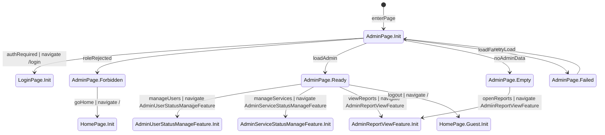

## ③ Role-specific Page State

### Home Page Delta: Guest
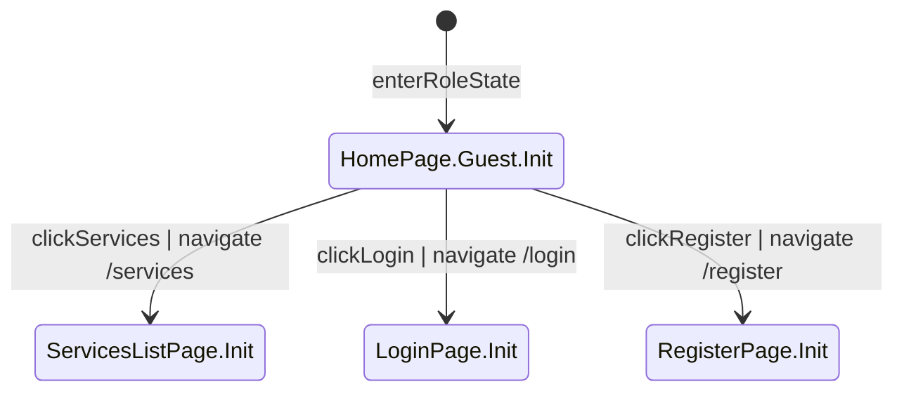

### Home Page Delta: User
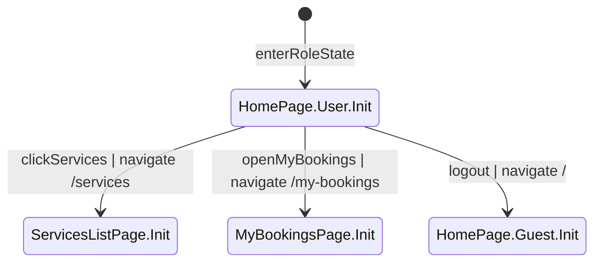

### Home Page Delta: Provider
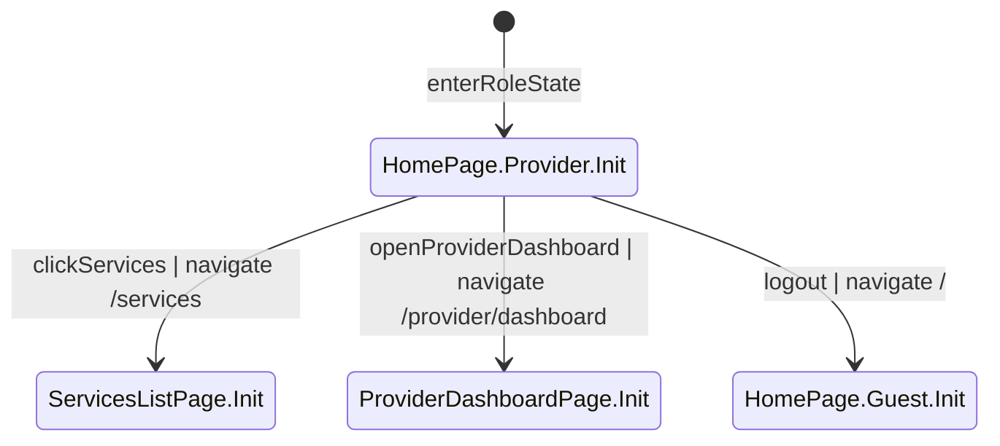

### Home Page Delta: Admin
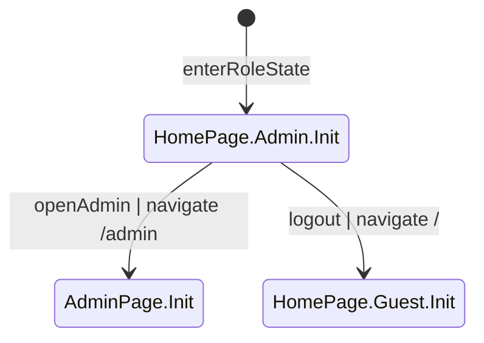

### Services List Page Delta: Guest
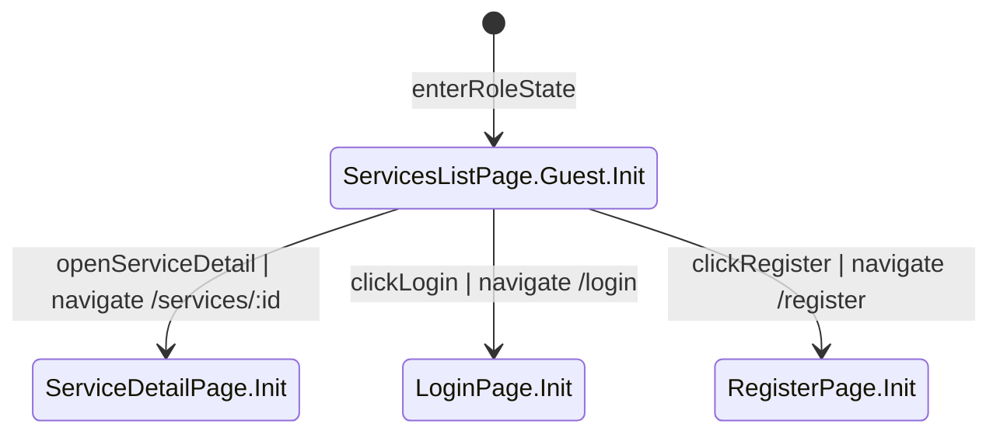

### Services List Page Delta: User
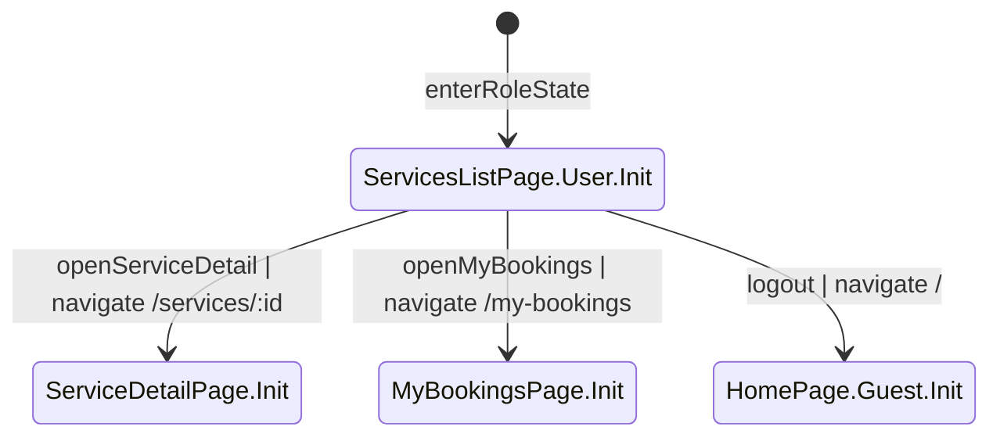

### Services List Page Delta: Provider
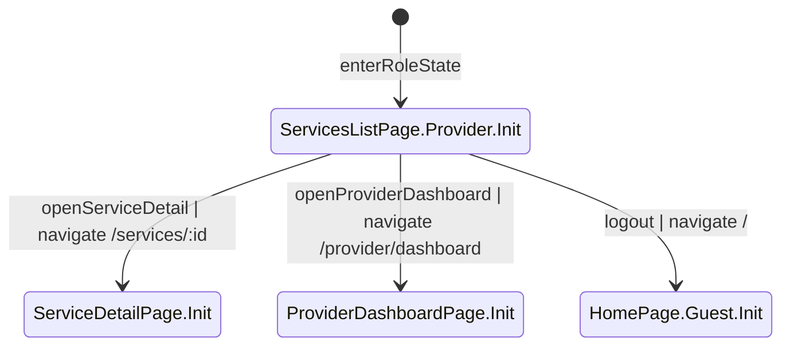

### Services List Page Delta: Admin
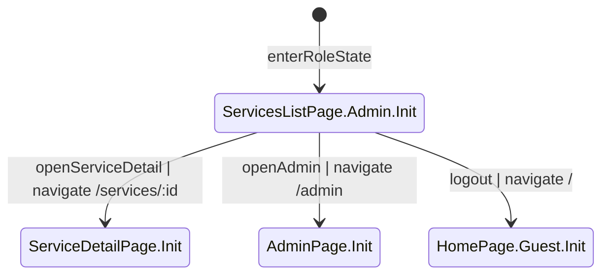

### Service Detail Page Delta: Guest
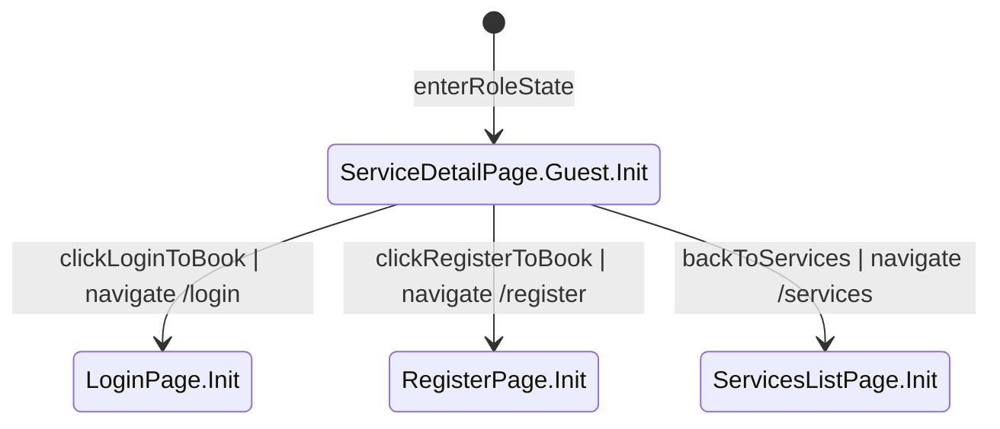

### Service Detail Page Delta: User
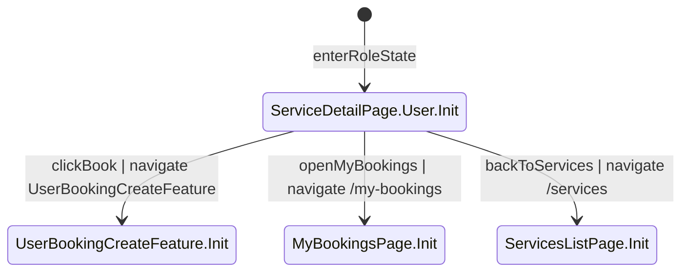

### Service Detail Page Delta: Provider
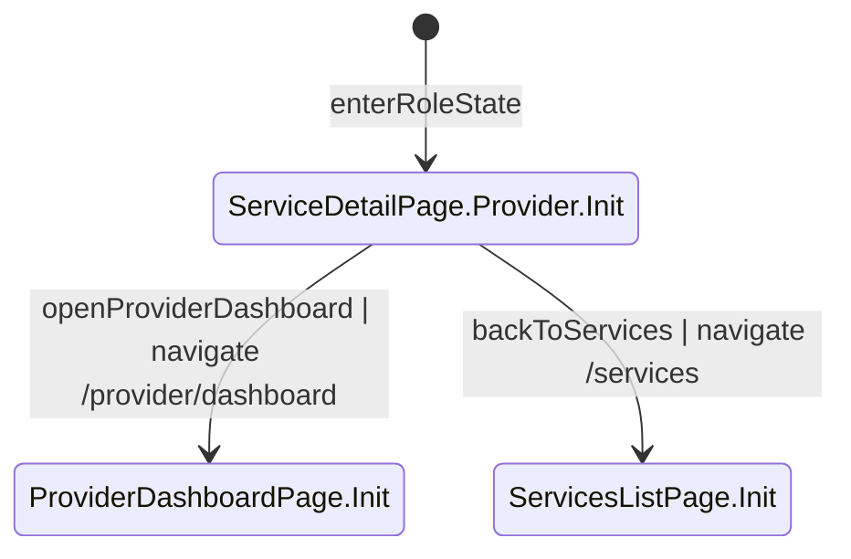

### Service Detail Page Delta: Admin
```mermaid
%% role: Admin
%% extends: ServiceDetailPage
stateDiagram-v2
    [*] --> ServiceDetailPage.Admin.Init : enterRoleState
    %% verify: Admin 角色下的服務詳情為只讀視角，不顯示立即預約 CTA。

    ServiceDetailPage.Admin.Init --> AdminPage.Init : openAdmin | navigate /admin
    %% verify: Admin 可從詳情返回後台，且後台資料仍維持 Admin 專屬權限。

    ServiceDetailPage.Admin.Init --> ServicesListPage.Init : backToServices | navigate /services
    %% verify: Admin 可從詳情返回服務列表並維持 Admin 導覽。
```

## ④ Feature / Function State Machine

### Auth Login Feature
Source Pages: LoginPage, MyBookingsPage, ProviderDashboardPage, AdminPage, ServiceDetailPage
```mermaid
%% role: none
stateDiagram-v2
    [*] --> AuthLoginFeature.Init : enterFeature
    %% verify: 進入登入功能流程時承接來源頁與可選的 returnTo，不直接假設任何角色已登入。

    AuthLoginFeature.Init --> AuthLoginFeature.Submitting : submitCredentials
    %% verify: 送出登入資料時觸發認證 API，前端應防止重複提交並等待 JWT 驗證結果。

    AuthLoginFeature.Submitting --> AuthLoginFeature.UserDone : authenticatedAsUser
    %% verify: API 回應成功且角色為 USER，建立有效 JWT/session，帳號狀態必須是 ACTIVE，SUSPENDED 不得走此路徑。

    AuthLoginFeature.Submitting --> AuthLoginFeature.ProviderDone : authenticatedAsProvider
    %% verify: API 回應成功且角色為 PROVIDER，建立有效 JWT/session，帳號狀態必須是 ACTIVE。

    AuthLoginFeature.Submitting --> AuthLoginFeature.AdminDone : authenticatedAsAdmin
    %% verify: API 回應成功且角色為 ADMIN，建立有效 JWT/session，只有 Admin 可進入後台流程。

    AuthLoginFeature.Submitting --> AuthLoginFeature.Failed : credentialsRejected
    %% verify: API 回應登入失敗、token 驗簽失敗或帳號為 SUSPENDED 時收斂到 Failed，UI 顯示明確錯誤且不建立登入狀態。

    AuthLoginFeature.UserDone --> HomePage.Init : loginDoneHome | navigate /
    %% verify: 一般 User 登入成功後導向 `/`，首頁後續應切換為 User 導覽並顯示我的預約與登出。

    AuthLoginFeature.UserDone --> MyBookingsPage.Init : loginDoneReturnMyBookings | navigate /my-bookings
    %% verify: 若 returnTo 是 `/my-bookings`，登入成功後回到該頁並只載入自己的 booking 清單。

    AuthLoginFeature.ProviderDone --> ProviderDashboardPage.Init : loginDoneDashboard | navigate /provider/dashboard
    %% verify: Provider 登入成功後導向自己的控制台，管理資料僅限 provider_id 為自己。

    AuthLoginFeature.AdminDone --> AdminPage.Init : loginDoneAdmin | navigate /admin
    %% verify: Admin 登入成功後導向 `/admin`，僅此角色可看到全站帳號、服務與報表資料。

    AuthLoginFeature.Failed --> LoginPage.Init : backToLogin | navigate /login
    %% verify: 登入失敗返回登入頁時保留錯誤訊息並維持未登入狀態，不顯示受保護頁導覽。
```

### Register Account Feature
Source Pages: RegisterPage
```mermaid
%% role: none
stateDiagram-v2
    [*] --> RegisterAccountFeature.Init : enterFeature
    %% verify: 進入註冊功能流程時承接註冊頁輸入資料，只允許建立 User 或 Provider 帳號。

    RegisterAccountFeature.Init --> RegisterAccountFeature.Submitting : submitRegistration
    %% verify: 送出註冊資料時檢查 email 唯一性、密碼有效性與角色選擇，前端應避免重複送出。

    RegisterAccountFeature.Submitting --> RegisterAccountFeature.UserCreated : registerUserDone
    %% verify: 建立 User 成功時資料庫新增 `role = USER`、`status = ACTIVE` 的帳號並只儲存 `password_hash`。

    RegisterAccountFeature.Submitting --> RegisterAccountFeature.ProviderCreated : registerProviderDone
    %% verify: 建立 Provider 成功時資料庫新增 `role = PROVIDER`、`status = ACTIVE` 的帳號並只儲存 `password_hash`。

    RegisterAccountFeature.Submitting --> RegisterAccountFeature.Failed : registerRejected
    %% verify: email 重複或資料驗證失敗時收斂到 Failed，UI 顯示欄位錯誤且不建立帳號。

    RegisterAccountFeature.UserCreated --> LoginPage.Init : proceedToLogin | navigate /login
    %% verify: User 註冊成功後導回登入頁，提示可使用新帳號登入，但不自動授予 Admin 或 Provider 權限。

    RegisterAccountFeature.ProviderCreated --> LoginPage.Init : proceedToLogin | navigate /login
    %% verify: Provider 註冊成功後導回登入頁，後續登入後才可進入 Provider 控制台。

    RegisterAccountFeature.Failed --> RegisterPage.Init : backToRegister | navigate /register
    %% verify: 註冊失敗返回註冊頁時保留使用者輸入與錯誤提示，不切換成已登入狀態。
```

### Forgot Password Feature
Source Pages: LoginPage
```mermaid
%% role: none
stateDiagram-v2
    [*] --> ForgotPasswordFeature.Init : enterFeature
    %% verify: 進入忘記密碼流程時不要求使用者先登入，來源為登入頁。

    ForgotPasswordFeature.Init --> ForgotPasswordFeature.Submitting : submitResetEmail
    %% verify: 送出 Email 後建立一次性 PasswordResetToken，token 需有 `token_hash`、`expires_at` 與未使用狀態。

    ForgotPasswordFeature.Submitting --> ForgotPasswordFeature.Done : resetLinkIssued
    %% verify: 成功時系統寄送重設連結並維持 token 可用一次，UI 顯示已送出提示但不暴露 token 原文。

    ForgotPasswordFeature.Submitting --> ForgotPasswordFeature.Failed : resetLinkRejected
    %% verify: 輸入無效或寄送失敗時收斂到 Failed，UI 顯示可理解錯誤且不建立可用 token。

    ForgotPasswordFeature.Done --> LoginPage.Init : backToLogin | navigate /login
    %% verify: 完成後返回登入頁一般模式，使用者可等待信件再用連結進入重設模式。

    ForgotPasswordFeature.Failed --> LoginPage.Init : backToLogin | navigate /login
    %% verify: 失敗返回登入頁時保留未登入狀態與必要錯誤提示。
```

### Reset Password Feature
Source Pages: LoginPage
```mermaid
%% role: none
stateDiagram-v2
    [*] --> ResetPasswordFeature.Init : enterFeature
    %% verify: 進入重設密碼流程時必須帶有效且未使用的 reset token，並切換 `/login` 的重設密碼模式。

    ResetPasswordFeature.Init --> ResetPasswordFeature.Submitting : submitNewPassword
    %% verify: 送出新密碼時驗證 token 未過期、未使用，並準備更新 `password_hash`。

    ResetPasswordFeature.Submitting --> ResetPasswordFeature.Done : passwordResetDone
    %% verify: 成功時更新使用者 `password_hash` 並將 PasswordResetToken 標記 `used_at`，同一 token 不可再次使用。

    ResetPasswordFeature.Submitting --> ResetPasswordFeature.Failed : passwordResetRejected
    %% verify: token 過期、已使用或新密碼驗證失敗時收斂到 Failed，密碼不得被更新。

    ResetPasswordFeature.Done --> LoginPage.Init : backToLogin | navigate /login
    %% verify: 重設成功後返回登入頁一般模式，使用者需以新密碼重新登入。

    ResetPasswordFeature.Failed --> LoginPage.Init : backToLogin | navigate /login
    %% verify: 重設失敗返回登入頁時不建立登入狀態，並提示 token 或密碼問題。
```

### User Booking Create Feature
Source Pages: ServiceDetailPage
```mermaid
%% role: User
stateDiagram-v2
    [*] --> UserBookingCreateFeature.Init : enterFeature
    %% verify: 進入建立預約流程時來源必須是 User 視角的服務詳情頁，Guest、Provider、Admin 不得進入。

    UserBookingCreateFeature.Init --> UserBookingCreateFeature.Submitting : submitBooking
    %% verify: 送出預約時檢查 JWT、`timeslot_id`、Service 狀態、TimeSlot 狀態、預約邊界與重複預約條件。

    UserBookingCreateFeature.Submitting --> UserBookingCreateFeature.Done : bookingCreated
    %% verify: 建立成功時交易內同時新增 Booking、更新 `booked_count + 1`，且 `booked_count` 不得超過 `capacity`，狀態為合法初始值 `PENDING` 或商業規則允許的 `CONFIRMED`。

    UserBookingCreateFeature.Submitting --> UserBookingCreateFeature.Rejected : bookingRejected
    %% verify: TimeSlot 為 CLOSED、Service 為 INACTIVE、名額已滿、已超過可預約邊界、JWT 無效或同一 user 對同一 timeslot 已有有效 Booking 時必須拒絕且不得變動 `booked_count`。

    UserBookingCreateFeature.Done --> MyBookingsPage.Init : openMyBookings | navigate /my-bookings
    %% verify: 預約成功後前往我的預約可立即看到新 booking，狀態、建立時間與關聯 timeslot 正確。

    UserBookingCreateFeature.Done --> ServiceDetailPage.Init : backToServiceDetail | navigate /services/:id
    %% verify: 預約成功後返回詳情時剩餘名額同步更新為 `capacity - booked_count`，且不出現重複 booking 入口。

    UserBookingCreateFeature.Rejected --> ServiceDetailPage.Init : backToServiceDetail | navigate /services/:id
    %% verify: 預約失敗返回詳情時顯示明確原因，原本服務與時段資料仍一致，`booked_count` 未被錯誤增加。
```

### Booking Cancel Feature
Source Pages: MyBookingsPage
```mermaid
%% role: User
stateDiagram-v2
    [*] --> BookingCancelFeature.Init : enterFeature
    %% verify: 進入取消預約流程時來源必須是自己的 booking，其他使用者不得取消該筆資料。

    BookingCancelFeature.Init --> BookingCancelFeature.Submitting : submitCancel
    %% verify: 送出取消時檢查 JWT、booking 所屬 user、目前狀態與 `cancel_deadline_at`，前端避免重複提交。

    BookingCancelFeature.Submitting --> BookingCancelFeature.Done : cancelAccepted
    %% verify: 取消成功時交易內同時把 Booking 狀態更新為 `CANCELLED`、寫入 `cancelled_at`，並將對應 TimeSlot `booked_count - 1`。

    BookingCancelFeature.Submitting --> BookingCancelFeature.Rejected : cancelRejected
    %% verify: 已超過 `cancel_deadline_at`、Booking 已是 `CANCELLED` 或 `COMPLETED`、JWT 無效或非本人操作時必須拒絕，且 `booked_count` 不得扣減。

    BookingCancelFeature.Done --> MyBookingsPage.Init : returnMyBookings | navigate /my-bookings
    %% verify: 取消成功返回我的預約時該筆 Booking 顯示 `CANCELLED`，列表與剩餘可取消入口同步更新。

    BookingCancelFeature.Rejected --> MyBookingsPage.Init : returnMyBookings | navigate /my-bookings
    %% verify: 取消失敗返回我的預約時保留原狀態與錯誤訊息，不改變 booking 與名額資料。
```

### Provider Service Manage Feature
Source Pages: ProviderDashboardPage
```mermaid
%% role: Provider
stateDiagram-v2
    [*] --> ProviderServiceManageFeature.Init : enterFeature
    %% verify: 進入服務管理流程時來源必須是 Provider 控制台，且只處理目前 Provider 的服務資料。

    ProviderServiceManageFeature.Init --> ProviderServiceManageFeature.Submitting : submitServiceChange
    %% verify: 送出服務新增、編輯或停用時檢查 JWT 與 `provider_id = 自己`，提交欄位只包含 `name`、`description`、`duration_minutes`、`status` 等定義欄位。

    ProviderServiceManageFeature.Submitting --> ProviderServiceManageFeature.Done : serviceChangeSaved
    %% verify: 成功時建立或更新 Service，停用語意為 `ACTIVE -> INACTIVE` 而非硬刪除，並寫入 AuditLog 的 actor、target、before_data、after_data。

    ProviderServiceManageFeature.Submitting --> ProviderServiceManageFeature.Rejected : serviceChangeRejected
    %% verify: 越權操作他人 Service、資料驗證失敗或未授權時必須拒絕，且不得改動既有 Service 資料。

    ProviderServiceManageFeature.Done --> ProviderDashboardPage.Init : returnDashboard | navigate /provider/dashboard
    %% verify: 成功返回控制台時服務列表反映最新名稱、描述、時長或狀態，且只顯示目前 Provider 的資料。

    ProviderServiceManageFeature.Rejected --> ProviderDashboardPage.Init : returnDashboard | navigate /provider/dashboard
    %% verify: 失敗返回控制台時保留錯誤提示，不新增或錯改任何 Service。
```

### Provider TimeSlot Manage Feature
Source Pages: ProviderDashboardPage
```mermaid
%% role: Provider
stateDiagram-v2
    [*] --> ProviderTimeSlotManageFeature.Init : enterFeature
    %% verify: 進入時段管理流程時來源必須是 Provider 控制台，且只處理自己服務下的 TimeSlot。

    ProviderTimeSlotManageFeature.Init --> ProviderTimeSlotManageFeature.Submitting : submitTimeSlotChange
    %% verify: 送出時段新增、更新或關閉時檢查 `service_id` 歸屬、時間範圍、`capacity`、`cancel_deadline_at` 與同一 Service 時段不可重疊。

    ProviderTimeSlotManageFeature.Submitting --> ProviderTimeSlotManageFeature.Done : timeSlotChangeSaved
    %% verify: 成功時建立或更新 TimeSlot，關閉語意為 `OPEN -> CLOSED`，且 `booked_count` 只能由系統維護不得手動覆寫，同時寫入 AuditLog。

    ProviderTimeSlotManageFeature.Submitting --> ProviderTimeSlotManageFeature.Rejected : timeSlotChangeRejected
    %% verify: 若調降 `capacity` 小於 `booked_count`、時間重疊、越權修改他人 Service 或資料不合法時必須拒絕且不得改動 TimeSlot。

    ProviderTimeSlotManageFeature.Done --> ProviderDashboardPage.Init : returnDashboard | navigate /provider/dashboard
    %% verify: 成功返回控制台時時段列表顯示新的時間、`capacity`、`cancel_deadline_at` 與狀態，且 `booked_count` 保持正確。

    ProviderTimeSlotManageFeature.Rejected --> ProviderDashboardPage.Init : returnDashboard | navigate /provider/dashboard
    %% verify: 失敗返回控制台時保留原有時段資料與錯誤訊息，不產生不一致更新。
```

### Provider Booking Status Update Feature
Source Pages: ProviderDashboardPage
```mermaid
%% role: Provider
stateDiagram-v2
    [*] --> ProviderBookingStatusUpdateFeature.Init : enterFeature
    %% verify: 進入預約狀態更新流程時來源必須是 Provider 控制台，且 booking 必須屬於自己的服務。

    ProviderBookingStatusUpdateFeature.Init --> ProviderBookingStatusUpdateFeature.Submitting : submitBookingStatusChange
    %% verify: 送出狀態更新時檢查 JWT、booking 歸屬與合法狀態轉移，不允許 Provider 修改他人服務 booking。

    ProviderBookingStatusUpdateFeature.Submitting --> ProviderBookingStatusUpdateFeature.Done : bookingStatusUpdated
    %% verify: 成功時 Booking 僅能依規則由 `PENDING -> CONFIRMED -> COMPLETED` 或 `PENDING/CONFIRMED -> CANCELLED` 轉移，並寫入 AuditLog 與必要時間欄位。

    ProviderBookingStatusUpdateFeature.Submitting --> ProviderBookingStatusUpdateFeature.Rejected : bookingStatusRejected
    %% verify: 非法轉移如 `COMPLETED -> CANCELLED`、`CANCELLED -> PENDING`、越權操作或資料不合法時必須拒絕，且不改動 Booking 狀態。

    ProviderBookingStatusUpdateFeature.Done --> ProviderDashboardPage.Init : returnDashboard | navigate /provider/dashboard
    %% verify: 成功返回控制台時預約名單顯示最新狀態，且只反映目前 Provider 服務下的 bookings。

    ProviderBookingStatusUpdateFeature.Rejected --> ProviderDashboardPage.Init : returnDashboard | navigate /provider/dashboard
    %% verify: 失敗返回控制台時保留原狀態與錯誤提示，不產生錯誤狀態更新。
```

### Admin User Status Manage Feature
Source Pages: AdminPage
```mermaid
%% role: Admin
stateDiagram-v2
    [*] --> AdminUserStatusManageFeature.Init : enterFeature
    %% verify: 進入帳號狀態管理流程時來源必須是 Admin 後台，非 Admin 不得進入。

    AdminUserStatusManageFeature.Init --> AdminUserStatusManageFeature.Submitting : submitUserStatusChange
    %% verify: 送出帳號狀態異動時檢查 JWT 與 Admin 權限，目標狀態只允許 `ACTIVE` 或 `SUSPENDED`。

    AdminUserStatusManageFeature.Submitting --> AdminUserStatusManageFeature.Done : userStatusUpdated
    %% verify: 成功時更新 User `status`，若改為 `SUSPENDED` 則後續受保護請求需失效，並寫入 AuditLog。

    AdminUserStatusManageFeature.Submitting --> AdminUserStatusManageFeature.Rejected : userStatusRejected
    %% verify: 非 Admin、目標不存在或狀態值不合法時必須拒絕且不改動帳號資料。

    AdminUserStatusManageFeature.Done --> AdminPage.Init : returnAdmin | navigate /admin
    %% verify: 成功返回後台時帳號列表顯示最新狀態，且被停用帳號無法再登入或建立預約。

    AdminUserStatusManageFeature.Rejected --> AdminPage.Init : returnAdmin | navigate /admin
    %% verify: 失敗返回後台時保留原狀態與錯誤提示，不錯改任何帳號。
```

### Admin Service Status Manage Feature
Source Pages: AdminPage
```mermaid
%% role: Admin
stateDiagram-v2
    [*] --> AdminServiceStatusManageFeature.Init : enterFeature
    %% verify: 進入服務狀態管理流程時來源必須是 Admin 後台，非 Admin 不得進入。

    AdminServiceStatusManageFeature.Init --> AdminServiceStatusManageFeature.Submitting : submitServiceStatusChange
    %% verify: 送出服務狀態異動時檢查 JWT 與 Admin 權限，目標狀態只允許 `ACTIVE` 或 `INACTIVE`。

    AdminServiceStatusManageFeature.Submitting --> AdminServiceStatusManageFeature.Done : serviceStatusUpdated
    %% verify: 成功時更新 Service 狀態並寫入 AuditLog；`INACTIVE` 服務不得再接受新 Booking，但既有 Booking 仍可查。

    AdminServiceStatusManageFeature.Submitting --> AdminServiceStatusManageFeature.Rejected : serviceStatusRejected
    %% verify: 非 Admin、目標不存在或狀態值不合法時必須拒絕且不改動 Service。

    AdminServiceStatusManageFeature.Done --> AdminPage.Init : returnAdmin | navigate /admin
    %% verify: 成功返回後台時服務列表顯示最新 ACTIVE 或 INACTIVE 狀態，並影響後續可預約性。

    AdminServiceStatusManageFeature.Rejected --> AdminPage.Init : returnAdmin | navigate /admin
    %% verify: 失敗返回後台時保留原有服務狀態與錯誤提示，不產生錯誤更新。
```

### Admin Report View Feature
Source Pages: AdminPage
```mermaid
%% role: Admin
stateDiagram-v2
    [*] --> AdminReportViewFeature.Init : enterFeature
    %% verify: 進入報表檢視流程時來源必須是 Admin 後台，非 Admin 不得取得報表資料。

    AdminReportViewFeature.Init --> AdminReportViewFeature.Ready : loadReports
    %% verify: 報表 API 成功時顯示預約量、取消率、服務活躍度摘要，資料來源為全站統計。

    AdminReportViewFeature.Init --> AdminReportViewFeature.Empty : noReportData
    %% verify: 報表無資料時顯示 Empty 狀態，不顯示錯誤訊息或過期統計。

    AdminReportViewFeature.Init --> AdminReportViewFeature.Failed : loadFailed
    %% verify: 報表讀取失敗時收斂到 Failed 狀態，UI 顯示錯誤且不顯示不完整統計。

    AdminReportViewFeature.Ready --> AdminPage.Init : returnAdmin | navigate /admin
    %% verify: 從 Ready 返回後台時仍保留 Admin 身分與後台導覽。

    AdminReportViewFeature.Empty --> AdminPage.Init : returnAdmin | navigate /admin
    %% verify: 從 Empty 返回後台時保留 Admin 導覽，且可繼續切換其他管理功能。

    AdminReportViewFeature.Failed --> AdminPage.Init : returnAdmin | navigate /admin
    %% verify: 從 Failed 返回後台時保留錯誤提示來源但不殘留不完整報表數據。
```