全體結構說明
[Entry State]
        ↓
[Page State Machine]
        ↓
[Role-specific Page State]
        ↓
[Feature / Function State Machine]
        ↓
[回到 Page 或跳轉其他 Page，或跳轉到其他 Feature]

以下將照這個層級排序。

## ① Entry State Machine
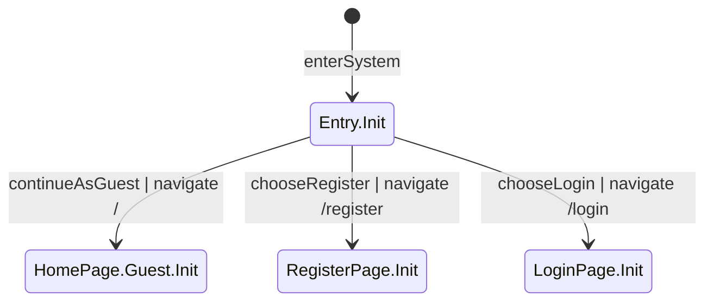
```mermaid
%% role: none
stateDiagram-v2
    [*] --> Entry.Init : enterSystem
    %% verify: 初次進站時只建立入口狀態，不預先假設已登入身分，也不直接顯示 /keys、/docs、/admin 導覽。

    Entry.Init --> HomePage.Guest.Init : continueAsGuest | navigate /
    %% verify: 進入公開首頁後僅顯示平台介紹與 Guest 可見導覽，Header 不得出現 /keys、/docs、/admin。

    Entry.Init --> RegisterPage.Init : chooseRegister | navigate /register
    %% verify: 導向 /register 後顯示註冊表單，且流程僅用於建立 developer 帳號，不建立 session。

    Entry.Init --> LoginPage.Init : chooseLogin | navigate /login
    %% verify: 導向 /login 後顯示 Email 與密碼登入表單，尚未登入前不得存取受保護頁。
```

## ② Home Page State Machine

### HomePage.Guest
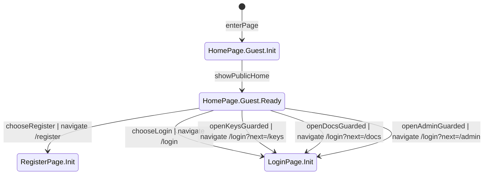
```mermaid
%% role: Guest
stateDiagram-v2
    [*] --> HomePage.Guest.Init : enterPage
    %% verify: 進入首頁時只以 Guest 視角初始化，不帶入 Developer 或 Admin 導覽項目。

    HomePage.Guest.Init --> HomePage.Guest.Ready : showPublicHome
    %% verify: 首頁載入後顯示平台介紹、能力與安全說明，且 Header 只保留 /、/register、/login。

    HomePage.Guest.Ready --> RegisterPage.Init : chooseRegister | navigate /register
    %% verify: 點擊註冊後正確導向 /register，頁面內不重複顯示與 Header 相同的登入入口。

    HomePage.Guest.Ready --> LoginPage.Init : chooseLogin | navigate /login
    %% verify: 點擊登入後正確導向 /login，且 Home 頁不應同時出現第二個重複登入 CTA。

    HomePage.Guest.Ready --> LoginPage.Init : openKeysGuarded | navigate /login?next=/keys
    %% verify: Guest 嘗試進入 /keys 時必須導向 /login 並保留 next=/keys，不能直接顯示 Key 管理內容。

    HomePage.Guest.Ready --> LoginPage.Init : openDocsGuarded | navigate /login?next=/docs
    %% verify: Guest 嘗試進入 /docs 時必須導向 /login 並保留 next=/docs，且 Header 仍不得顯示受保護導覽。

    HomePage.Guest.Ready --> LoginPage.Init : openAdminGuarded | navigate /login?next=/admin
    %% verify: Guest 嘗試進入 /admin 時必須導向 /login 並保留 next=/admin，不能直接暴露管理後台內容。
```

### HomePage.Developer
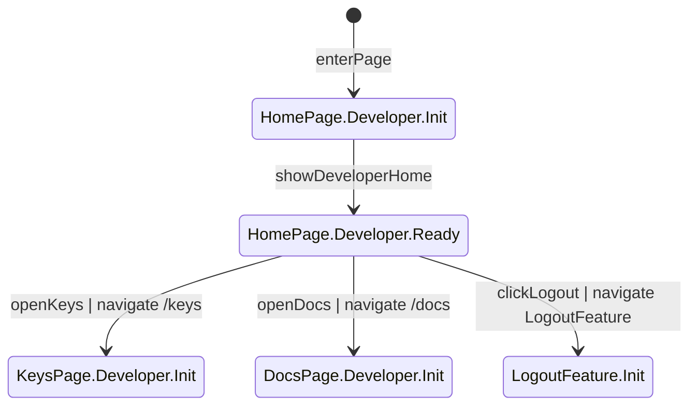
```mermaid
%% role: Developer
stateDiagram-v2
    [*] --> HomePage.Developer.Init : enterPage
    %% verify: 進入已登入首頁時應套用 developer 身分，Header 顯示 /、/keys、/docs、登出，且不顯示 /admin。

    HomePage.Developer.Init --> HomePage.Developer.Ready : showDeveloperHome
    %% verify: 首頁內容載入後保留平台介紹與登入後導覽，頁面內不得重複出現與 Header 相同的主要導覽 CTA。

    HomePage.Developer.Ready --> KeysPage.Developer.Init : openKeys | navigate /keys
    %% verify: 導向 /keys 後只載入目前 developer 名下的 Key 與設定資料，不可看到他人 Key。

    HomePage.Developer.Ready --> DocsPage.Developer.Init : openDocs | navigate /docs
    %% verify: 導向 /docs 後只顯示啟用中的 Service 與 Endpoint，並標示所需 scope。

    HomePage.Developer.Ready --> LogoutFeature.Init : clickLogout | navigate LogoutFeature
    %% verify: 點擊登出後必須進入 session 撤銷流程，後續受保護頁請求需重新登入。
```

### HomePage.Admin
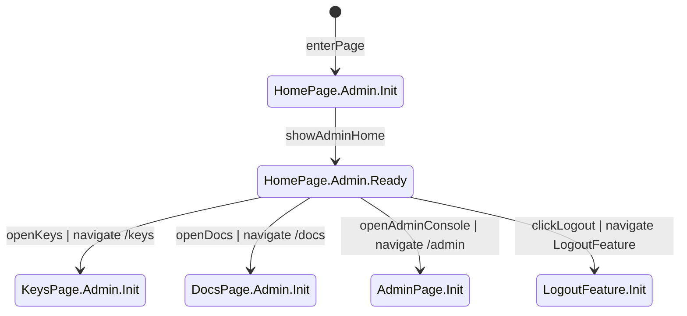
```mermaid
%% role: Admin
stateDiagram-v2
    [*] --> HomePage.Admin.Init : enterPage
    %% verify: 進入已登入首頁時應套用 admin 身分，Header 顯示 /、/keys、/docs、/admin、登出。

    HomePage.Admin.Init --> HomePage.Admin.Ready : showAdminHome
    %% verify: 首頁內容載入後保留平台介紹與管理導覽，且頁面內不重複放置與 Header 相同的主要管理入口。

    HomePage.Admin.Ready --> KeysPage.Admin.Init : openKeys | navigate /keys
    %% verify: 導向 /keys 後可查詢平台 Key 清單與管理動作，但仍不得顯示 API Key 原文。

    HomePage.Admin.Ready --> DocsPage.Admin.Init : openDocs | navigate /docs
    %% verify: 導向 /docs 後顯示啟用中的 API 目錄與 scope 需求，內容需與 Admin 設定一致。

    HomePage.Admin.Ready --> AdminPage.Init : openAdminConsole | navigate /admin
    %% verify: 導向 /admin 後可進入後台管理頁，且 route guard 允許 admin 進入。

    HomePage.Admin.Ready --> LogoutFeature.Init : clickLogout | navigate LogoutFeature
    %% verify: 點擊登出後必須撤銷目前 Web Session，重新整理 /admin、/keys、/docs 都要重新驗證登入。
```

## ③ Register Page State Machine
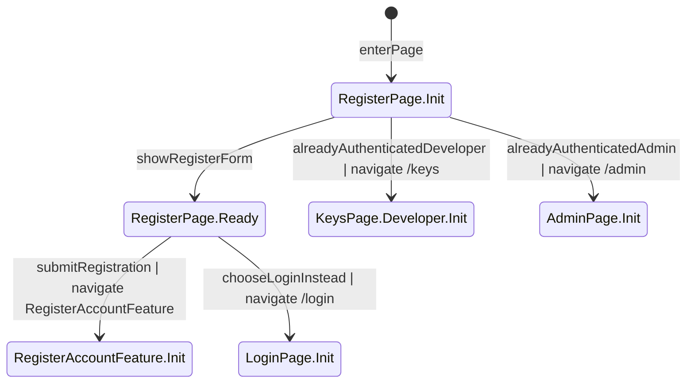
```mermaid
%% role: Guest
stateDiagram-v2
    [*] --> RegisterPage.Init : enterPage
    %% verify: 進入 /register 時先建立註冊頁入口狀態，Guest 才能停留此頁。

    RegisterPage.Init --> RegisterPage.Ready : showRegisterForm
    %% verify: 註冊頁顯示 Email 與密碼欄位，且不自動建立 session，也不顯示 /keys、/docs、/admin 導覽。

    RegisterPage.Init --> KeysPage.Developer.Init : alreadyAuthenticatedDeveloper | navigate /keys
    %% verify: 已登入 developer 存取 /register 時應直接導向 /keys，不可再次停留註冊頁。

    RegisterPage.Init --> AdminPage.Init : alreadyAuthenticatedAdmin | navigate /admin
    %% verify: 已登入 admin 存取 /register 時應直接導向 /admin，不可再次停留註冊頁。

    RegisterPage.Ready --> RegisterAccountFeature.Init : submitRegistration | navigate RegisterAccountFeature
    %% verify: 送出註冊後應檢查 Email 唯一性與密碼雜湊儲存規則，成功時新帳號 role=developer 且 status=active。

    RegisterPage.Ready --> LoginPage.Init : chooseLoginInstead | navigate /login
    %% verify: 選擇改去登入時應保留未登入狀態並正確導向 /login，不建立任何 session。
```

## ④ Login Page State Machine
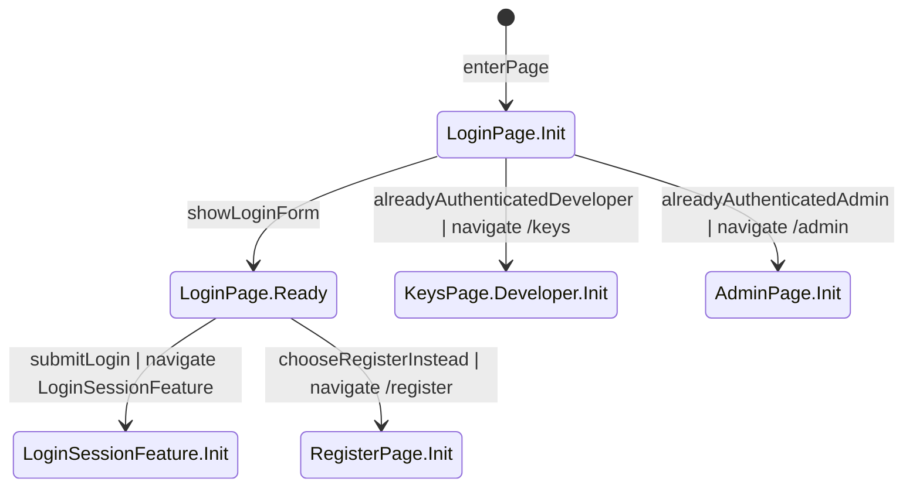
```mermaid
%% role: Guest
stateDiagram-v2
    [*] --> LoginPage.Init : enterPage
    %% verify: 進入 /login 時建立登入頁入口狀態，尚未登入前不得載入受保護頁資料。

    LoginPage.Init --> LoginPage.Ready : showLoginForm
    %% verify: 登入頁顯示 Email 與密碼表單，Guest 導覽中不得出現 /keys、/docs、/admin。

    LoginPage.Init --> KeysPage.Developer.Init : alreadyAuthenticatedDeveloper | navigate /keys
    %% verify: 已登入 developer 存取 /login 時應直接導向 /keys，避免重複登入。

    LoginPage.Init --> AdminPage.Init : alreadyAuthenticatedAdmin | navigate /admin
    %% verify: 已登入 admin 存取 /login 時應直接導向 /admin，避免重複登入。

    LoginPage.Ready --> LoginSessionFeature.Init : submitLogin | navigate LoginSessionFeature
    %% verify: 送出登入時應以 Email+密碼驗證帳號，disabled 使用者必須失敗且不得建立 session。

    LoginPage.Ready --> RegisterPage.Init : chooseRegisterInstead | navigate /register
    %% verify: 從登入頁切到註冊頁時保持未登入狀態，且不重複顯示與 Header 相同的註冊入口。
```

## ⑤ API Key Management Page State Machine

### KeysPage.Developer
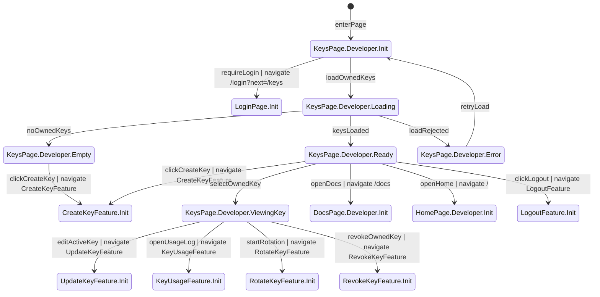
```mermaid
%% role: Developer
stateDiagram-v2
    [*] --> KeysPage.Developer.Init : enterPage
    %% verify: 進入 /keys 時先檢查是否有有效 developer session，未登入者不得直接看到 Key 資料。

    KeysPage.Developer.Init --> LoginPage.Init : requireLogin | navigate /login?next=/keys
    %% verify: 無有效 session 時必須導向 /login?next=/keys，且不能顯示任何 Key 名單或管理動作。

    KeysPage.Developer.Init --> KeysPage.Developer.Loading : loadOwnedKeys
    %% verify: 開始載入目前使用者名下 Key、scope、期限與 rate limit 資料，期間避免重複操作。

    KeysPage.Developer.Loading --> KeysPage.Developer.Empty : noOwnedKeys
    %% verify: 當使用者尚未建立任何 Key 時顯示 Empty 狀態與單一建立入口，不應顯示虛構 Key 資料。

    KeysPage.Developer.Loading --> KeysPage.Developer.Ready : keysLoaded
    %% verify: 載入完成後只顯示目前使用者自己的 Key，欄位可含 name、status、expires_at、rate limit，但不可回傳原始 key。

    KeysPage.Developer.Loading --> KeysPage.Developer.Error : loadRejected
    %% verify: 載入失敗時顯示可理解錯誤與 retry，且不應殘留過期或未授權的 Key 資料。

    KeysPage.Developer.Empty --> CreateKeyFeature.Init : clickCreateKey | navigate CreateKeyFeature
    %% verify: 在 Empty 狀態點擊建立 Key 時只開啟建立流程，不建立任何既有 Key 變更。

    KeysPage.Developer.Ready --> CreateKeyFeature.Init : clickCreateKey | navigate CreateKeyFeature
    %% verify: 在 Ready 狀態建立新 Key 時，不影響既有 active Key 可用性，也不得顯示重複建立 CTA。

    KeysPage.Developer.Ready --> KeysPage.Developer.ViewingKey : selectOwnedKey
    %% verify: 選取 Key 後只顯示所選 Key 的設定與狀態，不能切換到他人名下 Key，也不能顯示 key 原文。

    KeysPage.Developer.ViewingKey --> UpdateKeyFeature.Init : editActiveKey | navigate UpdateKeyFeature
    %% verify: 只有 status=active 的 Key 才能進入更新流程，且可編輯欄位僅限 name、scopes、expires_at、rate_limit。

    KeysPage.Developer.ViewingKey --> KeyUsageFeature.Init : openUsageLog | navigate KeyUsageFeature
    %% verify: 開啟使用紀錄後只能查該 Key 的 usage log，至少可依時間範圍、status code、endpoint 篩選。

    KeysPage.Developer.ViewingKey --> RotateKeyFeature.Init : startRotation | navigate RotateKeyFeature
    %% verify: 啟動輪替時應建立新 Key 並保留舊 Key 可並行測試，直到撤銷舊 Key 前兩者狀態需可追蹤。

    KeysPage.Developer.ViewingKey --> RevokeKeyFeature.Init : revokeOwnedKey | navigate RevokeKeyFeature
    %% verify: 只有本人名下 Key 可進入撤銷流程，撤銷後後續 Gateway 驗證必須回 401。

    KeysPage.Developer.Ready --> DocsPage.Developer.Init : openDocs | navigate /docs
    %% verify: 從 /keys 導向 /docs 時保留 developer 導覽規則，且 /admin 仍不得出現在 Header。

    KeysPage.Developer.Ready --> HomePage.Developer.Init : openHome | navigate /
    %% verify: 返回首頁後仍維持 developer 身分與導覽可見性，不應遺失登入狀態。

    KeysPage.Developer.Ready --> LogoutFeature.Init : clickLogout | navigate LogoutFeature
    %% verify: 從 /keys 登出後必須讓目前 session 立即失效，重新進入 /keys 需被導向 /login。

    KeysPage.Developer.Error --> KeysPage.Developer.Init : retryLoad
    %% verify: Retry 會重新請求 Key 清單，成功時回到 Empty 或 Ready，失敗訊息需被更新。
```

### KeysPage.Admin
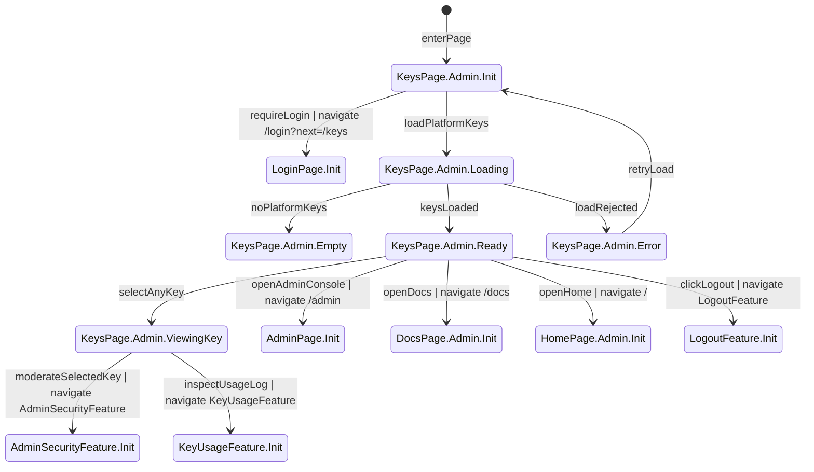
```mermaid
%% role: Admin
stateDiagram-v2
    [*] --> KeysPage.Admin.Init : enterPage
    %% verify: 進入 /keys 時先檢查 admin session，未登入者不得直接查詢平台 Key 清單。

    KeysPage.Admin.Init --> LoginPage.Init : requireLogin | navigate /login?next=/keys
    %% verify: 無有效 session 時必須導向 /login?next=/keys，且不能顯示任何平台 Key 管理資訊。

    KeysPage.Admin.Init --> KeysPage.Admin.Loading : loadPlatformKeys
    %% verify: 開始載入全平台 Key 清單與狀態，期間不可洩漏原始 key 值。

    KeysPage.Admin.Loading --> KeysPage.Admin.Empty : noPlatformKeys
    %% verify: 無 Key 時顯示 Empty 狀態，但仍保留 admin 導覽與管理返回路徑。

    KeysPage.Admin.Loading --> KeysPage.Admin.Ready : keysLoaded
    %% verify: 載入完成後可查看任意使用者 Key 的名稱、狀態、期限與限流資訊，但不可查看原始 key。

    KeysPage.Admin.Loading --> KeysPage.Admin.Error : loadRejected
    %% verify: 載入失敗時顯示錯誤與 retry，不應保留錯誤前的舊資料快取誤導管理員。

    KeysPage.Admin.Ready --> KeysPage.Admin.ViewingKey : selectAnyKey
    %% verify: 選取 Key 後可查看目標 Key 的管理資訊與狀態，不可誤混其他 Key 的 usage 或操作按鈕。

    KeysPage.Admin.ViewingKey --> AdminSecurityFeature.Init : moderateSelectedKey | navigate AdminSecurityFeature
    %% verify: 進入安全管理流程後可對目標 Key 執行 block 或 revoke，操作必須寫入 Audit Log 並立即影響 Gateway 驗證。

    KeysPage.Admin.ViewingKey --> KeyUsageFeature.Init : inspectUsageLog | navigate KeyUsageFeature
    %% verify: 查看使用紀錄時可查該 Key 的 status code、response time、timestamp 與 endpoint，資料來源需為 Usage Log。

    KeysPage.Admin.Ready --> AdminPage.Init : openAdminConsole | navigate /admin
    %% verify: 回到 /admin 時保留 admin 身分與管理導覽，且 route guard 持續允許存取。

    KeysPage.Admin.Ready --> DocsPage.Admin.Init : openDocs | navigate /docs
    %% verify: 導向 /docs 後顯示啟用中的 API 目錄與 scope 需求，內容需與管理設定一致。

    KeysPage.Admin.Ready --> HomePage.Admin.Init : openHome | navigate /
    %% verify: 返回首頁時保留 admin 導覽與登入狀態，不應降為 developer 或 guest。

    KeysPage.Admin.Ready --> LogoutFeature.Init : clickLogout | navigate LogoutFeature
    %% verify: 從 /keys 登出後目前 session 應失效，重新請求 /keys 與 /admin 必須重新登入。

    KeysPage.Admin.Error --> KeysPage.Admin.Init : retryLoad
    %% verify: Retry 重新載入平台 Key 清單，成功後應回到 Empty 或 Ready，失敗時更新錯誤訊息。
```

## ⑥ API Docs Page State Machine

### DocsPage.Developer
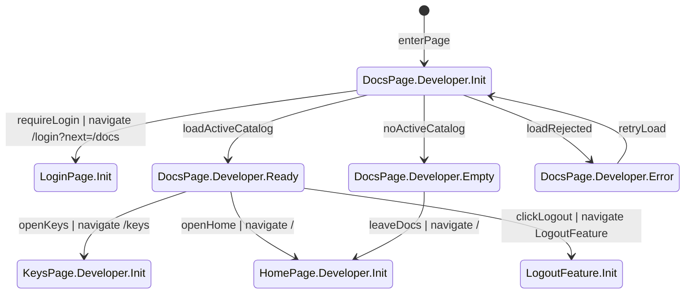
```mermaid
%% role: Developer
stateDiagram-v2
    [*] --> DocsPage.Developer.Init : enterPage
    %% verify: 進入 /docs 時先檢查 developer session，Guest 不得直接看文件。

    DocsPage.Developer.Init --> LoginPage.Init : requireLogin | navigate /login?next=/docs
    %% verify: 未登入時必須導向 /login?next=/docs，且不得顯示 API 文件內容。

    DocsPage.Developer.Init --> DocsPage.Developer.Ready : loadActiveCatalog
    %% verify: 載入完成後只顯示 status=active 的 ApiService 與 ApiEndpoint，並標示授權所需 scope。

    DocsPage.Developer.Init --> DocsPage.Developer.Empty : noActiveCatalog
    %% verify: 無啟用 API 目錄時顯示 Empty 狀態，不應顯示已停用 service 或 endpoint。

    DocsPage.Developer.Init --> DocsPage.Developer.Error : loadRejected
    %% verify: 載入失敗時顯示可理解錯誤與 retry，且不應顯示不完整文件資訊。

    DocsPage.Developer.Ready --> KeysPage.Developer.Init : openKeys | navigate /keys
    %% verify: 從文件返回 Key 管理時保留 developer 身分，且 /admin 導覽仍不得出現。

    DocsPage.Developer.Ready --> HomePage.Developer.Init : openHome | navigate /
    %% verify: 返回首頁後保留登入狀態與 developer 可見導覽，不顯示 /admin。

    DocsPage.Developer.Ready --> LogoutFeature.Init : clickLogout | navigate LogoutFeature
    %% verify: 從文件頁登出後 session 立即失效，重新造訪 /docs 需被導回 /login。

    DocsPage.Developer.Empty --> HomePage.Developer.Init : leaveDocs | navigate /
    %% verify: 從 Empty 狀態離開文件頁時不改變登入狀態，首頁仍只顯示 developer 可見導覽。

    DocsPage.Developer.Error --> DocsPage.Developer.Init : retryLoad
    %% verify: Retry 重新載入啟用中的 API 目錄，成功後進入 Ready 或 Empty，錯誤訊息需同步更新。
```

### DocsPage.Admin
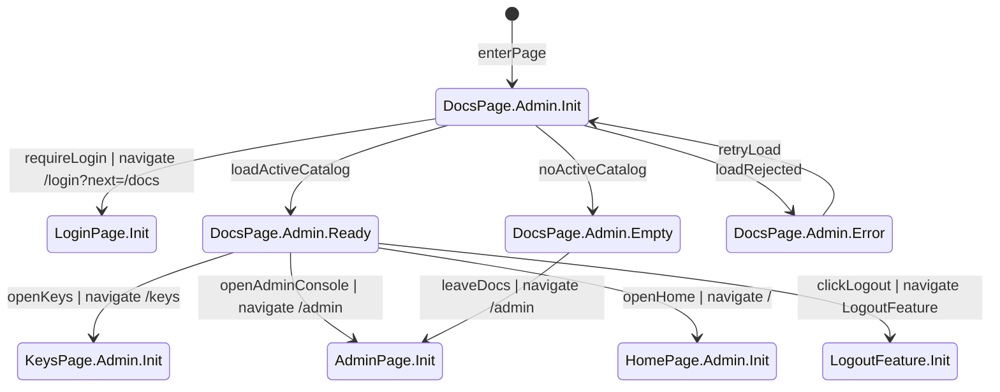
```mermaid
%% role: Admin
stateDiagram-v2
    [*] --> DocsPage.Admin.Init : enterPage
    %% verify: 進入 /docs 時先檢查 admin session，Guest 不得直接看文件。

    DocsPage.Admin.Init --> LoginPage.Init : requireLogin | navigate /login?next=/docs
    %% verify: 未登入時必須導向 /login?next=/docs，且不應暴露任何管理導覽或文件資料。

    DocsPage.Admin.Init --> DocsPage.Admin.Ready : loadActiveCatalog
    %% verify: 載入完成後只顯示啟用中的 service 與 endpoint，scope 標示需與管理規則一致。

    DocsPage.Admin.Init --> DocsPage.Admin.Empty : noActiveCatalog
    %% verify: 沒有啟用中的 API 目錄時顯示 Empty 狀態，仍保留 admin 導覽與返回管理台路徑。

    DocsPage.Admin.Init --> DocsPage.Admin.Error : loadRejected
    %% verify: 載入失敗時顯示錯誤與 retry，不顯示殘缺文件內容。

    DocsPage.Admin.Ready --> KeysPage.Admin.Init : openKeys | navigate /keys
    %% verify: 從文件頁返回 /keys 時保留 admin 管理能力與 Key 查詢權限。

    DocsPage.Admin.Ready --> AdminPage.Init : openAdminConsole | navigate /admin
    %% verify: 返回 /admin 後可繼續管理 Service、Endpoint、Scope、Rate Limit 與安全設定。

    DocsPage.Admin.Ready --> HomePage.Admin.Init : openHome | navigate /
    %% verify: 返回首頁後保留 admin 導覽與登入狀態，不降為其他角色。

    DocsPage.Admin.Ready --> LogoutFeature.Init : clickLogout | navigate LogoutFeature
    %% verify: 從文件頁登出後必須撤銷目前 session，後續 /admin、/keys、/docs 都需重新登入。

    DocsPage.Admin.Empty --> AdminPage.Init : leaveDocs | navigate /admin
    %% verify: 從 Empty 狀態返回 /admin 時仍保留 admin 身分與管理入口。

    DocsPage.Admin.Error --> DocsPage.Admin.Init : retryLoad
    %% verify: Retry 重新載入 API 目錄，成功後進入 Ready 或 Empty，失敗提示需更新。
```

## ⑦ Admin Console Page State Machine

```mermaid
%% role: Admin
stateDiagram-v2
    [*] --> AdminPage.Init : enterPage
    %% verify: 進入 /admin 時先檢查 session 與角色，只有 admin 可進入此頁。

    AdminPage.Init --> LoginPage.Init : requireLogin | navigate /login?next=/admin
    %% verify: 未登入者必須導向 /login?next=/admin，不能直接顯示管理後台內容。

    AdminPage.Init --> AdminPage.Forbidden : rejectNonAdmin
    %% verify: 已登入但非 admin 的使用者必須看到 403 狀態，不可用 404 隱藏，也不得反覆導向登入頁。

    AdminPage.Init --> AdminPage.Ready : loadAdminConsole
    %% verify: 管理後台載入後可見 Service、Endpoint、Scope、Rate Limit、監控、稽核與安全管理入口。

    AdminPage.Init --> AdminPage.Error : loadRejected
    %% verify: 載入失敗時顯示可理解錯誤與 retry，不得洩漏敏感設定內容。

    AdminPage.Forbidden --> HomePage.Developer.Init : leaveForbidden | navigate /
    %% verify: 離開 403 狀態回首頁後保留原登入角色，但 /admin 導覽仍不得對 developer 顯示。

    AdminPage.Ready --> ManageApiCatalogFeature.Init : manageApiCatalog | navigate ManageApiCatalogFeature
    %% verify: 進入 API 目錄管理後可處理 Service CRUD 與 Endpoint 設定，且同一 Service 下 method+path 不可重複。

    AdminPage.Ready --> ManageAccessControlFeature.Init : manageAccessControl | navigate ManageAccessControlFeature
    %% verify: 進入授權管理後可編輯 scope、scope rule 與 rate limit 規則，變更需可影響 Gateway 授權與節流結果。

    AdminPage.Ready --> MonitoringFeature.Init : reviewMonitoring | navigate MonitoringFeature
    %% verify: 進入監控後可檢視全站 usage 與 audit 資訊，至少包含 401、403、429、5xx 統計與敏感操作紀錄。

    AdminPage.Ready --> AdminSecurityFeature.Init : managePlatformSecurity | navigate AdminSecurityFeature
    %% verify: 進入安全管理後可封鎖或撤銷 Key、停用使用者、維護黑名單 IP，變更需立即生效並可稽核。

    AdminPage.Ready --> KeysPage.Admin.Init : openKeys | navigate /keys
    %% verify: 從後台前往 /keys 後保留 admin 查詢任意 Key 的權限，且不顯示原始 key。

    AdminPage.Ready --> DocsPage.Admin.Init : openDocs | navigate /docs
    %% verify: 從後台前往 /docs 後顯示啟用中的 API 目錄與 scope 需求，與剛設定的資料一致。

    AdminPage.Ready --> HomePage.Admin.Init : openHome | navigate /
    %% verify: 返回首頁後維持 admin 導覽與登入狀態，仍可再進入 /admin。

    AdminPage.Ready --> LogoutFeature.Init : clickLogout | navigate LogoutFeature
    %% verify: 從管理後台登出後目前 session 立即失效，重新請求 /admin 必須被導向 /login。

    AdminPage.Error --> AdminPage.Init : retryLoad
    %% verify: Retry 會重新載入後台資料，成功時回到 Ready，失敗時更新錯誤訊息。
```

## ⑧ Register Account Feature / Function State Machine
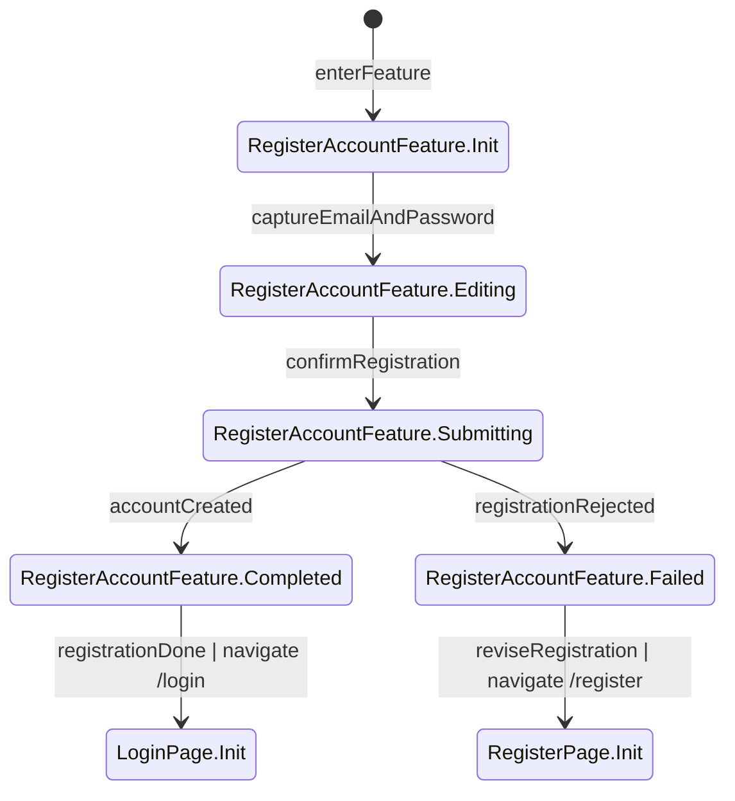
```mermaid
%% role: none
%% source pages: RegisterPage
stateDiagram-v2
    [*] --> RegisterAccountFeature.Init : enterFeature
    %% verify: 進入註冊功能時只建立 feature 入口，不建立 session，也不決定登入狀態。

    RegisterAccountFeature.Init --> RegisterAccountFeature.Editing : captureEmailAndPassword
    %% verify: 顯示 Email 與密碼輸入狀態，欄位可編輯且尚未送出前不應產生任何使用者資料。

    RegisterAccountFeature.Editing --> RegisterAccountFeature.Submitting : confirmRegistration
    %% verify: 送出註冊時按鈕需避免重送，系統檢查 Email 唯一性且準備以不可逆 hash 儲存密碼。

    RegisterAccountFeature.Submitting --> RegisterAccountFeature.Completed : accountCreated
    %% verify: 建立成功後新使用者資料必須寫入 email、password_hash、role=developer、status=active，且不自動登入。

    RegisterAccountFeature.Submitting --> RegisterAccountFeature.Failed : registrationRejected
    %% verify: 註冊失敗時需明確指出重複 Email 或驗證失敗，且資料庫不得新增部分帳號資料。

    RegisterAccountFeature.Completed --> LoginPage.Init : registrationDone | navigate /login
    %% verify: 註冊成功後導向 /login，使用者需重新以新帳號登入，不能帶著已建立 session 進入受保護頁。

    RegisterAccountFeature.Failed --> RegisterPage.Init : reviseRegistration | navigate /register
    %% verify: 返回註冊頁後顯示修正入口，且先前失敗原因可被使用者理解，不建立任何 session。
```

## ⑨ Login Session Feature / Function State Machine
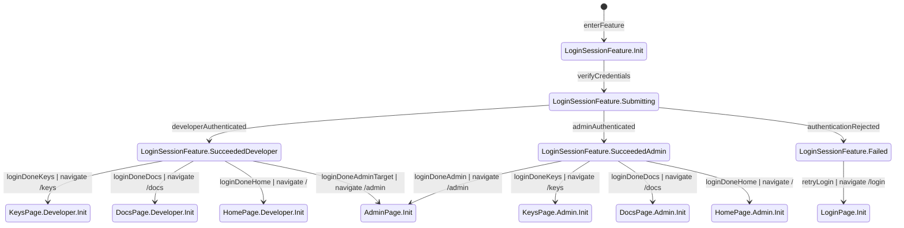
```mermaid
%% role: none
%% source pages: LoginPage
stateDiagram-v2
    [*] --> LoginSessionFeature.Init : enterFeature
    %% verify: 進入登入功能時建立認證流程入口，尚未驗證前不得建立 UserSession。

    LoginSessionFeature.Init --> LoginSessionFeature.Submitting : verifyCredentials
    %% verify: 送出登入請求時需驗證 Email 與密碼，disabled 使用者必須被拒絕且不得建立 session。

    LoginSessionFeature.Submitting --> LoginSessionFeature.SucceededDeveloper : developerAuthenticated
    %% verify: developer 驗證成功後建立有效 Web Session、更新 last_login_at，並套用 developer 導覽規則。

    LoginSessionFeature.Submitting --> LoginSessionFeature.SucceededAdmin : adminAuthenticated
    %% verify: admin 驗證成功後建立有效 Web Session、更新 last_login_at，並套用 admin 導覽規則。

    LoginSessionFeature.Submitting --> LoginSessionFeature.Failed : authenticationRejected
    %% verify: 驗證失敗時顯示帳密錯誤或停用結果，且不得建立 session 或更新 last_login_at。

    LoginSessionFeature.SucceededDeveloper --> KeysPage.Developer.Init : loginDoneKeys | navigate /keys
    %% verify: 導向 /keys 後只載入 developer 本人的 Key 管理資料，不可進入 admin 模式。

    LoginSessionFeature.SucceededDeveloper --> DocsPage.Developer.Init : loginDoneDocs | navigate /docs
    %% verify: 導向 /docs 後只顯示啟用中的 API 文件與 scope 需求，/admin 導覽仍不得出現。

    LoginSessionFeature.SucceededDeveloper --> HomePage.Developer.Init : loginDoneHome | navigate /
    %% verify: 導向首頁後 Header 顯示 /keys、/docs、登出，且不顯示 /admin。

    LoginSessionFeature.SucceededDeveloper --> AdminPage.Init : loginDoneAdminTarget | navigate /admin
    %% verify: 若 returnTo 指向 /admin，developer 到達 AdminPage.Init 後必須被收斂為 403，而不是被當成 admin 放行。

    LoginSessionFeature.SucceededAdmin --> AdminPage.Init : loginDoneAdmin | navigate /admin
    %% verify: admin 登入成功導向 /admin 後可載入管理後台，Header 顯示 /admin。

    LoginSessionFeature.SucceededAdmin --> KeysPage.Admin.Init : loginDoneKeys | navigate /keys
    %% verify: admin 導向 /keys 後可檢視平台 Key 清單與管理動作，但仍不可看到原始 key。

    LoginSessionFeature.SucceededAdmin --> DocsPage.Admin.Init : loginDoneDocs | navigate /docs
    %% verify: admin 導向 /docs 後可查看啟用中的 API 目錄與 scope 需求，內容與後台設定一致。

    LoginSessionFeature.SucceededAdmin --> HomePage.Admin.Init : loginDoneHome | navigate /
    %% verify: 導向首頁後 Header 顯示 /keys、/docs、/admin、登出，角色顯示需與 session 一致。

    LoginSessionFeature.Failed --> LoginPage.Init : retryLogin | navigate /login
    %% verify: 回到登入頁後仍未建立 session，使用者可重新輸入帳密且錯誤訊息與表單狀態一致。
```

## ⑩ Logout Feature / Function State Machine
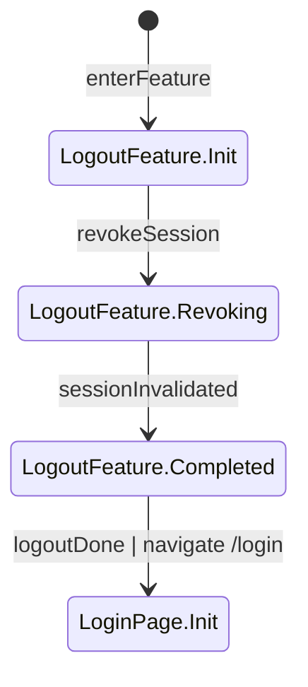
```mermaid
%% role: none
%% source pages: HomePage.Developer, HomePage.Admin, KeysPage.Developer, KeysPage.Admin, DocsPage.Developer, DocsPage.Admin, AdminPage
stateDiagram-v2
    [*] --> LogoutFeature.Init : enterFeature
    %% verify: 進入登出流程時鎖定當前 session 作為撤銷目標，不變更使用者角色資料。

    LogoutFeature.Init --> LogoutFeature.Revoking : revokeSession
    %% verify: 撤銷 session 時需設定 UserSession.revoked_at，並使後續受保護頁請求失敗。

    LogoutFeature.Revoking --> LogoutFeature.Completed : sessionInvalidated
    %% verify: session 失效後重新請求 /keys、/docs、/admin 都應導向 /login，Header 轉為 Guest 導覽。

    LogoutFeature.Completed --> LoginPage.Init : logoutDone | navigate /login
    %% verify: 登出完成後顯示登入頁，且不保留任何 developer 或 admin 導覽項目。
```

## ⑪ Create Key Feature / Function State Machine
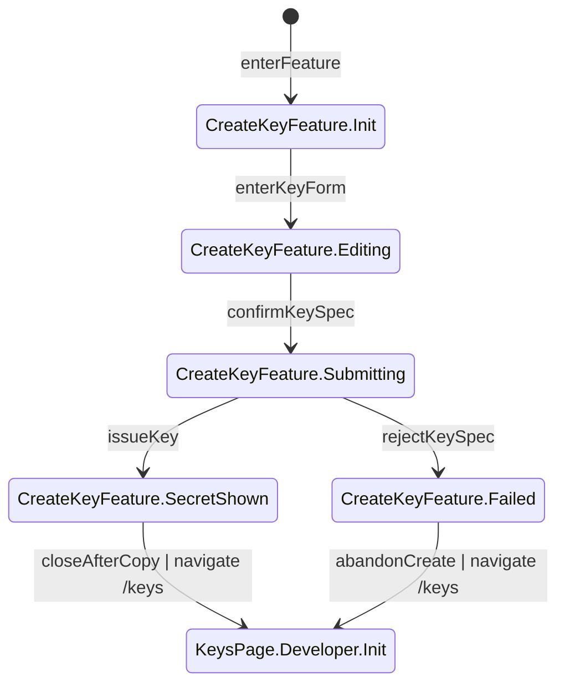
```mermaid
%% role: Developer
%% source pages: KeysPage.Developer
stateDiagram-v2
    [*] --> CreateKeyFeature.Init : enterFeature
    %% verify: 進入建立 Key 流程時只允許已登入 developer 操作，且預設不帶出原始 key 值。

    CreateKeyFeature.Init --> CreateKeyFeature.Editing : enterKeyForm
    %% verify: 建立表單可編輯 name、scopes、expires_at、rate limit，Developer 設定不得超過平台上限。

    CreateKeyFeature.Editing --> CreateKeyFeature.Submitting : confirmKeySpec
    %% verify: 送出建立請求時按鈕需避免重送，系統檢查 scope 與 rate limit 是否符合規則。

    CreateKeyFeature.Submitting --> CreateKeyFeature.SecretShown : issueKey
    %% verify: 建立成功時應產生新 ApiKey、儲存 hash、初始化狀態為 active，並只在此狀態一次性顯示原始 key。

    CreateKeyFeature.Submitting --> CreateKeyFeature.Failed : rejectKeySpec
    %% verify: 建立失敗時需指出驗證問題或超過上限，且資料庫不得留下可用的半成品 Key。

    CreateKeyFeature.SecretShown --> KeysPage.Developer.Init : closeAfterCopy | navigate /keys
    %% verify: 關閉一次性顯示後返回 /keys，之後任何 UI、API、Log 都不得再次取得原始 key。

    CreateKeyFeature.Failed --> KeysPage.Developer.Init : abandonCreate | navigate /keys
    %% verify: 返回 /keys 後不應新增任何新 Key，頁面仍只顯示既有 Key 狀態與設定。
```

## ⑫ Update Key Feature / Function State Machine
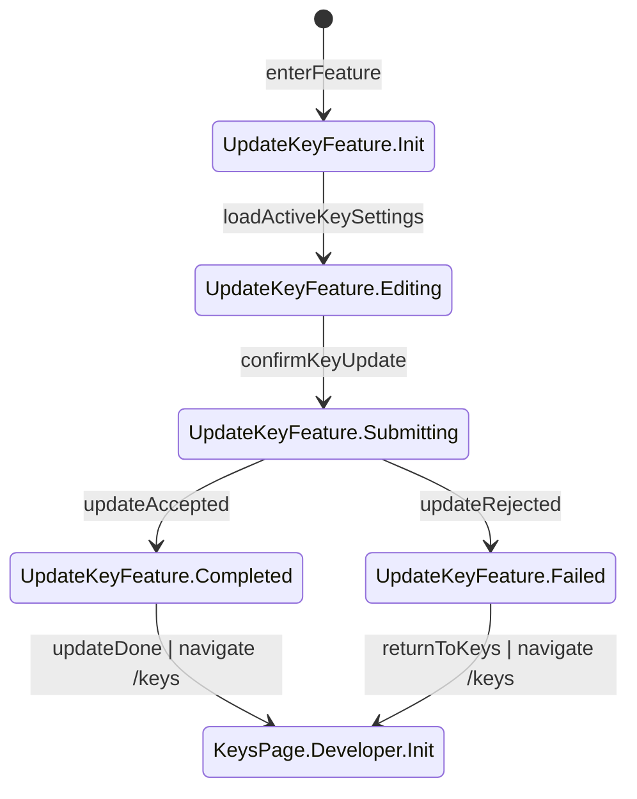
```mermaid
%% role: Developer
%% source pages: KeysPage.Developer
stateDiagram-v2
    [*] --> UpdateKeyFeature.Init : enterFeature
    %% verify: 進入更新流程時目標必須是目前使用者名下且 status=active 的 Key。

    UpdateKeyFeature.Init --> UpdateKeyFeature.Editing : loadActiveKeySettings
    %% verify: 載入設定後只允許編輯 name、scopes、expires_at、rate_limit，不可修改 hash 或原始 key。

    UpdateKeyFeature.Editing --> UpdateKeyFeature.Submitting : confirmKeyUpdate
    %% verify: 送出更新時需檢查 scopes 與 rate limit 是否有效且未超過平台上限，並避免重複送出。

    UpdateKeyFeature.Submitting --> UpdateKeyFeature.Completed : updateAccepted
    %% verify: 更新成功後目標 Key 的可編輯欄位需立即生效，Audit Log 記錄 actor、時間、目標資源與變更內容。

    UpdateKeyFeature.Submitting --> UpdateKeyFeature.Failed : updateRejected
    %% verify: 更新失敗時不得改變現有 Key 設定，且需保留可修正的輸入資訊與錯誤說明。

    UpdateKeyFeature.Completed --> KeysPage.Developer.Init : updateDone | navigate /keys
    %% verify: 回到 /keys 後顯示更新後的設定值，目標 Key 仍維持 active 並可供後續 Gateway 驗證。

    UpdateKeyFeature.Failed --> KeysPage.Developer.Init : returnToKeys | navigate /keys
    %% verify: 返回 /keys 後應維持更新前資料，不顯示不一致的暫存值。
```

## ⑬ Revoke Key Feature / Function State Machine
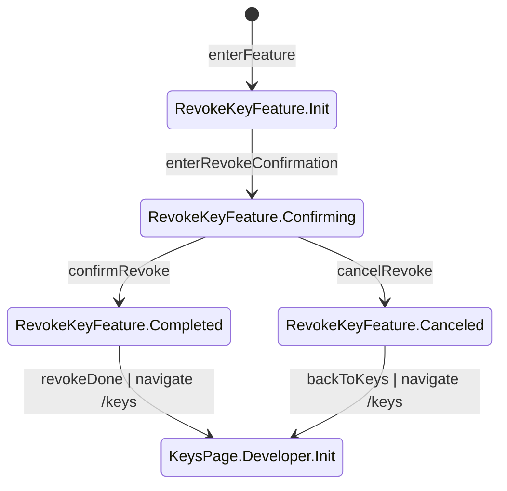
```mermaid
%% role: Developer
%% source pages: KeysPage.Developer
stateDiagram-v2
    [*] --> RevokeKeyFeature.Init : enterFeature
    %% verify: 進入撤銷流程時目標必須是目前使用者名下的 Key，且不可切換到他人資源。

    RevokeKeyFeature.Init --> RevokeKeyFeature.Confirming : enterRevokeConfirmation
    %% verify: 顯示撤銷確認資訊時需標明目標 Key 名稱與影響，但不得顯示原始 key。

    RevokeKeyFeature.Confirming --> RevokeKeyFeature.Completed : confirmRevoke
    %% verify: 確認撤銷後目標 Key 狀態改為 revoked、revoked_at 被記錄、後續 API 呼叫回 401，並寫入 Audit Log。

    RevokeKeyFeature.Confirming --> RevokeKeyFeature.Canceled : cancelRevoke
    %% verify: 取消撤銷後 Key 狀態維持原值，不得提早失效或寫入誤導性的稽核紀錄。

    RevokeKeyFeature.Completed --> KeysPage.Developer.Init : revokeDone | navigate /keys
    %% verify: 返回 /keys 後目標 Key 顯示 revoked，且對應 Usage 與歷史狀態仍可查詢。

    RevokeKeyFeature.Canceled --> KeysPage.Developer.Init : backToKeys | navigate /keys
    %% verify: 返回 /keys 後目標 Key 仍維持 active 或原本狀態，畫面不顯示撤銷成功提示。
```

## ⑭ Rotate Key Feature / Function State Machine
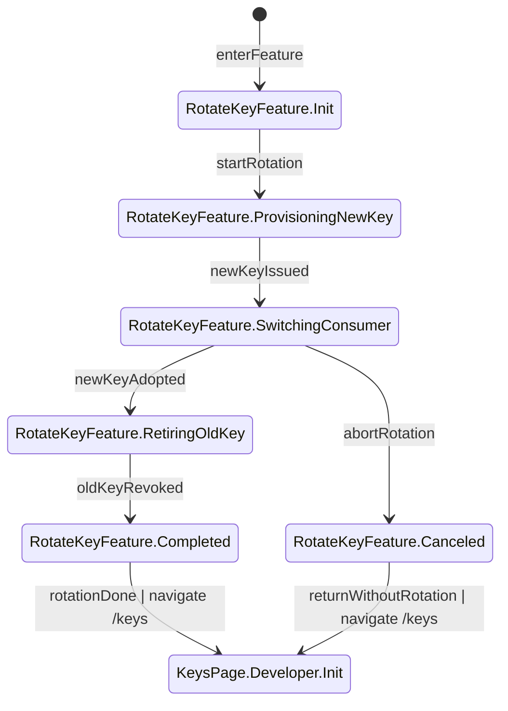
```mermaid
%% role: Developer
%% source pages: KeysPage.Developer
stateDiagram-v2
    [*] --> RotateKeyFeature.Init : enterFeature
    %% verify: 進入輪替流程時目標必須是目前使用者名下的既有 Key，且流程會追蹤新舊 Key 關聯。

    RotateKeyFeature.Init --> RotateKeyFeature.ProvisioningNewKey : startRotation
    %% verify: 啟動輪替後開始建立新 Key，舊 Key 仍維持可用直到明確撤銷。

    RotateKeyFeature.ProvisioningNewKey --> RotateKeyFeature.SwitchingConsumer : newKeyIssued
    %% verify: 新 Key 建立成功後只一次性顯示原始 key，系統僅儲存 hash，舊 Key 與新 Key 可並行測試。

    RotateKeyFeature.SwitchingConsumer --> RotateKeyFeature.RetiringOldKey : newKeyAdopted
    %% verify: 應用程式切換到新 Key 後，使用紀錄需能分辨新舊 Key，且新 Key 呼叫可回 200 或其他真實結果供檢查。

    RotateKeyFeature.SwitchingConsumer --> RotateKeyFeature.Canceled : abortRotation
    %% verify: 中止輪替時不得撤銷舊 Key，也不得建立錯誤的 replaced_by_key_id 關聯。

    RotateKeyFeature.RetiringOldKey --> RotateKeyFeature.Completed : oldKeyRevoked
    %% verify: 撤銷舊 Key 後舊 Key 呼叫必須回 401，新 Key 維持可用，舊 Key 記錄需保存 replaced_by_key_id 與歷史 usage。

    RotateKeyFeature.Completed --> KeysPage.Developer.Init : rotationDone | navigate /keys
    %% verify: 返回 /keys 後新 Key 顯示為 active、舊 Key 顯示為 revoked，兩者狀態與關聯資料一致。

    RotateKeyFeature.Canceled --> KeysPage.Developer.Init : returnWithoutRotation | navigate /keys
    %% verify: 返回 /keys 後舊 Key 仍維持原狀，新 Key 若未完成建立則不得出現在清單中。
```

## ⑮ Key Usage Feature / Function State Machine
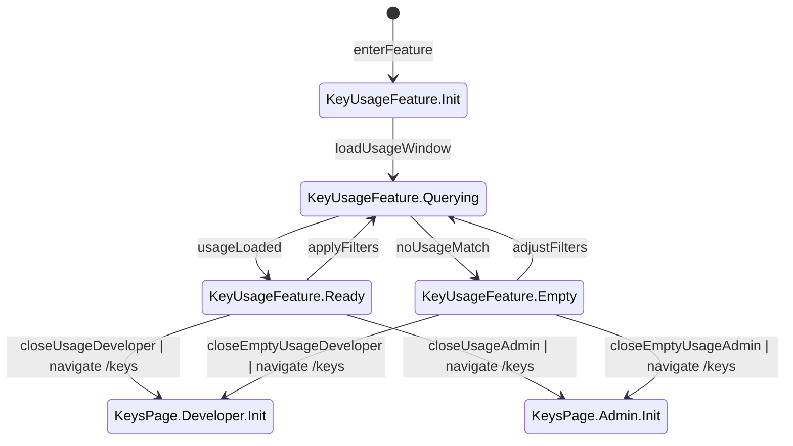
```mermaid
%% role: Developer|Admin
%% source pages: KeysPage.Developer, KeysPage.Admin
stateDiagram-v2
    [*] --> KeyUsageFeature.Init : enterFeature
    %% verify: 進入使用紀錄功能時必須鎖定單一 Key 作為查詢目標，且資料來源為 Usage Log。

    KeyUsageFeature.Init --> KeyUsageFeature.Querying : loadUsageWindow
    %% verify: 初次查詢至少帶入時間範圍、status code、endpoint 等可用篩選條件，查詢過程不阻塞其他頁面資料。

    KeyUsageFeature.Querying --> KeyUsageFeature.Ready : usageLoaded
    %% verify: 查詢成功後顯示 method、path、status code、response time、timestamp，且資料只屬於目標 Key。

    KeyUsageFeature.Querying --> KeyUsageFeature.Empty : noUsageMatch
    %% verify: 查無資料時顯示 Empty 狀態與目前篩選條件，不應顯示其他 Key 的紀錄。

    KeyUsageFeature.Ready --> KeyUsageFeature.Querying : applyFilters
    %% verify: 重新套用篩選時應依新的時間範圍、status code、endpoint 條件重新查詢並更新結果。

    KeyUsageFeature.Empty --> KeyUsageFeature.Querying : adjustFilters
    %% verify: 調整篩選後重新查詢，若符合條件資料存在則應離開 Empty 狀態。

    KeyUsageFeature.Ready --> KeysPage.Developer.Init : closeUsageDeveloper | navigate /keys
    %% verify: 從 developer 視角關閉使用紀錄後返回 /keys，只保留自己的 Key 管理畫面。

    KeyUsageFeature.Ready --> KeysPage.Admin.Init : closeUsageAdmin | navigate /keys
    %% verify: 從 admin 視角關閉使用紀錄後返回 /keys，仍可繼續查詢平台 Key。

    KeyUsageFeature.Empty --> KeysPage.Developer.Init : closeEmptyUsageDeveloper | navigate /keys
    %% verify: developer 在 Empty 狀態離開後返回自己的 Key 清單，不顯示跨帳號資料。

    KeyUsageFeature.Empty --> KeysPage.Admin.Init : closeEmptyUsageAdmin | navigate /keys
    %% verify: admin 在 Empty 狀態離開後返回平台 Key 清單，仍保留管理權限與篩選上下文。
```

## ⑯ Manage API Catalog Feature / Function State Machine
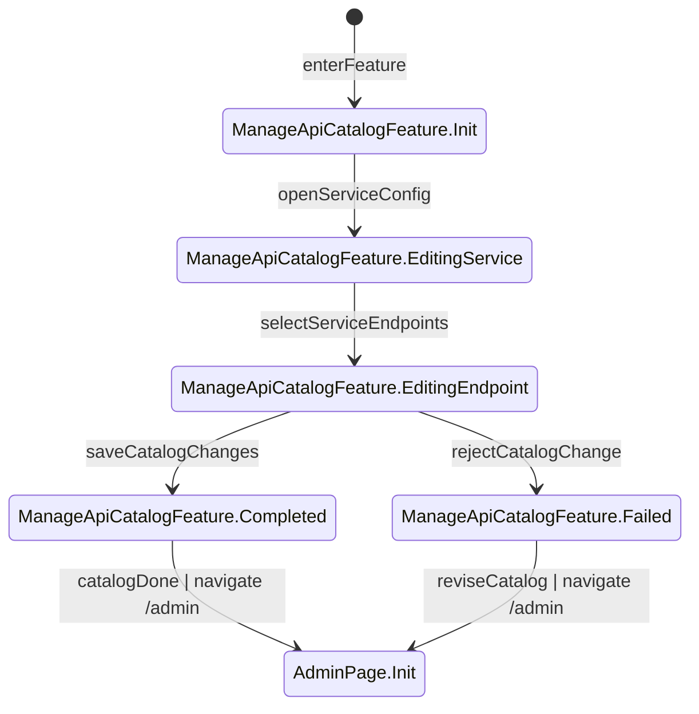
```mermaid
%% role: Admin
%% source pages: AdminPage
stateDiagram-v2
    [*] --> ManageApiCatalogFeature.Init : enterFeature
    %% verify: 進入 API 目錄管理時僅 admin 可操作，並載入目前 Service 與 Endpoint 設定。

    ManageApiCatalogFeature.Init --> ManageApiCatalogFeature.EditingService : openServiceConfig
    %% verify: Service 設定畫面可新增、編輯、停用 ApiService，且 service name 必須維持唯一。

    ManageApiCatalogFeature.EditingService --> ManageApiCatalogFeature.EditingEndpoint : selectServiceEndpoints
    %% verify: 切到 Endpoint 設定後可管理 method、path、status，且同一 Service 內 method+path 不可重複。

    ManageApiCatalogFeature.EditingEndpoint --> ManageApiCatalogFeature.Completed : saveCatalogChanges
    %% verify: 儲存成功後 ApiService、ApiEndpoint 與啟用狀態需一致更新，並寫入 Audit Log。

    ManageApiCatalogFeature.EditingEndpoint --> ManageApiCatalogFeature.Failed : rejectCatalogChange
    %% verify: 儲存失敗時不得部分寫入 Service 或 Endpoint 變更，需顯示可理解錯誤。

    ManageApiCatalogFeature.Completed --> AdminPage.Init : catalogDone | navigate /admin
    %% verify: 返回 /admin 後新的 Service 與 Endpoint 設定可被後台與文件頁一致讀取。

    ManageApiCatalogFeature.Failed --> AdminPage.Init : reviseCatalog | navigate /admin
    %% verify: 返回 /admin 後保留管理權限，且不應顯示未成功儲存的設定結果。
```

## ⑰ Manage Access Control Feature / Function State Machine
```mermaid
%% role: Admin
%% source pages: AdminPage
stateDiagram-v2
    [*] --> ManageAccessControlFeature.Init : enterFeature
    %% verify: 進入授權管理後僅 admin 可編輯 scope、scope rule 與 rate limit 規則。

    ManageAccessControlFeature.Init --> ManageAccessControlFeature.EditingScopes : openScopeConfig
    %% verify: Scope 設定可新增或編輯 scope 名稱與描述，scope.name 必須唯一且維持可讀命名規則。

    ManageAccessControlFeature.EditingScopes --> ManageAccessControlFeature.EditingRules : defineEndpointRules
    %% verify: Scope rule 設定需把 scope 對應到 service、endpoint、method，且可明確判斷 allow 規則。

    ManageAccessControlFeature.EditingRules --> ManageAccessControlFeature.EditingRateLimits : adjustRateLimits
    %% verify: 進入 rate limit 設定後可調整平台預設與上限，Developer 的 Key 設定不得超出此上限。

    ManageAccessControlFeature.EditingRateLimits --> ManageAccessControlFeature.Completed : saveAccessPolicy
    %% verify: 儲存成功後 scope、scope rule、rate limit 規則需立即可被 Gateway 的 403 與 429 判斷使用，並寫入 Audit Log。

    ManageAccessControlFeature.EditingRateLimits --> ManageAccessControlFeature.Failed : rejectAccessPolicy
    %% verify: 儲存失敗時不得留下部分生效的授權或節流規則，需提供可修正錯誤資訊。

    ManageAccessControlFeature.Completed --> AdminPage.Init : accessPolicyDone | navigate /admin
    %% verify: 返回 /admin 後新規則可被後台查詢，且文件頁 scope 標示與 Gateway 行為一致。

    ManageAccessControlFeature.Failed --> AdminPage.Init : reviseAccessPolicy | navigate /admin
    %% verify: 返回 /admin 後原規則應維持生效，不顯示未成功儲存的變更。
```

## ⑱ Monitoring Feature / Function State Machine
```mermaid
%% role: Admin
%% source pages: AdminPage
stateDiagram-v2
    [*] --> MonitoringFeature.Init : enterFeature
    %% verify: 進入監控功能時僅 admin 可檢視全站 usage 與 audit 資料。

    MonitoringFeature.Init --> MonitoringFeature.ViewingUsage : openUsageAnalytics
    %% verify: Usage 分頁需顯示全站流量與 401、403、429、5xx 統計，資料來源為 Usage Log。

    MonitoringFeature.ViewingUsage --> MonitoringFeature.ViewingAudit : openAuditTrail
    %% verify: 切換到稽核視圖後可檢查 who、when、what，至少包含 admin 管理操作與 developer 對 Key 的敏感操作。

    MonitoringFeature.ViewingAudit --> MonitoringFeature.ViewingUsage : returnToUsageAnalytics
    %% verify: 切回 Usage 視圖時保留監控功能上下文，不遺失已選擇的查詢條件。

    MonitoringFeature.ViewingUsage --> AdminPage.Init : closeUsageMonitoring | navigate /admin
    %% verify: 關閉 Usage 視圖後返回 /admin，管理員可繼續操作其他管理功能且 session 不變。

    MonitoringFeature.ViewingAudit --> AdminPage.Init : closeAuditMonitoring | navigate /admin
    %% verify: 關閉 Audit 視圖後返回 /admin，稽核資料不應因離開視圖而被修改或遺失。
```

## ⑲ Admin Security Feature / Function State Machine
```mermaid
%% role: Admin
%% source pages: AdminPage, KeysPage.Admin
stateDiagram-v2
    [*] --> AdminSecurityFeature.Init : enterFeature
    %% verify: 進入安全管理時僅 admin 可操作，且可追蹤目標是 Key、User 或 Blocked IP 設定。

    AdminSecurityFeature.Init --> AdminSecurityFeature.ReviewingKeyAction : chooseKeyModeration
    %% verify: 選擇 Key 管理時可執行 block 或 revoke，操作目標必須是指定 Key，且不得顯示原始 key。

    AdminSecurityFeature.Init --> AdminSecurityFeature.ReviewingUserAction : chooseUserDisable
    %% verify: 選擇停用使用者時需鎖定目標使用者，並準備同步讓其所有 active Key 與既有 session 失效。

    AdminSecurityFeature.Init --> AdminSecurityFeature.ReviewingBlockedIp : chooseBlockedIpMaintenance
    %% verify: 選擇黑名單 IP 維護時可管理 ip_or_cidr、reason、status，且變更僅影響受保護 API 請求。

    AdminSecurityFeature.ReviewingKeyAction --> AdminSecurityFeature.Completed : confirmKeyModeration
    %% verify: 確認 Key 封鎖或撤銷後狀態需立即生效，後續 API 呼叫回 401，並寫入 Audit Log。

    AdminSecurityFeature.ReviewingUserAction --> AdminSecurityFeature.Completed : confirmUserDisable
    %% verify: 確認停用使用者後 user.status=disabled、其所有 active Key 立即不可用、既有 session 下一次請求必須失效，且登入需失敗。

    AdminSecurityFeature.ReviewingBlockedIp --> AdminSecurityFeature.Completed : saveBlockedIpChange
    %% verify: 儲存黑名單 IP 變更後，受保護 API 來自該 IP 的請求需被直接拒絕，並保留稽核紀錄。

    AdminSecurityFeature.ReviewingKeyAction --> AdminSecurityFeature.Canceled : cancelKeyModeration
    %% verify: 取消 Key 管理後不得改變 Key 狀態，也不應留下誤導性的成功訊息。

    AdminSecurityFeature.ReviewingUserAction --> AdminSecurityFeature.Canceled : cancelUserDisable
    %% verify: 取消停用使用者後 user.status、其 session 與 active Key 都必須維持原狀。

    AdminSecurityFeature.ReviewingBlockedIp --> AdminSecurityFeature.Canceled : cancelBlockedIpMaintenance
    %% verify: 取消黑名單 IP 維護後不得寫入任何 IP 狀態變更，也不應影響既有封鎖規則。

    AdminSecurityFeature.Completed --> AdminPage.Init : securityDoneFromAdmin | navigate /admin
    %% verify: 從 /admin 返回後可立即在後台看到最新安全狀態與稽核結果。

    AdminSecurityFeature.Completed --> KeysPage.Admin.Init : securityDoneFromKeys | navigate /keys
    %% verify: 從 /keys 返回後目標 Key 狀態需立即更新為 blocked 或 revoked，且後續使用紀錄查詢仍可用。

    AdminSecurityFeature.Canceled --> AdminPage.Init : returnSecurityAdmin | navigate /admin
    %% verify: 取消後返回 /admin，管理權限與原本資料維持不變，不顯示已生效的安全變更。

    AdminSecurityFeature.Canceled --> KeysPage.Admin.Init : returnSecurityKeys | navigate /keys
    %% verify: 取消後返回 /keys，目標 Key 狀態維持原值，頁面不顯示錯誤的封鎖或撤銷結果。
```