全體結構說明
[Entry State]
        ↓
[Page State Machine]
        ↓
[Role-specific Page State]
        ↓
[Feature / Function State Machine]
        ↓
[回到 Page 或跳轉其他 Page，或跳轉到其他 Feature]

以下將照這個層級排序。

## ① Entry State Machine
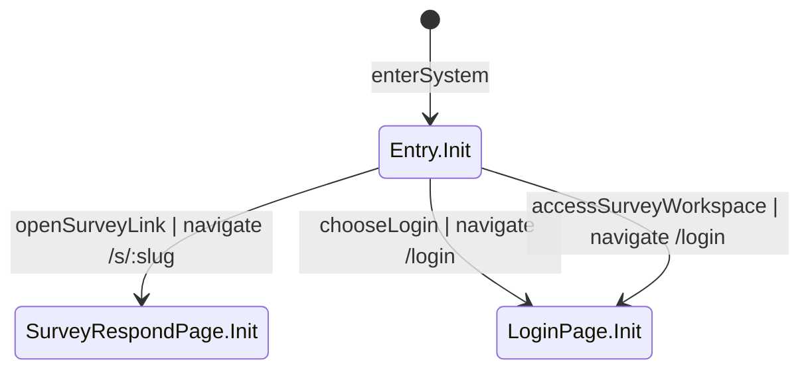
```mermaid
stateDiagram-v2
    %% role: none
    [*] --> Entry.Init : enterSystem
    %% verify: 系統進入公共入口；Guest Header 只顯示登入入口且不顯示任何 /surveys* 導覽；尚未建立 Session 或 owner 後台權限

    Entry.Init --> SurveyRespondPage.Init : openSurveyLink | navigate /s/:slug
    %% verify: 路由切換到 /s/:slug；/s/:slug 對 Guest 可開啟；頁面進入填答頁的初始化流程並開始載入指定 slug 的 Survey

    Entry.Init --> LoginPage.Init : chooseLogin | navigate /login
    %% verify: 路由切換到 /login；Header 不應再出現第二個等價登入 CTA；頁面顯示單一主要登入提交入口

    Entry.Init --> LoginPage.Init : accessSurveyWorkspace | navigate /login
    %% verify: 未登入使用者進入後台流程時被導向 /login；/surveys* 受保護不可直接進入；登入成功後才可回到後台頁面
```

## ② Login Page State Machine
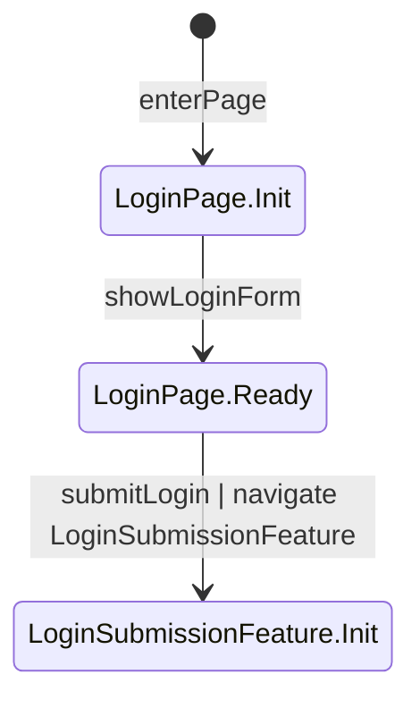
```mermaid
stateDiagram-v2
    %% role: none
    [*] --> LoginPage.Init : enterPage
    %% verify: 進入 /login 頁面；顯示登入表單入口；Guest 導覽僅保留登入相關入口且不顯示我的問卷或登出

    LoginPage.Init --> LoginPage.Ready : showLoginForm
    %% verify: 登入表單已可互動；頁面只有單一主要登入 CTA；若存在 return_to，UI 保留回跳目標資訊供成功後導回

    LoginPage.Ready --> LoginSubmissionFeature.Init : submitLogin | navigate LoginSubmissionFeature
    %% verify: 點擊登入後進入登入功能流程；提交按鈕進入防重送狀態；後續成功時只能導向 return_to 或 /surveys
```

## ③ Surveys Page State Machine
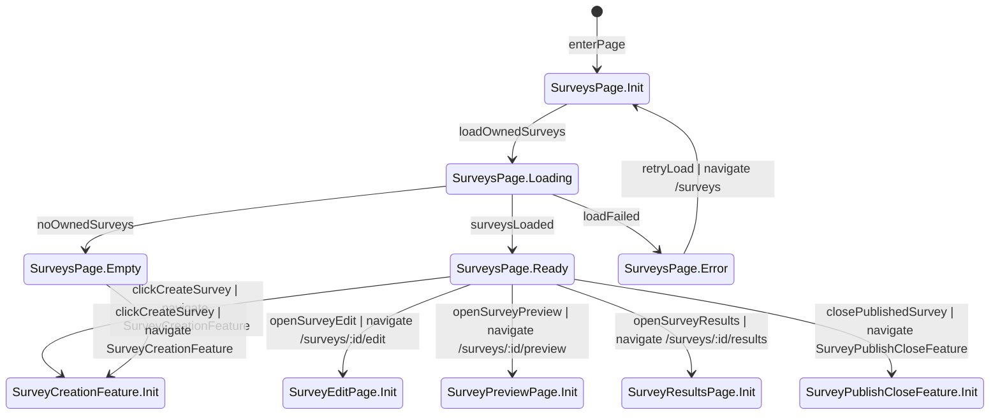
```mermaid
stateDiagram-v2
    %% role: none
    [*] --> SurveysPage.Init : enterPage
    %% verify: 進入 /surveys 前需已登入；未登入請求依 Spec 應為 401；頁面作為我的問卷列表入口開始初始化

    SurveysPage.Init --> SurveysPage.Loading : loadOwnedSurveys
    %% verify: 開始載入目前登入使用者擁有的 Surveys；UI 顯示 Loading；清單尚未可互動

    SurveysPage.Loading --> SurveysPage.Ready : surveysLoaded
    %% verify: 取得清單成功且 API 回應 200；列表只包含 owner_user_id 為目前使用者的 Surveys；畫面顯示 Draft/Published/Closed 狀態

    SurveysPage.Loading --> SurveysPage.Empty : noOwnedSurveys
    %% verify: API 回應 200 且目前使用者沒有任何 Survey；畫面顯示 Empty 狀態與建立新問卷 CTA；不顯示他人資料

    SurveysPage.Loading --> SurveysPage.Error : loadFailed
    %% verify: 清單載入失敗時進入 Error 狀態；UI 顯示可辨識的錯誤提示與重試入口；既有清單資料不應偽裝成成功狀態

    SurveysPage.Ready --> SurveyCreationFeature.Init : clickCreateSurvey | navigate SurveyCreationFeature
    %% verify: 從列表點擊建立新問卷後進入建立 Draft 功能；來源頁只有一個建立 CTA；提交期間禁止重複建立相同草稿

    SurveysPage.Ready --> SurveyEditPage.Init : openSurveyEdit | navigate /surveys/:id/edit
    %% verify: 路由切換到 /surveys/:id/edit；目標 Survey 必須屬於目前使用者，否則依 Spec 應為 403；畫面不可洩漏他人問卷內容

    SurveysPage.Ready --> SurveyPreviewPage.Init : openSurveyPreview | navigate /surveys/:id/preview
    %% verify: 路由切換到 /surveys/:id/preview；僅 owner 可進入；預覽只載入 Draft 結構模擬流程，不建立 Response 或 response_hash

    SurveysPage.Ready --> SurveyResultsPage.Init : openSurveyResults | navigate /surveys/:id/results
    %% verify: 路由切換到 /surveys/:id/results；僅 owner 可查看結果；結果頁顯示的是該 Survey 的回收資料與統計而非其他問卷資料

    SurveysPage.Ready --> SurveyPublishCloseFeature.Init : closePublishedSurvey | navigate SurveyPublishCloseFeature
    %% verify: 從列表觸發關閉問卷時進入狀態轉換功能；只有 Published Survey 可合法關閉；操作不應提供重新開啟 Closed 的入口

    SurveysPage.Empty --> SurveyCreationFeature.Init : clickCreateSurvey | navigate SurveyCreationFeature
    %% verify: Empty 狀態下的建立新問卷 CTA 可用；進入建立 Draft 功能後若成功，後續必須能回到可見新 Draft 的列表

    SurveysPage.Error --> SurveysPage.Init : retryLoad | navigate /surveys
    %% verify: 觸發重試後重新進入 /surveys 初始化；再次發送 owned surveys 請求；成功時只會回到 Ready 或 Empty，不保留錯誤畫面
```

## ④ Survey Edit Page State Machine

```mermaid
stateDiagram-v2
    %% role: none
    [*] --> SurveyEditPage.Init : enterPage
    %% verify: 進入 /surveys/:id/edit 前需已登入且為 owner；未登入應為 401，非 owner 應為 403；頁面作為編輯入口初始化

    SurveyEditPage.Init --> SurveyEditPage.Loading : loadSurveyDefinition
    %% verify: 開始載入 Survey 基本資訊、Questions、Options、RuleGroups、LogicRules；UI 顯示 Loading；編輯區暫不可操作

    SurveyEditPage.Loading --> SurveyEditPage.ReadyEditable : draftLoaded
    %% verify: API 回應 200 且 Survey.status=Draft；結構編輯 UI 可互動；可編輯 title、description、is_anonymous、題目、選項與邏輯規則

    SurveyEditPage.Loading --> SurveyEditPage.ReadyLocked : publishedOrClosedLoaded
    %% verify: API 回應 200 且 Survey.status 為 Published 或 Closed；結構性欄位禁用；僅白名單欄位 title 與 description 可更新

    SurveyEditPage.Loading --> SurveyEditPage.Empty : surveyUnavailable
    %% verify: 問卷不存在或不可存取時顯示 Empty/Not Found；不可呈現任何可編輯結構資料；符合 Spec 的不可洩漏原則

    SurveyEditPage.Loading --> SurveyEditPage.Error : loadFailed
    %% verify: 載入失敗時進入 Error；UI 顯示重試入口；尚未取得的 Survey 結構不應部分顯示為有效內容

    SurveyEditPage.ReadyEditable --> SurveyStructureEditingFeature.Init : editSurveyStructure | navigate SurveyStructureEditingFeature
    %% verify: 從 Draft 編輯狀態進入結構編輯功能；僅 Draft 可走此路徑；後續保存必須驗證 forward-only、cycle detection 與資料完整性

    SurveyEditPage.ReadyEditable --> RuleValidationFeature.Init : validateDraftRules | navigate RuleValidationFeature
    %% verify: 從 Draft 編輯狀態可主動觸發規則驗證功能；驗證只針對目前草稿結構；結果不得改寫 Published/Closed 問卷資料

    SurveyEditPage.ReadyEditable --> SurveyPreviewPage.Init : openPreview | navigate /surveys/:id/preview
    %% verify: 從編輯頁進入預覽頁；目標頁應以已保存的 Draft 結構模擬；不建立 Response、Answer 或 response_hash

    SurveyEditPage.ReadyEditable --> SurveyPublishCloseFeature.Init : publishSurvey | navigate SurveyPublishCloseFeature
    %% verify: 點擊發佈後進入狀態轉換功能；Draft 需通過結構與規則驗證才能發佈；成功後必須寫入 publish_hash 並鎖定結構

    SurveyEditPage.ReadyEditable --> SurveysPage.Init : backToSurveyList | navigate /surveys
    %% verify: 返回我的問卷列表；列表資料仍只顯示目前 owner 的 Survey；若先前已保存，狀態與資料需與列表一致

    SurveyEditPage.ReadyLocked --> SurveyPreviewPage.Init : openPreview | navigate /surveys/:id/preview
    %% verify: Published/Closed 問卷仍可由 owner 進入預覽；預覽僅供檢視邏輯流程，不允許修改結構或建立正式回覆

    SurveyEditPage.ReadyLocked --> SurveyResultsPage.Init : openResults | navigate /surveys/:id/results
    %% verify: owner 可從鎖定問卷直接進入結果分析；結果頁應對應同一份 Survey；不可顯示其他問卷的統計資料

    SurveyEditPage.ReadyLocked --> SurveyPublishCloseFeature.Init : closeSurvey | navigate SurveyPublishCloseFeature
    %% verify: 從已鎖定頁面觸發關閉流程時，只允許對 Published 問卷執行合法關閉；Closed 不可回退為 Published 或 Draft

    SurveyEditPage.ReadyLocked --> SurveysPage.Init : backToSurveyList | navigate /surveys
    %% verify: 從鎖定頁返回列表後，列表中的 Survey 狀態需維持 Published 或 Closed；不可意外恢復可編輯結構狀態

    SurveyEditPage.Empty --> SurveysPage.Init : returnToSurveyList | navigate /surveys
    %% verify: 從不可用/不存在頁面返回列表；路由切換回 /surveys；列表仍僅顯示目前使用者可管理的問卷

    SurveyEditPage.Error --> SurveyEditPage.Init : retryLoad | navigate /surveys/:id/edit
    %% verify: 重試後重新載入同一 Survey 編輯頁；若成功則回到 ReadyEditable 或 ReadyLocked；錯誤訊息應被新狀態取代
```

## ⑤ Survey Preview Page State Machine
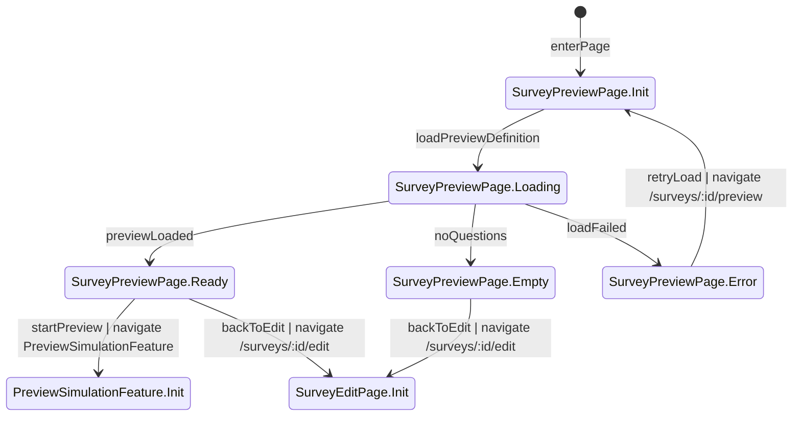
```mermaid
stateDiagram-v2
    %% role: none
    [*] --> SurveyPreviewPage.Init : enterPage
    %% verify: 進入 /surveys/:id/preview 前需已登入且為 owner；此頁僅作預覽模擬，不建立正式回覆資料

    SurveyPreviewPage.Init --> SurveyPreviewPage.Loading : loadPreviewDefinition
    %% verify: 載入預覽所需的 Survey 結構；UI 顯示 Loading；尚未開始模擬前不可操作題目流程

    SurveyPreviewPage.Loading --> SurveyPreviewPage.Ready : previewLoaded
    %% verify: API 回應 200 且成功取得可預覽的 Survey 結構；畫面顯示開始預覽入口；未產生 Response 或 response_hash

    SurveyPreviewPage.Loading --> SurveyPreviewPage.Empty : noQuestions
    %% verify: 問卷無題目時顯示 Empty；不應提供開始預覽 CTA；owner 需回編輯頁補題目

    SurveyPreviewPage.Loading --> SurveyPreviewPage.Error : loadFailed
    %% verify: 預覽結構載入失敗時顯示 Error 與重試入口；不可誤顯示舊的模擬題目內容

    SurveyPreviewPage.Ready --> PreviewSimulationFeature.Init : startPreview | navigate PreviewSimulationFeature
    %% verify: 進入預覽模擬功能後以前端同一套 Logic Engine 計算可見題目；建立的是本地 draft answers，不建立 Response

    SurveyPreviewPage.Ready --> SurveyEditPage.Init : backToEdit | navigate /surveys/:id/edit
    %% verify: 返回編輯頁時路由切換回同一 Survey；Draft 問卷可繼續編輯，Published/Closed 仍維持結構鎖定規則

    SurveyPreviewPage.Empty --> SurveyEditPage.Init : backToEdit | navigate /surveys/:id/edit
    %% verify: 從無題目預覽頁返回編輯頁；owner 可補上題目結構；不會建立任何填答紀錄

    SurveyPreviewPage.Error --> SurveyPreviewPage.Init : retryLoad | navigate /surveys/:id/preview
    %% verify: 重試後重新載入同一預覽頁；成功時回到 Ready 或 Empty；錯誤提示應被最新狀態覆蓋
```

## ⑥ Survey Respond Page State Machine
例外：`ResponseSubmitFeature` 成功後可回接 `SurveyRespondPage.Completion`，因 Step 1 Spec 明確定義 `/s/:slug` 於同一路由呈現完成狀態。
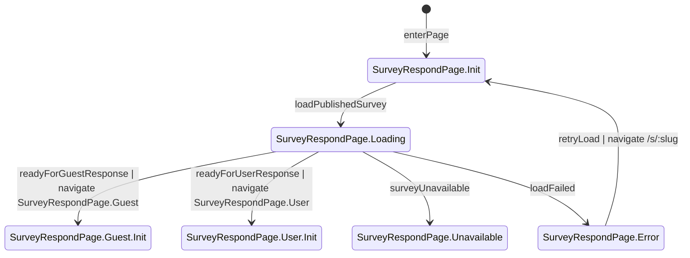
```mermaid
stateDiagram-v2
    %% role: none
    %% base: SurveyRespondPage
    [*] --> SurveyRespondPage.Init : enterPage
    %% verify: 進入 /s/:slug 填答頁初始化；Guest、User、Admin 皆可開啟；頁面開始判定該 Survey 是否可填答

    SurveyRespondPage.Init --> SurveyRespondPage.Loading : loadPublishedSurvey
    %% verify: 開始載入 slug 對應的 Survey 結構；只有 Published 且可填的問卷才可進入作答；UI 顯示 Loading

    SurveyRespondPage.Loading --> SurveyRespondPage.Guest.Init : readyForGuestResponse | navigate SurveyRespondPage.Guest
    %% verify: 問卷允許以 Guest 進行填答時進入 Guest 填答角色流程；頁面顯示作答 UI；Header 仍不可出現 /surveys* 導覽

    SurveyRespondPage.Loading --> SurveyRespondPage.User.Init : readyForUserResponse | navigate SurveyRespondPage.User
    %% verify: 已登入使用者可進入 User 填答角色流程；後續若為記名問卷，提交成功時 respondent_id 需對應目前 User.id

    SurveyRespondPage.Loading --> SurveyRespondPage.Unavailable : surveyUnavailable
    %% verify: slug 不存在或 Survey 狀態為 Draft/Closed 時顯示不可填/404；畫面不得洩漏管理後台資訊或可提交入口

    SurveyRespondPage.Loading --> SurveyRespondPage.Error : loadFailed
    %% verify: 載入失敗時進入 Error；UI 顯示重試入口；若前端已有草稿答案，依 Spec 應保留而非直接清空

    SurveyRespondPage.Error --> SurveyRespondPage.Init : retryLoad | navigate /s/:slug
    %% verify: 重試會重新載入同一 slug；成功時依登入狀態回到 Guest 或 User 角色流程，或回到 Unavailable；路由維持 /s/:slug
```

## ⑦ Survey Results Page State Machine
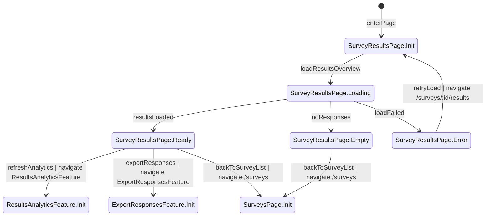
```mermaid
stateDiagram-v2
    %% role: none
    [*] --> SurveyResultsPage.Init : enterPage
    %% verify: 進入 /surveys/:id/results 前需已登入且為 owner；未登入應為 401，非 owner 應為 403；頁面作為結果分析入口初始化

    SurveyResultsPage.Init --> SurveyResultsPage.Loading : loadResultsOverview
    %% verify: 開始載入該 Survey 的回收狀況與彙總統計；UI 顯示 Loading；結果元件暫不可互動

    SurveyResultsPage.Loading --> SurveyResultsPage.Ready : resultsLoaded
    %% verify: API 回應 200 且結果資料載入成功；畫面顯示回覆數與各題統計；統計結果需與 Response/Answer 資料一致

    SurveyResultsPage.Loading --> SurveyResultsPage.Empty : noResponses
    %% verify: API 回應 200 且目前無任何回覆；畫面顯示 Empty 狀態；不得顯示虛假的統計數值

    SurveyResultsPage.Loading --> SurveyResultsPage.Error : loadFailed
    %% verify: 結果載入失敗時顯示 Error 與重試入口；不可混用舊的統計資料當成最新結果

    SurveyResultsPage.Ready --> ResultsAnalyticsFeature.Init : refreshAnalytics | navigate ResultsAnalyticsFeature
    %% verify: 進入分析刷新功能後仍只操作目前 Survey 的結果資料；功能完成後返回結果頁並保持統計一致性

    SurveyResultsPage.Ready --> ExportResponsesFeature.Init : exportResponses | navigate ExportResponsesFeature
    %% verify: 點擊匯出後進入匯出功能；匯出資料必須來自目前 Survey 的 Response/Answer，並可對應 publish_hash 追溯

    SurveyResultsPage.Ready --> SurveysPage.Init : backToSurveyList | navigate /surveys
    %% verify: 返回我的問卷列表；列表與結果頁對應的 Survey 狀態一致；不改變任何 Response 的不可變資料

    SurveyResultsPage.Empty --> SurveysPage.Init : backToSurveyList | navigate /surveys
    %% verify: 從無回覆結果頁返回列表；路由切換成功；Survey 狀態與可用操作維持不變

    SurveyResultsPage.Error --> SurveyResultsPage.Init : retryLoad | navigate /surveys/:id/results
    %% verify: 重試後重新載入同一 Survey 的結果頁；成功時回到 Ready 或 Empty；錯誤提示由最新狀態覆蓋
```

## ⑧ Survey Respond Page.Guest State Machine
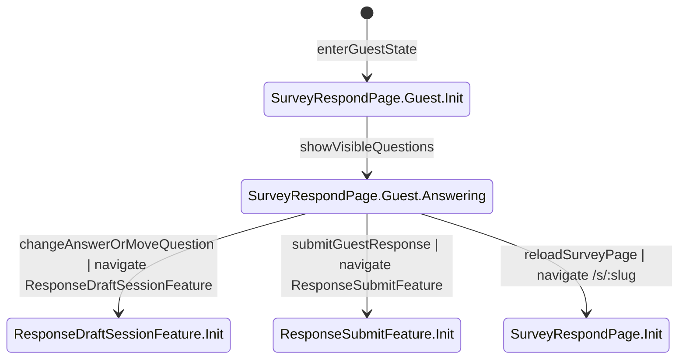
```mermaid
stateDiagram-v2
    %% role: Guest
    %% extends: SurveyRespondPage
    [*] --> SurveyRespondPage.Guest.Init : enterGuestState
    %% verify: 以 Guest 身分進入填答角色流程；不需 Session 即可作答公開問卷；Header 不顯示我的問卷與登出

    SurveyRespondPage.Guest.Init --> SurveyRespondPage.Guest.Answering : showVisibleQuestions
    %% verify: 畫面僅顯示依目前 draft answers 計算出的可見題目；required 驗證只對可見題目生效；提供上一題/下一題操作

    SurveyRespondPage.Guest.Answering --> ResponseDraftSessionFeature.Init : changeAnswerOrMoveQuestion | navigate ResponseDraftSessionFeature
    %% verify: 變更答案或切換題目時進入草稿處理功能；前端必須即時重算 Visible Questions，並清除變成 hidden 的題目答案

    SurveyRespondPage.Guest.Answering --> ResponseSubmitFeature.Init : submitGuestResponse | navigate ResponseSubmitFeature
    %% verify: Guest 送出流程只在 Survey.is_anonymous=true 時可成功完成；送出 payload 不得包含 hidden 題目答案；提交前需通過前端驗證

    SurveyRespondPage.Guest.Answering --> SurveyRespondPage.Init : reloadSurveyPage | navigate /s/:slug
    %% verify: 重新載入同一填答頁後仍以 slug 為準重新計算可見題目；若草稿有保留機制則需保留，否則至少不得顯示錯誤身分導覽
```

## ⑨ Survey Respond Page.User State Machine
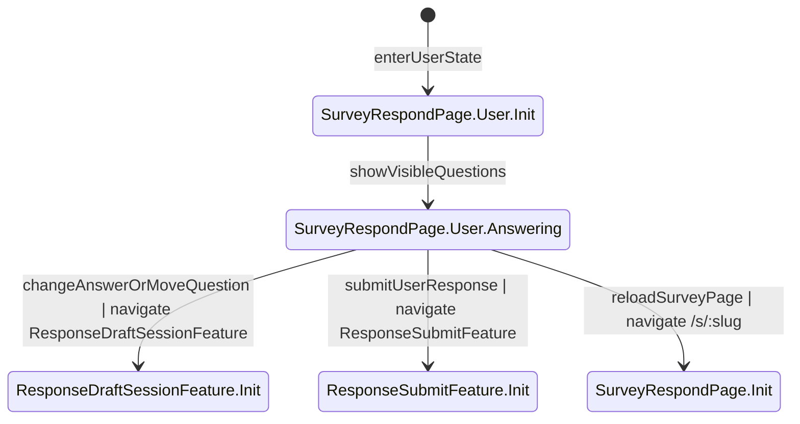
```mermaid
stateDiagram-v2
    %% role: User
    %% extends: SurveyRespondPage
    [*] --> SurveyRespondPage.User.Init : enterUserState
    %% verify: 已登入使用者進入填答角色流程；若問卷要求記名提交，後續 respondent_id 必須對應目前登入者；Header 可維持登入狀態

    SurveyRespondPage.User.Init --> SurveyRespondPage.User.Answering : showVisibleQuestions
    %% verify: 畫面顯示依同一套 Logic Engine 計算出的可見題目；required 只對目前可見題目生效；使用者可回上一題修正答案

    SurveyRespondPage.User.Answering --> ResponseDraftSessionFeature.Init : changeAnswerOrMoveQuestion | navigate ResponseDraftSessionFeature
    %% verify: 每次變更答案或題目移動都會進入草稿處理功能；若題目由 visible 變 hidden，其草稿答案必須立即清除且不得送出

    SurveyRespondPage.User.Answering --> ResponseSubmitFeature.Init : submitUserResponse | navigate ResponseSubmitFeature
    %% verify: 已登入使用者提交時進入正式送出功能；後端需以 publish_hash 對應的結構重算可見題目並驗證 required 與 schema

    SurveyRespondPage.User.Answering --> SurveyRespondPage.Init : reloadSurveyPage | navigate /s/:slug
    %% verify: 重新載入同一路由後重新判定問卷可填狀態與使用者身分；若有保留草稿，重載後應維持同一份 draft answers
```

## ⑩ Feature: Login Submission
Source Pages: `LoginPage`
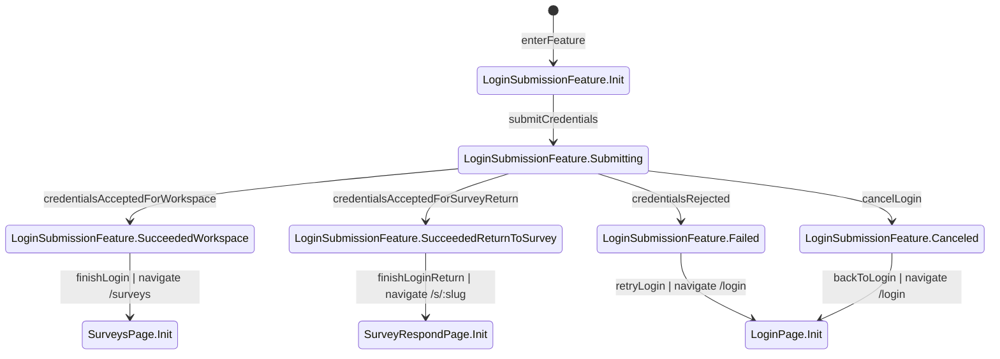
```mermaid
stateDiagram-v2
    %% role: none
    [*] --> LoginSubmissionFeature.Init : enterFeature
    %% verify: 進入登入提交功能；來源必須是 LoginPage；提交流程開始後頁面不得再出現第二個等價登入提交入口

    LoginSubmissionFeature.Init --> LoginSubmissionFeature.Submitting : submitCredentials
    %% verify: 發送登入請求；按鈕 disabled 防止重複送出；請求攜帶使用者輸入認證資訊與可能存在的 return_to

    LoginSubmissionFeature.Submitting --> LoginSubmissionFeature.SucceededWorkspace : credentialsAcceptedForWorkspace
    %% verify: API 回應 200 且登入成功；Session 建立；當沒有 survey return_to 時，後續目標為 /surveys

    LoginSubmissionFeature.Submitting --> LoginSubmissionFeature.SucceededReturnToSurvey : credentialsAcceptedForSurveyReturn
    %% verify: API 回應 200 且登入成功；Session 建立；存在來自 /s/:slug 的 return_to，草稿答案需保留供回到同一問卷繼續填寫

    LoginSubmissionFeature.Submitting --> LoginSubmissionFeature.Failed : credentialsRejected
    %% verify: API 回應 401 或登入失敗；顯示登入失敗訊息；不建立 Session，也不切換到後台導覽

    LoginSubmissionFeature.Submitting --> LoginSubmissionFeature.Canceled : cancelLogin
    %% verify: 使用者取消登入流程；不建立 Session；既有 return_to 不應被誤用為已登入成功導向

    LoginSubmissionFeature.SucceededWorkspace --> SurveysPage.Init : finishLogin | navigate /surveys
    %% verify: 路由切換到 /surveys；Header 顯示我的問卷與登出；頁面開始載入 owner 自己的問卷清單

    LoginSubmissionFeature.SucceededReturnToSurvey --> SurveyRespondPage.Init : finishLoginReturn | navigate /s/:slug
    %% verify: 路由切換回原本 /s/:slug；登入狀態已成立；先前草稿答案保留，使用者可在同一問卷繼續記名提交

    LoginSubmissionFeature.Failed --> LoginPage.Init : retryLogin | navigate /login
    %% verify: 回到 /login 重新輸入；錯誤訊息可見；頁面仍只有單一主要登入 CTA，且不顯示後台導覽

    LoginSubmissionFeature.Canceled --> LoginPage.Init : backToLogin | navigate /login
    %% verify: 取消後返回 /login；表單可再次互動；系統保持 Guest 身分，不建立 Session
```

## ⑪ Feature: Survey Creation
Source Pages: `SurveysPage`
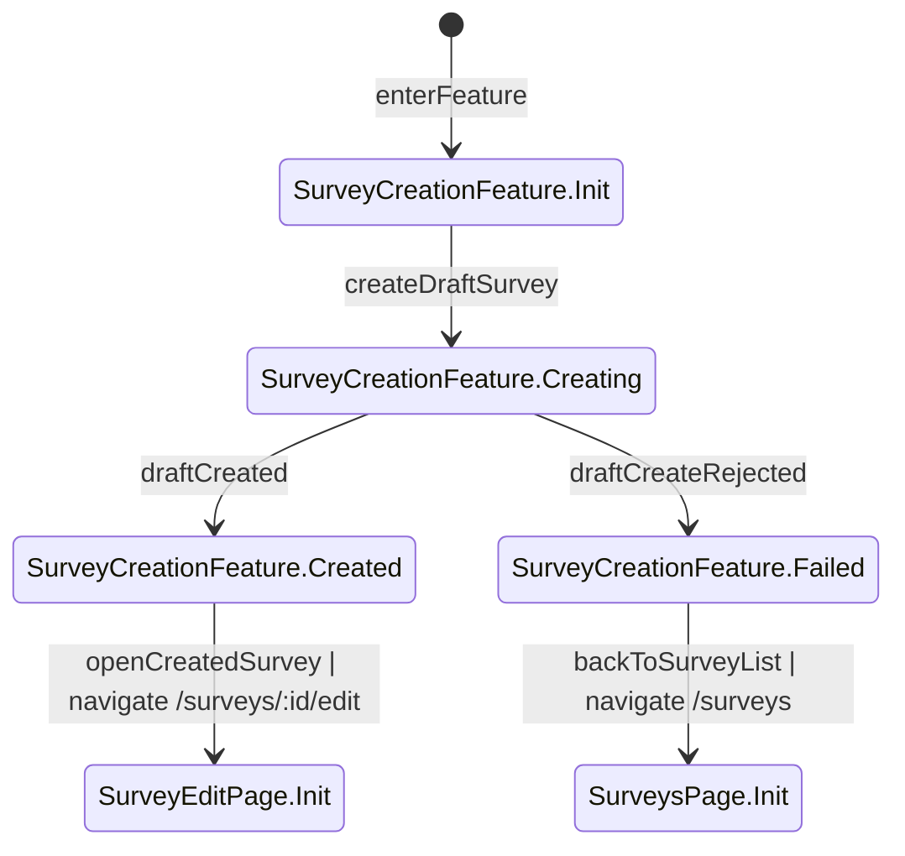
```mermaid
stateDiagram-v2
    %% role: none
    [*] --> SurveyCreationFeature.Init : enterFeature
    %% verify: 進入建立問卷功能；來源必須是 /surveys；操作者需已登入且具備 owner 身分建立自己的 Survey

    SurveyCreationFeature.Init --> SurveyCreationFeature.Creating : createDraftSurvey
    %% verify: 發送建立 Draft Survey 請求；提交期間防重複建立；新 Survey 初始狀態必須為 Draft

    SurveyCreationFeature.Creating --> SurveyCreationFeature.Created : draftCreated
    %% verify: API 回應 200 且成功建立 Survey；新資料包含 owner_user_id、固定 slug、status=Draft；尚未產生 publish_hash

    SurveyCreationFeature.Creating --> SurveyCreationFeature.Failed : draftCreateRejected
    %% verify: 建立失敗時不產生任何 Survey 資料；UI 應顯示失敗訊息；列表不得出現半完成的新項目

    SurveyCreationFeature.Created --> SurveyEditPage.Init : openCreatedSurvey | navigate /surveys/:id/edit
    %% verify: 成功建立後導向新 Survey 的編輯頁；該 Survey 屬於目前 owner；可立即進行 Draft 結構編輯

    SurveyCreationFeature.Failed --> SurveysPage.Init : backToSurveyList | navigate /surveys
    %% verify: 失敗後返回列表頁；若原本為 Empty，仍維持 Empty；若原本有列表，資料數量不應增加
```

## ⑫ Feature: Survey Structure Editing
Source Pages: `SurveyEditPage`
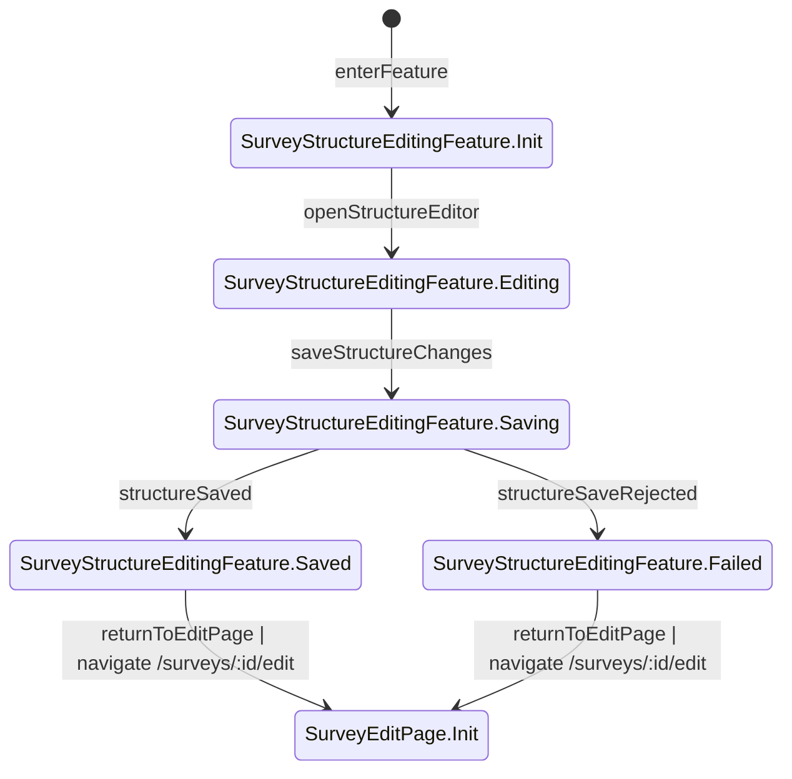
```mermaid
stateDiagram-v2
    %% role: none
    [*] --> SurveyStructureEditingFeature.Init : enterFeature
    %% verify: 進入問卷結構編輯功能；來源需為 Draft 的 SurveyEditPage；Published/Closed 不可透過此功能修改結構

    SurveyStructureEditingFeature.Init --> SurveyStructureEditingFeature.Editing : openStructureEditor
    %% verify: 編輯器可操作 Questions、Options、RuleGroups、LogicRules 與基本 Draft 欄位；變更會標記為未保存草稿

    SurveyStructureEditingFeature.Editing --> SurveyStructureEditingFeature.Saving : saveStructureChanges
    %% verify: 送出保存草稿請求；後端必須驗證 forward-only、cycle detection、Option.value 唯一性與資料完整性

    SurveyStructureEditingFeature.Saving --> SurveyStructureEditingFeature.Saved : structureSaved
    %% verify: API 回應 200 且保存成功；Questions、Options、RuleGroups、LogicRules 與基本欄位一致寫入；Survey 仍維持 Draft 且不產生 publish_hash

    SurveyStructureEditingFeature.Saving --> SurveyStructureEditingFeature.Failed : structureSaveRejected
    %% verify: API 回應 400 或保存失敗；應顯示可定位的驗證錯誤，例如 cycle path 或 order 違規；不應寫入不合法結構

    SurveyStructureEditingFeature.Saved --> SurveyEditPage.Init : returnToEditPage | navigate /surveys/:id/edit
    %% verify: 返回編輯頁後重新載入同一 Survey；畫面應呈現剛保存的 Draft 結構；dirty 狀態清除

    SurveyStructureEditingFeature.Failed --> SurveyEditPage.Init : returnToEditPage | navigate /surveys/:id/edit
    %% verify: 失敗後返回編輯頁；錯誤訊息可見；未保存的問題需可被修正後再次提交，不得誤當成保存成功
```

## ⑬ Feature: Rule Validation
Source Pages: `SurveyEditPage`
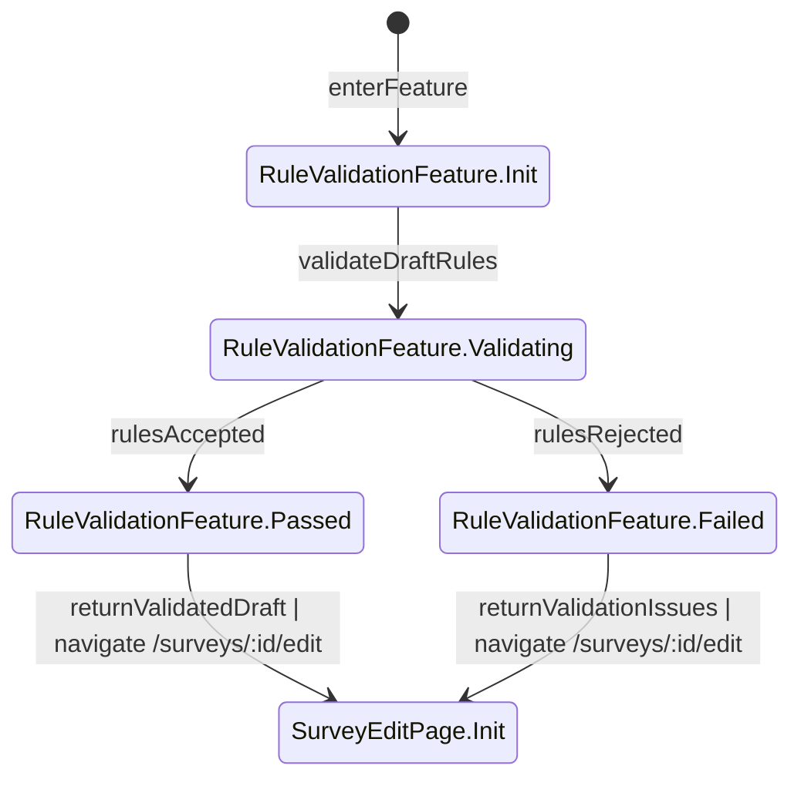
```mermaid
stateDiagram-v2
    %% role: none
    [*] --> RuleValidationFeature.Init : enterFeature
    %% verify: 進入規則驗證功能；來源為 SurveyEditPage 的 Draft 問卷；驗證目標是目前草稿規則，而非已發佈回覆資料

    RuleValidationFeature.Init --> RuleValidationFeature.Validating : validateDraftRules
    %% verify: 開始驗證 RuleGroups 與 LogicRules；需檢查 forward-only、cycle detection、show/hide 合併邏輯所需的結構完整性

    RuleValidationFeature.Validating --> RuleValidationFeature.Passed : rulesAccepted
    %% verify: 驗證通過表示規則在結構上可被保存與用於後續發佈；不代表已建立 publish_hash，也不建立任何 Response

    RuleValidationFeature.Validating --> RuleValidationFeature.Failed : rulesRejected
    %% verify: 驗證失敗時應回報明確問題，例如 target/source 順序違規、循環依賴或資料缺漏；Draft 不得被視為可發佈

    RuleValidationFeature.Passed --> SurveyEditPage.Init : returnValidatedDraft | navigate /surveys/:id/edit
    %% verify: 返回編輯頁後保留目前 Draft 內容；畫面可繼續保存或發佈；狀態不應被誤改成 Published

    RuleValidationFeature.Failed --> SurveyEditPage.Init : returnValidationIssues | navigate /surveys/:id/edit
    %% verify: 返回編輯頁並顯示可修正的驗證問題；owner 可依問題調整規則後再次驗證或保存
```

## ⑭ Feature: Preview Simulation
Source Pages: `SurveyPreviewPage`
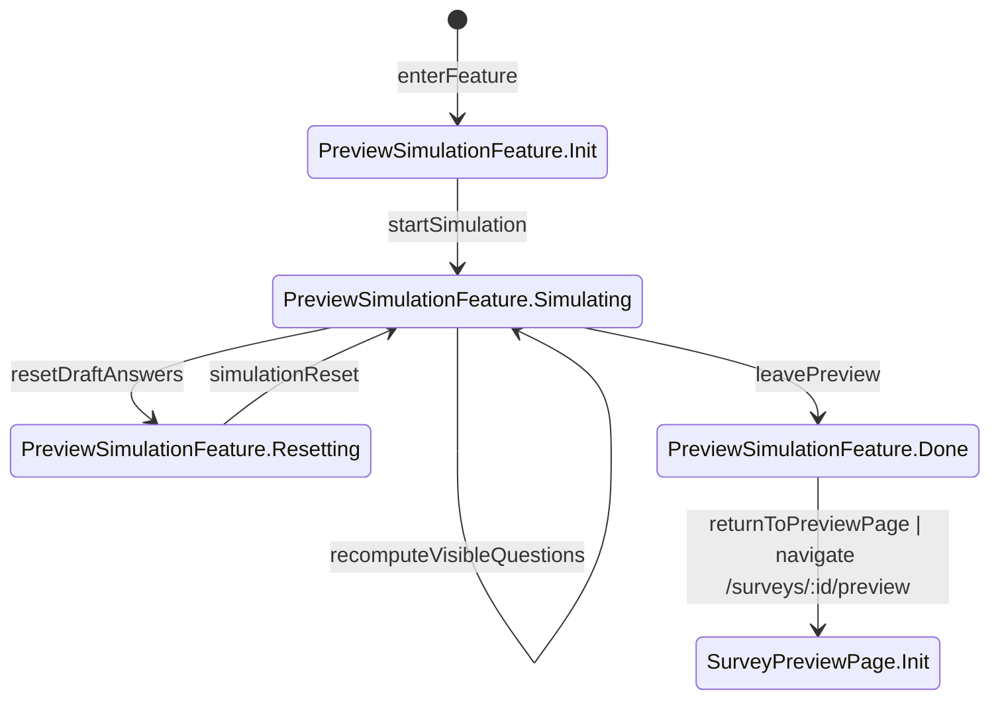
```mermaid
stateDiagram-v2
    %% role: none
    [*] --> PreviewSimulationFeature.Init : enterFeature
    %% verify: 進入預覽模擬功能；來源是預覽頁；模擬只使用前端邏輯引擎與本地 draft answers，不建立 Response 或 response_hash

    PreviewSimulationFeature.Init --> PreviewSimulationFeature.Simulating : startSimulation
    %% verify: 開始預覽後顯示第一個可見題目；可見題目集合依目前 draft answers 與規則運算決定

    PreviewSimulationFeature.Simulating --> PreviewSimulationFeature.Simulating : recomputeVisibleQuestions
    %% verify: 每次模擬答案變更都立即重算 Visible Questions；若題目從 visible 變 hidden，其草稿答案必須同步清除

    PreviewSimulationFeature.Simulating --> PreviewSimulationFeature.Resetting : resetDraftAnswers
    %% verify: 觸發重設時清空目前模擬用草稿答案；不影響已保存 Draft 問卷結構，也不建立任何提交資料

    PreviewSimulationFeature.Resetting --> PreviewSimulationFeature.Simulating : simulationReset
    %% verify: 重設完成後回到模擬狀態；顯示初始可見題目集合；先前模擬輸入不再出現在畫面上

    PreviewSimulationFeature.Simulating --> PreviewSimulationFeature.Done : leavePreview
    %% verify: 離開預覽模擬時結束本地草稿流程；不寫入 Response、Answer 或任何不可變稽核資料

    PreviewSimulationFeature.Done --> SurveyPreviewPage.Init : returnToPreviewPage | navigate /surveys/:id/preview
    %% verify: 返回預覽頁後仍在同一 Survey；頁面可再次開始預覽；不保留已離開的模擬流程副作用
```

## ⑮ Feature: Response Draft Session
Source Pages: `SurveyRespondPage.Guest`, `SurveyRespondPage.User`
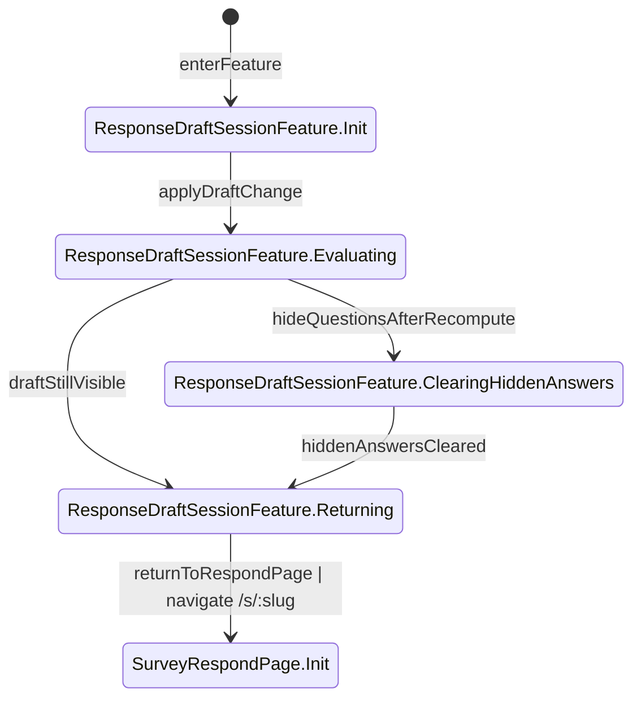
```mermaid
stateDiagram-v2
    %% role: none
    [*] --> ResponseDraftSessionFeature.Init : enterFeature
    %% verify: 進入填答草稿處理功能；來源為 Guest 或 User 的填答狀態；此功能只處理本地 draft answers，不寫入正式回覆

    ResponseDraftSessionFeature.Init --> ResponseDraftSessionFeature.Evaluating : applyDraftChange
    %% verify: 套用最新答案或題目移動後，前端以同一套 Logic Engine 重算可見題目集合；required 只針對可見題目評估

    ResponseDraftSessionFeature.Evaluating --> ResponseDraftSessionFeature.ClearingHiddenAnswers : hideQuestionsAfterRecompute
    %% verify: 當有題目在重算後變 hidden，對應草稿答案必須立即清除或標記為不送出；畫面不再顯示這些題目

    ResponseDraftSessionFeature.Evaluating --> ResponseDraftSessionFeature.Returning : draftStillVisible
    %% verify: 若重算後目前草稿仍有效且題目可見，維持當前填答流程；使用者可繼續上一題/下一題與編輯答案

    ResponseDraftSessionFeature.ClearingHiddenAnswers --> ResponseDraftSessionFeature.Returning : hiddenAnswersCleared
    %% verify: 完成清除後返回填答頁；後續提交 payload 不得包含已隱藏題目的答案；畫面與可見題目集合一致

    ResponseDraftSessionFeature.Returning --> SurveyRespondPage.Init : returnToRespondPage | navigate /s/:slug
    %% verify: 回到同一 /s/:slug 重新呈現填答頁；依最新 draft answers 顯示題目；路由與問卷 slug 不變
```

## ⑯ Feature: Response Submit
Source Pages: `SurveyRespondPage.Guest`, `SurveyRespondPage.User`
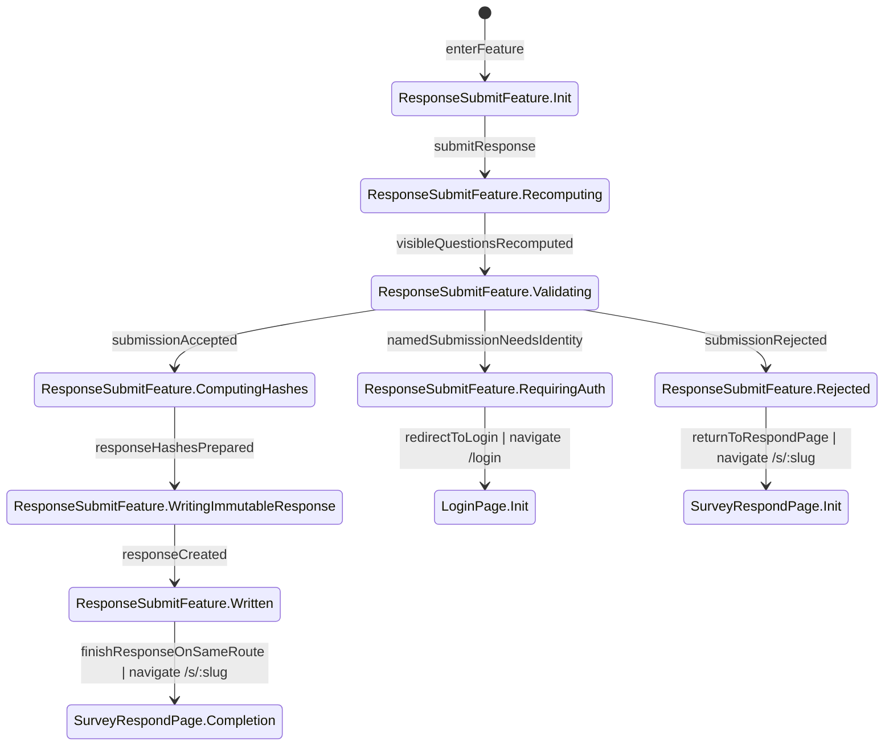
```mermaid
stateDiagram-v2
    %% role: none
    [*] --> ResponseSubmitFeature.Init : enterFeature
    %% verify: 進入正式提交功能；來源為填答頁；提交對象必須是 Published 且可填答的 Survey；既有 Response 不可在此被修改

    ResponseSubmitFeature.Init --> ResponseSubmitFeature.Recomputing : submitResponse
    %% verify: 送出時後端開始依 publish_hash 對應的結構重算 Visible Questions；提交 payload 送出後應防止重複送出

    ResponseSubmitFeature.Recomputing --> ResponseSubmitFeature.Validating : visibleQuestionsRecomputed
    %% verify: 後端已完成可見題目重算；接下來只驗證 visible 題目的 required 與題型 schema；hidden 題目答案不得被接受

    ResponseSubmitFeature.Validating --> ResponseSubmitFeature.RequiringAuth : namedSubmissionNeedsIdentity
    %% verify: 當 Survey.is_anonymous=false 且目前沒有登入身分時，回應需符合 401；不得建立 Response；需保留草稿答案供登入後續填

    ResponseSubmitFeature.Validating --> ResponseSubmitFeature.ComputingHashes : submissionAccepted
    %% verify: 驗證通過後準備建立不可變回覆；所有 visible required 題目已合法，payload 符合題型 schema 與大小限制

    ResponseSubmitFeature.Validating --> ResponseSubmitFeature.Rejected : submissionRejected
    %% verify: 驗證失敗時回應應為可檢查的錯誤結果；指出 required、格式或 hidden 題目答案等問題；不得建立 Response 或 Answer

    ResponseSubmitFeature.ComputingHashes --> ResponseSubmitFeature.WritingImmutableResponse : responseHashesPrepared
    %% verify: 後端已準備 publish_hash 與 response_hash；即將寫入 Response 主檔與對應 Answer；雜湊需可用於後續稽核

    ResponseSubmitFeature.WritingImmutableResponse --> ResponseSubmitFeature.Written : responseCreated
    %% verify: API 回應 200 且成功建立 Response 與 Answer；資料寫入後不可修改；Response 必須保存 publish_hash 與 response_hash

    ResponseSubmitFeature.RequiringAuth --> LoginPage.Init : redirectToLogin | navigate /login
    %% verify: 路由切換到 /login 並保留 return_to=/s/:slug；Guest Header 只顯示登入入口；先前草稿答案需保留供成功登入後回填答頁

    ResponseSubmitFeature.Rejected --> SurveyRespondPage.Init : returnToRespondPage | navigate /s/:slug
    %% verify: 驗證失敗後回到同一填答頁；畫面顯示具體錯誤；草稿答案保留以便修正重新送出

    ResponseSubmitFeature.Written --> SurveyRespondPage.Completion : finishResponseOnSameRoute | navigate /s/:slug
    %% verify: 提交成功後仍停留同一路由 /s/:slug，但 UI 轉為 Completion；不提供修改已提交答案的入口；結果可於後台統計中被看見
```

## ⑰ Feature: Survey Publish And Close
Source Pages: `SurveyEditPage`, `SurveysPage`
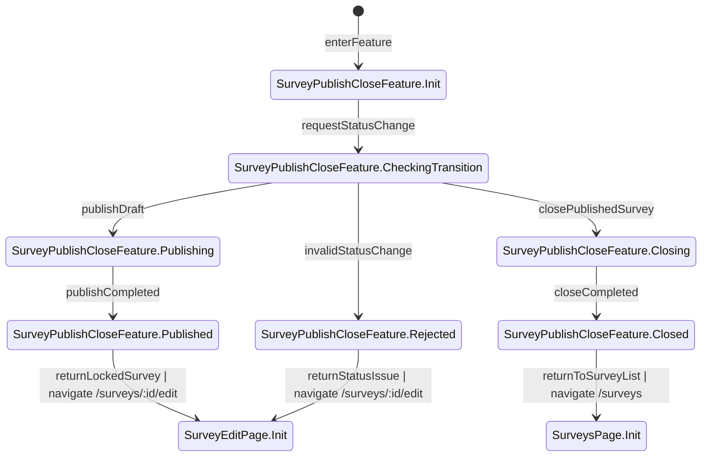
```mermaid
stateDiagram-v2
    %% role: none
    [*] --> SurveyPublishCloseFeature.Init : enterFeature
    %% verify: 進入問卷狀態轉換功能；來源為編輯頁或列表頁；操作者需為 owner；功能只處理 Draft->Published 或 Published->Closed

    SurveyPublishCloseFeature.Init --> SurveyPublishCloseFeature.CheckingTransition : requestStatusChange
    %% verify: 開始檢查目前 Survey.status 與請求目標狀態是否合法；不可接受 Closed 回退或未定義的轉換

    SurveyPublishCloseFeature.CheckingTransition --> SurveyPublishCloseFeature.Publishing : publishDraft
    %% verify: 只有 Draft 可進入發佈流程；後端需再次確認結構驗證通過；成功後必須寫入 publish_hash 並鎖定結構

    SurveyPublishCloseFeature.CheckingTransition --> SurveyPublishCloseFeature.Closing : closePublishedSurvey
    %% verify: 只有 Published 可進入關閉流程；關閉後問卷不得再接受新的填答提交；既有回覆資料必須保留

    SurveyPublishCloseFeature.CheckingTransition --> SurveyPublishCloseFeature.Rejected : invalidStatusChange
    %% verify: 非法狀態轉換會被拒絕；例如 Closed 重新開啟或 Draft 直接關閉；Survey.status 不得改變

    SurveyPublishCloseFeature.Publishing --> SurveyPublishCloseFeature.Published : publishCompleted
    %% verify: API 回應 200 且發佈成功；Survey.status=Published；publish_hash 已寫入且之後所有 Response 必須沿用相同 publish_hash

    SurveyPublishCloseFeature.Closing --> SurveyPublishCloseFeature.Closed : closeCompleted
    %% verify: API 回應 200 且關閉成功；Survey.status=Closed；/s/:slug 後續應視為不可填答並回應不可用/404 規則

    SurveyPublishCloseFeature.Published --> SurveyEditPage.Init : returnLockedSurvey | navigate /surveys/:id/edit
    %% verify: 發佈成功後回到編輯頁；同一 Survey 的結構編輯 UI 應鎖定；僅 title/description 可更新

    SurveyPublishCloseFeature.Closed --> SurveysPage.Init : returnToSurveyList | navigate /surveys
    %% verify: 關閉成功後返回列表；列表中的 Survey 狀態顯示為 Closed；不可提供再開啟或結構編輯入口

    SurveyPublishCloseFeature.Rejected --> SurveyEditPage.Init : returnStatusIssue | navigate /surveys/:id/edit
    %% verify: 非法狀態轉換被拒絕後返回編輯頁；顯示狀態錯誤訊息；Survey.status 與 publish_hash 維持原值不變
```

## ⑱ Feature: Results Analytics
Source Pages: `SurveyResultsPage`
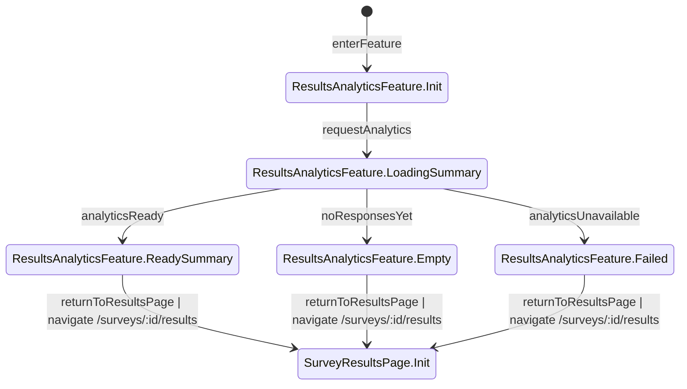
```mermaid
stateDiagram-v2
    %% role: none
    [*] --> ResultsAnalyticsFeature.Init : enterFeature
    %% verify: 進入結果分析功能；來源為結果頁；只處理目前 owner 可見的單一 Survey 統計資料

    ResultsAnalyticsFeature.Init --> ResultsAnalyticsFeature.LoadingSummary : requestAnalytics
    %% verify: 發送分析資料請求；UI 進入載入中；統計計算基礎必須來自該 Survey 的 Response/Answer

    ResultsAnalyticsFeature.LoadingSummary --> ResultsAnalyticsFeature.ReadySummary : analyticsReady
    %% verify: API 回應 200 且統計資料可用；顯示回覆數與各題彙總結果；數值需與原始回覆資料一致

    ResultsAnalyticsFeature.LoadingSummary --> ResultsAnalyticsFeature.Empty : noResponsesYet
    %% verify: API 回應 200 且尚無回覆；顯示 Empty 狀態；不得顯示非零統計或假資料

    ResultsAnalyticsFeature.LoadingSummary --> ResultsAnalyticsFeature.Failed : analyticsUnavailable
    %% verify: 分析資料取得失敗時顯示失敗狀態；錯誤不得改寫既有 Response；使用者可返回結果頁重試

    ResultsAnalyticsFeature.ReadySummary --> SurveyResultsPage.Init : returnToResultsPage | navigate /surveys/:id/results
    %% verify: 返回結果頁後應顯示最新統計；路由維持同一 Survey；不影響回覆不可變性

    ResultsAnalyticsFeature.Empty --> SurveyResultsPage.Init : returnToResultsPage | navigate /surveys/:id/results
    %% verify: 從無資料分析狀態返回結果頁；畫面仍維持 Empty；Survey 與權限上下文不變

    ResultsAnalyticsFeature.Failed --> SurveyResultsPage.Init : returnToResultsPage | navigate /surveys/:id/results
    %% verify: 失敗後返回結果頁；畫面可再次重試載入；不會產生額外或錯誤的統計資料
```

## ⑲ Feature: Export Responses
Source Pages: `SurveyResultsPage`
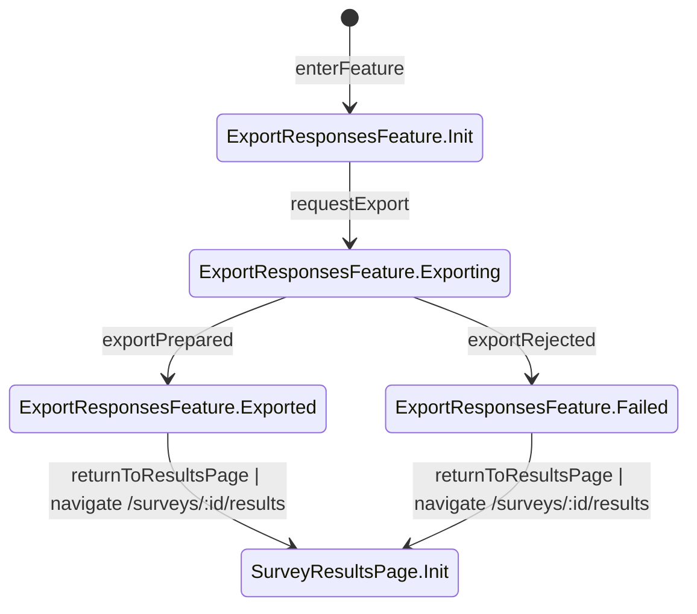
```mermaid
stateDiagram-v2
    %% role: none
    [*] --> ExportResponsesFeature.Init : enterFeature
    %% verify: 進入回覆匯出功能；來源為結果頁；操作者需為該 Survey 的 owner；匯出只涵蓋目前 Survey 的回覆資料

    ExportResponsesFeature.Init --> ExportResponsesFeature.Exporting : requestExport
    %% verify: 發送匯出請求；UI 顯示匯出進行中；匯出內容應來自 Response/Answer 並可追溯對應 publish_hash

    ExportResponsesFeature.Exporting --> ExportResponsesFeature.Exported : exportPrepared
    %% verify: 匯出準備成功；下載內容應包含該 Survey 的回覆資料且與結果頁統計一致；不得混入其他 Survey 回覆

    ExportResponsesFeature.Exporting --> ExportResponsesFeature.Failed : exportRejected
    %% verify: 匯出失敗時顯示錯誤訊息；不影響結果頁已載入的統計與回覆資料；不產生不完整檔案當成成功

    ExportResponsesFeature.Exported --> SurveyResultsPage.Init : returnToResultsPage | navigate /surveys/:id/results
    %% verify: 匯出完成後返回結果頁；頁面仍顯示同一 Survey 的結果；權限與統計上下文維持一致

    ExportResponsesFeature.Failed --> SurveyResultsPage.Init : returnToResultsPage | navigate /surveys/:id/results
    %% verify: 匯出失敗後返回結果頁；使用者可再次嘗試匯出；既有結果資料不應被清空或改寫
```
