全體結構說明
[Entry State]
        ↓
[Page State Machine]
        ↓
[Role-specific Page State]
        ↓
[Feature / Function State Machine]
        ↓
[回到 Page 或跳轉其他 Page，或跳轉到其他 Feature]

以下將照這個層級排序。

## ① Entry State Machine
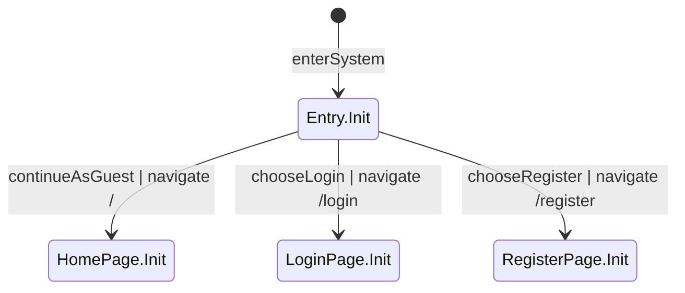

## ② Home Page
```mermaid
%% role: none
stateDiagram-v2
    [*] --> HomePage.Init : enterPage
    %% verify: 載入首頁時請求看板列表；頁面先進入首頁初始化流程，並以 sort_order 作為後續顯示排序依據

    HomePage.Init --> HomePage.Ready : showBoardList
    %% verify: boards API 回 200 且至少一筆資料；看板依 sort_order 排序；停用看板帶有不可互動標示但仍可點入唯讀瀏覽

    HomePage.Init --> HomePage.Empty : showNoBoards
    %% verify: boards API 回 200 且結果為空；顯示空狀態文案；仍保留 Header 的首頁/搜尋/登入/註冊導覽且不額外重複登入 CTA

    HomePage.Init --> HomePage.Failed : loadBoardsFailed
    %% verify: 載入看板失敗時顯示可重試錯誤狀態；不顯示過期或部分成功的列表資料

    HomePage.Ready --> BoardPage.Init : openBoard | navigate /boards/:id
    %% verify: 點擊看板卡導向正確 /boards/:id；存在的 board 回 200，不存在回 404；停用看板進入後為唯讀模式

    HomePage.Ready --> SearchPage.Init : openSearch | navigate /search
    %% verify: 導向 /search 並保留公開搜尋入口；Guest 仍只能搜尋 published 且非 hidden 的內容

    HomePage.Ready --> LoginPage.Init : openLogin | navigate /login
    %% verify: 僅在 Guest 導覽顯示登入入口；若 Header 已有登入按鈕，首頁內容區不重複產生第二個登入 CTA

    HomePage.Ready --> RegisterPage.Init : openRegister | navigate /register
    %% verify: 僅在 Guest 導覽顯示註冊入口；若 Header 已有註冊按鈕，首頁內容區不重複產生第二個註冊 CTA

    HomePage.Ready --> LogoutFeature.Init : chooseLogout | navigate LogoutFeature
    %% verify: 僅已登入使用者可看到登出入口；觸發後會清除 session，Guest 不應看到此動作

    HomePage.Ready --> AdminPage.Init : openAdmin | navigate /admin
    %% verify: 只有 Admin 導覽可見後台入口；非 Admin 不顯示此入口，直接進入 /admin 會在後續頁面 guard 收斂為 401/403

    HomePage.Empty --> SearchPage.Init : openSearch | navigate /search
    %% verify: 無看板時仍可進入搜尋頁；搜尋頁僅顯示公開內容，不會因首頁空資料而失效

    HomePage.Empty --> LoginPage.Init : openLogin | navigate /login
    %% verify: 空列表狀態下登入入口仍可用；登入入口不重複出現在 Header 與頁面內容兩處

    HomePage.Empty --> RegisterPage.Init : openRegister | navigate /register
    %% verify: 空列表狀態下註冊入口仍可用；註冊入口不重複出現在 Header 與頁面內容兩處

    HomePage.Empty --> LogoutFeature.Init : chooseLogout | navigate LogoutFeature
    %% verify: 已登入且沒有看板時仍可登出；登出成功後 Header 立即回到 Guest 導覽

    HomePage.Failed --> HomePage.Init : retryHome | navigate /
    %% verify: 點擊重試會重新呼叫 boards API；成功後進入 Ready/Empty，失敗時維持 Failed 而不產生重複列表項目
```

## ③ Search Page
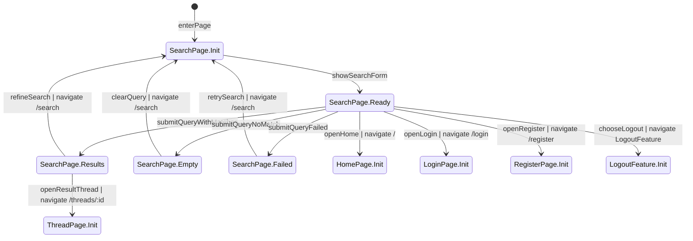

## ④ Board Page Base
```mermaid
%% role: none
%% base: BoardPage
stateDiagram-v2
    [*] --> BoardPage.Init : enterPage
    %% verify: 進入 /boards/:id 會請求看板明細與主題列表；列表分頁為每頁 20 筆且 pinned 需優先排序

    BoardPage.Init --> BoardPage.Ready : showActiveBoard
    %% verify: board API 與 thread list API 回 200 且 board.is_active=true；主題列表僅顯示目前角色可見內容，pinned 優先於其他主題

    BoardPage.Init --> BoardPage.Empty : showActiveBoardEmpty
    %% verify: board 存在且啟用但目前無主題；顯示空狀態，若角色為 User 以上則可見新增主題 CTA

    BoardPage.Init --> BoardPage.ReadOnly : showInactiveBoard
    %% verify: board.is_active=false 時仍可瀏覽舊內容；Like/Favorite/Report/Reply/New Thread 入口必須禁用並顯示停用原因

    BoardPage.Init --> BoardPage.NotFound : boardMissing
    %% verify: 查無 board 時回 404；顯示 Not Found 且不顯示不存在看板的主題列表

    BoardPage.Init --> BoardPage.Forbidden : boardForbidden
    %% verify: 若存取被拒顯示 403 提示；不應將 Forbidden 誤導為空列表或一般錯誤

    BoardPage.Init --> BoardPage.Failed : loadBoardFailed
    %% verify: 載入失敗時顯示可重試錯誤狀態；不保留過期資料或部分治理資料

    BoardPage.Ready --> ThreadPage.Init : openThread | navigate /threads/:id
    %% verify: 點擊主題項目導向對應 /threads/:id；若目標 thread 已 hidden 且無權限，後續主題頁應收斂為 403/404

    BoardPage.Ready --> NewThreadPage.Init : openNewThread | navigate /threads/new
    %% verify: User/Moderator/Admin 才可進入發文頁；Guest 會在目標頁 guard 導向 /login，且 board_id 需正確帶入

    BoardPage.Ready --> SearchPage.Init : openSearch | navigate /search
    %% verify: 可從看板頁返回搜尋；當前 board 上下文不會污染公開搜尋結果

    BoardPage.Ready --> BoardPage.Moderator.Init : openGovernance | navigate BoardPage.Moderator
    %% verify: 僅 Moderator(該 board scope) 與 Admin 可進入治理差異圖；未指派 Moderator 不顯示治理面板入口

    BoardPage.Ready --> LogoutFeature.Init : chooseLogout | navigate LogoutFeature
    %% verify: 已登入使用者可從看板頁登出；登出後 Header 回到 Guest 導覽且治理入口消失

    BoardPage.Empty --> NewThreadPage.Init : openNewThread | navigate /threads/new
    %% verify: 空看板下仍可由 User 以上發第一篇主題；停用看板則不應出現可送出的新增主題流程

    BoardPage.Empty --> SearchPage.Init : openSearch | navigate /search
    %% verify: 空看板可改走搜尋頁；搜尋結果仍只含公開可見內容

    BoardPage.Empty --> BoardPage.Moderator.Init : openGovernance | navigate BoardPage.Moderator
    %% verify: 空看板但有治理需求時，Moderator/Admin 仍可進入治理面板查看檢舉列表或空狀態

    BoardPage.ReadOnly --> ThreadPage.Init : openThread | navigate /threads/:id
    %% verify: 停用看板中的既有主題仍可唯讀開啟；後續主題頁不得允許新增回覆或互動

    BoardPage.ReadOnly --> BoardPage.Moderator.Init : openGovernance | navigate BoardPage.Moderator
    %% verify: 停用看板下 Moderator/Admin 仍可治理既有內容；治理按鈕保留且需標示看板停用狀態

    BoardPage.ReadOnly --> HomePage.Init : backHome | navigate /
    %% verify: 返回首頁後仍顯示停用看板標記；不會因返回而把停用看板誤顯示成可互動

    BoardPage.NotFound --> HomePage.Init : backHome | navigate /
    %% verify: 從 404 看板返回首頁後可正常瀏覽其他看板；不存在的 board_id 不會殘留在導覽狀態

    BoardPage.Forbidden --> HomePage.Init : backHome | navigate /
    %% verify: 從 403 狀態返回首頁後不會短暫顯示無權限看板內容；權限提示與首頁列表分離

    BoardPage.Failed --> BoardPage.Init : retryBoard | navigate /boards/:id
    %% verify: 重試會重新請求 board 與 thread list；成功後回到 Ready/Empty/ReadOnly，失敗時留在 Failed
```

## ⑤ Board Page Moderator Delta
此圖為 BoardPage 的治理差異圖，只描述 Moderator / Admin 在同一路由上的額外狀態。
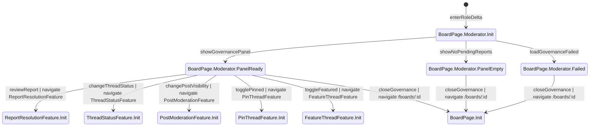

## ⑥ Thread Page Base
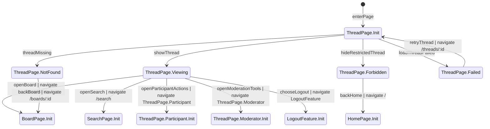

## ⑦ Thread Page Participant Delta
此圖為 ThreadPage 的參與差異圖，描述 User / Moderator / Admin 在同一主題頁上的互動狀態。
```mermaid
%% role: User|Moderator|Admin
%% extends: ThreadPage
stateDiagram-v2
    [*] --> ThreadPage.Participant.Init : enterRoleDelta
    %% verify: 只有已登入角色會進入互動差異圖；Guest 不應看到可送出的回覆、按讚、收藏、檢舉表單

    ThreadPage.Participant.Init --> ThreadPage.Participant.Ready : showInteractiveThread
    %% verify: board.is_active=true 且 thread 非 locked；Reply、Like、Favorite、Report 入口依規格顯示且僅出現一次

    ThreadPage.Participant.Init --> ThreadPage.Participant.Locked : showLockedThread
    %% verify: thread.status=locked 時顯示鎖定提示；回覆入口禁用或隱藏，但 Like/Favorite/Report 仍可依規格使用

    ThreadPage.Participant.Init --> ThreadPage.Participant.InactiveBoard : showInactiveBoardThread
    %% verify: board.is_active=false 時主題內容可唯讀顯示；Like/Favorite/Report/Reply 全部禁用並提供停用原因

    ThreadPage.Participant.Ready --> ReplyFeature.Init : submitReply | navigate ReplyFeature
    %% verify: 只有已登入且 board 啟用且 thread 非 locked 才可進入回覆流程；送出前需帶正確 thread_id

    ThreadPage.Participant.Ready --> LikeFeature.Init : toggleLike | navigate LikeFeature
    %% verify: 僅已登入且 board 啟用時可切換 Like；target_type 必須為 thread 或 post 且與畫面目標一致

    ThreadPage.Participant.Ready --> FavoriteFeature.Init : toggleFavorite | navigate FavoriteFeature
    %% verify: 僅已登入且 board 啟用時可切換 Favorite；Favorite 僅允許 thread 目標，不可對 post 進行收藏

    ThreadPage.Participant.Ready --> ReportSubmissionFeature.Init : submitReport | navigate ReportSubmissionFeature
    %% verify: 只有可見內容才有檢舉入口；同一使用者對同一 target 不可重複建立 report

    ThreadPage.Participant.Ready --> ThreadPage.Init : closeParticipantActions | navigate /threads/:id
    %% verify: 關閉互動區後回到主題基本檢視；已載入的回覆與互動計數保持一致

    ThreadPage.Participant.Locked --> LikeFeature.Init : toggleLike | navigate LikeFeature
    %% verify: 鎖定主題仍可切換 Like；Like API 成功不應改變 thread.status 或解鎖狀態

    ThreadPage.Participant.Locked --> FavoriteFeature.Init : toggleFavorite | navigate FavoriteFeature
    %% verify: 鎖定主題仍可切換 Favorite；收藏狀態更新後仍維持 locked 標籤與回覆禁用狀態

    ThreadPage.Participant.Locked --> ReportSubmissionFeature.Init : submitReport | navigate ReportSubmissionFeature
    %% verify: 鎖定主題仍可檢舉可見內容；report 建立後狀態為 pending，不會解除主題鎖定

    ThreadPage.Participant.Locked --> ThreadPage.Init : closeParticipantActions | navigate /threads/:id
    %% verify: 關閉鎖定狀態互動區後回到主題頁；鎖定提示仍保留且回覆區維持禁用

    ThreadPage.Participant.InactiveBoard --> ThreadPage.Init : closeParticipantActions | navigate /threads/:id
    %% verify: 關閉停用看板提示後回到主題頁唯讀檢視；互動區仍全部禁用且不產生任何操作 API
```

## ⑧ Thread Page Moderator Delta
此圖為 ThreadPage 的治理差異圖，只描述 Moderator / Admin 在同一路由上的治理狀態。
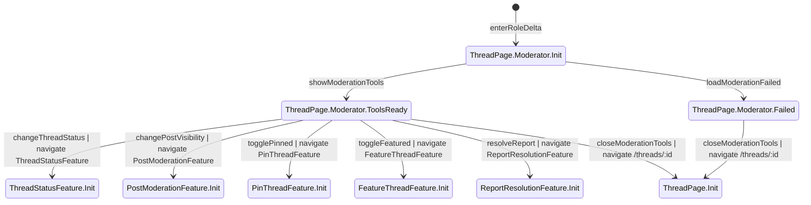

## ⑨ New Thread Page
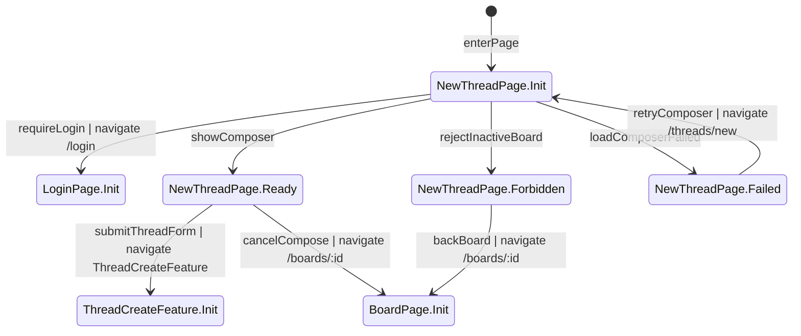

## ⑩ Login Page
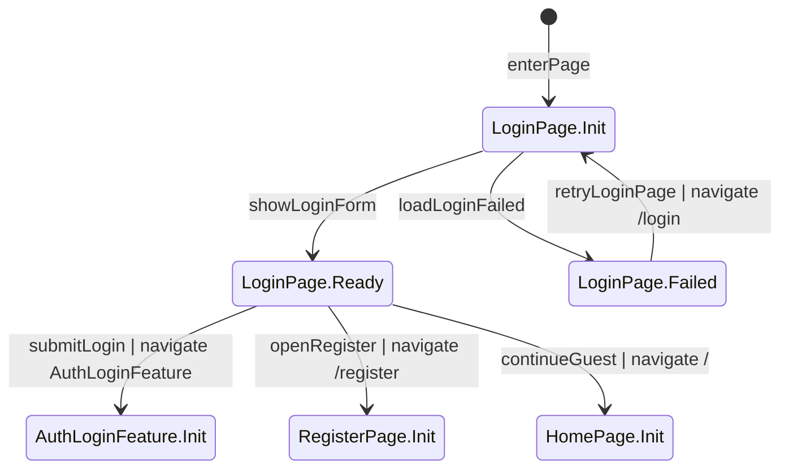

## ⑪ Register Page
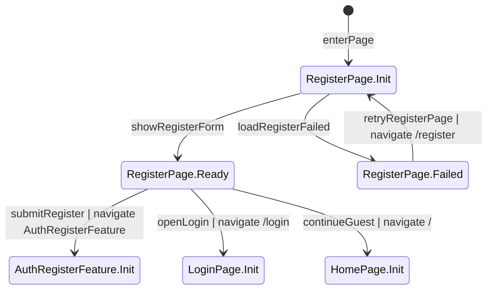

## ⑫ Admin Page
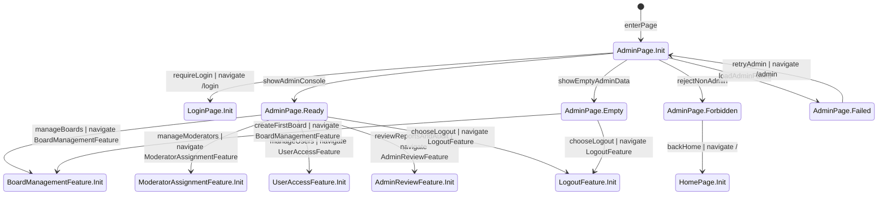

## ⑬ Auth Login Feature
Source Pages: LoginPage，以及所有受保護路由的 returnTo 入口。
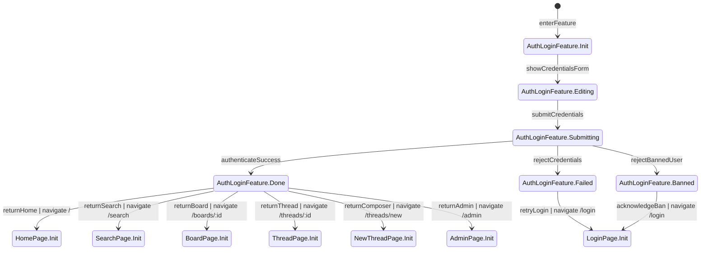

## ⑭ Auth Register Feature
Source Pages: RegisterPage，以及所有允許 Guest 先進入後再完成註冊的公開頁。
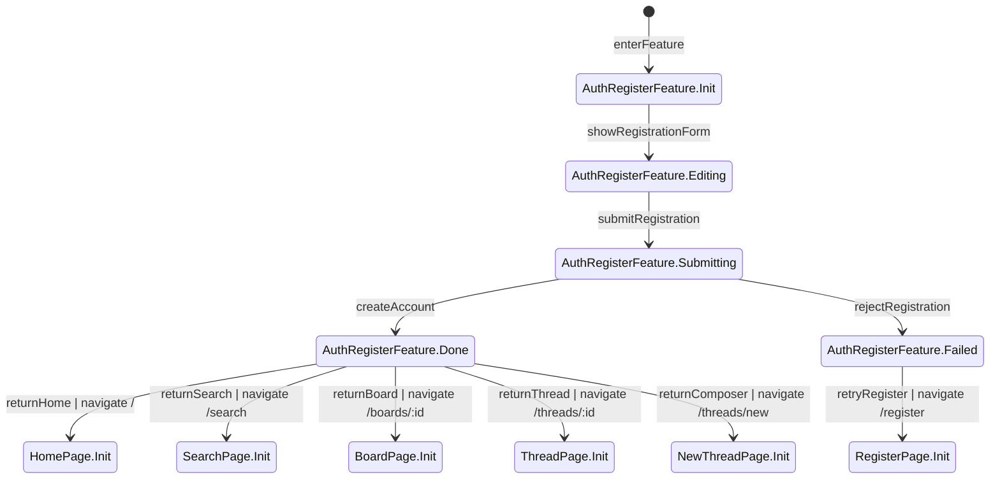

## ⑮ Logout Feature
Source Pages: HomePage, SearchPage, BoardPage, ThreadPage, AdminPage。
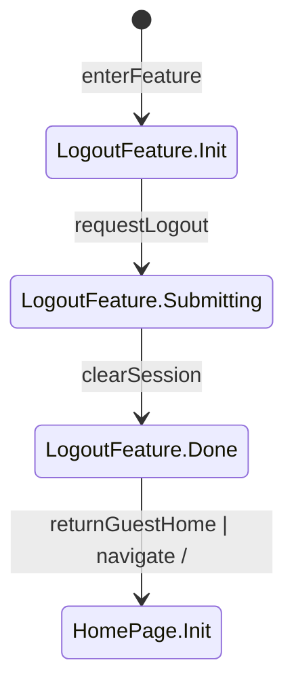

## ⑯ Thread Create Feature
Source Pages: NewThreadPage。
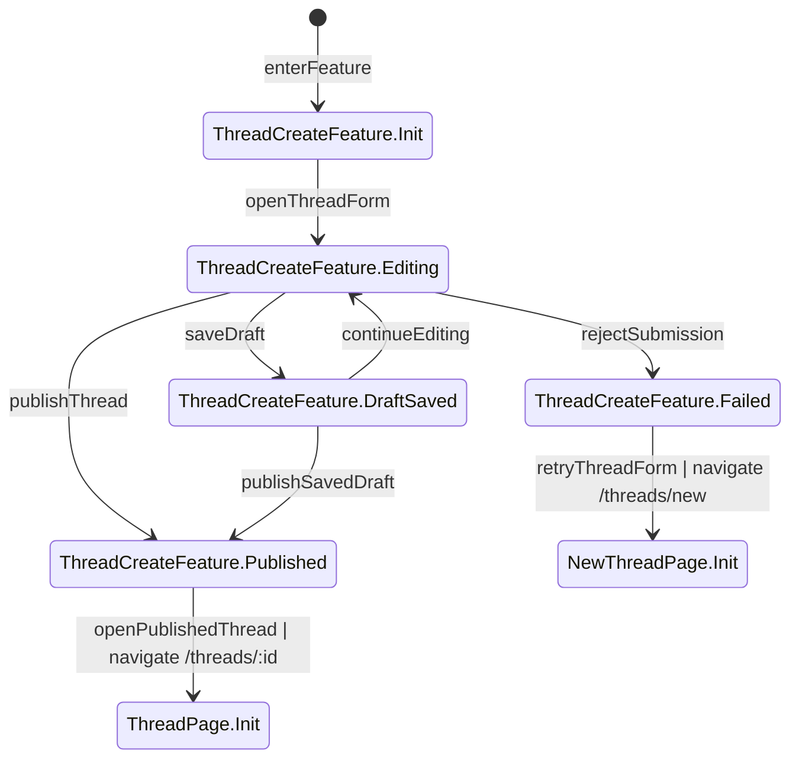

## ⑰ Reply Feature
Source Pages: ThreadPage.Participant。
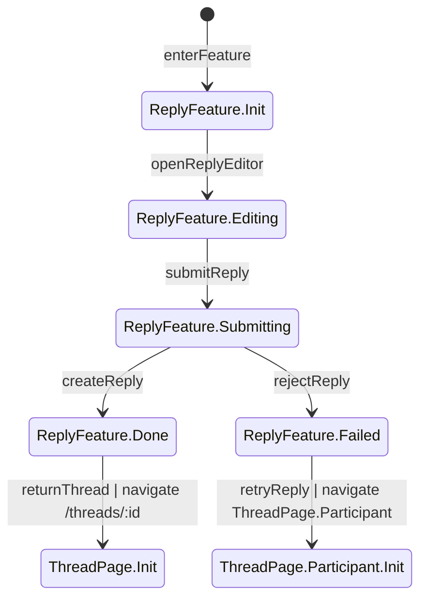

## ⑱ Like Feature
Source Pages: ThreadPage.Participant。
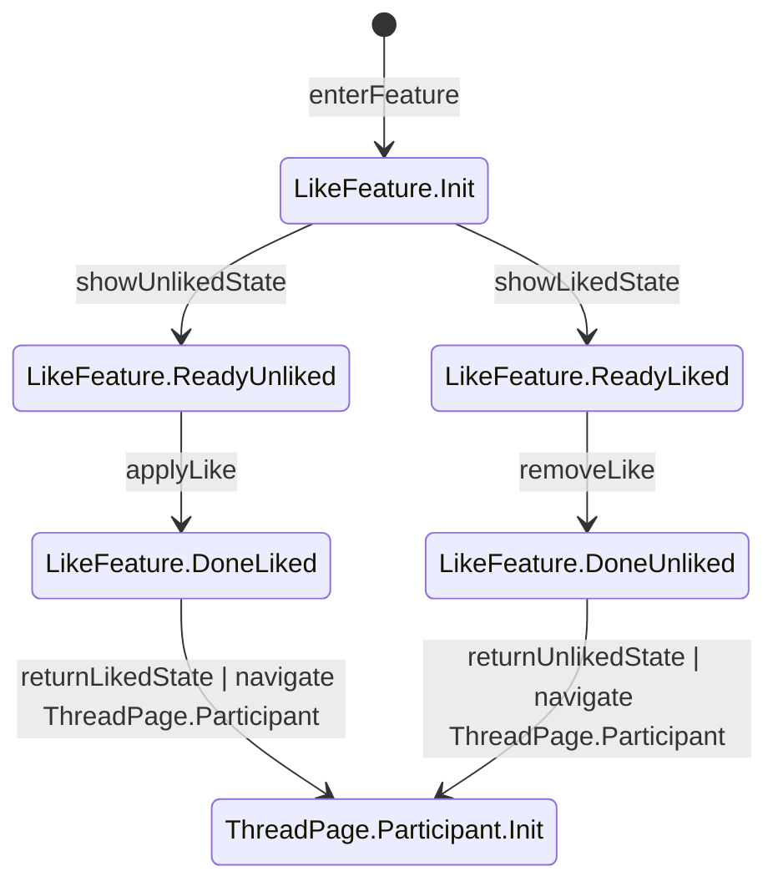

## ⑲ Favorite Feature
Source Pages: ThreadPage.Participant。
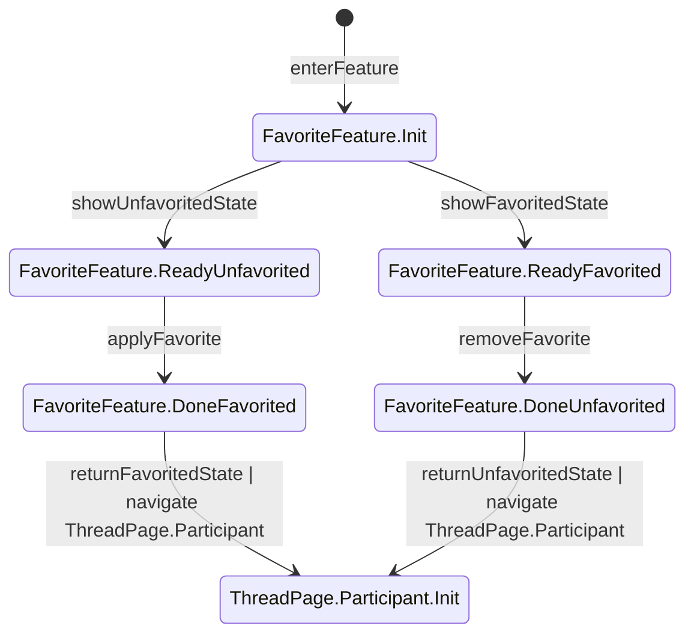

## ⑳ Report Submission Feature
Source Pages: ThreadPage.Participant。
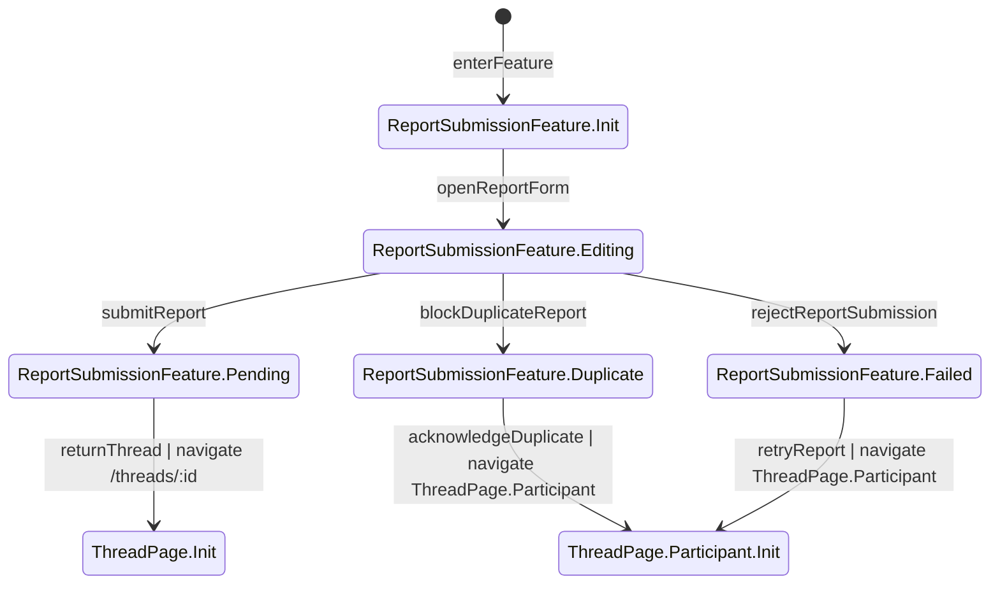

## ㉑ Thread Status Feature
Source Pages: BoardPage.Moderator, ThreadPage.Moderator。
```mermaid
%% role: Moderator|Admin
stateDiagram-v2
    [*] --> ThreadStatusFeature.Init : enterFeature
    %% verify: 進入主題治理功能時帶入當前 thread.status 與所屬 board scope；只有 Moderator/Admin 可操作

    ThreadStatusFeature.Init --> ThreadStatusFeature.Published : inspectPublishedThread
    %% verify: 目標 thread.status=published；Guest/User 可見該主題，且目前可被治理為 hidden 或 locked

    ThreadStatusFeature.Init --> ThreadStatusFeature.Hidden : inspectHiddenThread
    %% verify: 目標 thread.status=hidden；只有對應 board Moderator 與 Admin 可見，搜尋結果不得帶出此主題

    ThreadStatusFeature.Init --> ThreadStatusFeature.Locked : inspectLockedThread
    %% verify: 目標 thread.status=locked；內容仍可見但新增回覆與作者編輯主題操作皆應被阻擋

    ThreadStatusFeature.Published --> ThreadStatusFeature.Hidden : hideThread
    %% verify: hide API 回 200 並將 thread.status 更新為 hidden；Guest/User 立即不可見，搜尋結果同步排除，Audit Log 記錄 thread.hide

    ThreadStatusFeature.Hidden --> ThreadStatusFeature.Published : restoreThread
    %% verify: restore API 回 200 並將 thread.status 更新為 published；公開列表與搜尋可再次看到此主題，Audit Log 記錄 thread.restore

    ThreadStatusFeature.Published --> ThreadStatusFeature.Locked : lockThread
    %% verify: lock API 回 200 並將 thread.status 更新為 locked；reply API 對一般使用者改回 403，Audit Log 記錄 thread.lock

    ThreadStatusFeature.Locked --> ThreadStatusFeature.Published : unlockThread
    %% verify: unlock API 回 200 並將 thread.status 更新為 published；回覆入口恢復可用，Audit Log 記錄 thread.unlock

    ThreadStatusFeature.Published --> BoardPage.Moderator.Init : backBoardGovernance | navigate BoardPage.Moderator
    %% verify: 回到看板治理面板後，該主題的最新狀態標籤已同步更新在治理列表與看板列表

    ThreadStatusFeature.Published --> ThreadPage.Moderator.Init : backThreadGovernance | navigate ThreadPage.Moderator
    %% verify: 回到主題治理工具後，主題頁狀態標籤與可用治理按鈕已同步反映最新 published 狀態

    ThreadStatusFeature.Hidden --> BoardPage.Moderator.Init : backBoardGovernance | navigate BoardPage.Moderator
    %% verify: 回到看板治理面板後 hidden 主題僅留在治理視角可見；一般列表視角不再向 Guest/User 顯示

    ThreadStatusFeature.Hidden --> ThreadPage.Moderator.Init : backThreadGovernance | navigate ThreadPage.Moderator
    %% verify: 回到主題治理工具後 hidden 標籤與恢復動作可見；一般互動入口對 Guest/User 不可見

    ThreadStatusFeature.Locked --> BoardPage.Moderator.Init : backBoardGovernance | navigate BoardPage.Moderator
    %% verify: 回到看板治理面板後 locked 標籤已同步；看板內仍可瀏覽但回覆受限

    ThreadStatusFeature.Locked --> ThreadPage.Moderator.Init : backThreadGovernance | navigate ThreadPage.Moderator
    %% verify: 回到主題治理工具後 locked 狀態已生效；主題頁回覆區維持禁用直到解鎖
```

## ㉒ Post Moderation Feature
Source Pages: BoardPage.Moderator, ThreadPage.Moderator。
```mermaid
%% role: Moderator|Admin
stateDiagram-v2
    [*] --> PostModerationFeature.Init : enterFeature
    %% verify: 進入回覆治理功能時帶入正確 post_id、thread_id 與 board scope；只有對應 Moderator/Admin 可操作

    PostModerationFeature.Init --> PostModerationFeature.Visible : inspectVisiblePost
    %% verify: 目標 post.status=visible；Guest/User 目前可在主題頁看到該回覆

    PostModerationFeature.Init --> PostModerationFeature.Hidden : inspectHiddenPost
    %% verify: 目標 post.status=hidden；Guest/User 不可見，只有 Moderator/Admin 可在治理視角查看

    PostModerationFeature.Visible --> PostModerationFeature.Hidden : hidePost
    %% verify: hide post API 回 200 並將 post.status 更新為 hidden；Guest/User 立即看不到該回覆，Audit Log 記錄 post.hide

    PostModerationFeature.Hidden --> PostModerationFeature.Visible : restorePost
    %% verify: restore post API 回 200 並將 post.status 更新為 visible；主題頁回覆列表重新可見，Audit Log 記錄 post.restore

    PostModerationFeature.Visible --> BoardPage.Moderator.Init : backBoardGovernance | navigate BoardPage.Moderator
    %% verify: 回到看板治理面板後，該回覆的可見性狀態已同步於治理列表

    PostModerationFeature.Visible --> ThreadPage.Moderator.Init : backThreadGovernance | navigate ThreadPage.Moderator
    %% verify: 回到主題治理工具後，該回覆仍處於 visible 並可再執行 hide 操作

    PostModerationFeature.Hidden --> BoardPage.Moderator.Init : backBoardGovernance | navigate BoardPage.Moderator
    %% verify: 回到看板治理面板後 hidden 回覆只在治理視角可見；一般使用者視角不可見

    PostModerationFeature.Hidden --> ThreadPage.Moderator.Init : backThreadGovernance | navigate ThreadPage.Moderator
    %% verify: 回到主題治理工具後 hidden 回覆保留 restore 入口；一般回覆列表不顯示該項目
```

## ㉓ Pin Thread Feature
Source Pages: BoardPage.Moderator, ThreadPage.Moderator。
```mermaid
%% role: Moderator|Admin
stateDiagram-v2
    [*] --> PinThreadFeature.Init : enterFeature
    %% verify: 進入置頂功能時帶入正確 thread_id 與 board_id；只有對應 Moderator/Admin 可操作

    PinThreadFeature.Init --> PinThreadFeature.Unpinned : inspectUnpinnedThread
    %% verify: 目前 thread.is_pinned=false；看板列表排序未置頂

    PinThreadFeature.Init --> PinThreadFeature.Pinned : inspectPinnedThread
    %% verify: 目前 thread.is_pinned=true；看板列表該主題優先顯示於一般主題之前

    PinThreadFeature.Unpinned --> PinThreadFeature.Pinned : pinThread
    %% verify: pin API 回 200 並將 is_pinned 更新為 true；僅影響排序，不改變 thread.status，Audit Log 記錄 thread.pin

    PinThreadFeature.Pinned --> PinThreadFeature.Unpinned : unpinThread
    %% verify: unpin API 回 200 並將 is_pinned 更新為 false；主題排序恢復一般規則，Audit Log 記錄 thread.unpin

    PinThreadFeature.Pinned --> BoardPage.Moderator.Init : backBoardGovernance | navigate BoardPage.Moderator
    %% verify: 回到看板治理面板後 pinned 標記與排序結果已同步顯示

    PinThreadFeature.Pinned --> ThreadPage.Moderator.Init : backThreadGovernance | navigate ThreadPage.Moderator
    %% verify: 回到主題治理工具後 pinned 標記已同步於主題頁，且不影響其他治理操作

    PinThreadFeature.Unpinned --> BoardPage.Moderator.Init : backBoardGovernance | navigate BoardPage.Moderator
    %% verify: 回到看板治理面板後主題已依一般排序顯示；置頂標記消失

    PinThreadFeature.Unpinned --> ThreadPage.Moderator.Init : backThreadGovernance | navigate ThreadPage.Moderator
    %% verify: 回到主題治理工具後 unpinned 狀態已同步；頁面不保留舊的置頂徽章
```

## ㉔ Feature Thread Feature
Source Pages: BoardPage.Moderator, ThreadPage.Moderator。
```mermaid
%% role: Moderator|Admin
stateDiagram-v2
    [*] --> FeatureThreadFeature.Init : enterFeature
    %% verify: 進入精華功能時帶入正確 thread_id 與 board scope；只有對應 Moderator/Admin 可操作

    FeatureThreadFeature.Init --> FeatureThreadFeature.Unfeatured : inspectUnfeaturedThread
    %% verify: 目前 thread.is_featured=false；看板與主題頁均不顯示精華標記

    FeatureThreadFeature.Init --> FeatureThreadFeature.Featured : inspectFeaturedThread
    %% verify: 目前 thread.is_featured=true；看板與主題頁均顯示精華標記

    FeatureThreadFeature.Unfeatured --> FeatureThreadFeature.Featured : featureThread
    %% verify: feature API 回 200 並將 is_featured 更新為 true；不改變 thread.status，Audit Log 記錄 thread.feature

    FeatureThreadFeature.Featured --> FeatureThreadFeature.Unfeatured : unfeatureThread
    %% verify: unfeature API 回 200 並將 is_featured 更新為 false；精華標記同步移除，Audit Log 記錄 thread.unfeature

    FeatureThreadFeature.Featured --> BoardPage.Moderator.Init : backBoardGovernance | navigate BoardPage.Moderator
    %% verify: 回到看板治理面板後精華標記已同步顯示於該主題

    FeatureThreadFeature.Featured --> ThreadPage.Moderator.Init : backThreadGovernance | navigate ThreadPage.Moderator
    %% verify: 回到主題治理工具後精華標記已同步顯示於主題頁且不影響回覆或狀態機

    FeatureThreadFeature.Unfeatured --> BoardPage.Moderator.Init : backBoardGovernance | navigate BoardPage.Moderator
    %% verify: 回到看板治理面板後精華標記消失；其他排序與狀態維持原規則

    FeatureThreadFeature.Unfeatured --> ThreadPage.Moderator.Init : backThreadGovernance | navigate ThreadPage.Moderator
    %% verify: 回到主題治理工具後主題頁不再顯示精華標記；資料與後端一致
```

## ㉕ Report Resolution Feature
Source Pages: BoardPage.Moderator, ThreadPage.Moderator, AdminReviewFeature。
```mermaid
%% role: Moderator|Admin
stateDiagram-v2
    [*] --> ReportResolutionFeature.Init : enterFeature
    %% verify: 進入檢舉處理功能時帶入正確 report_id 與 target 資訊；只有 Moderator/Admin 可操作，且 Moderator 受 board scope 限制

    ReportResolutionFeature.Init --> ReportResolutionFeature.Pending : openReport
    %% verify: 載入 pending 報告內容成功；顯示 reason、target_type、target_id、reporter 與目前狀態 pending

    ReportResolutionFeature.Init --> ReportResolutionFeature.Failed : loadReportFailed
    %% verify: 報告載入失敗時顯示錯誤；不顯示不完整的 target 資料或誤導性的處理按鈕

    ReportResolutionFeature.Pending --> ReportResolutionFeature.Accepted : acceptReport
    %% verify: accept API 回 200 並將 report.status=accepted，寫入 resolved_by/resolved_at；若 target 是 thread 或 post，對應內容依規格被 hidden，Audit Log 記錄 report.accept

    ReportResolutionFeature.Pending --> ReportResolutionFeature.Rejected : rejectReport
    %% verify: reject API 回 200 並將 report.status=rejected，寫入 resolved_by/resolved_at；內容狀態保持不變，Audit Log 記錄 report.reject

    ReportResolutionFeature.Accepted --> BoardPage.Moderator.Init : backBoardGovernance | navigate BoardPage.Moderator
    %% verify: 回到看板治理面板後該報告不再列為 pending；對應內容隱藏狀態已同步顯示

    ReportResolutionFeature.Accepted --> ThreadPage.Moderator.Init : backThreadGovernance | navigate ThreadPage.Moderator
    %% verify: 回到主題治理工具後報告狀態為 accepted，且 target 內容已依規格改為 hidden

    ReportResolutionFeature.Accepted --> AdminReviewFeature.Init : backAdminReview | navigate AdminReviewFeature
    %% verify: 回到後台檢舉檢視時該報告已顯示為 accepted，並可在 Audit Log 查到處理紀錄

    ReportResolutionFeature.Rejected --> BoardPage.Moderator.Init : backBoardGovernance | navigate BoardPage.Moderator
    %% verify: 回到看板治理面板後該報告不再列為 pending；target 內容保持原可見狀態

    ReportResolutionFeature.Rejected --> ThreadPage.Moderator.Init : backThreadGovernance | navigate ThreadPage.Moderator
    %% verify: 回到主題治理工具後報告狀態為 rejected，且 target 內容未被額外隱藏或修改

    ReportResolutionFeature.Rejected --> AdminReviewFeature.Init : backAdminReview | navigate AdminReviewFeature
    %% verify: 回到後台檢舉檢視時該報告已顯示為 rejected，並可在 Audit Log 查到處理紀錄

    ReportResolutionFeature.Failed --> BoardPage.Moderator.Init : closeReportResolution | navigate BoardPage.Moderator
    %% verify: 報告載入失敗時可返回治理面板；未成功載入前不得對 report 狀態或 target 內容做任何修改
```

## ㉖ Board Management Feature
Source Pages: AdminPage。
```mermaid
%% role: Admin
stateDiagram-v2
    [*] --> BoardManagementFeature.Init : enterFeature
    %% verify: 進入看板管理功能時只允許 Admin；載入現有 boards 與 sort_order 供管理使用

    BoardManagementFeature.Init --> BoardManagementFeature.Listing : openBoardManager
    %% verify: boards 管理列表載入成功；可查看 name、description、is_active、sort_order 並準備編輯

    BoardManagementFeature.Init --> BoardManagementFeature.Failed : loadBoardManagerFailed
    %% verify: 載入看板管理失敗時顯示錯誤與返回；不顯示不完整的管理列表

    BoardManagementFeature.Listing --> BoardManagementFeature.Editing : editBoard
    %% verify: 進入建立或編輯看板流程時可修改 name、description、is_active、sort_order；只有 Admin 可操作

    BoardManagementFeature.Editing --> BoardManagementFeature.Listing : saveBoard
    %% verify: board create/update API 回 200；變更後的欄位正確保存並立即反映於列表，Audit Log 記錄 board.create 或 board.update

    BoardManagementFeature.Listing --> BoardManagementFeature.Reordering : reorderBoards
    %% verify: 可調整多個看板的 sort_order；排序編輯模式啟用且不改變 board 其他欄位

    BoardManagementFeature.Reordering --> BoardManagementFeature.Listing : applyBoardOrder
    %% verify: 排序 API 回 200；首頁與管理列表都依新的 sort_order 顯示，Audit Log 記錄 board.reorder

    BoardManagementFeature.Listing --> BoardManagementFeature.Deactivating : deactivateBoard
    %% verify: 可對看板執行停用或重新啟用流程；只有 Admin 可操作且需帶正確 board_id

    BoardManagementFeature.Deactivating --> BoardManagementFeature.Listing : confirmBoardStatus
    %% verify: is_active 更新成功；停用後新增 Thread/Post 與互動被禁止，但既有內容可唯讀瀏覽，Audit Log 記錄 board.deactivate 或 board.activate

    BoardManagementFeature.Listing --> AdminPage.Init : closeBoardManager | navigate /admin
    %% verify: 關閉看板管理後回後台主頁；最新的 boards 狀態與排序已同步顯示

    BoardManagementFeature.Failed --> AdminPage.Init : closeBoardManager | navigate /admin
    %% verify: 載入失敗後返回後台主頁；不保留半成功的編輯狀態
```

## ㉗ Moderator Assignment Feature
Source Pages: AdminPage。
```mermaid
%% role: Admin
stateDiagram-v2
    [*] --> ModeratorAssignmentFeature.Init : enterFeature
    %% verify: 進入 Moderator 指派功能時只允許 Admin；需載入 board 與候選 user 資料

    ModeratorAssignmentFeature.Init --> ModeratorAssignmentFeature.Unassigned : reviewUnassignedUser
    %% verify: 顯示尚未被指派到指定看板的使用者；該使用者在該看板不應看到治理面板，治理 API 回 403

    ModeratorAssignmentFeature.Init --> ModeratorAssignmentFeature.Assigned : reviewAssignedModerator
    %% verify: 顯示已被指派到指定看板的 Moderator；該使用者在該看板可看到治理面板與治理工具

    ModeratorAssignmentFeature.Init --> ModeratorAssignmentFeature.Failed : loadAssignmentsFailed
    %% verify: 載入指派資料失敗時顯示錯誤；不顯示不完整的 board-user 關聯資料

    ModeratorAssignmentFeature.Unassigned --> ModeratorAssignmentFeature.Assigned : assignModerator
    %% verify: assign API 回 200 並建立 ModeratorAssignment；board_id+user_id 唯一約束生效，Audit Log 記錄 moderator.assign

    ModeratorAssignmentFeature.Assigned --> ModeratorAssignmentFeature.Unassigned : removeModerator
    %% verify: remove assignment API 回 200 並刪除或停用指派；該使用者立即失去該看板治理權限，Audit Log 記錄 moderator.remove

    ModeratorAssignmentFeature.Assigned --> AdminPage.Init : closeAssignmentManager | navigate /admin
    %% verify: 返回後台主頁後，該看板的 Moderator 清單已更新且與 API 資料一致

    ModeratorAssignmentFeature.Unassigned --> AdminPage.Init : closeAssignmentManager | navigate /admin
    %% verify: 返回後台主頁後，未指派清單狀態保留最新結果且未誤產生指派紀錄

    ModeratorAssignmentFeature.Failed --> AdminPage.Init : closeAssignmentManager | navigate /admin
    %% verify: 載入失敗後返回後台主頁；不應有任何指派資料被部分寫入
```

## ㉘ User Access Feature
Source Pages: AdminPage。
```mermaid
%% role: Admin
stateDiagram-v2
    [*] --> UserAccessFeature.Init : enterFeature
    %% verify: 進入使用者權限管理功能時只允許 Admin；需載入目標使用者目前 is_banned 狀態

    UserAccessFeature.Init --> UserAccessFeature.ActiveUser : reviewActiveUser
    %% verify: 目標使用者 is_banned=false；目前可登入且不顯示停權狀態

    UserAccessFeature.Init --> UserAccessFeature.BannedUser : reviewBannedUser
    %% verify: 目標使用者 is_banned=true；登入時應被拒絕並顯示明確停權訊息

    UserAccessFeature.Init --> UserAccessFeature.Failed : loadUserAccessFailed
    %% verify: 載入使用者資料失敗時顯示錯誤；不顯示不完整的使用者狀態資訊

    UserAccessFeature.ActiveUser --> UserAccessFeature.BannedUser : banUser
    %% verify: ban API 回 200 並將 is_banned 設為 true；後續登入 API 回 403，Audit Log 記錄 user.ban

    UserAccessFeature.BannedUser --> UserAccessFeature.ActiveUser : unbanUser
    %% verify: unban API 回 200 並將 is_banned 設為 false；後續可正常登入，Audit Log 記錄 user.unban

    UserAccessFeature.ActiveUser --> AdminPage.Init : closeUserAccess | navigate /admin
    %% verify: 返回後台主頁後，使用者狀態顯示為可登入；不殘留舊的停權標記

    UserAccessFeature.BannedUser --> AdminPage.Init : closeUserAccess | navigate /admin
    %% verify: 返回後台主頁後，使用者狀態顯示為停權中；登入保護規則已生效

    UserAccessFeature.Failed --> AdminPage.Init : closeUserAccess | navigate /admin
    %% verify: 載入失敗後返回後台主頁；不應誤改任何使用者狀態
```

## ㉙ Admin Review Feature
Source Pages: AdminPage。
```mermaid
%% role: Admin
stateDiagram-v2
    [*] --> AdminReviewFeature.Init : enterFeature
    %% verify: 進入全站檢舉與審計檢視功能時只允許 Admin；需載入 reports 與 audit logs 相關資料

    AdminReviewFeature.Init --> AdminReviewFeature.ReportsView : openReports
    %% verify: 載入全站 reports 成功；可按 pending/accepted/rejected 檢視，且資料包含 target 與處理欄位

    AdminReviewFeature.Init --> AdminReviewFeature.AuditView : openAuditLog
    %% verify: 載入 Audit Log 成功；每筆紀錄包含 actor、action、target_type、target_id、metadata、created_at

    AdminReviewFeature.Init --> AdminReviewFeature.Empty : showNoReportsOrLogs
    %% verify: 當暫無 reports 與 audit logs 時顯示空狀態；不顯示不存在的紀錄列

    AdminReviewFeature.Init --> AdminReviewFeature.Failed : loadReviewFailed
    %% verify: 載入 reports 或 audit logs 失敗時顯示錯誤；不顯示部分成功的敏感資料

    AdminReviewFeature.ReportsView --> ReportResolutionFeature.Init : escalateOrResolveReport | navigate ReportResolutionFeature
    %% verify: Admin 可從全站檢舉列表進入處理流程；不受單一看板 scope 限制但仍需帶正確 report_id

    AdminReviewFeature.ReportsView --> AdminReviewFeature.AuditView : openAuditLog
    %% verify: 從檢舉檢視切到 Audit Log 時保留後台權限上下文；不遺失目前已處理的 report 狀態

    AdminReviewFeature.AuditView --> AdminReviewFeature.ReportsView : openReports
    %% verify: 從 Audit Log 切回 reports 時可重新看到最新的處理狀態；accepted/rejected 變更需已同步

    AdminReviewFeature.ReportsView --> AdminPage.Init : closeReviewCenter | navigate /admin
    %% verify: 關閉檢舉檢視後返回後台主頁；最新 report 狀態已同步在摘要區塊中

    AdminReviewFeature.AuditView --> AdminPage.Init : closeReviewCenter | navigate /admin
    %% verify: 關閉 Audit Log 檢視後返回後台主頁；不保留錯誤的篩選或頁面殘影

    AdminReviewFeature.Empty --> AdminPage.Init : closeReviewCenter | navigate /admin
    %% verify: 從空狀態返回後台主頁後仍可進行其他管理功能；不顯示虛構資料

    AdminReviewFeature.Failed --> AdminPage.Init : closeReviewCenter | navigate /admin
    %% verify: 載入失敗後返回後台主頁；不應誤認為沒有 reports 或 audit logs
```