全體結構說明
[Entry State]
        ↓
[Page State Machine]
        ↓
[Role-specific Page State]
        ↓
[Feature / Function State Machine]
        ↓
[回到 Page 或跳轉其他 Page，或跳轉到其他 Feature]

以下將照這個層級排序。

## ① Entry State Machine
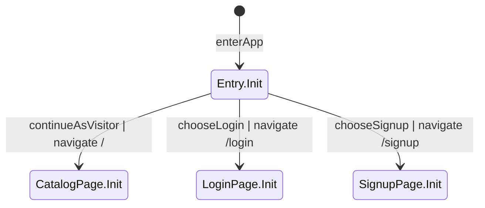
```mermaid
%% role: none
stateDiagram-v2
    [*] --> Entry.Init : enterApp
    %% verify: app entry renders public landing choices, Header only shows 商品列表 搜尋 登入 註冊, and no Buyer Seller Platform Admin specific navigation is visible

    Entry.Init --> CatalogPage.Init : continueAsVisitor | navigate /
    %% verify: navigating to / returns 200 and opens the catalog entry state with only active non-banned products visible in list context

    Entry.Init --> LoginPage.Init : chooseLogin | navigate /login
    %% verify: navigating to /login returns 200, login form fields and submit CTA are visible, and this page does not render a duplicate primary login CTA outside the form/header pattern

    Entry.Init --> SignupPage.Init : chooseSignup | navigate /signup
    %% verify: navigating to /signup returns 200, signup form fields and submit CTA are visible, and this page does not render a duplicate primary signup CTA outside the form/header pattern
```

## ② Catalog Page State Machine

```mermaid
%% role: none
stateDiagram-v2
    [*] --> CatalogPage.Init : enterPage
    %% verify: entering the catalog page shows the shared public layout, Header remains public-only for Visitor, and page-level loading placeholder can resolve into list search or detail states

    CatalogPage.Init --> CatalogPage.ListReady : enter / with active products
    %% verify: catalog list API returns 200 and only products with status active and not banned are rendered with product cards and detail CTAs

    CatalogPage.Init --> CatalogPage.SearchReady : enter /search with matched products
    %% verify: search API returns 200 with query and filter conditions applied, matched products are rendered, and the result set is consistent with title description category and price filters

    CatalogPage.Init --> CatalogPage.SearchEmpty : enter /search with no matched products
    %% verify: search API returns 200 with zero results, empty state messaging is shown, and no stale product cards remain visible

    CatalogPage.Init --> CatalogPage.DetailReady : enter /products/:productId with available product
    %% verify: product detail API returns 200, UI renders title price purchasable status stock or availability and seller shop_name, and the product is not banned

    CatalogPage.Init --> CatalogPage.DetailUnavailable : enter /products/:productId with banned or missing product
    %% verify: unavailable product access returns 404 or the agreed unavailable state consistently, purchase CTA is not usable, and banned products are not exposed as purchasable items

    CatalogPage.ListReady --> CatalogPage.Init : openSearch | navigate /search
    %% verify: route changes to /search, search inputs become visible, and the catalog list view is replaced by the search view without duplicate search CTAs

    CatalogPage.ListReady --> CatalogPage.Init : openProduct | navigate /products/:productId
    %% verify: clicked product id matches the destination route, detail request is issued for that product, and the destination page can render product information for the selected item

    CatalogPage.SearchReady --> CatalogPage.Init : refineSearch | navigate /search
    %% verify: updated query or filters trigger a new search request, the result set refreshes to match the new conditions, and previous results do not persist incorrectly

    CatalogPage.SearchReady --> CatalogPage.Init : openProduct | navigate /products/:productId
    %% verify: selecting a search result navigates to the matching product detail route and preserves the chosen product identity

    CatalogPage.SearchEmpty --> CatalogPage.Init : changeFilters | navigate /search
    %% verify: filter controls remain interactive in empty state, a new search request is sent with revised conditions, and the page leaves empty state only when results exist

    CatalogPage.SearchEmpty --> CatalogPage.Init : backToList | navigate /
    %% verify: route changes back to /, public list content reloads, and list cards are restored from active non-banned products only

    CatalogPage.DetailReady --> AddCartFeature.Init : addToCartAsBuyer | navigate AddCartFeature
    %% verify: only Buyer can trigger add-to-cart, request includes the current product and quantity at least 1, and product status must still be active before entering the feature

    CatalogPage.DetailReady --> LoginPage.Init : addToCartAsVisitor | navigate /login
    %% verify: Visitor attempting add-to-cart is redirected to /login, backend returns 401 for protected cart action, and no Cart CartItem Order or Payment record is created

    CatalogPage.DetailReady --> CartPage.Init : openCartAsBuyer | navigate /cart
    %% verify: Buyer navigation to /cart returns 200, cart page entry loads only the current buyer cart, and no other user's cart data is visible

    CatalogPage.DetailUnavailable --> CatalogPage.Init : backToCatalog | navigate /
    %% verify: returning to catalog clears the unavailable detail state and restores the public list page with available products only
```

## ③ Login Page State Machine
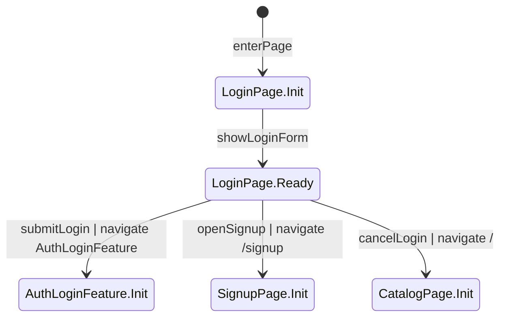
```mermaid
%% role: none
stateDiagram-v2
    [*] --> LoginPage.Init : enterPage
    %% verify: /login entry returns 200, the page renders login form fields and submit button, and public navigation still excludes Buyer Seller Platform Admin only entries

    LoginPage.Init --> LoginPage.Ready : showLoginForm
    %% verify: form inputs are enabled, inline validation area is available, and the page contains a single primary login submission path without duplicate CTA placement

    LoginPage.Ready --> AuthLoginFeature.Init : submitLogin | navigate AuthLoginFeature
    %% verify: submitting credentials sends the authentication request, submit UI enters a submitting state to prevent double submit, and only the login feature handles role resolution

    LoginPage.Ready --> SignupPage.Init : openSignup | navigate /signup
    %% verify: route changes to /signup, signup form becomes the active auth UI, and login-specific errors or field values do not leak into the signup entry view unless intentionally preserved

    LoginPage.Ready --> CatalogPage.Init : cancelLogin | navigate /
    %% verify: canceling login returns to the public catalog route and removes the auth-focused page from the current view
```

## ④ Signup Page State Machine
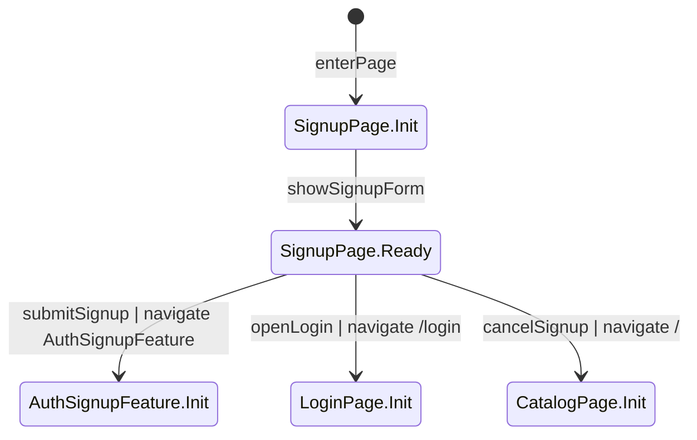
```mermaid
%% role: none
stateDiagram-v2
    [*] --> SignupPage.Init : enterPage
    %% verify: /signup entry returns 200, signup form renders correctly, and public navigation remains limited to public links only

    SignupPage.Init --> SignupPage.Ready : showSignupForm
    %% verify: signup fields are editable, validation hints are available, and the page exposes a single primary signup action without duplicate CTA placement

    SignupPage.Ready --> AuthSignupFeature.Init : submitSignup | navigate AuthSignupFeature
    %% verify: signup submission sends account creation request, submit UI prevents duplicate submission, and no authenticated Buyer Seller or Platform Admin session is created before success

    SignupPage.Ready --> LoginPage.Init : openLogin | navigate /login
    %% verify: route changes to /login and the login form becomes the active auth screen with no duplicate auth CTA confusion

    SignupPage.Ready --> CatalogPage.Init : cancelSignup | navigate /
    %% verify: canceling signup returns to the public catalog and leaves no partial authenticated state behind
```

## ⑤ Cart Page State Machine
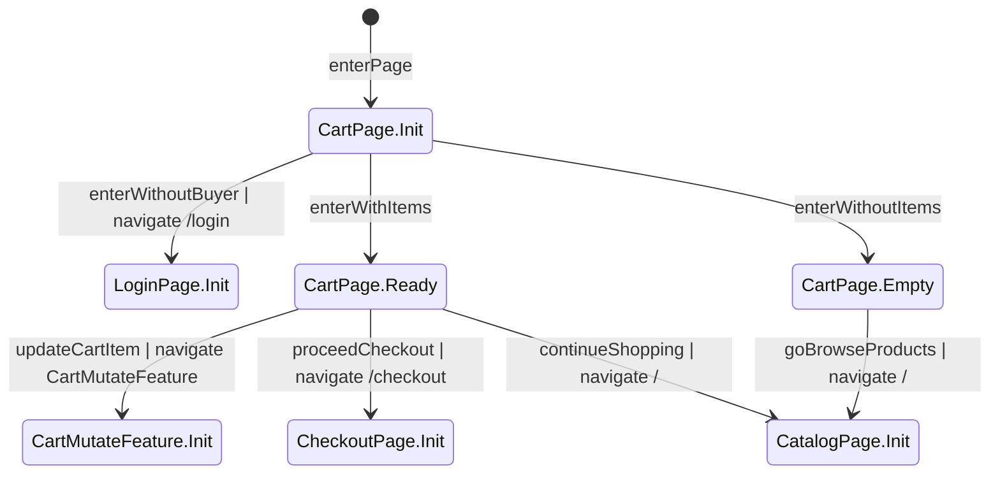
```mermaid
%% role: Buyer
stateDiagram-v2
    [*] --> CartPage.Init : enterPage
    %% verify: cart page entry checks authentication before loading cart data and does not expose cart content until buyer ownership is confirmed

    CartPage.Init --> LoginPage.Init : enterWithoutBuyer | navigate /login
    %% verify: unauthenticated cart access returns 401 and redirects to /login, while authenticated non-Buyer access is not granted cart operations

    CartPage.Init --> CartPage.Ready : enterWithItems
    %% verify: cart API returns 200 for the current buyer, only this buyer's cart items are shown, each quantity is at least 1, and inactive draft banned products are not accepted as valid cart entries

    CartPage.Init --> CartPage.Empty : enterWithoutItems
    %% verify: cart API returns 200 with zero items, empty state UI is shown, and checkout CTA is not offered as a primary path from an empty cart

    CartPage.Ready --> CartMutateFeature.Init : updateCartItem | navigate CartMutateFeature
    %% verify: cart mutation request targets only the current buyer cart item, requested quantity changes respect stock and minimum quantity rules, and mutation is blocked for unavailable products

    CartPage.Ready --> CheckoutPage.Init : proceedCheckout | navigate /checkout
    %% verify: route changes to /checkout, buyer context is preserved, and the next page will revalidate product active state and stock before order creation

    CartPage.Ready --> CatalogPage.Init : continueShopping | navigate /
    %% verify: returning to catalog leaves existing buyer cart persisted and reopens the public product browsing route

    CartPage.Empty --> CatalogPage.Init : goBrowseProducts | navigate /
    %% verify: empty cart state can navigate back to catalog and does not create any order payment or suborder data
```

## ⑥ Checkout Page State Machine
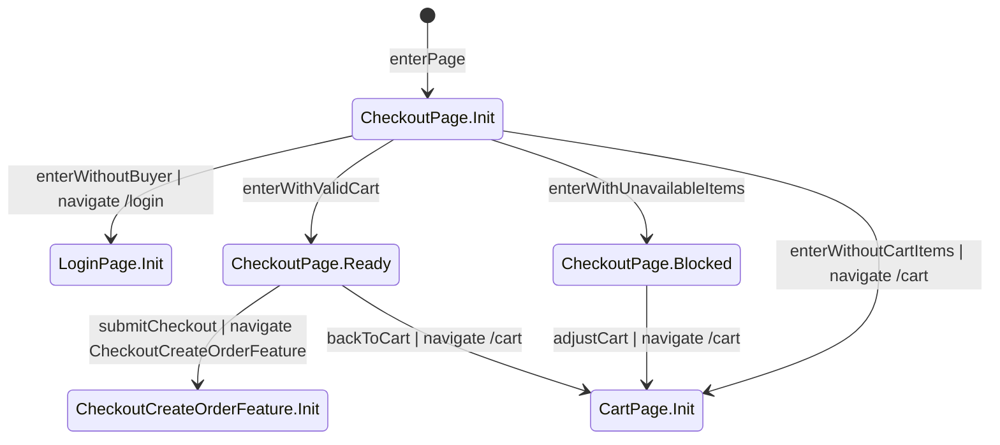
```mermaid
%% role: Buyer
stateDiagram-v2
    [*] --> CheckoutPage.Init : enterPage
    %% verify: checkout entry performs authentication and cart existence checks before exposing order summary or payment CTA

    CheckoutPage.Init --> LoginPage.Init : enterWithoutBuyer | navigate /login
    %% verify: unauthenticated checkout access returns 401 and redirects to /login, and no Order SubOrder or Payment record is created

    CheckoutPage.Init --> CheckoutPage.Ready : enterWithValidCart
    %% verify: checkout summary API returns 200, only current buyer cart lines are included, each product remains active, and stock is sufficient at page entry time

    CheckoutPage.Init --> CheckoutPage.Blocked : enterWithUnavailableItems
    %% verify: unavailable or insufficient-stock items are explicitly identified in UI, order creation is blocked, and buyer is told to adjust cart instead of creating partial unauthorized orders

    CheckoutPage.Init --> CartPage.Init : enterWithoutCartItems | navigate /cart
    %% verify: when no valid cart items exist the flow routes back to /cart and checkout cannot proceed

    CheckoutPage.Ready --> CheckoutCreateOrderFeature.Init : submitCheckout | navigate CheckoutCreateOrderFeature
    %% verify: submitting checkout starts the create-order flow exactly once, the request uses current buyer cart data, and validation rechecks product active state stock and seller grouping before creation

    CheckoutPage.Ready --> CartPage.Init : backToCart | navigate /cart
    %% verify: returning to cart preserves current buyer cart state and does not create any partial order payment or suborder records

    CheckoutPage.Blocked --> CartPage.Init : adjustCart | navigate /cart
    %% verify: blocked checkout sends buyer back to cart to resolve unavailable items and leaves all Order SubOrder Payment data unchanged
```

## ⑦ Payment Result Page State Machine
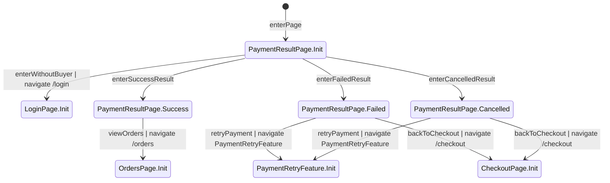
```mermaid
%% role: Buyer
stateDiagram-v2
    [*] --> PaymentResultPage.Init : enterPage
    %% verify: payment result entry validates buyer access, resolves the current payment outcome context, and does not expose another buyer's payment information

    PaymentResultPage.Init --> LoginPage.Init : enterWithoutBuyer | navigate /login
    %% verify: unauthenticated payment-result access returns 401 and redirects to /login

    PaymentResultPage.Init --> PaymentResultPage.Success : enterSuccessResult
    %% verify: payment result payload shows succeeded status, success message is visible, and the related order context is available for navigating to orders

    PaymentResultPage.Init --> PaymentResultPage.Failed : enterFailedResult
    %% verify: payment result payload shows failed status, failure messaging is visible, and retry/back-to-checkout options are available

    PaymentResultPage.Init --> PaymentResultPage.Cancelled : enterCancelledResult
    %% verify: payment result payload shows cancelled status, cancelled messaging is visible, and retry/back-to-checkout options are available without marking the order as paid

    PaymentResultPage.Success --> OrdersPage.Init : viewOrders | navigate /orders
    %% verify: navigating to /orders after success loads only the current buyer orders and includes the newly paid order in a consistent status view

    PaymentResultPage.Failed --> PaymentRetryFeature.Init : retryPayment | navigate PaymentRetryFeature
    %% verify: retry is available only for failed payment state, the existing order remains created with suborders pending_payment, and retry enters the payment retry feature instead of creating a duplicate order

    PaymentResultPage.Cancelled --> PaymentRetryFeature.Init : retryPayment | navigate PaymentRetryFeature
    %% verify: retry is available only for cancelled payment state, the existing order remains created with suborders pending_payment, and retry does not duplicate payment success effects

    PaymentResultPage.Failed --> CheckoutPage.Init : backToCheckout | navigate /checkout
    %% verify: returning to checkout from failed result preserves the same buyer context and allows review before retrying payment

    PaymentResultPage.Cancelled --> CheckoutPage.Init : backToCheckout | navigate /checkout
    %% verify: returning to checkout from cancelled result does not mark payment as succeeded and allows buyer to restart payment intentionally
```

## ⑧ Orders Page State Machine

```mermaid
%% role: Buyer
stateDiagram-v2
    [*] --> OrdersPage.Init : enterPage
    %% verify: orders entry checks authentication and buyer ownership before loading any order or suborder data

    OrdersPage.Init --> LoginPage.Init : enterWithoutBuyer | navigate /login
    %% verify: unauthenticated access to /orders or child routes returns 401 and redirects to /login

    OrdersPage.Init --> OrdersPage.ListReady : enter /orders with orders
    %% verify: orders API returns 200 and only the current buyer's orders are listed with aggregated order statuses consistent with their suborders

    OrdersPage.Init --> OrdersPage.ListEmpty : enter /orders without orders
    %% verify: orders API returns 200 with zero orders, empty state UI is shown, and no stale order rows remain visible

    OrdersPage.Init --> OrdersPage.DetailReady : enter /orders/:orderId with owned order
    %% verify: order detail API returns 200 only for the current buyer's order, order amount and status are shown, and suborder rows belong to that order only

    OrdersPage.Init --> OrdersPage.SubOrderReady : enter /orders/:orderId/suborders/:subOrderId with owned suborder
    %% verify: suborder detail API returns 200 only for the current buyer-owned suborder, status and after-sales entry are shown, and cross-user resource access is blocked with 403 or 404 consistently

    OrdersPage.Init --> OrdersPage.ReviewDraft : enter /reviews/new with delivered product
    %% verify: delivered purchase eligibility check passes, review form is available, and the product belongs to a delivered transaction of the current buyer

    OrdersPage.Init --> OrdersPage.ReviewBlocked : enter /reviews/new without delivered product
    %% verify: review eligibility check fails, review submission is blocked, and UI communicates that only delivered transaction items can be reviewed

    OrdersPage.ListReady --> OrdersPage.Init : openOrder | navigate /orders/:orderId
    %% verify: selected order id matches the destination route and detail view resolves only if the order belongs to the current buyer

    OrdersPage.ListReady --> CatalogPage.Init : goBrowseProducts | navigate /
    %% verify: leaving orders for catalog does not change existing order data and reopens the public catalog route

    OrdersPage.ListEmpty --> CatalogPage.Init : startShopping | navigate /
    %% verify: empty orders state can navigate back to catalog and no order detail route remains selected

    OrdersPage.DetailReady --> OrdersPage.Init : openSubOrder | navigate /orders/:orderId/suborders/:subOrderId
    %% verify: selected suborder belongs to the displayed order and route parameters identify the same buyer-owned resources

    OrdersPage.DetailReady --> OrderCancelFeature.Init : cancelBeforePayment | navigate OrderCancelFeature
    %% verify: cancel action is offered only before payment, target order is buyer-owned, and the feature receives the current order in created or pending-payment related state only

    OrdersPage.DetailReady --> OrdersPage.Init : backToOrders | navigate /orders
    %% verify: returning to /orders restores the buyer order list view and preserves current data consistency

    OrdersPage.SubOrderReady --> RefundRequestFeature.Init : requestRefund | navigate RefundRequestFeature
    %% verify: refund entry is offered only for allowed paid shipped or delivered suborder states within the permitted rules and only for the current buyer's suborder

    OrdersPage.SubOrderReady --> OrdersPage.Init : openReviewForm | navigate /reviews/new?productId=:productId
    %% verify: review form route uses the selected product id from the delivered transaction item and only opens when review eligibility is satisfied

    OrdersPage.SubOrderReady --> OrdersPage.Init : backToOrderDetail | navigate /orders/:orderId
    %% verify: route returns to the parent order detail and the selected order still belongs to the current buyer

    OrdersPage.ReviewDraft --> ReviewCreateFeature.Init : submitReview | navigate ReviewCreateFeature
    %% verify: review submission includes rating and comment for the delivered product only, and the feature is entered only for buyer-owned delivered transactions

    OrdersPage.ReviewDraft --> OrdersPage.Init : cancelReview | navigate /orders/:orderId/suborders/:subOrderId
    %% verify: canceling review returns to the same buyer-owned suborder detail without creating any Review record

    OrdersPage.ReviewBlocked --> OrdersPage.Init : backToSubOrder | navigate /orders/:orderId/suborders/:subOrderId
    %% verify: blocked review state routes back to the current buyer-owned suborder detail and leaves review data unchanged
```

## ⑨ Seller Console Page State Machine

```mermaid
%% role: Buyer|Seller
stateDiagram-v2
    [*] --> SellerConsolePage.Init : enterPage
    %% verify: seller-area entry checks authentication and role before exposing seller application or seller console data

    SellerConsolePage.Init --> LoginPage.Init : enterWithoutSession | navigate /login
    %% verify: unauthenticated /seller/* access returns 401 and redirects to /login with no seller data exposed

    SellerConsolePage.Init --> SellerConsolePage.ApplyReady : enter /seller/apply as buyer without seller role
    %% verify: buyer without seller role can access seller apply page, application form fields like shop_name are shown, and seller-only product order settlement data is not shown

    SellerConsolePage.Init --> SellerConsolePage.ProductsReady : enter /seller/products as seller
    %% verify: seller products API returns 200, only the current seller's products are listed, and no other seller product records are visible

    SellerConsolePage.Init --> SellerConsolePage.ProductNewDraft : enter /seller/products/new as seller
    %% verify: seller product creation form is visible only to the current seller and supports product fields required for draft active inactive management

    SellerConsolePage.Init --> SellerConsolePage.ProductEditDraft : enter /seller/products/:productId/edit as owner seller
    %% verify: product edit API returns 200 only when the product belongs to the current seller, and cross-seller editing is blocked with 403 or 404 consistently

    SellerConsolePage.Init --> SellerConsolePage.OrdersReady : enter /seller/orders as seller
    %% verify: seller order list API returns 200 and shows only suborders owned by the current seller

    SellerConsolePage.Init --> SellerConsolePage.OrderDetailReady : enter /seller/orders/:subOrderId as owner seller
    %% verify: seller suborder detail API returns 200 only for current seller-owned suborders and exposes shipment and after-sales actions according to status

    SellerConsolePage.Init --> SellerConsolePage.SettlementsReady : enter /seller/settlements as seller
    %% verify: settlement list API returns 200 and shows only current seller settlement rows with gross_amount platform_fee net_amount and status

    SellerConsolePage.Init --> SellerConsolePage.SettlementDetailReady : enter /seller/settlements/:settlementId as owner seller
    %% verify: settlement detail API returns 200 only for current seller-owned settlement and shows immutable settled records consistently

    SellerConsolePage.Init --> SellerConsolePage.Forbidden : enterSellerRouteWithoutPermission
    %% verify: authenticated non-seller access to seller-only routes returns 403, forbidden state is shown, and seller-only data remains hidden

    SellerConsolePage.ApplyReady --> SellerApplicationSubmitFeature.Init : submitSellerApplication | navigate SellerApplicationSubmitFeature
    %% verify: application submission includes buyer-owned identity and shop_name data only, and entering the feature does not grant seller role before admin approval

    SellerConsolePage.ApplyReady --> CatalogPage.Init : cancelSellerApplication | navigate /
    %% verify: canceling seller application returns to catalog and leaves SellerApplication data unchanged

    SellerConsolePage.ProductsReady --> SellerConsolePage.Init : openNewProduct | navigate /seller/products/new
    %% verify: route changes to the product creation page for the current seller and no existing product is modified

    SellerConsolePage.ProductsReady --> SellerConsolePage.Init : openEditProduct | navigate /seller/products/:productId/edit
    %% verify: selected product belongs to the current seller and the edit route uses that product id only

    SellerConsolePage.ProductsReady --> SellerProductStatusFeature.Init : changeProductStatus | navigate SellerProductStatusFeature
    %% verify: status change is initiated only for current seller-owned products and target statuses stay within draft active inactive rules, never allowing seller-side banned control

    SellerConsolePage.ProductsReady --> SellerConsolePage.Init : openSellerOrders | navigate /seller/orders
    %% verify: route changes to seller orders and the seller context remains the same without exposing other sellers' data

    SellerConsolePage.ProductsReady --> SellerConsolePage.Init : openSettlements | navigate /seller/settlements
    %% verify: route changes to settlement list and retains the current seller scope only

    SellerConsolePage.ProductNewDraft --> SellerProductSaveFeature.Init : createProduct | navigate SellerProductSaveFeature
    %% verify: product creation submits current seller ownership and form fields, and entering the feature cannot save a product for another seller

    SellerConsolePage.ProductNewDraft --> SellerConsolePage.Init : cancelProductCreate | navigate /seller/products
    %% verify: canceling product creation returns to seller product list and does not persist a new Product record

    SellerConsolePage.ProductEditDraft --> SellerProductSaveFeature.Init : saveProductChanges | navigate SellerProductSaveFeature
    %% verify: product update submits only current seller-owned product changes and cannot alter platform-managed fields such as platform_fee rules

    SellerConsolePage.ProductEditDraft --> SellerConsolePage.Init : cancelProductEdit | navigate /seller/products
    %% verify: canceling product edit returns to seller product list and does not persist unsaved product changes

    SellerConsolePage.OrdersReady --> SellerConsolePage.Init : openSellerOrderDetail | navigate /seller/orders/:subOrderId
    %% verify: selected suborder belongs to the current seller and the detail route points to that suborder only

    SellerConsolePage.OrdersReady --> SellerConsolePage.Init : openProducts | navigate /seller/products
    %% verify: seller can return from orders list to product list without changing any suborder data

    SellerConsolePage.OrderDetailReady --> SellerFulfillmentFeature.Init : shipSubOrder | navigate SellerFulfillmentFeature
    %% verify: ship action is available only when the seller owns the suborder and the suborder status is paid, not pending_payment cancelled refund_requested or refunded

    SellerConsolePage.OrderDetailReady --> SellerRefundReviewFeature.Init : reviewRefundRequest | navigate SellerRefundReviewFeature
    %% verify: refund review action is available only for seller-owned suborders currently in refund_requested and the feature receives the current refund request context

    SellerConsolePage.OrderDetailReady --> SellerConsolePage.Init : backToSellerOrders | navigate /seller/orders
    %% verify: returning to seller order list preserves seller scope and does not modify the suborder state

    SellerConsolePage.SettlementsReady --> SellerConsolePage.Init : openSettlementDetail | navigate /seller/settlements/:settlementId
    %% verify: selected settlement belongs to the current seller and the detail route references that settlement only

    SellerConsolePage.SettlementsReady --> SellerConsolePage.Init : openProducts | navigate /seller/products
    %% verify: returning from settlement list to product list keeps seller scope and does not alter settlement values

    SellerConsolePage.SettlementDetailReady --> SellerConsolePage.Init : backToSettlements | navigate /seller/settlements
    %% verify: back navigation restores the settlement list and keeps gross_amount platform_fee net_amount status consistent with detail data

    SellerConsolePage.Forbidden --> CatalogPage.Init : leaveSellerArea | navigate /
    %% verify: leaving forbidden seller area returns to public catalog and seller-only navigation is no longer shown for unauthorized users
```

## ⑩ Admin Console Page State Machine

```mermaid
%% role: Platform Admin
stateDiagram-v2
    [*] --> AdminConsolePage.Init : enterPage
    %% verify: admin-area entry checks authentication and admin role before exposing any admin management data

    AdminConsolePage.Init --> LoginPage.Init : enterWithoutSession | navigate /login
    %% verify: unauthenticated /admin/* access returns 401 and redirects to /login with no admin data exposed

    AdminConsolePage.Init --> AdminConsolePage.SellerApplicationsReady : enter /admin/seller-applications as admin
    %% verify: seller application list API returns 200 and shows submitted applications for admin review only

    AdminConsolePage.Init --> AdminConsolePage.CategoriesReady : enter /admin/categories as admin
    %% verify: category management API returns 200 and category rows with active inactive status are visible only to admin

    AdminConsolePage.Init --> AdminConsolePage.OrdersReady : enter /admin/orders as admin
    %% verify: admin order query API returns 200 and can access platform-wide order records according to admin permissions

    AdminConsolePage.Init --> AdminConsolePage.DisputesReady : enter /admin/disputes as admin
    %% verify: dispute list API returns 200 and open resolved dispute cases are visible for admin handling only

    AdminConsolePage.Init --> AdminConsolePage.RefundsReady : enter /admin/refunds as admin
    %% verify: refund management API returns 200 and refund requests are visible for admin intervention only

    AdminConsolePage.Init --> AdminConsolePage.AnalyticsReady : enter /admin/analytics as admin
    %% verify: analytics API returns 200 and platform aggregate metrics are visible only to admin users

    AdminConsolePage.Init --> AdminConsolePage.Forbidden : enterAdminRouteWithoutAdminRole
    %% verify: authenticated non-admin access returns 403, admin management data is hidden, and forbidden state is shown consistently

    AdminConsolePage.SellerApplicationsReady --> AdminSellerApplicationReviewFeature.Init : reviewSellerApplication | navigate AdminSellerApplicationReviewFeature
    %% verify: review action is available only for admin and targets submitted seller applications with auditable context

    AdminConsolePage.SellerApplicationsReady --> AdminConsolePage.Init : openCategories | navigate /admin/categories
    %% verify: route changes to admin categories and remains within admin-only navigation

    AdminConsolePage.CategoriesReady --> AdminCategoryManageFeature.Init : manageCategory | navigate AdminCategoryManageFeature
    %% verify: category manage entry targets admin-controlled category records only and seller users cannot invoke this feature

    AdminConsolePage.CategoriesReady --> AdminConsolePage.Init : openOrders | navigate /admin/orders
    %% verify: route changes to admin orders and platform-wide query capability remains admin-only

    AdminConsolePage.OrdersReady --> AdminOrderInterventionFeature.Init : interveneOrder | navigate AdminOrderInterventionFeature
    %% verify: intervention entry targets an admin-selected order or suborder dispute context and records the acting admin identity for audit

    AdminConsolePage.OrdersReady --> AdminConsolePage.Init : openDisputes | navigate /admin/disputes
    %% verify: route changes to admin disputes and current admin scope is preserved

    AdminConsolePage.DisputesReady --> AdminDisputeResolveFeature.Init : resolveDispute | navigate AdminDisputeResolveFeature
    %% verify: dispute resolution entry targets an open dispute case and only admin can perform the action

    AdminConsolePage.DisputesReady --> AdminConsolePage.Init : openRefunds | navigate /admin/refunds
    %% verify: route changes to admin refunds and current admin scope is preserved

    AdminConsolePage.RefundsReady --> AdminRefundInterventionFeature.Init : decideRefund | navigate AdminRefundInterventionFeature
    %% verify: refund intervention entry targets a current refund request and only admin can approve reject or force refund with audit requirements

    AdminConsolePage.RefundsReady --> AdminConsolePage.Init : openAnalytics | navigate /admin/analytics
    %% verify: route changes to admin analytics and keeps admin-only visibility rules intact

    AdminConsolePage.AnalyticsReady --> AdminConsolePage.Init : openSellerApplications | navigate /admin/seller-applications
    %% verify: route changes back to seller application review and retains admin-only access control

    AdminConsolePage.AnalyticsReady --> CatalogPage.Init : leaveAdminArea | navigate /
    %% verify: leaving admin area returns to public catalog and admin-only views are no longer active on screen

    AdminConsolePage.Forbidden --> CatalogPage.Init : leaveForbiddenPage | navigate /
    %% verify: forbidden admin state can return to public catalog while keeping all admin data inaccessible
```

## ⑪ AuthLoginFeature State Machine
Source Pages: LoginPage
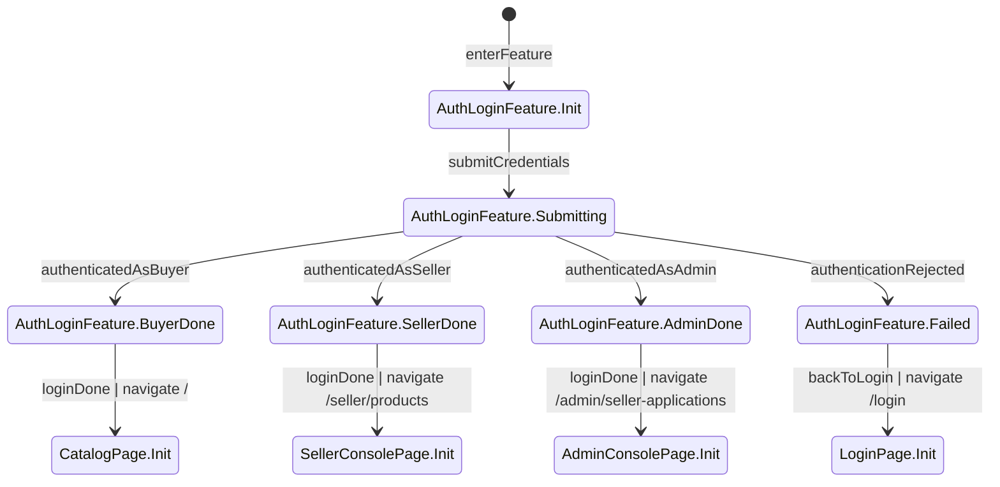
```mermaid
%% role: none
stateDiagram-v2
    [*] --> AuthLoginFeature.Init : enterFeature
    %% verify: login feature starts from the login page only and receives submitted credentials plus optional return target without exposing authenticated resources yet

    AuthLoginFeature.Init --> AuthLoginFeature.Submitting : submitCredentials
    %% verify: authentication request is sent once, submit controls are disabled to avoid duplicate requests, and the feature transitions into submitting state

    AuthLoginFeature.Submitting --> AuthLoginFeature.BuyerDone : authenticatedAsBuyer
    %% verify: auth API returns 200 with Buyer role, session is created for the authenticated user, and buyer navigation becomes available while seller and admin navigation stays hidden unless roles exist

    AuthLoginFeature.Submitting --> AuthLoginFeature.SellerDone : authenticatedAsSeller
    %% verify: auth API returns 200 with Seller role, session is created for the authenticated seller, and seller console navigation becomes visible without exposing admin navigation

    AuthLoginFeature.Submitting --> AuthLoginFeature.AdminDone : authenticatedAsAdmin
    %% verify: auth API returns 200 with Platform Admin role, session is created for the admin user, and admin navigation becomes visible

    AuthLoginFeature.Submitting --> AuthLoginFeature.Failed : authenticationRejected
    %% verify: auth API returns 401 or validation failure, no session is created, and the feature keeps the user unauthenticated with error feedback available on return

    AuthLoginFeature.Failed --> LoginPage.Init : backToLogin | navigate /login
    %% verify: returning to login shows the login form with authentication failure feedback and still hides protected navigation entries

    AuthLoginFeature.BuyerDone --> CatalogPage.Init : loginDone | navigate /
    %% verify: buyer login completion routes to /, public catalog loads, and Buyer Header now shows 購物車 我的訂單 登出 without seller or admin items

    AuthLoginFeature.SellerDone --> SellerConsolePage.Init : loginDone | navigate /seller/products
    %% verify: seller login completion routes to /seller/products, seller-owned product list is loaded, and seller-only navigation is visible while admin items remain hidden

    AuthLoginFeature.AdminDone --> AdminConsolePage.Init : loginDone | navigate /admin/seller-applications
    %% verify: admin login completion routes to /admin/seller-applications, admin review data can load, and admin navigation becomes visible
```

## ⑫ AuthSignupFeature State Machine
Source Pages: SignupPage
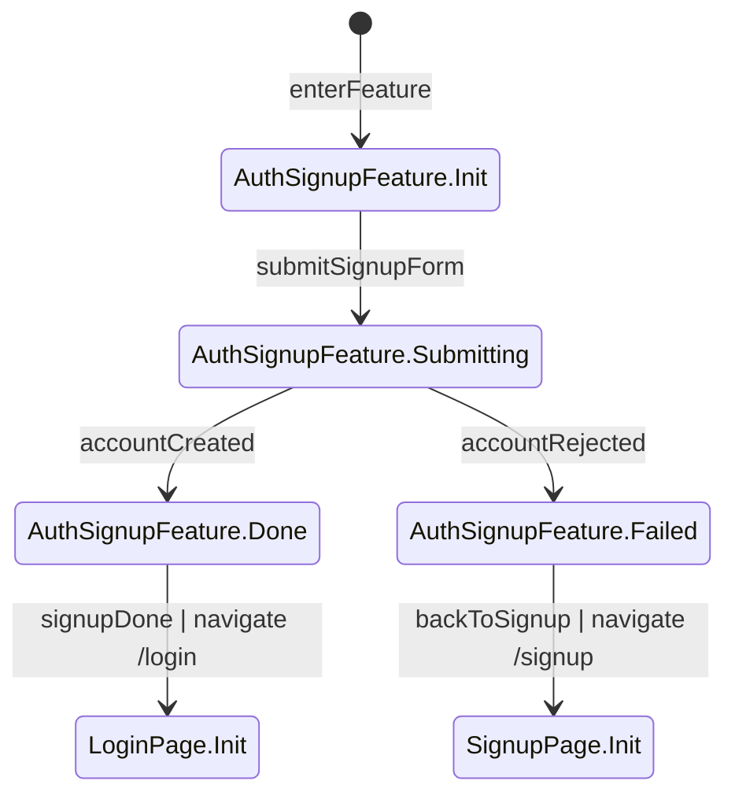
```mermaid
%% role: none
stateDiagram-v2
    [*] --> AuthSignupFeature.Init : enterFeature
    %% verify: signup feature starts only from the signup page and receives the submitted registration fields without creating a session yet

    AuthSignupFeature.Init --> AuthSignupFeature.Submitting : submitSignupForm
    %% verify: account creation request is sent once, submit UI prevents duplicate submission, and validation is handled in the feature submission step

    AuthSignupFeature.Submitting --> AuthSignupFeature.Done : accountCreated
    %% verify: signup API returns 201 or success equivalent, a new user account is created, and the resulting user can proceed to login without unexpected seller or admin role assignment

    AuthSignupFeature.Submitting --> AuthSignupFeature.Failed : accountRejected
    %% verify: signup API returns validation failure or rejection, no new user account is persisted, and error details are available on return to the signup page

    AuthSignupFeature.Failed --> SignupPage.Init : backToSignup | navigate /signup
    %% verify: signup page is restored with failure feedback and no authenticated session exists

    AuthSignupFeature.Done --> LoginPage.Init : signupDone | navigate /login
    %% verify: successful signup routes to /login and the new account can be used for authentication from the login form
```

## ⑬ AddCartFeature State Machine
Source Pages: CatalogPage
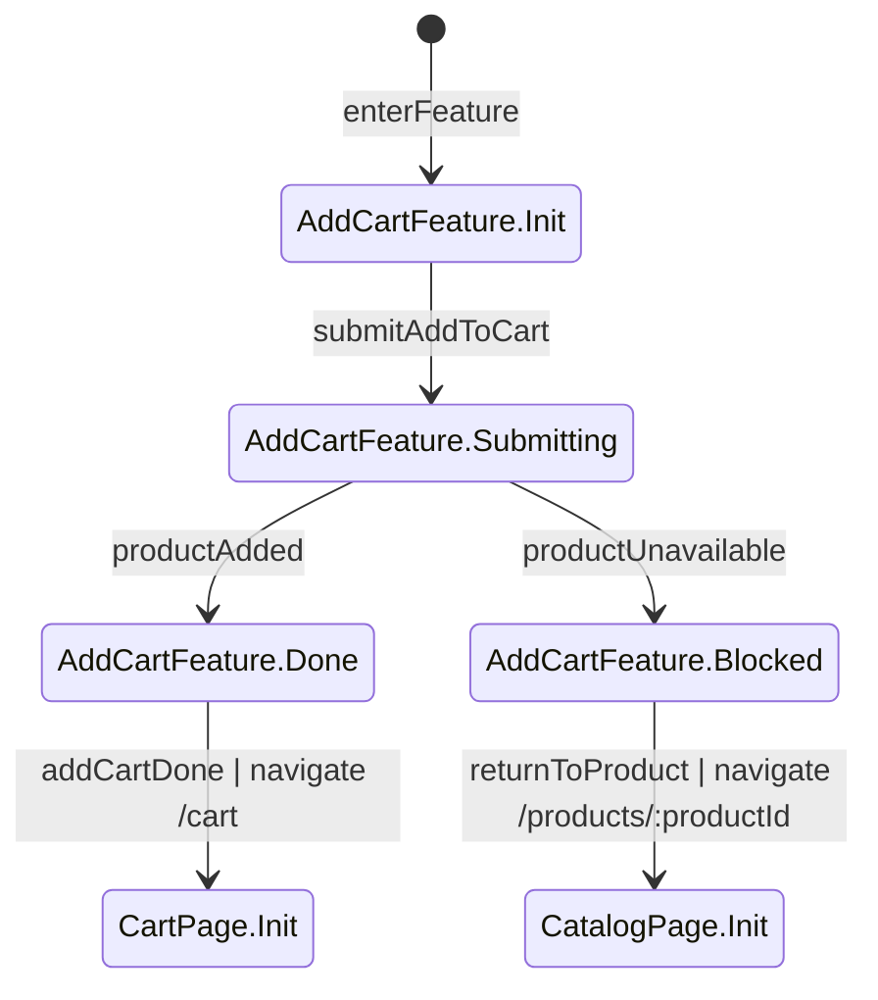
```mermaid
%% role: Buyer
stateDiagram-v2
    [*] --> AddCartFeature.Init : enterFeature
    %% verify: add-to-cart feature starts only from a buyer product detail action and receives the selected product and quantity context

    AddCartFeature.Init --> AddCartFeature.Submitting : submitAddToCart
    %% verify: cart add request targets the current buyer cart, quantity is at least 1, and the product is rechecked as active and purchasable before mutation

    AddCartFeature.Submitting --> AddCartFeature.Done : productAdded
    %% verify: cart API returns 200, the buyer cart contains the selected product with the requested quantity, and no duplicate cart is created for another user

    AddCartFeature.Submitting --> AddCartFeature.Blocked : productUnavailable
    %% verify: cart API rejects inactive draft banned or insufficient-stock products, no cart quantity is changed, and the product remains unavailable for purchase

    AddCartFeature.Done --> CartPage.Init : addCartDone | navigate /cart
    %% verify: navigation to /cart shows the updated current buyer cart with the added item present and quantities consistent with the successful mutation

    AddCartFeature.Blocked --> CatalogPage.Init : returnToProduct | navigate /products/:productId
    %% verify: returning to product detail preserves the same product route and shows that add-to-cart could not complete without altering cart data
```

## ⑭ CartMutateFeature State Machine
Source Pages: CartPage
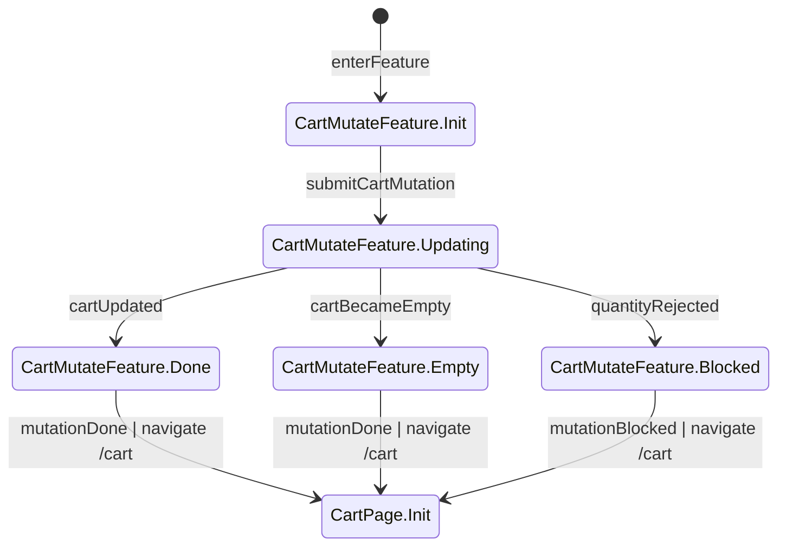
```mermaid
%% role: Buyer
stateDiagram-v2
    [*] --> CartMutateFeature.Init : enterFeature
    %% verify: cart mutation feature starts from the buyer cart page only and receives the current buyer cart item mutation intent

    CartMutateFeature.Init --> CartMutateFeature.Updating : submitCartMutation
    %% verify: cart update request is sent once for the current buyer item, requested quantity or removal is validated, and duplicate submits are prevented during update

    CartMutateFeature.Updating --> CartMutateFeature.Done : cartUpdated
    %% verify: cart API returns 200, item quantity or removal is persisted for the current buyer only, and remaining cart totals are recalculated consistently

    CartMutateFeature.Updating --> CartMutateFeature.Empty : cartBecameEmpty
    %% verify: cart API returns 200 and after mutation no items remain in the current buyer cart, so empty cart state becomes accurate

    CartMutateFeature.Updating --> CartMutateFeature.Blocked : quantityRejected
    %% verify: cart API rejects invalid quantity below 1 or above available stock, no unintended cart change is persisted, and buyer receives actionable feedback

    CartMutateFeature.Done --> CartPage.Init : mutationDone | navigate /cart
    %% verify: returning to /cart shows updated items and quantities for the current buyer with no cross-user leakage

    CartMutateFeature.Empty --> CartPage.Init : mutationDone | navigate /cart
    %% verify: returning to /cart shows empty state with no checkout primary action and no stale cart rows

    CartMutateFeature.Blocked --> CartPage.Init : mutationBlocked | navigate /cart
    %% verify: blocked mutation returns to the same cart with original values intact and error feedback visible
```

## ⑮ CheckoutCreateOrderFeature State Machine
Source Pages: CheckoutPage
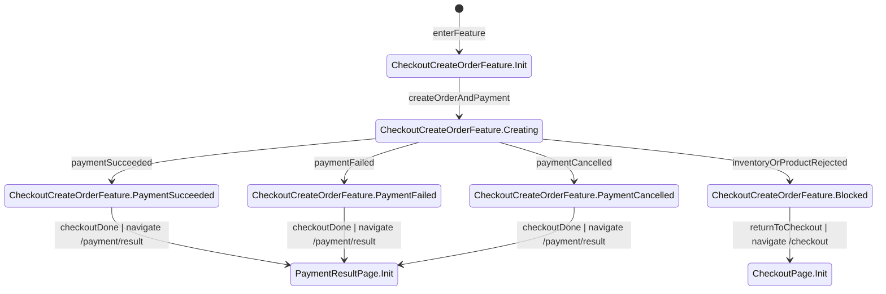
```mermaid
%% role: Buyer
stateDiagram-v2
    [*] --> CheckoutCreateOrderFeature.Init : enterFeature
    %% verify: checkout feature starts from buyer checkout only and uses the current buyer cart snapshot as input

    CheckoutCreateOrderFeature.Init --> CheckoutCreateOrderFeature.Creating : createOrderAndPayment
    %% verify: order creation request is sent once, products are regrouped by seller_id, active status and stock are revalidated, and duplicate submission is prevented

    CheckoutCreateOrderFeature.Creating --> CheckoutCreateOrderFeature.PaymentSucceeded : paymentSucceeded
    %% verify: payment callback or completion marks Payment succeeded, creates one Order plus N seller-grouped SubOrders, sets Order to paid, sets each SubOrder to paid, deducts stock atomically, and repeated callback with the same transaction_id plus order_id does not duplicate stock deduction or status updates

    CheckoutCreateOrderFeature.Creating --> CheckoutCreateOrderFeature.PaymentFailed : paymentFailed
    %% verify: Payment is recorded as failed, Order remains created, each SubOrder remains pending_payment, and stock is not deducted

    CheckoutCreateOrderFeature.Creating --> CheckoutCreateOrderFeature.PaymentCancelled : paymentCancelled
    %% verify: Payment is recorded as cancelled, Order remains created, each SubOrder remains pending_payment, and stock is not deducted

    CheckoutCreateOrderFeature.Creating --> CheckoutCreateOrderFeature.Blocked : inventoryOrProductRejected
    %% verify: create-order flow stops when any product is inactive or stock is insufficient, no invalid Order SubOrder Payment success state is persisted, and buyer must adjust cart consistently

    CheckoutCreateOrderFeature.PaymentSucceeded --> PaymentResultPage.Init : checkoutDone | navigate /payment/result
    %% verify: payment result route resolves to success view for the same buyer and order, and downstream order list shows the newly paid order consistently

    CheckoutCreateOrderFeature.PaymentFailed --> PaymentResultPage.Init : checkoutDone | navigate /payment/result
    %% verify: payment result route resolves to failed view for the same buyer and order with retry available, and order state remains created

    CheckoutCreateOrderFeature.PaymentCancelled --> PaymentResultPage.Init : checkoutDone | navigate /payment/result
    %% verify: payment result route resolves to cancelled view for the same buyer and order with retry available, and order state remains created

    CheckoutCreateOrderFeature.Blocked --> CheckoutPage.Init : returnToCheckout | navigate /checkout
    %% verify: returning to checkout shows blocked item context again, and no paid order or deducted inventory has been created from the rejected attempt
```

## ⑯ PaymentRetryFeature State Machine
Source Pages: PaymentResultPage
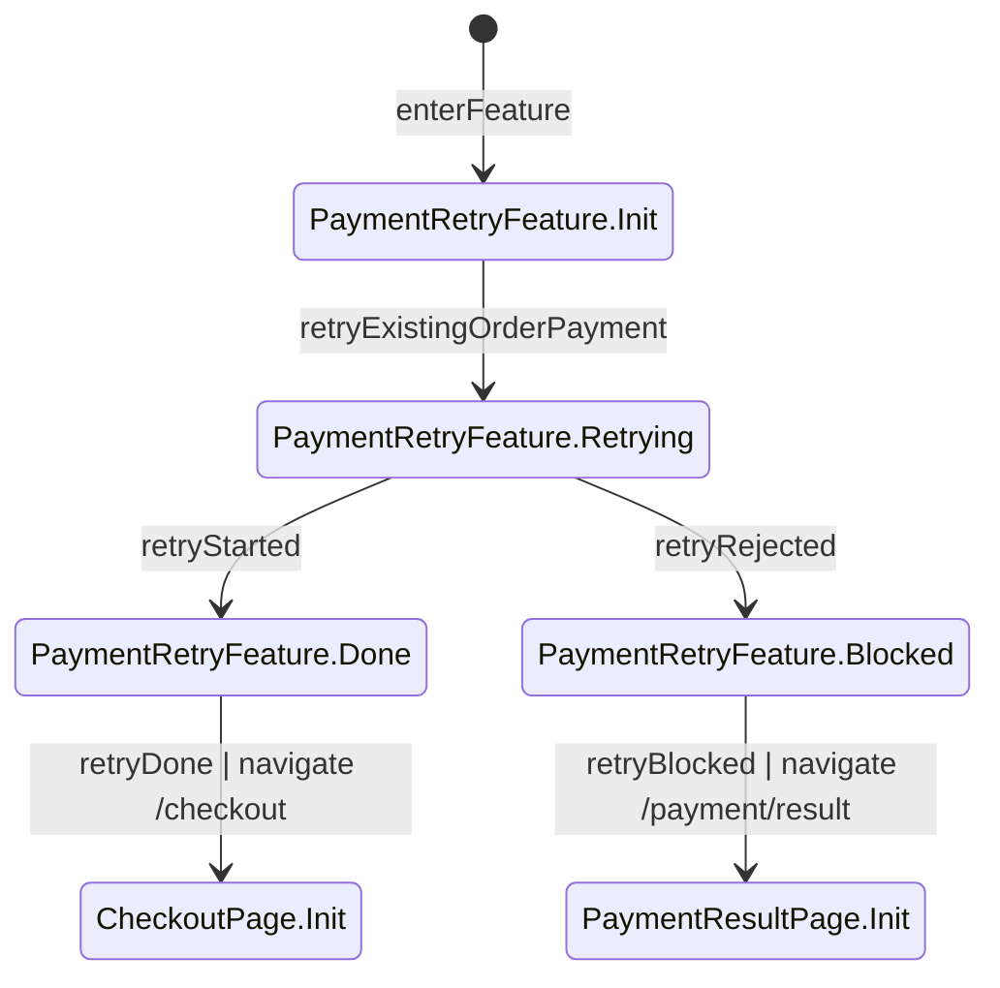
```mermaid
%% role: Buyer
stateDiagram-v2
    [*] --> PaymentRetryFeature.Init : enterFeature
    %% verify: payment retry feature starts only from failed or cancelled payment result for the current buyer and existing order

    PaymentRetryFeature.Init --> PaymentRetryFeature.Retrying : retryExistingOrderPayment
    %% verify: retry request references the existing order payment context rather than creating a new order, and duplicate retry submissions are prevented while retry is in progress

    PaymentRetryFeature.Retrying --> PaymentRetryFeature.Done : retryStarted
    %% verify: retry flow successfully reopens payment for the same order, order remains associated with the current buyer, and no duplicate Order or SubOrder set is created

    PaymentRetryFeature.Retrying --> PaymentRetryFeature.Blocked : retryRejected
    %% verify: retry is rejected when the existing order is no longer eligible for retry, and no payment success side effects occur

    PaymentRetryFeature.Done --> CheckoutPage.Init : retryDone | navigate /checkout
    %% verify: buyer returns to checkout for the same order context and can continue payment without losing order association

    PaymentRetryFeature.Blocked --> PaymentResultPage.Init : retryBlocked | navigate /payment/result
    %% verify: blocked retry returns to payment result with the original failure or cancellation context unchanged
```

## ⑰ OrderCancelFeature State Machine
Source Pages: OrdersPage
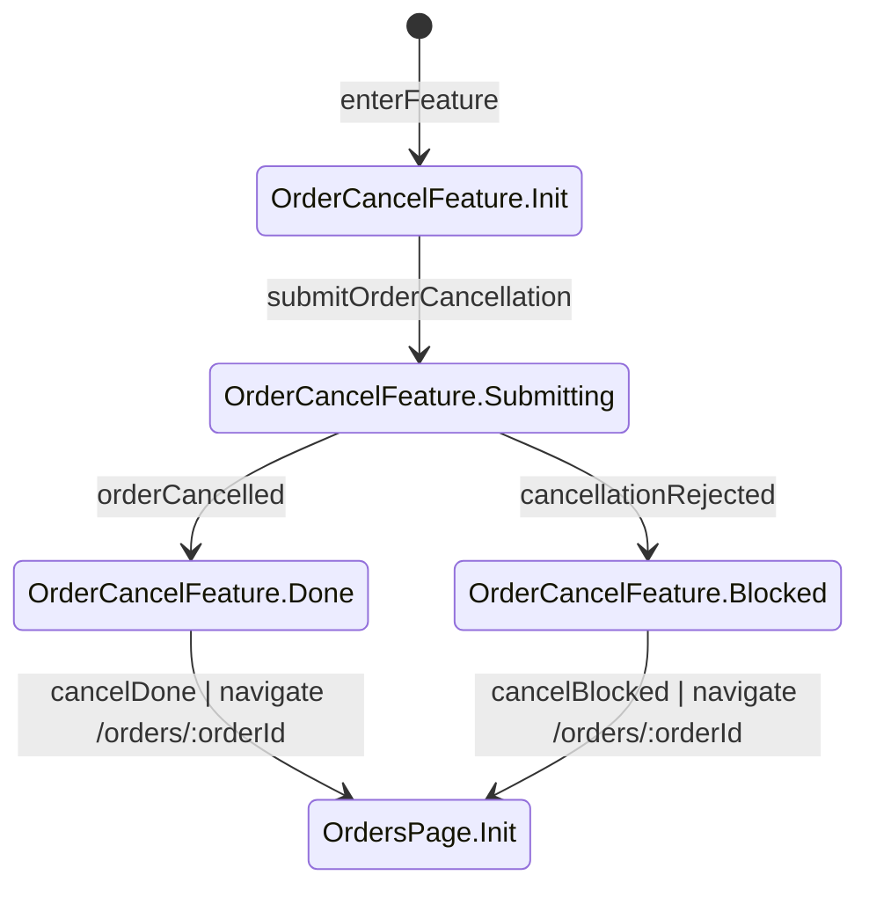
```mermaid
%% role: Buyer
stateDiagram-v2
    [*] --> OrderCancelFeature.Init : enterFeature
    %% verify: order cancel feature starts only from buyer-owned order detail and only before payment completion

    OrderCancelFeature.Init --> OrderCancelFeature.Submitting : submitOrderCancellation
    %% verify: cancellation request is sent once for the current buyer-owned order and only when the order remains cancellable before payment

    OrderCancelFeature.Submitting --> OrderCancelFeature.Done : orderCancelled
    %% verify: cancellation succeeds by setting each SubOrder to cancelled, setting Order to cancelled, and recording auditable state changes without touching unrelated orders

    OrderCancelFeature.Submitting --> OrderCancelFeature.Blocked : cancellationRejected
    %% verify: cancellation is rejected when payment has already succeeded or the order is otherwise not eligible, and existing Order SubOrder states remain unchanged

    OrderCancelFeature.Done --> OrdersPage.Init : cancelDone | navigate /orders/:orderId
    %% verify: returning to order detail shows Order cancelled and all related SubOrders cancelled consistently for the current buyer

    OrderCancelFeature.Blocked --> OrdersPage.Init : cancelBlocked | navigate /orders/:orderId
    %% verify: returning to order detail shows original order and suborder states intact with cancellation rejection feedback
```

## ⑱ RefundRequestFeature State Machine
Source Pages: OrdersPage
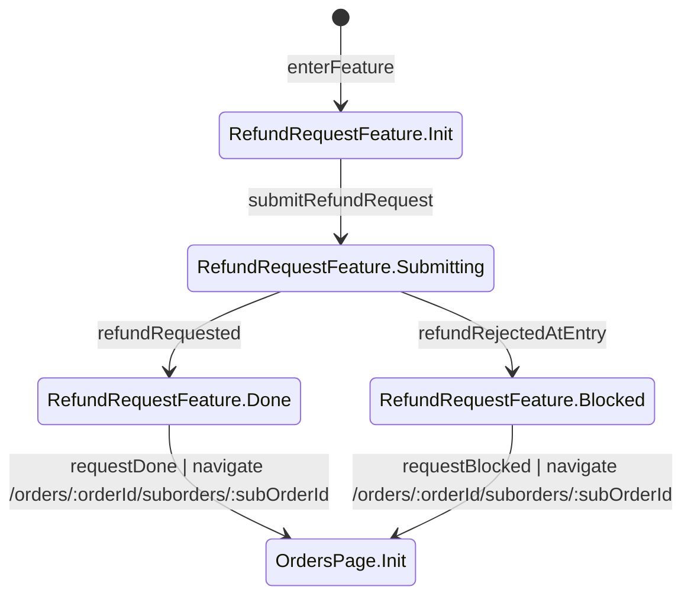
```mermaid
%% role: Buyer
stateDiagram-v2
    [*] --> RefundRequestFeature.Init : enterFeature
    %% verify: refund request feature starts only from the current buyer-owned suborder detail and receives the selected suborder context

    RefundRequestFeature.Init --> RefundRequestFeature.Submitting : submitRefundRequest
    %% verify: refund request submission includes buyer_id suborder_id reason and requested_amount, and only eligible paid shipped or delivered states are accepted according to platform rules

    RefundRequestFeature.Submitting --> RefundRequestFeature.Done : refundRequested
    %% verify: RefundRequest is created with status requested, the target SubOrder becomes refund_requested, the previous suborder status is preserved for potential rejection rollback, and the data is linked to the current buyer-owned resource only

    RefundRequestFeature.Submitting --> RefundRequestFeature.Blocked : refundRejectedAtEntry
    %% verify: refund request is blocked when the suborder is not eligible or ownership check fails, and no RefundRequest or SubOrder state change is persisted

    RefundRequestFeature.Done --> OrdersPage.Init : requestDone | navigate /orders/:orderId/suborders/:subOrderId
    %% verify: returning to suborder detail shows refund request status requested and suborder status refund_requested consistently

    RefundRequestFeature.Blocked --> OrdersPage.Init : requestBlocked | navigate /orders/:orderId/suborders/:subOrderId
    %% verify: returning to suborder detail shows the original suborder state unchanged with refund-request rejection feedback
```

## ⑲ ReviewCreateFeature State Machine
Source Pages: OrdersPage
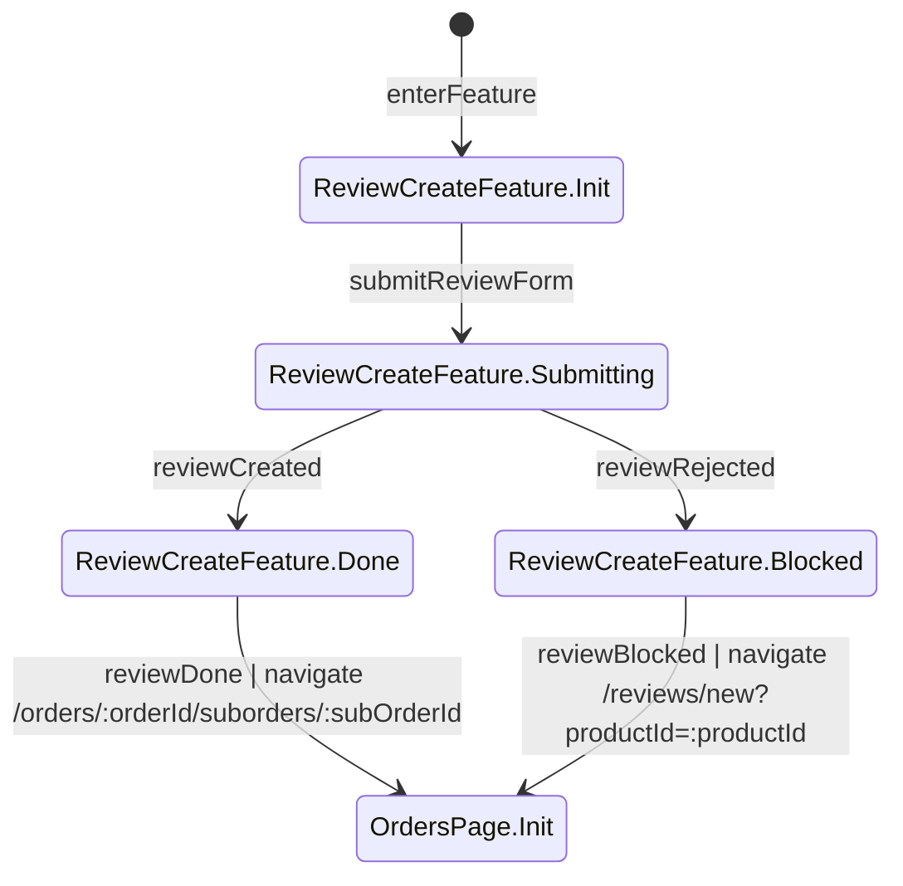
```mermaid
%% role: Buyer
stateDiagram-v2
    [*] --> ReviewCreateFeature.Init : enterFeature
    %% verify: review create feature starts only from buyer review form for a delivered transaction item and receives rating and comment input

    ReviewCreateFeature.Init --> ReviewCreateFeature.Submitting : submitReviewForm
    %% verify: review submission is sent once for the current buyer and product, rating and comment are validated, and comment handling applies the defined XSS-safe storage and rendering strategy consistently

    ReviewCreateFeature.Submitting --> ReviewCreateFeature.Done : reviewCreated
    %% verify: Review record is created for the current buyer and delivered product only, API returns success, and the created review is associated with the correct product and buyer

    ReviewCreateFeature.Submitting --> ReviewCreateFeature.Blocked : reviewRejected
    %% verify: review is rejected when the product is not from a delivered buyer transaction or input validation fails, and no Review record is created

    ReviewCreateFeature.Done --> OrdersPage.Init : reviewDone | navigate /orders/:orderId/suborders/:subOrderId
    %% verify: returning to suborder detail reflects that the delivered transaction now has its review submitted and no duplicate review is silently created

    ReviewCreateFeature.Blocked --> OrdersPage.Init : reviewBlocked | navigate /reviews/new?productId=:productId
    %% verify: blocked review returns to the review form route with validation or eligibility feedback and no persisted review data
```

## ⑳ SellerApplicationSubmitFeature State Machine
Source Pages: SellerConsolePage
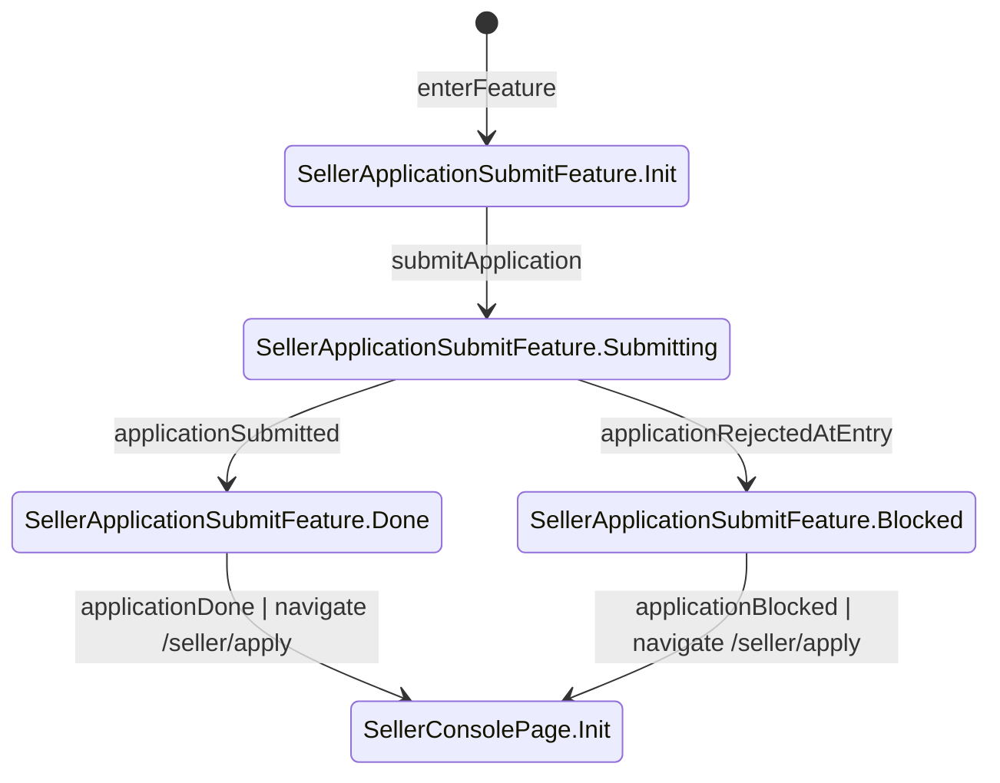
```mermaid
%% role: Buyer
stateDiagram-v2
    [*] --> SellerApplicationSubmitFeature.Init : enterFeature
    %% verify: seller application feature starts only from buyer seller-apply page and receives the applicant's own identity and form data

    SellerApplicationSubmitFeature.Init --> SellerApplicationSubmitFeature.Submitting : submitApplication
    %% verify: seller application request is sent once with applicant user_id and shop_name, and the action does not grant seller permissions during submission

    SellerApplicationSubmitFeature.Submitting --> SellerApplicationSubmitFeature.Done : applicationSubmitted
    %% verify: SellerApplication is created with status submitted, ownership is tied to the current user, and no seller role is added before admin approval

    SellerApplicationSubmitFeature.Submitting --> SellerApplicationSubmitFeature.Blocked : applicationRejectedAtEntry
    %% verify: submission is blocked when the applicant is not eligible or required form data is invalid, and no SellerApplication record is created

    SellerApplicationSubmitFeature.Done --> SellerConsolePage.Init : applicationDone | navigate /seller/apply
    %% verify: returning to seller apply page shows the submitted application state and does not expose seller-only console sections yet

    SellerApplicationSubmitFeature.Blocked --> SellerConsolePage.Init : applicationBlocked | navigate /seller/apply
    %% verify: returning to seller apply page shows validation or eligibility feedback with no new application persisted
```

## ㉑ SellerProductSaveFeature State Machine
Source Pages: SellerConsolePage
```mermaid
%% role: Seller
stateDiagram-v2
    [*] --> SellerProductSaveFeature.Init : enterFeature
    %% verify: seller product save feature starts only from seller-owned product create or edit pages and receives seller-scoped form data

    SellerProductSaveFeature.Init --> SellerProductSaveFeature.Submitting : submitProductForm
    %% verify: product save request is sent once for the current seller, editable product fields are validated, and duplicate submissions are prevented

    SellerProductSaveFeature.Submitting --> SellerProductSaveFeature.Done : productSaved
    %% verify: Product record is created or updated for the current seller only, API returns success, and saved fields such as title description price stock category and status are persisted consistently

    SellerProductSaveFeature.Submitting --> SellerProductSaveFeature.Blocked : productSaveRejected
    %% verify: save is rejected when validation fails or ownership does not match, and no unintended Product changes are persisted

    SellerProductSaveFeature.Done --> SellerConsolePage.Init : saveDone | navigate /seller/products
    %% verify: returning to seller product list shows the new or updated current seller product with consistent status and ownership

    SellerProductSaveFeature.Blocked --> SellerConsolePage.Init : saveBlocked | navigate /seller/products
    %% verify: returning to seller product list leaves previous product data unchanged and shows save rejection feedback
```

## ㉒ SellerProductStatusFeature State Machine
Source Pages: SellerConsolePage
```mermaid
%% role: Seller
stateDiagram-v2
    [*] --> SellerProductStatusFeature.Init : enterFeature
    %% verify: product status feature starts only for seller-owned products from the seller product list

    SellerProductStatusFeature.Init --> SellerProductStatusFeature.Submitting : submitStatusChange
    %% verify: status change request is sent once for the current seller-owned product and only draft active inactive transitions under seller control are allowed

    SellerProductStatusFeature.Submitting --> SellerProductStatusFeature.Done : statusChanged
    %% verify: Product status is updated successfully for the current seller-owned product and product visibility in public catalog remains consistent with the resulting status

    SellerProductStatusFeature.Submitting --> SellerProductStatusFeature.Blocked : statusChangeRejected
    %% verify: status change is rejected for invalid transitions or ownership mismatch, and public visibility and product state remain unchanged

    SellerProductStatusFeature.Done --> SellerConsolePage.Init : statusDone | navigate /seller/products
    %% verify: returning to seller product list shows the updated product status for the current seller only

    SellerProductStatusFeature.Blocked --> SellerConsolePage.Init : statusBlocked | navigate /seller/products
    %% verify: returning to seller product list shows the original status unchanged with rejection feedback
```

## ㉓ SellerFulfillmentFeature State Machine
Source Pages: SellerConsolePage
```mermaid
%% role: Seller
stateDiagram-v2
    [*] --> SellerFulfillmentFeature.Init : enterFeature
    %% verify: fulfillment feature starts only from seller-owned suborder detail for a currently paid suborder

    SellerFulfillmentFeature.Init --> SellerFulfillmentFeature.Submitting : submitShipment
    %% verify: shipment submission is sent once for the selected seller-owned suborder and is allowed only when the suborder status is paid

    SellerFulfillmentFeature.Submitting --> SellerFulfillmentFeature.Done : suborderShipped
    %% verify: SubOrder status changes from paid to shipped only, API returns success, and the parent Order aggregate status recalculates consistently to paid or partially_shipped as required

    SellerFulfillmentFeature.Submitting --> SellerFulfillmentFeature.Blocked : shipmentRejected
    %% verify: shipment is rejected for non-paid or non-owned suborders, and no SubOrder or Order aggregate state is changed

    SellerFulfillmentFeature.Done --> SellerConsolePage.Init : shipmentDone | navigate /seller/orders/:subOrderId
    %% verify: returning to seller suborder detail shows the suborder as shipped and parent order aggregate status remains consistent with all suborders

    SellerFulfillmentFeature.Blocked --> SellerConsolePage.Init : shipmentBlocked | navigate /seller/orders/:subOrderId
    %% verify: returning to seller suborder detail shows the original status unchanged with shipment rejection feedback
```

## ㉔ SellerRefundReviewFeature State Machine
Source Pages: SellerConsolePage
```mermaid
%% role: Seller
stateDiagram-v2
    [*] --> SellerRefundReviewFeature.Init : enterFeature
    %% verify: seller refund review feature starts only from seller-owned suborder detail with an active refund request

    SellerRefundReviewFeature.Init --> SellerRefundReviewFeature.Submitting : submitRefundDecision
    %% verify: refund decision submission is sent once for the seller-owned refund request and contains the seller decision context

    SellerRefundReviewFeature.Submitting --> SellerRefundReviewFeature.Approved : refundApproved
    %% verify: approved refund updates RefundRequest toward approved or refunded handling, changes the related SubOrder toward refunded when refund completes, and preserves auditable decision data including approved_amount when applicable

    SellerRefundReviewFeature.Submitting --> SellerRefundReviewFeature.Rejected : refundRejected
    %% verify: rejected refund sets RefundRequest to rejected, restores the SubOrder to its saved pre-request status from refund_requested_prev_status, and writes the decision to audit data

    SellerRefundReviewFeature.Submitting --> SellerRefundReviewFeature.Escalated : escalateToAdmin
    %% verify: escalation keeps the refund request available for admin handling, preserves current request and suborder context, and records the escalation path

    SellerRefundReviewFeature.Approved --> SellerConsolePage.Init : decisionDone | navigate /seller/orders/:subOrderId
    %% verify: returning to seller suborder detail shows the approved or refunded outcome consistently with refund request data and suborder status

    SellerRefundReviewFeature.Rejected --> SellerConsolePage.Init : decisionDone | navigate /seller/orders/:subOrderId
    %% verify: returning to seller suborder detail shows RefundRequest rejected and the suborder restored to the correct prior state rather than remaining refund_requested

    SellerRefundReviewFeature.Escalated --> AdminConsolePage.Init : escalateDone | navigate /admin/refunds
    %% verify: admin refunds page becomes the next handling point, the same refund request is visible to admin, and seller escalation does not lose request context
```

## ㉕ AdminSellerApplicationReviewFeature State Machine
Source Pages: AdminConsolePage
```mermaid
%% role: Platform Admin
stateDiagram-v2
    [*] --> AdminSellerApplicationReviewFeature.Init : enterFeature
    %% verify: admin seller application review starts only from admin seller-application list with a selected submitted application

    AdminSellerApplicationReviewFeature.Init --> AdminSellerApplicationReviewFeature.Submitting : submitApplicationDecision
    %% verify: review decision request is sent once by the current admin and carries the target SellerApplication identity plus decision data

    AdminSellerApplicationReviewFeature.Submitting --> AdminSellerApplicationReviewFeature.Approved : applicationApproved
    %% verify: SellerApplication status becomes approved, the applicant gains Seller role, reviewed_by_admin_id is recorded, and an AuditLog entry is written for the approval action

    AdminSellerApplicationReviewFeature.Submitting --> AdminSellerApplicationReviewFeature.Rejected : applicationRejected
    %% verify: SellerApplication status becomes rejected, no Seller role is granted, reviewed_by_admin_id is recorded, and an AuditLog entry is written for the rejection action

    AdminSellerApplicationReviewFeature.Approved --> AdminConsolePage.Init : reviewDone | navigate /admin/seller-applications
    %% verify: returning to seller-application list shows the updated approved status and removes the application from pending-submitted handling as appropriate

    AdminSellerApplicationReviewFeature.Rejected --> AdminConsolePage.Init : reviewDone | navigate /admin/seller-applications
    %% verify: returning to seller-application list shows the updated rejected status and keeps the applicant without seller access until a new eligible submission exists
```

## ㉖ AdminCategoryManageFeature State Machine
Source Pages: AdminConsolePage
```mermaid
%% role: Platform Admin
stateDiagram-v2
    [*] --> AdminCategoryManageFeature.Init : enterFeature
    %% verify: admin category management starts only from admin categories page with a selected category create or update action

    AdminCategoryManageFeature.Init --> AdminCategoryManageFeature.Submitting : submitCategoryChange
    %% verify: category change request is sent once by the current admin and includes the targeted category data

    AdminCategoryManageFeature.Submitting --> AdminCategoryManageFeature.Done : categoryChanged
    %% verify: Category record is created or updated successfully, status active or inactive is persisted consistently, and an AuditLog entry is written for the admin action

    AdminCategoryManageFeature.Submitting --> AdminCategoryManageFeature.Blocked : categoryChangeRejected
    %% verify: invalid category changes are rejected, no unintended Category data is persisted, and no partial admin update remains visible

    AdminCategoryManageFeature.Done --> AdminConsolePage.Init : categoryDone | navigate /admin/categories
    %% verify: returning to admin categories shows the updated category data and status consistently

    AdminCategoryManageFeature.Blocked --> AdminConsolePage.Init : categoryBlocked | navigate /admin/categories
    %% verify: returning to admin categories leaves prior category data unchanged with rejection feedback
```

## ㉗ AdminOrderInterventionFeature State Machine
Source Pages: AdminConsolePage
```mermaid
%% role: Platform Admin
stateDiagram-v2
    [*] --> AdminOrderInterventionFeature.Init : enterFeature
    %% verify: admin order intervention starts only from admin orders page with a selected order or suborder intervention context

    AdminOrderInterventionFeature.Init --> AdminOrderInterventionFeature.Submitting : submitOrderIntervention
    %% verify: intervention request is sent once by the current admin and includes the target order or suborder identity plus chosen action

    AdminOrderInterventionFeature.Submitting --> AdminOrderInterventionFeature.Done : interventionApplied
    %% verify: allowed admin intervention is applied to the targeted order flow, resulting Order and SubOrder states are updated consistently with business rules, and an AuditLog entry records actor role action target_type and target_id

    AdminOrderInterventionFeature.Submitting --> AdminOrderInterventionFeature.Blocked : interventionRejected
    %% verify: invalid or disallowed admin intervention is rejected, no unintended state change is persisted, and audit context can still record the denied attempt if implemented

    AdminOrderInterventionFeature.Done --> AdminConsolePage.Init : interventionDone | navigate /admin/orders
    %% verify: returning to admin orders shows the updated order or suborder state consistently after intervention

    AdminOrderInterventionFeature.Blocked --> AdminConsolePage.Init : interventionBlocked | navigate /admin/orders
    %% verify: returning to admin orders leaves original order data unchanged with intervention rejection feedback
```

## ㉘ AdminDisputeResolveFeature State Machine
Source Pages: AdminConsolePage
```mermaid
%% role: Platform Admin
stateDiagram-v2
    [*] --> AdminDisputeResolveFeature.Init : enterFeature
    %% verify: admin dispute resolution starts only from admin disputes page with a selected open dispute case

    AdminDisputeResolveFeature.Init --> AdminDisputeResolveFeature.Submitting : submitDisputeResolution
    %% verify: resolution request is sent once by the current admin and includes the selected dispute case plus resolution details

    AdminDisputeResolveFeature.Submitting --> AdminDisputeResolveFeature.Done : disputeResolved
    %% verify: DisputeCase status changes from open to resolved, resolution_note is stored, and the admin action is audit logged consistently

    AdminDisputeResolveFeature.Submitting --> AdminDisputeResolveFeature.Blocked : resolutionRejected
    %% verify: resolution is rejected when the dispute is not eligible or input is invalid, and the DisputeCase remains unchanged

    AdminDisputeResolveFeature.Done --> AdminConsolePage.Init : resolutionDone | navigate /admin/disputes
    %% verify: returning to admin disputes shows the case as resolved with persisted resolution data

    AdminDisputeResolveFeature.Blocked --> AdminConsolePage.Init : resolutionBlocked | navigate /admin/disputes
    %% verify: returning to admin disputes shows the original dispute state unchanged with resolution rejection feedback
```

## ㉙ AdminRefundInterventionFeature State Machine
Source Pages: AdminConsolePage
```mermaid
%% role: Platform Admin
stateDiagram-v2
    [*] --> AdminRefundInterventionFeature.Init : enterFeature
    %% verify: admin refund intervention starts only from admin refunds page with a selected refund request context

    AdminRefundInterventionFeature.Init --> AdminRefundInterventionFeature.Submitting : submitRefundDecision
    %% verify: refund decision request is sent once by the current admin and includes the selected RefundRequest and chosen decision action

    AdminRefundInterventionFeature.Submitting --> AdminRefundInterventionFeature.Approved : refundApproved
    %% verify: approved refund updates RefundRequest toward approved or refunded completion, updates the related SubOrder to refunded when refund completes, updates Order aggregate status if all suborders are refunded, and writes an AuditLog entry

    AdminRefundInterventionFeature.Submitting --> AdminRefundInterventionFeature.Rejected : refundRejected
    %% verify: rejected refund sets RefundRequest to rejected, restores the SubOrder to its saved prior state, keeps data consistency across order aggregates, and writes an AuditLog entry

    AdminRefundInterventionFeature.Submitting --> AdminRefundInterventionFeature.Forced : refundForced
    %% verify: forced refund applies the admin override, completes refund handling on the targeted refund and suborder, updates order aggregates consistently, and writes an AuditLog entry for the forced action

    AdminRefundInterventionFeature.Approved --> AdminConsolePage.Init : refundDone | navigate /admin/refunds
    %% verify: returning to admin refunds shows the updated approved or refunded refund request and consistent suborder state

    AdminRefundInterventionFeature.Rejected --> AdminConsolePage.Init : refundDone | navigate /admin/refunds
    %% verify: returning to admin refunds shows the rejected refund request and the restored suborder state rather than refund_requested

    AdminRefundInterventionFeature.Forced --> AdminConsolePage.Init : refundDone | navigate /admin/refunds
    %% verify: returning to admin refunds shows the forced refund result, related financial and status data are consistent, and the action remains auditable
```