全體結構說明
[Entry State]
        ↓
[Page State Machine]
        ↓
[Role-specific Page State]
        ↓
[Feature / Function State Machine]
        ↓
[回到 Page 或跳轉其他 Page，或跳轉到其他 Feature]

以下將照這個層級排序。

---

## ① Entry State Machine
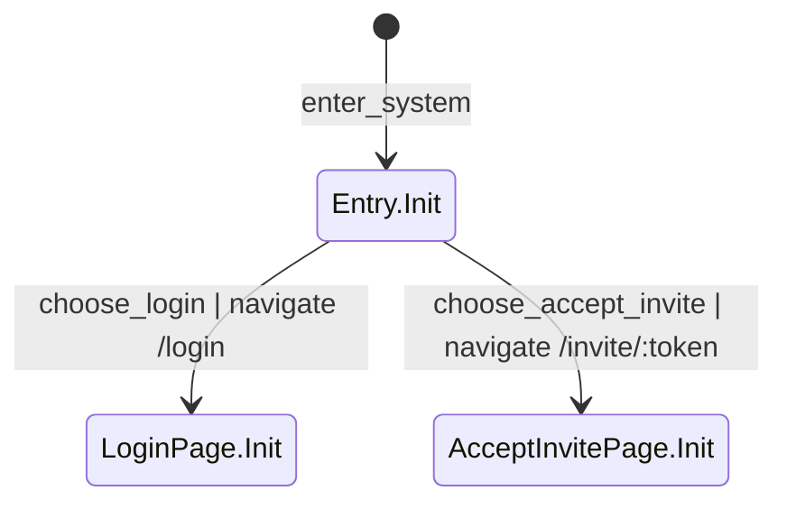

---

## ② Login Page（/login）
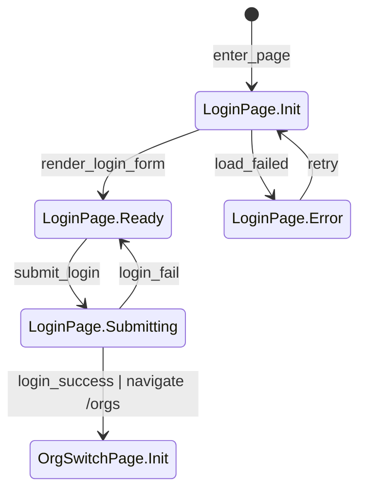

## ③ Accept Invite Page（/invite/:token）
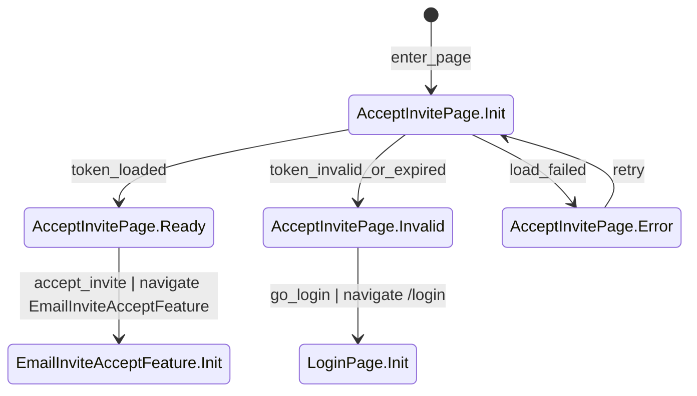

## ④ Organization Switch Page（/orgs）
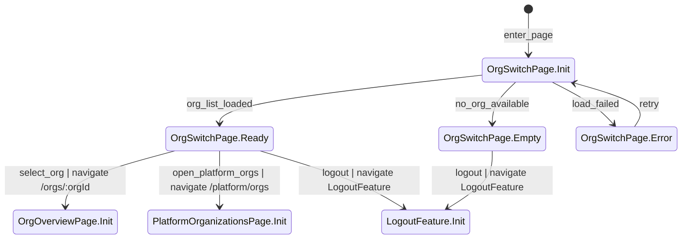

## ⑤ Org Overview Page（/orgs/:orgId）
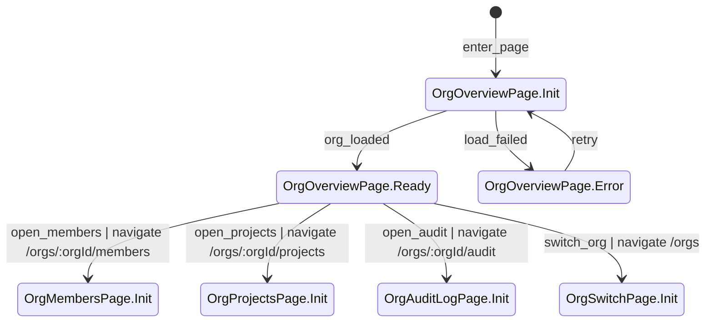

## ⑥ Org Members Page（/orgs/:orgId/members）
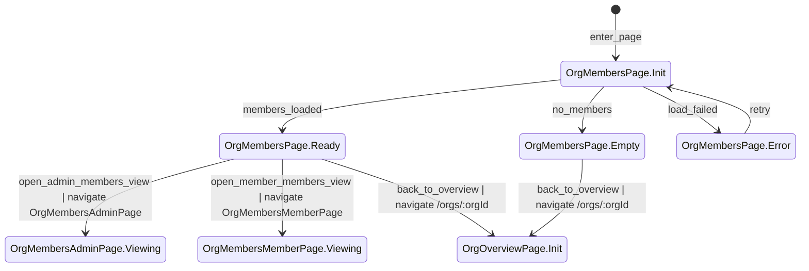

## ⑦ Org Projects Page（/orgs/:orgId/projects）
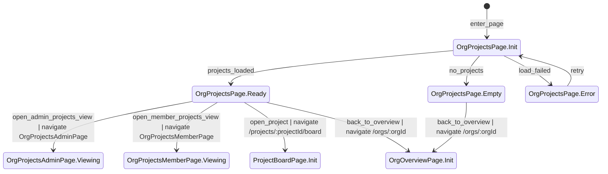

## ⑧ Org Audit Log Page（/orgs/:orgId/audit）
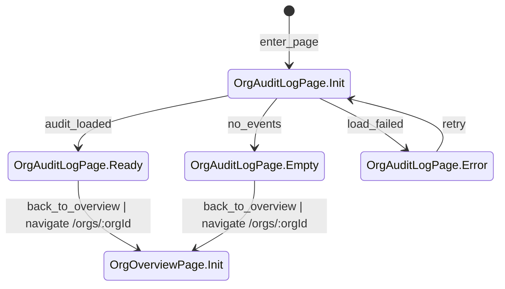

## ⑨ Platform Organizations Page（/platform/orgs）
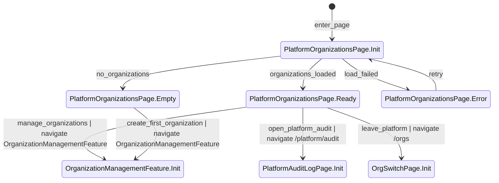

## ⑩ Platform Audit Log Page（/platform/audit）
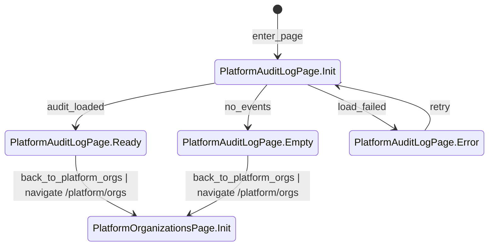

## ⑪ Project Board Page（/projects/:projectId/board）
```mermaid
stateDiagram-v2
    [*] --> ProjectBoardPage.Init : enter_page
    %% verify: 只有 project 成員可進入 board；未登入回 401，非成員依存在性策略回 404，避免 project 外洩。

    ProjectBoardPage.Init --> ProjectBoardPage.Ready : board_loaded
    %% verify: board API 回傳 issues 與 workflow statuses；欄位需對應 workflow，若 org suspended 或 project archived，畫面標示唯讀。

    ProjectBoardPage.Init --> ProjectBoardPage.Empty : no_issues
    %% verify: 沒有 issue 時顯示 Empty；建立 issue CTA 是否可見需依角色、org status、project status 同步決定。

    ProjectBoardPage.Init --> ProjectBoardPage.Error : load_failed
    %% verify: 載入失敗時只顯示錯誤與 Retry；不得殘留錯誤的 board 欄位或 issues 快取。

    ProjectBoardPage.Ready --> ProjectBoardManagerPage.Viewing : open_manager_board_view | navigate ProjectBoardManagerPage
    %% verify: Project Manager 視角可見建立 issue 與狀態轉換入口；唯讀狀態下所有寫入入口必須 disabled 或 hidden。

    ProjectBoardPage.Ready --> ProjectBoardDeveloperPage.Viewing : open_developer_board_view | navigate ProjectBoardDeveloperPage
    %% verify: Developer 視角只能看到被允許的建立 issue 與合法狀態轉換入口；不得看到 workflow 或 archive 設定入口。

    ProjectBoardPage.Ready --> ProjectBoardViewerPage.Viewing : open_viewer_board_view | navigate ProjectBoardViewerPage
    %% verify: Viewer 視角只可檢視 board；所有建立、編輯、拖曳轉換入口都必須 hidden 或 disabled。

    ProjectBoardPage.Ready --> ProjectIssuesListPage.Init : open_issue_list | navigate /projects/:projectId/issues
    %% verify: 導向 issues list 後維持相同 project context；issue 排序與列表內容需與 board 所屬 project 一致。

    ProjectBoardPage.Ready --> ProjectBacklogPage.Init : open_backlog | navigate /projects/:projectId/backlog
    %% verify: 只有 scrum project 顯示 backlog 導覽；kanban project 不顯示入口，直連此路徑應被拒絕或顯示不適用。

    ProjectBoardPage.Ready --> ProjectSprintsPage.Init : open_sprints | navigate /projects/:projectId/sprints
    %% verify: 只有 scrum project 顯示 sprints 導覽；kanban project 不得藉由手動輸入 URL 取得 sprint 管理畫面。

    ProjectBoardPage.Ready --> ProjectSettingsPage.Init : open_settings | navigate /projects/:projectId/settings
    %% verify: Settings 導覽只對 Project Manager 與具備成員管理責任的 Org Admin 可見；Developer 與 Viewer 不顯示入口。

    ProjectBoardPage.Ready --> IssueDetailPage.Init : open_issue_detail | navigate /projects/:projectId/issues/:issueKey
    %% verify: 打開 issue 詳情時需以 issueKey 載入同一 project 的 issue；不存在回 404，非成員回 404，資料不得跨 project 泄漏。

    ProjectBoardPage.Empty --> ProjectIssuesListPage.Init : open_issue_list | navigate /projects/:projectId/issues
    %% verify: 從 Empty 狀態切到 issue list 後仍指向同一 project；若列表仍無資料，畫面應一致顯示 Empty。

    ProjectBoardPage.Error --> ProjectBoardPage.Init : retry
    %% verify: Retry 重新拉取 board；成功後欄位、issue 分佈與唯讀標示需與後端狀態同步。
```

## ⑫ Project Backlog Page（/projects/:projectId/backlog）
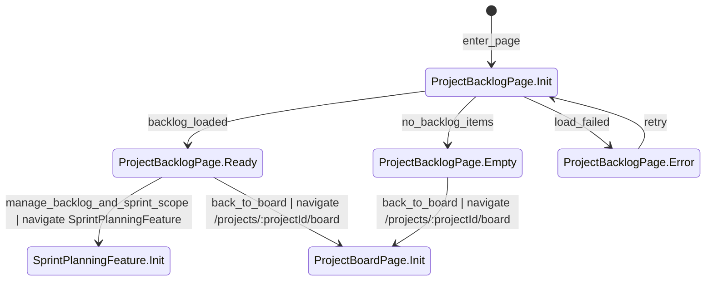

## ⑬ Project Sprints Page（/projects/:projectId/sprints）
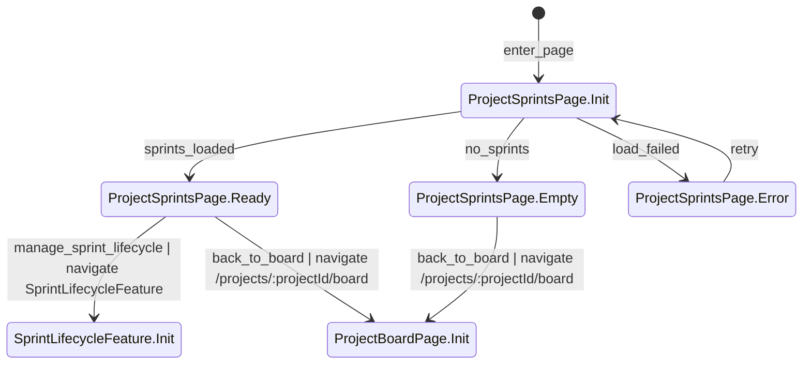

## ⑭ Project Issues List Page（/projects/:projectId/issues）
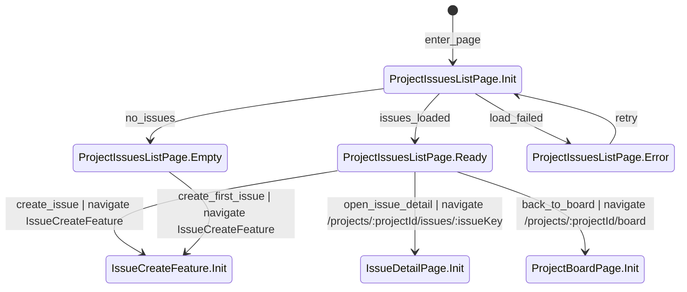

## ⑮ Issue Detail Page（/projects/:projectId/issues/:issueKey）
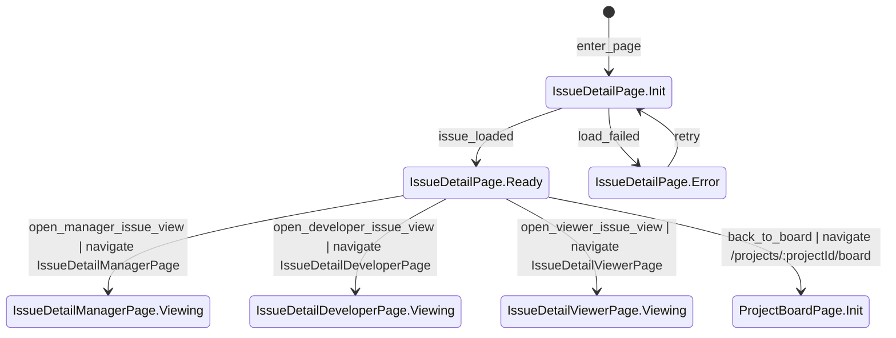

## ⑯ Project Settings Page（/projects/:projectId/settings）
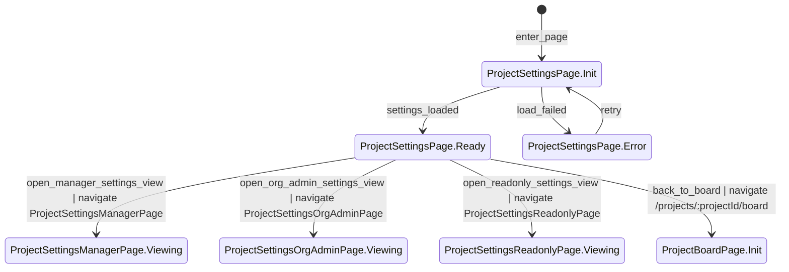

---

## ⑰ Org Members Page（Org Admin 視角）
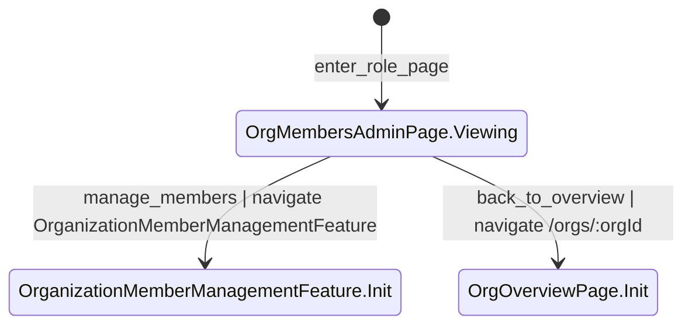

## ⑱ Org Members Page（Org Member 視角）
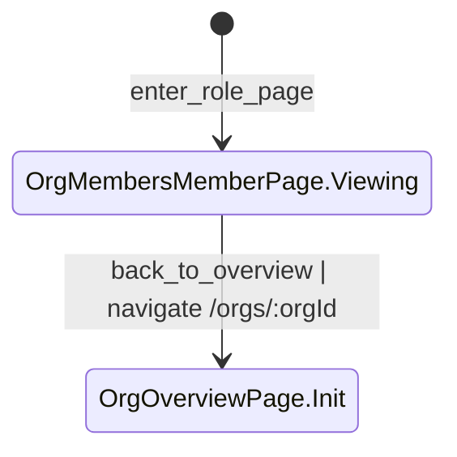

## ⑲ Org Projects Page（Org Admin 視角）
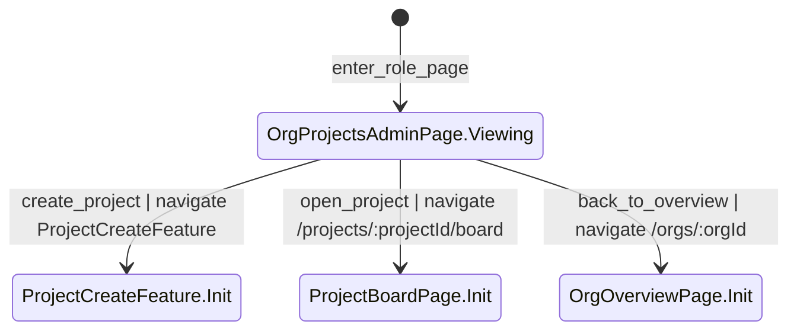

## ⑳ Org Projects Page（Org Member 視角）
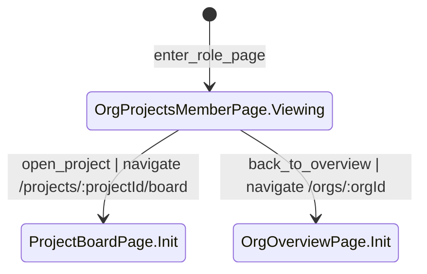

## ㉑ Project Board Page（Project Manager 視角）
```mermaid
stateDiagram-v2
    [*] --> ProjectBoardManagerPage.Viewing : enter_role_page
    %% verify: Project Manager 視角可見建立 issue 與合法狀態轉換入口；若 org suspended 或 project archived，所有寫入入口需禁用。

    ProjectBoardManagerPage.Viewing --> IssueCreateFeature.Init : create_issue | navigate IssueCreateFeature
    %% verify: 建立 issue 前 UI 只顯示單一建立入口；送出時必填 title，type 必須是該 project 已啟用的 issue type。

    ProjectBoardManagerPage.Viewing --> IssueStatusTransitionFeature.Init : change_issue_status | navigate IssueStatusTransitionFeature
    %% verify: 狀態轉換入口只允許 workflow 定義的合法 transition；API 寫入時需保留 from/to 並更新 issue.updated_at。

    ProjectBoardManagerPage.Viewing --> IssueDetailPage.Init : open_issue_detail | navigate /projects/:projectId/issues/:issueKey
    %% verify: 打開 issue 詳情時欄位與 board 卡片相同；issueKey、status、assignee 需與 board 卡片資料一致。

    ProjectBoardManagerPage.Viewing --> ProjectIssuesListPage.Init : open_issue_list | navigate /projects/:projectId/issues
    %% verify: 從 board 切到 list 後，issue 集合需一致；排序與列表欄位要能正確顯示 issue_key 與更新時間。
```

## ㉒ Project Board Page（Developer 視角）
```mermaid
stateDiagram-v2
    [*] --> ProjectBoardDeveloperPage.Viewing : enter_role_page
    %% verify: Developer 視角只顯示專案允許的建立 issue 入口與合法狀態轉換；不得顯示 workflow 或 project 設定入口。

    ProjectBoardDeveloperPage.Viewing --> IssueCreateFeature.Init : create_issue_if_allowed | navigate IssueCreateFeature
    %% verify: 若專案不允許 Developer 建立 issue，該 CTA 不得顯示；若顯示，後端仍需驗證 developer 權限與唯讀規則。

    ProjectBoardDeveloperPage.Viewing --> IssueStatusTransitionFeature.Init : change_issue_status | navigate IssueStatusTransitionFeature
    %% verify: Developer 只能執行 workflow 允許的 transition；非法轉換不得改變 status，也不得產生 audit 紀錄。

    ProjectBoardDeveloperPage.Viewing --> IssueDetailPage.Init : open_issue_detail | navigate /projects/:projectId/issues/:issueKey
    %% verify: 切往 detail 後 issue 欄位需與 board 一致；同一 issue 的狀態、標題、assignee 不得出現不同步。

    ProjectBoardDeveloperPage.Viewing --> ProjectIssuesListPage.Init : open_issue_list | navigate /projects/:projectId/issues
    %% verify: 切往 list 後只顯示當前 project 的 issues；Developer 不應因此得到額外設定權限。
```

## ㉓ Project Board Page（Viewer 視角）
```mermaid
stateDiagram-v2
    [*] --> ProjectBoardViewerPage.Viewing : enter_role_page
    %% verify: Viewer 視角僅能檢視 board；建立 issue、拖曳卡片、狀態切換等入口必須全部 hidden 或 disabled。

    ProjectBoardViewerPage.Viewing --> IssueDetailPage.Init : open_issue_detail | navigate /projects/:projectId/issues/:issueKey
    %% verify: Viewer 可查看 issue 詳情，但 detail 中也必須維持唯讀；不得在 detail 裡顯示留言或編輯 CTA。

    ProjectBoardViewerPage.Viewing --> ProjectIssuesListPage.Init : open_issue_list | navigate /projects/:projectId/issues
    %% verify: 切往 issue list 後仍維持唯讀；建立 issue CTA 不得因頁面切換而出現。
```

## ㉔ Issue Detail Page（Project Manager 視角）
```mermaid
stateDiagram-v2
    [*] --> IssueDetailManagerPage.Viewing : enter_role_page
    %% verify: Project Manager 視角可見欄位編輯、狀態轉換、留言與 epic link 管理入口；唯讀狀態下全部寫入 CTA 必須禁用。

    IssueDetailManagerPage.Viewing --> IssueEditFeature.Init : edit_issue_fields | navigate IssueEditFeature
    %% verify: 可編輯欄位包含 title、description、priority、assignee、labels、due_date、estimate；提交時須帶 optimistic concurrency 條件。

    IssueDetailManagerPage.Viewing --> IssueStatusTransitionFeature.Init : change_issue_status | navigate IssueStatusTransitionFeature
    %% verify: 狀態轉換前需驗證目前 status 仍存在於 workflow；若 status 已 deprecated，伺服端必須拒絕並顯示明確提示。

    IssueDetailManagerPage.Viewing --> IssueCommentFeature.Init : add_comment | navigate IssueCommentFeature
    %% verify: 留言入口只對可留言角色顯示；提交期間 CTA disabled，避免重送建立重複 comment。

    IssueDetailManagerPage.Viewing --> EpicLinkFeature.Init : update_epic_link | navigate EpicLinkFeature
    %% verify: epic link 管理只允許同 project 的 epic 與 child issue 關聯；更新不得改寫 child issue 自身 status。

    IssueDetailManagerPage.Viewing --> ProjectBoardPage.Init : back_to_board | navigate /projects/:projectId/board
    %% verify: 返回 board 後該 issue 的 status、assignee 與標題需與 detail 編輯後資料一致。
```

## ㉕ Issue Detail Page（Developer 視角）
```mermaid
stateDiagram-v2
    [*] --> IssueDetailDeveloperPage.Viewing : enter_role_page
    %% verify: Developer 視角只顯示專案允許的 issue 編輯、狀態轉換、留言與可能的 epic link 入口；不得出現 project 設定操作。

    IssueDetailDeveloperPage.Viewing --> IssueEditFeature.Init : edit_issue_fields_if_allowed | navigate IssueEditFeature
    %% verify: 若專案不允許 Developer 編輯欄位，該 CTA 不得顯示；若允許，後端仍需驗證權限與 CONFLICT 檢查。

    IssueDetailDeveloperPage.Viewing --> IssueStatusTransitionFeature.Init : change_issue_status | navigate IssueStatusTransitionFeature
    %% verify: Developer 的 status 變更只允許合法 transition；成功時需更新 updated_at，失敗時 status 必須維持不變。

    IssueDetailDeveloperPage.Viewing --> IssueCommentFeature.Init : add_comment | navigate IssueCommentFeature
    %% verify: Developer 可留言；留言提交後 comment 應顯示 author、created_at，且 project archived 或 org suspended 時必須被拒絕。

    IssueDetailDeveloperPage.Viewing --> EpicLinkFeature.Init : update_epic_link_if_allowed | navigate EpicLinkFeature
    %% verify: 若專案允許 Developer 管理 epic link，後端仍需驗證 epic 類型與 project 歸屬；不允許時 CTA 不得顯示。

    IssueDetailDeveloperPage.Viewing --> ProjectBoardPage.Init : back_to_board | navigate /projects/:projectId/board
    %% verify: 返回 board 後 issue card 需反映 detail 中最新欄位與 status；Developer 不應因此取得額外角色權限。
```

## ㉖ Issue Detail Page（Viewer 視角）
```mermaid
stateDiagram-v2
    [*] --> IssueDetailViewerPage.Viewing : enter_role_page
    %% verify: Viewer 視角只有讀取權限；編輯欄位、留言、狀態轉換、epic link 管理入口都必須 hidden 或 disabled。

    IssueDetailViewerPage.Viewing --> ProjectBoardPage.Init : back_to_board | navigate /projects/:projectId/board
    %% verify: 返回 board 後仍維持 viewer 導覽規則；board 上任何寫入入口都不得出現。
```

## ㉗ Project Settings Page（Project Manager 視角）
```mermaid
stateDiagram-v2
    [*] --> ProjectSettingsManagerPage.Viewing : enter_role_page
    %% verify: Project Manager 視角可見 workflow、issue types、archive project 區塊；唯讀狀態時這些提交按鈕需 disabled。

    ProjectSettingsManagerPage.Viewing --> WorkflowManagementFeature.Init : edit_workflow | navigate WorkflowManagementFeature
    %% verify: 進入 workflow 編輯前應載入現行 workflow version；只有 Project Manager 可看到此入口，Developer 與 Viewer 不可見。

    ProjectSettingsManagerPage.Viewing --> IssueTypeManagementFeature.Init : edit_issue_types | navigate IssueTypeManagementFeature
    %% verify: issue type 編輯只允許 story、task、bug、epic 的啟用停用；提交前 UI 應顯示目前啟用狀態。

    ProjectSettingsManagerPage.Viewing --> ProjectArchiveFeature.Init : archive_project | navigate ProjectArchiveFeature
    %% verify: Archive Project 為不可逆操作；UI 必須要求明確確認，且唯讀狀態或權限不足時不可觸發。

    ProjectSettingsManagerPage.Viewing --> ProjectBoardPage.Init : back_to_board | navigate /projects/:projectId/board
    %% verify: 返回 board 後 workflow、archive 狀態與任何唯讀限制需已同步到 project 介面。
```

## ㉘ Project Settings Page（Org Admin 視角）
```mermaid
stateDiagram-v2
    [*] --> ProjectSettingsOrgAdminPage.Viewing : enter_role_page
    %% verify: Org Admin 視角只可管理 project 成員與角色；workflow、issue types、archive 區塊不得顯示，除非同時具備 Project Manager 角色。

    ProjectSettingsOrgAdminPage.Viewing --> ProjectRoleAssignmentFeature.Init : manage_project_roles | navigate ProjectRoleAssignmentFeature
    %% verify: 角色管理前需載入 project memberships；被指派者必須先是 org 成員，不得跨 organization 指派。

    ProjectSettingsOrgAdminPage.Viewing --> ProjectBoardPage.Init : back_to_board | navigate /projects/:projectId/board
    %% verify: 返回 board 後 project 導覽不應出現 Org Admin 無權限的設定 CTA；project 成員角色調整若已成功，權限需立即生效。
```

## ㉙ Project Settings Page（Developer / Viewer 視角）
```mermaid
stateDiagram-v2
    [*] --> ProjectSettingsReadonlyPage.Viewing : enter_role_page
    %% verify: Developer 與 Viewer 進入此收斂狀態時只能看到 Forbidden 或唯讀提示；任何設定提交入口都不得出現。

    ProjectSettingsReadonlyPage.Viewing --> ProjectBoardPage.Init : back_to_board | navigate /projects/:projectId/board
    %% verify: 返回 board 後依舊維持原角色的可見性規則；Settings 導覽對無權限者不應保留高亮或可操作狀態。
```

---

## ㉚ Feature: Logout
```mermaid
stateDiagram-v2
    [*] --> LogoutFeature.Init : enter_feature
    %% verify: 進入登出功能時仍處於已登入 session；UI 不應再出現第二個登出 CTA，避免重複觸發。

    LogoutFeature.Init --> LogoutFeature.ClearingSession : clear_session
    %% verify: 呼叫登出 API 後 session cookie 開始清除；提交期間受保護導覽應立即收斂，避免使用者繼續操作寫入功能。

    LogoutFeature.ClearingSession --> LogoutFeature.Done : logout_completed
    %% verify: 登出 API 回 200；session cookie 已清空，之後再打受保護 API 應回 401。

    LogoutFeature.Done --> LoginPage.Init : go_login | navigate /login
    %% verify: 回到 /login 後只顯示 Guest 導覽；/orgs、/projects、/platform 入口皆不可見。
```

## ㉛ Feature: Email Invite Accept
```mermaid
stateDiagram-v2
    [*] --> EmailInviteAcceptFeature.Init : enter_feature
    %% verify: 進入邀請接受功能時必須攜帶有效 token；空 token 或格式錯誤不得進入可接受狀態。

    EmailInviteAcceptFeature.Init --> EmailInviteAcceptFeature.Validated : validate_token
    %% verify: 驗證 token 時需檢查 organization_id、expires_at、accepted_at；成功後才可進入可接受狀態。

    EmailInviteAcceptFeature.Validated --> EmailInviteAcceptFeature.Accepted : accept_invite
    %% verify: 接受邀請 API 回 200 時需完成 email 一致性檢查；不存在的帳號可建立並設定密碼，已存在帳號須以同 email 完成。

    EmailInviteAcceptFeature.Validated --> EmailInviteAcceptFeature.Rejected : reject_invite
    %% verify: token 無效、已使用或 email 不匹配時應拒絕；不得建立 membership，也不得寫入 accepted_at。

    EmailInviteAcceptFeature.Accepted --> EmailInviteAcceptFeature.MembershipCreated : create_membership
    %% verify: OrganizationMembership 建立時 organization_id、user_id、org_role 與 status=active 需正確；Audit Log 記錄 member_joined 或等效事件。

    EmailInviteAcceptFeature.MembershipCreated --> OrgSwitchPage.Init : auto_login_complete | navigate /orgs
    %% verify: 若系統支援 auto login，需設置 session cookie 並導向 /orgs；新 membership 應立即出現在 organization 清單中。

    EmailInviteAcceptFeature.MembershipCreated --> LoginPage.Init : prompt_login | navigate /login
    %% verify: 若不 auto login，導向 /login 時不能遺失剛建立的 membership；使用同 email 登入後應可看見該 organization。

    EmailInviteAcceptFeature.Rejected --> AcceptInvitePage.Init : return_to_invite | navigate /invite/:token
    %% verify: 回到邀請頁時保留拒絕原因提示；接受邀請 CTA 應維持不可用，且 token 狀態不被錯誤修改。
```

## ㉜ Feature: Organization Management
```mermaid
stateDiagram-v2
    [*] --> OrganizationManagementFeature.Init : enter_feature
    %% verify: 只有 Platform Admin 可進入組織管理功能；非 Platform Admin 無法從 UI 或 API 觸發此功能。

    OrganizationManagementFeature.Init --> OrganizationManagementFeature.CreatingOrganization : submit_organization
    %% verify: 建立 organization 時必填 name 與初始 Org Admin email；plan 預設 free、status 預設 active、created_by_user_id 為操作者。

    OrganizationManagementFeature.CreatingOrganization --> PlatformOrganizationsPage.Init : organization_created | navigate /platform/orgs
    %% verify: API 回 200 後 organization 已建立，初始 Org Admin 加入流程已準備好；清單需立即顯示新 organization 與預設 plan/status。

    OrganizationManagementFeature.CreatingOrganization --> OrganizationManagementFeature.Init : organization_creation_failed
    %% verify: 欄位缺漏或格式錯誤時回 400；畫面保留表單與具體錯誤訊息，不得建立任何 organization 或 invite。

    OrganizationManagementFeature.Init --> OrganizationManagementFeature.UpdatingPlan : change_plan
    %% verify: 只有 free 與 paid 可被設定；送出時需指定正確 organization，且更新不影響既有 membership 與 project 關聯。

    OrganizationManagementFeature.UpdatingPlan --> PlatformOrganizationsPage.Init : plan_updated | navigate /platform/orgs
    %% verify: plan 更新成功後 API 回 200；清單與詳情都顯示新 plan，Audit Log 記錄 organization_plan_changed。

    OrganizationManagementFeature.Init --> OrganizationManagementFeature.SuspendingOrganization : suspend_organization
    %% verify: 停權操作只對 Platform Admin 可用；確認後 org status 變為 suspended，後續該 org 所有寫入 API 應回 ORG_SUSPENDED。

    OrganizationManagementFeature.SuspendingOrganization --> PlatformOrganizationsPage.Init : organization_suspended | navigate /platform/orgs
    %% verify: 清單顯示 suspended 狀態；該 org 內 Members、Projects、Issue 等頁面必須同步轉為唯讀。

    OrganizationManagementFeature.Init --> OrganizationManagementFeature.UnsuspendingOrganization : unsuspend_organization
    %% verify: 解除停權操作仍只對 Platform Admin 可用；status 變回 active 不得影響 project archived 的不可逆限制。

    OrganizationManagementFeature.UnsuspendingOrganization --> PlatformOrganizationsPage.Init : organization_unsuspended | navigate /platform/orgs
    %% verify: 成功後寫入入口依原角色恢復可用；Audit Log 記錄 organization_unsuspended，清單狀態同步更新。
```

## ㉝ Feature: Organization Member Management
```mermaid
stateDiagram-v2
    [*] --> OrganizationMemberManagementFeature.Init : enter_feature
    %% verify: 只有 Org Admin 可進入成員管理功能；Org Member 即使知道 API 路徑也應回 403。

    OrganizationMemberManagementFeature.Init --> OrganizationMemberManagementFeature.SendingInvite : send_invite
    %% verify: 發送邀請前需驗證 email 格式；建立 invite 時 token 必須 unique，expires_at 有值，accepted_at 為空。

    OrganizationMemberManagementFeature.SendingInvite --> OrgMembersPage.Init : invite_sent | navigate /orgs/:orgId/members
    %% verify: invite 建立成功後 API 回 200；Audit Log 記錄 member_invited，Members 頁可反映邀請已寄送狀態。

    OrganizationMemberManagementFeature.SendingInvite --> OrganizationMemberManagementFeature.Init : invite_failed
    %% verify: org suspended 或欄位驗證失敗時不得建立 invite；UI 顯示具體原因，表單內容保留供修正。

    OrganizationMemberManagementFeature.Init --> OrganizationMemberManagementFeature.UpdatingMemberStatus : update_member_status
    %% verify: 更新 member 狀態時只能操作當前 organization 的 membership；移除或停用需明確指定目標 member。

    OrganizationMemberManagementFeature.UpdatingMemberStatus --> OrgMembersPage.Init : member_updated | navigate /orgs/:orgId/members
    %% verify: API 回 200 後 OrganizationMembership.status 已更新；被移除成員再次進入 /orgs/:orgId* 時應回 404，Audit Log 需記錄變更。

    OrganizationMemberManagementFeature.UpdatingMemberStatus --> OrganizationMemberManagementFeature.Init : update_rejected
    %% verify: org suspended 或權限不足時回 403；成員狀態不應部分更新，畫面需顯示明確拒絕原因。
```

## ㉞ Feature: Project Create
```mermaid
stateDiagram-v2
    [*] --> ProjectCreateFeature.Init : enter_feature
    %% verify: 只有 Org Admin 可進入建立專案功能；Org Member 與非成員不應看到此入口，也不得成功呼叫 API。

    ProjectCreateFeature.Init --> ProjectCreateFeature.CreatingProject : submit_project
    %% verify: 建立專案需提供 key、name、type；type 只允許 scrum 或 kanban，project key 必須在 organization 內唯一。

    ProjectCreateFeature.CreatingProject --> OrgProjectsPage.Init : project_created | navigate /orgs/:orgId/projects
    %% verify: API 回 200 後 Project 建立成功，organization_id 正確，並初始化預設 workflow 與 issue types；Audit Log 記錄 project_created。

    ProjectCreateFeature.CreatingProject --> ProjectCreateFeature.Init : project_creation_failed
    %% verify: key 重複、欄位缺漏或 org suspended 時不得建立 project；錯誤訊息需具體指出衝突欄位或唯讀原因。
```

## ㉟ Feature: Project Role Assignment
```mermaid
stateDiagram-v2
    [*] --> ProjectRoleAssignmentFeature.Init : enter_feature
    %% verify: 只有具成員管理責任的 Org Admin 可進入此功能；被指派者必須已是該 organization 成員。

    ProjectRoleAssignmentFeature.Init --> ProjectRoleAssignmentFeature.UpdatingRole : assign_project_role
    %% verify: 可指派角色僅限 project_manager、developer、viewer；不得跨 project 或跨 organization 建立 membership。

    ProjectRoleAssignmentFeature.UpdatingRole --> ProjectSettingsPage.Init : project_role_updated | navigate /projects/:projectId/settings
    %% verify: API 回 200 後 ProjectMembership 已建立或更新；Audit Log 記錄 project_role_changed，新權限需立即反映在導覽與 API 存取上。

    ProjectRoleAssignmentFeature.UpdatingRole --> ProjectRoleAssignmentFeature.Init : assignment_failed
    %% verify: org suspended、目標成員不屬於 org 或角色值不合法時回 403/400；畫面保留表單並不改變現有角色。
```

## ㊱ Feature: Issue Create
```mermaid
stateDiagram-v2
    [*] --> IssueCreateFeature.Init : enter_feature
    %% verify: 只有被專案允許建立 issue 的 Project Manager 或 Developer 可進入；Viewer 不得顯示此入口。

    IssueCreateFeature.Init --> IssueCreateFeature.CreatingIssue : submit_issue
    %% verify: 建立 issue 時 title 必填，type 必須在 project 已啟用的 issue types 內；提交期間 CTA disabled 防重送。

    IssueCreateFeature.CreatingIssue --> ProjectBoardPage.Init : issue_created_to_board | navigate /projects/:projectId/board
    %% verify: API 回 200 後 issue_key 在 project 內唯一且遞增、reporter_user_id 為操作者、board 立即顯示新 issue 與正確 status 欄位。

    IssueCreateFeature.CreatingIssue --> ProjectIssuesListPage.Init : issue_created_to_list | navigate /projects/:projectId/issues
    %% verify: 成功返回 list 時列表可見新 issue_key、title、updated_at；排序結果需與後端 created_at 或 updated_at 一致。

    IssueCreateFeature.CreatingIssue --> IssueCreateFeature.Init : issue_creation_failed
    %% verify: 權限不足、project archived、org suspended 或欄位錯誤時不得建立 issue；不應產生重複 issue_key 或部分 audit 紀錄。
```

## ㊲ Feature: Issue Status Transition
```mermaid
stateDiagram-v2
    [*] --> IssueStatusTransitionFeature.Init : enter_feature
    %% verify: 只有 Project Manager 與具權限的 Developer 可進入狀態轉換；Viewer 不得顯示此入口。

    IssueStatusTransitionFeature.Init --> IssueStatusTransitionFeature.TransitioningIssue : submit_status_transition
    %% verify: 提交時後端必須檢查 workflow transition 合法、issue 所在 project 正確，並記錄 from_status 與 to_status。

    IssueStatusTransitionFeature.TransitioningIssue --> ProjectBoardPage.Init : transition_saved_to_board | navigate /projects/:projectId/board
    %% verify: 轉換成功後 API 回 200；board 上 issue 需移到新欄位，updated_at 更新，Audit Log 記錄狀態流轉。

    IssueStatusTransitionFeature.TransitioningIssue --> IssueDetailPage.Init : transition_saved_to_detail | navigate /projects/:projectId/issues/:issueKey
    %% verify: 轉換成功返回 detail 時 status、timeline 與 updated_at 已更新；若 status 已 deprecated，這條成功路徑不應發生。

    IssueStatusTransitionFeature.TransitioningIssue --> IssueStatusTransitionFeature.Init : transition_rejected
    %% verify: 非法 transition、權限不足、project archived、org suspended 或 deprecated status 時回 400/403；issue status 不變且不應留下部分更新。
```

## ㊳ Feature: Issue Edit
```mermaid
stateDiagram-v2
    [*] --> IssueEditFeature.Init : enter_feature
    %% verify: 只有允許編輯 issue 的角色可進入；Viewer 不得進入，唯讀狀態下此功能應直接被拒絕。

    IssueEditFeature.Init --> IssueEditFeature.EditingIssue : save_issue_changes
    %% verify: 儲存變更時需提交受影響欄位與 optimistic concurrency 條件；編輯期間主要 CTA disabled，避免重送。

    IssueEditFeature.EditingIssue --> IssueDetailPage.Init : issue_saved | navigate /projects/:projectId/issues/:issueKey
    %% verify: API 回 200 後 title、description、priority、assignee、labels、due_date、estimate 與 updated_at 已同步更新；Audit Log 記錄 before/after。

    IssueEditFeature.EditingIssue --> IssueEditFeature.Init : issue_save_rejected
    %% verify: 權限不足、project archived、org suspended 或 CONFLICT 時回 403/409；detail 中欄位不得部分更新，需顯示具體錯誤。
```

## ㊴ Feature: Issue Comment
```mermaid
stateDiagram-v2
    [*] --> IssueCommentFeature.Init : enter_feature
    %% verify: 只有 Project Manager 與 Developer 可進入留言功能；Viewer 不得顯示留言輸入框或送出按鈕。

    IssueCommentFeature.Init --> IssueCommentFeature.SubmittingComment : submit_comment
    %% verify: 送出留言時主要 CTA disabled；comment body 需經 XSS 處理規則保護，不得以明文腳本回顯。

    IssueCommentFeature.SubmittingComment --> IssueDetailPage.Init : comment_saved | navigate /projects/:projectId/issues/:issueKey
    %% verify: API 回 200 後建立 IssueComment，顯示 author_user_id 對應的作者資訊與 created_at，Audit Log 記錄 comment_created。

    IssueCommentFeature.SubmittingComment --> IssueCommentFeature.Init : comment_rejected
    %% verify: project archived、org suspended、權限不足或欄位驗證失敗時不得建立 comment；detail timeline 不應新增虛假留言。
```

## ㊵ Feature: Epic Link Management
```mermaid
stateDiagram-v2
    [*] --> EpicLinkFeature.Init : enter_feature
    %% verify: 只有被允許管理 epic 關聯的角色可進入；Viewer 不得看到新增或移除 epic link 的入口。

    EpicLinkFeature.Init --> EpicLinkFeature.UpdatingEpicLink : submit_epic_link_change
    %% verify: 提交時必須驗證 epic_issue_id 的 issue.type=epic、child_issue_id 屬於同一 project，且關聯變更不改寫 child issue status。

    EpicLinkFeature.UpdatingEpicLink --> IssueDetailPage.Init : epic_link_saved | navigate /projects/:projectId/issues/:issueKey
    %% verify: API 回 200 後 IssueEpicLink 已新增或移除；detail 畫面顯示最新關聯，Audit Log 記錄 epic_link_added 或 epic_link_removed。

    EpicLinkFeature.UpdatingEpicLink --> EpicLinkFeature.Init : epic_link_rejected
    %% verify: 權限不足、project archived、org suspended 或 epic 驗證失敗時不得修改 link；既有關聯與 child issue 欄位保持不變。
```

## ㊶ Feature: Workflow Management
```mermaid
stateDiagram-v2
    [*] --> WorkflowManagementFeature.Init : enter_feature
    %% verify: 只有 Project Manager 可進入 workflow 管理；Org Admin 若沒有 project_manager 角色，不得看到此入口。

    WorkflowManagementFeature.Init --> WorkflowManagementFeature.EditingWorkflow : save_workflow
    %% verify: 送出 workflow 時需檢查 statuses 與 transitions 的參照完整性；新版本建立前不能破壞既有 workflow 歷史。

    WorkflowManagementFeature.EditingWorkflow --> ProjectSettingsPage.Init : workflow_saved | navigate /projects/:projectId/settings
    %% verify: API 回 200 後建立新的 workflow version 並設為 active；settings 顯示最新 version，Audit Log 記錄 workflow_updated。

    WorkflowManagementFeature.EditingWorkflow --> WorkflowManagementFeature.Init : workflow_save_rejected
    %% verify: 權限不足、project archived、org suspended 或規則不合法時回 403/400；現有 active workflow 不得被部分覆寫。
```

## ㊷ Feature: Issue Type Management
```mermaid
stateDiagram-v2
    [*] --> IssueTypeManagementFeature.Init : enter_feature
    %% verify: 只有 Project Manager 可進入 issue type 管理；其他角色不顯示此入口，也不得成功呼叫 API。

    IssueTypeManagementFeature.Init --> IssueTypeManagementFeature.EditingIssueTypes : save_issue_types
    %% verify: 只允許啟用或停用 story、task、bug、epic 四種 issue type；提交期間需防重送並保持目前設定可回溯。

    IssueTypeManagementFeature.EditingIssueTypes --> ProjectSettingsPage.Init : issue_types_saved | navigate /projects/:projectId/settings
    %% verify: API 回 200 後 ProjectIssueType 狀態已更新；settings 畫面顯示最新啟用清單，Audit Log 記錄 issue_types_updated。

    IssueTypeManagementFeature.EditingIssueTypes --> IssueTypeManagementFeature.Init : issue_types_save_rejected
    %% verify: 權限不足、project archived、org suspended 或資料不合法時不得更新；現有 issue type 啟用狀態保持不變。
```

## ㊸ Feature: Sprint Planning
```mermaid
stateDiagram-v2
    [*] --> SprintPlanningFeature.Init : enter_feature
    %% verify: 只有 scrum project 的 Project Manager 可進入 backlog 規劃；Developer 與 Viewer 不顯示建立 Sprint 或調整 sprint scope 的入口。

    SprintPlanningFeature.Init --> SprintPlanningFeature.ManagingBacklog : update_sprint_scope
    %% verify: 更新 backlog 與 sprint scope 時需檢查 issue.sprint_id 關聯合法；提交期間主要 CTA disabled，避免重複寫入。

    SprintPlanningFeature.ManagingBacklog --> ProjectBacklogPage.Init : backlog_saved | navigate /projects/:projectId/backlog
    %% verify: API 回 200 後 issue.sprint_id 與 sprint 規劃結果一致；backlog 頁面顯示最新 issue 分配與 sprint 區塊。

    SprintPlanningFeature.ManagingBacklog --> SprintPlanningFeature.Init : backlog_update_rejected
    %% verify: 非 scrum project、權限不足、project archived 或 org suspended 時不得更新；issue 與 sprint 關聯保持原狀。
```

## ㊹ Feature: Sprint Lifecycle
```mermaid
stateDiagram-v2
    [*] --> SprintLifecycleFeature.Init : enter_feature
    %% verify: 只有 scrum project 的 Project Manager 可進入 sprint 生命週期管理；Developer 與 Viewer 無法從 UI 或 API 觸發。

    SprintLifecycleFeature.Init --> SprintLifecycleFeature.ManagingSprintLifecycle : update_sprint_status
    %% verify: 送出時僅允許 planned→active 或 active→closed 的合法轉換；不得在唯讀狀態下更新 sprint。

    SprintLifecycleFeature.ManagingSprintLifecycle --> ProjectSprintsPage.Init : sprint_updated | navigate /projects/:projectId/sprints
    %% verify: API 回 200 後 sprint status 已更新；sprints 頁面與 backlog、board 中的 sprint 表示需保持一致，Audit Log 記錄變更。

    SprintLifecycleFeature.ManagingSprintLifecycle --> SprintLifecycleFeature.Init : sprint_update_rejected
    %% verify: 權限不足、project archived、org suspended 或轉換不合法時回 403/400；sprint 狀態不得部分更新。
```

## ㊺ Feature: Project Archive
```mermaid
stateDiagram-v2
    [*] --> ProjectArchiveFeature.Init : enter_feature
    %% verify: 只有 Project Manager 可進入 archive 功能；Org Admin 若沒有 project_manager 角色，不得看到此入口。

    ProjectArchiveFeature.Init --> ProjectArchiveFeature.ConfirmingArchive : confirm_archive
    %% verify: 進入確認步驟時 UI 必須清楚標示 archive 不可逆；需二次確認後才會送出 API。

    ProjectArchiveFeature.ConfirmingArchive --> ProjectArchiveFeature.Archived : archive_completed
    %% verify: API 回 200 後 Project.status=archived；此後所有 issue 欄位更新、狀態轉換、留言與 backlog、sprint 寫入都必須回 PROJECT_ARCHIVED。

    ProjectArchiveFeature.ConfirmingArchive --> ProjectArchiveFeature.Init : archive_rejected
    %% verify: 權限不足、org suspended 或確認取消時不得改變 project status；archive 不得部分成功。

    ProjectArchiveFeature.Archived --> ProjectSettingsPage.Init : return_archived_settings | navigate /projects/:projectId/settings
    %% verify: 返回 settings 後畫面需清楚標示 archived，且所有寫入 CTA disabled；不得提供 restore 入口。
```