全體結構說明
[Entry State]
        ↓
[Page State Machine]
        ↓
[Role-specific Page State]
        ↓
[Feature / Function State Machine]
        ↓
[回到 Page 或跳轉其他 Page，或跳轉到其他 Feature]

以下將照這個層級排序。

## ① Entry State Machine
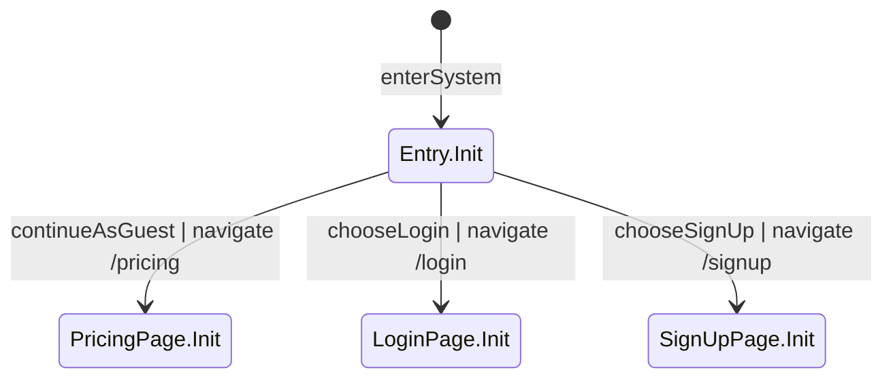
```mermaid
%% role: none
stateDiagram-v2
    [*] --> Entry.Init: enterSystem
    %% verify: entry route renders guest-safe entry options only, Guest header shows Pricing, Login, Sign Up, and no App or Admin navigation is visible

    Entry.Init --> PricingPage.Init: continueAsGuest | navigate /pricing
    %% verify: navigate to /pricing succeeds with public access, pricing page loads without session, and header still hides App and Admin navigation

    Entry.Init --> LoginPage.Init: chooseLogin | navigate /login
    %% verify: navigate to /login succeeds with public access, login form route is reachable without session, and no authenticated-only navigation is rendered

    Entry.Init --> SignUpPage.Init: chooseSignUp | navigate /signup
    %% verify: navigate to /signup succeeds with public access, sign-up form route is reachable without session, and no authenticated-only navigation is rendered
```

## ② Pricing Page State Machine
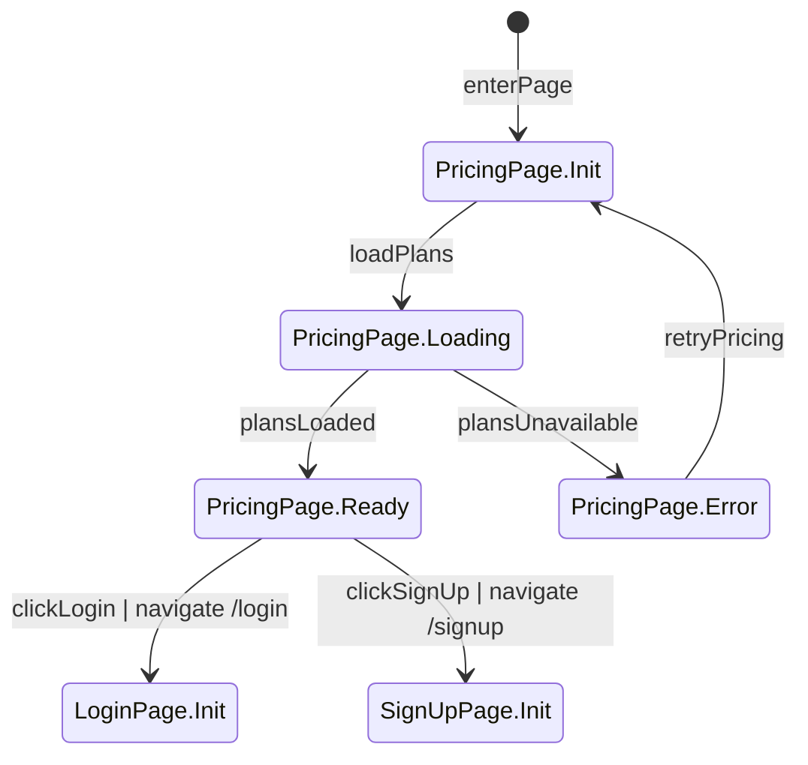
```mermaid
%% role: Guest
stateDiagram-v2
    [*] --> PricingPage.Init: enterPage
    %% verify: /pricing renders public pricing layout, Guest header shows Pricing, Login, Sign Up only, and no App or Admin CTA is shown

    PricingPage.Init --> PricingPage.Loading: loadPlans
    %% verify: pricing API request starts once per page entry, pricing CTA is not duplicated in page body and header, and loading state prevents repeated fetch submission

    PricingPage.Loading --> PricingPage.Ready: plansLoaded
    %% verify: plans API returns 200 with data-driven plan names, billing cycles, prices, limits, and features, and UI shows plan comparison without authenticated-only controls

    PricingPage.Loading --> PricingPage.Error: plansUnavailable
    %% verify: failed pricing fetch shows understandable error state with retry action, no stale price table is rendered as ready data, and guest access remains public

    PricingPage.Ready --> LoginPage.Init: clickLogin | navigate /login
    %% verify: Login CTA appears once, navigation to /login succeeds, and selected pricing context does not expose any App or Admin route

    PricingPage.Ready --> SignUpPage.Init: clickSignUp | navigate /signup
    %% verify: Sign Up CTA appears once, navigation to /signup succeeds, and pricing comparison remains public with no authenticated-only action leakage

    PricingPage.Error --> PricingPage.Init: retryPricing
    %% verify: retry re-enters pricing initialization, issues a new plans fetch, and clears prior error banner before reloading
```

## ③ Login Page State Machine
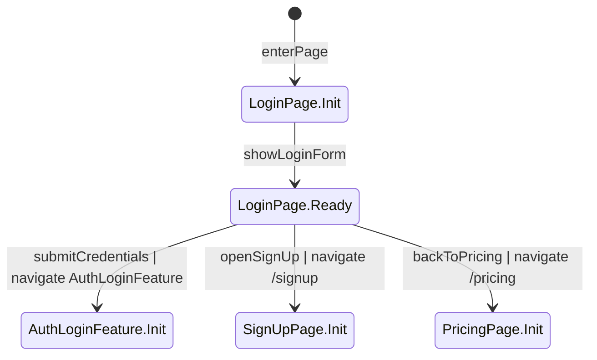
```mermaid
%% role: none
stateDiagram-v2
    [*] --> LoginPage.Init: enterPage
    %% verify: /login is publicly reachable, login layout renders without requiring session, and Guest header excludes App and Admin navigation

    LoginPage.Init --> LoginPage.Ready: showLoginForm
    %% verify: login form fields and submit CTA render, submit action is shown once, and no sign-in-protected data is fetched before credentials are entered

    LoginPage.Ready --> AuthLoginFeature.Init: submitCredentials | navigate AuthLoginFeature
    %% verify: login submit sends credential request once, submit button prevents duplicate submission while auth starts, and authentication logic is handled by backend rather than UI-only role checks

    LoginPage.Ready --> SignUpPage.Init: openSignUp | navigate /signup
    %% verify: navigate to /signup succeeds, cross-link remains public, and login page does not retain duplicate registration CTA after navigation

    LoginPage.Ready --> PricingPage.Init: backToPricing | navigate /pricing
    %% verify: navigate back to /pricing succeeds, guest-visible pricing content is shown, and authenticated-only navigation remains hidden
```

## ④ Sign Up Page State Machine
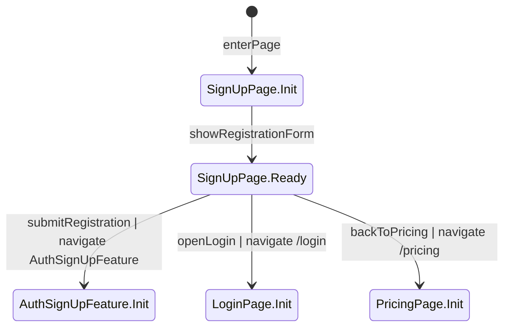
```mermaid
%% role: Guest
stateDiagram-v2
    [*] --> SignUpPage.Init: enterPage
    %% verify: /signup is publicly reachable, sign-up layout renders without session, and Guest header excludes App and Admin navigation

    SignUpPage.Init --> SignUpPage.Ready: showRegistrationForm
    %% verify: registration form fields and submit CTA render, sign-up CTA appears once, and no protected organization data is requested before submission

    SignUpPage.Ready --> AuthSignUpFeature.Init: submitRegistration | navigate AuthSignUpFeature
    %% verify: sign-up submit starts one registration request, UI prevents repeated submission, and backend creates identity through the defined onboarding flow instead of assuming existing membership

    SignUpPage.Ready --> LoginPage.Init: openLogin | navigate /login
    %% verify: navigate to /login succeeds, login form becomes the active auth entry, and sign-up page does not keep duplicate login CTA after navigation

    SignUpPage.Ready --> PricingPage.Init: backToPricing | navigate /pricing
    %% verify: navigate to /pricing succeeds, public plan comparison is shown, and no authenticated-only navigation is displayed
```

## ⑤ App Dashboard Page State Machine
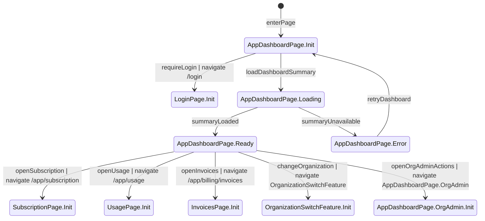
```mermaid
%% role: End User|Org Admin
%% base: AppDashboardPage
stateDiagram-v2
    [*] --> AppDashboardPage.Init: enterPage
    %% verify: entering /app requires authenticated session, unauthenticated access is intercepted before protected dashboard data is shown, and authenticated header is selected only after login succeeds

    AppDashboardPage.Init --> LoginPage.Init: requireLogin | navigate /login
    %% verify: unauthenticated request to /app returns 401 or route guard redirect to /login, dashboard data is not exposed, and return target remains the protected app area

    AppDashboardPage.Init --> AppDashboardPage.Loading: loadDashboardSummary
    %% verify: authenticated dashboard request starts summary fetch once for the selected organization, header shows Dashboard, Subscription, Usage, Invoices, and no duplicated page CTA is rendered

    AppDashboardPage.Loading --> AppDashboardPage.Ready: summaryLoaded
    %% verify: dashboard APIs return 200 with subscription status, plan, billing cycle, usage summary, recent invoices, and risk indicators scoped to the selected organization_id

    AppDashboardPage.Loading --> AppDashboardPage.Error: summaryUnavailable
    %% verify: failed dashboard fetch shows understandable error state with retry, no partial protected summary is treated as ready, and session state remains unchanged

    AppDashboardPage.Ready --> SubscriptionPage.Init: openSubscription | navigate /app/subscription
    %% verify: navigation to /app/subscription preserves selected organization context, subscription page opens for authenticated users only, and no duplicate subscription CTA is shown in both header and page body for the same action

    AppDashboardPage.Ready --> UsagePage.Init: openUsage | navigate /app/usage
    %% verify: navigation to /app/usage preserves selected organization context, usage page opens for authenticated users only, and meter data remains scoped to that organization

    AppDashboardPage.Ready --> InvoicesPage.Init: openInvoices | navigate /app/billing/invoices
    %% verify: navigation to invoice history preserves selected organization context, invoice list remains protected behind login, and only invoices for the chosen organization are reachable

    AppDashboardPage.Ready --> OrganizationSwitchFeature.Init: changeOrganization | navigate OrganizationSwitchFeature
    %% verify: organization switcher is visible only when user belongs to multiple organizations, switching starts org-scoped flow, and current dashboard data is not mutated until selection is applied

    AppDashboardPage.Ready --> AppDashboardPage.OrgAdmin.Init: openOrgAdminActions | navigate AppDashboardPage.OrgAdmin
    %% verify: Org Admin delta entry is available only when current member role is ORG_ADMIN, Payment Methods and Members shortcuts become visible only for Org Admin, and regular End User does not see these actions

    AppDashboardPage.Error --> AppDashboardPage.Init: retryDashboard
    %% verify: retry clears dashboard error state, re-runs organization-scoped summary fetch, and does not create duplicate dashboard requests from a single user action
```

## ⑥ Subscription Page State Machine
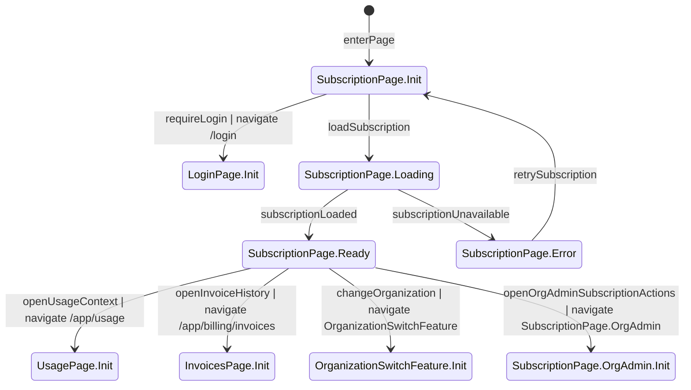
```mermaid
%% role: End User|Org Admin
%% base: SubscriptionPage
stateDiagram-v2
    [*] --> SubscriptionPage.Init: enterPage
    %% verify: entering /app/subscription requires authenticated session, protected subscription details are not rendered before auth succeeds, and authenticated app navigation is shown instead of guest navigation

    SubscriptionPage.Init --> LoginPage.Init: requireLogin | navigate /login
    %% verify: unauthenticated request to /app/subscription returns 401 or redirects to /login, subscription payload is not exposed, and protected route access is preserved for post-login return

    SubscriptionPage.Init --> SubscriptionPage.Loading: loadSubscription
    %% verify: subscription summary request starts once for the selected organization_id, loading state prevents repeated fetch actions, and page does not show Org Admin CTAs until role is resolved

    SubscriptionPage.Loading --> SubscriptionPage.Ready: subscriptionLoaded
    %% verify: API returns 200 with current plan, billing cycle, subscription.status, next invoice date, and pending downgrade data if present, all scoped to the selected organization

    SubscriptionPage.Loading --> SubscriptionPage.Error: subscriptionUnavailable
    %% verify: failed subscription fetch shows understandable error state and retry action, no stale plan or status is presented as current, and selected organization context remains intact

    SubscriptionPage.Ready --> UsagePage.Init: openUsageContext | navigate /app/usage
    %% verify: usage navigation preserves current organization, usage page reflects the same plan limits context, and cross-page data stays consistent with the loaded subscription

    SubscriptionPage.Ready --> InvoicesPage.Init: openInvoiceHistory | navigate /app/billing/invoices
    %% verify: invoice history navigation preserves organization scope, invoice records match the current subscription, and access remains restricted to authenticated organization members

    SubscriptionPage.Ready --> OrganizationSwitchFeature.Init: changeOrganization | navigate OrganizationSwitchFeature
    %% verify: organization switch flow starts from authenticated context only, currently loaded subscription data is organization-scoped, and selection change is deferred until user confirms switch

    SubscriptionPage.Ready --> SubscriptionPage.OrgAdmin.Init: openOrgAdminSubscriptionActions | navigate SubscriptionPage.OrgAdmin
    %% verify: Org Admin management entry appears only for ORG_ADMIN membership, Upgrade, Downgrade, Cancel, and Payment Methods actions are hidden or disabled for non-Org Admin users with clear reason

    SubscriptionPage.Error --> SubscriptionPage.Init: retrySubscription
    %% verify: retry clears subscription error state, starts a new organization-scoped fetch, and does not duplicate pending management actions
```

## ⑦ Usage Page State Machine
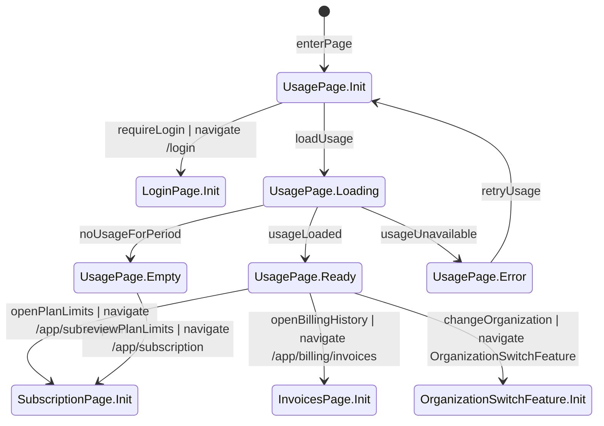
```mermaid
%% role: End User|Org Admin
stateDiagram-v2
    [*] --> UsagePage.Init: enterPage
    %% verify: entering /app/usage requires authenticated session, usage data is protected behind login, and authenticated app navigation is shown instead of guest navigation

    UsagePage.Init --> LoginPage.Init: requireLogin | navigate /login
    %% verify: unauthenticated request to /app/usage returns 401 or redirects to /login, no usage metrics are disclosed, and protected route target remains the usage page after login

    UsagePage.Init --> UsagePage.Loading: loadUsage
    %% verify: usage request starts once for selected organization_id and current billing period, loading state prevents repeated fetch actions, and page waits for meter and limit payload before enabling actions

    UsagePage.Loading --> UsagePage.Ready: usageLoaded
    %% verify: API returns 200 with API calls, storage, user count, project count, limits, reset time, and overage strategy for the current billing cycle, all scoped to the selected organization

    UsagePage.Loading --> UsagePage.Empty: noUsageForPeriod
    %% verify: API returns empty usage period without treating it as error, UI shows empty state plus reset timing and available limits, and no stale prior-period numbers remain visible

    UsagePage.Loading --> UsagePage.Error: usageUnavailable
    %% verify: failed usage fetch shows understandable error state with retry, no meter values are presented as current, and organization context is preserved for retry

    UsagePage.Ready --> SubscriptionPage.Init: openPlanLimits | navigate /app/subscription
    %% verify: navigation to subscription preserves current organization, plan and entitlement limits shown there match the usage page limit context, and access remains authenticated-only

    UsagePage.Ready --> InvoicesPage.Init: openBillingHistory | navigate /app/billing/invoices
    %% verify: navigation to invoices preserves organization scope, invoice history remains consistent with usage billing cycle, and protected billing data stays organization-isolated

    UsagePage.Ready --> OrganizationSwitchFeature.Init: changeOrganization | navigate OrganizationSwitchFeature
    %% verify: organization switch flow is available only for users with multiple organizations, current usage payload remains unchanged until selection is applied, and switch is scoped to the authenticated user memberships

    UsagePage.Empty --> SubscriptionPage.Init: reviewPlanLimits | navigate /app/subscription
    %% verify: from empty usage state user can review current plan limits, navigation preserves organization scope, and plan details explain limits without fabricating usage records

    UsagePage.Error --> UsagePage.Init: retryUsage
    %% verify: retry clears usage error state, issues a new billing-period usage request, and does not double-count or mutate stored usage values
```

## ⑧ Invoices Page State Machine
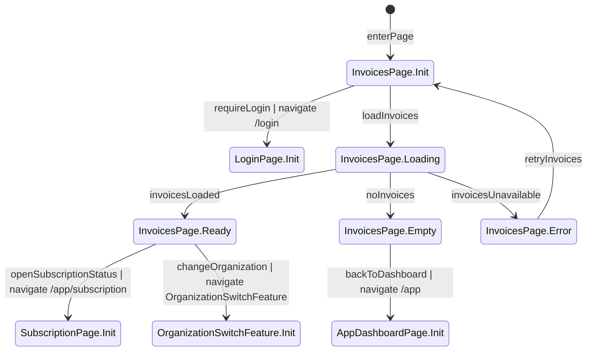
```mermaid
%% role: End User|Org Admin
stateDiagram-v2
    [*] --> InvoicesPage.Init: enterPage
    %% verify: entering /app/billing/invoices requires authenticated session, invoice data is protected, and authenticated app navigation is shown instead of guest navigation

    InvoicesPage.Init --> LoginPage.Init: requireLogin | navigate /login
    %% verify: unauthenticated request to invoice history returns 401 or redirects to /login, no billing amounts or statuses are exposed, and protected route target remains invoice history after login

    InvoicesPage.Init --> InvoicesPage.Loading: loadInvoices
    %% verify: invoice list request starts once for selected organization_id, loading state prevents repeated fetch actions, and page waits for billing payload before showing totals or statuses

    InvoicesPage.Loading --> InvoicesPage.Ready: invoicesLoaded
    %% verify: API returns 200 with invoice statuses Draft, Open, Paid, Failed, or Voided, billing periods, totals, and payment timestamps scoped to the selected organization

    InvoicesPage.Loading --> InvoicesPage.Empty: noInvoices
    %% verify: empty invoice response is rendered as empty state rather than error, UI shows no-invoice guidance, and no stale billing row remains visible

    InvoicesPage.Loading --> InvoicesPage.Error: invoicesUnavailable
    %% verify: failed invoice fetch shows understandable error state with retry, no stale payment result is treated as current, and organization scope remains unchanged

    InvoicesPage.Ready --> SubscriptionPage.Init: openSubscriptionStatus | navigate /app/subscription
    %% verify: navigation to subscription preserves organization scope, subscription status shown there is consistent with invoice payment result such as PastDue or Active, and access remains authenticated-only

    InvoicesPage.Ready --> OrganizationSwitchFeature.Init: changeOrganization | navigate OrganizationSwitchFeature
    %% verify: organization switching starts from authenticated invoice context only, invoice list remains bound to the current organization until switch is applied, and other organizations' invoices are not exposed

    InvoicesPage.Empty --> AppDashboardPage.Init: backToDashboard | navigate /app
    %% verify: navigation back to dashboard succeeds for authenticated users, dashboard summary stays in the same organization context, and invoice empty state does not leak across organizations

    InvoicesPage.Error --> InvoicesPage.Init: retryInvoices
    %% verify: retry clears invoice error state, starts a new organization-scoped invoice fetch, and does not duplicate invoice rows or payment events
```

## ⑨ Payment Methods Page State Machine
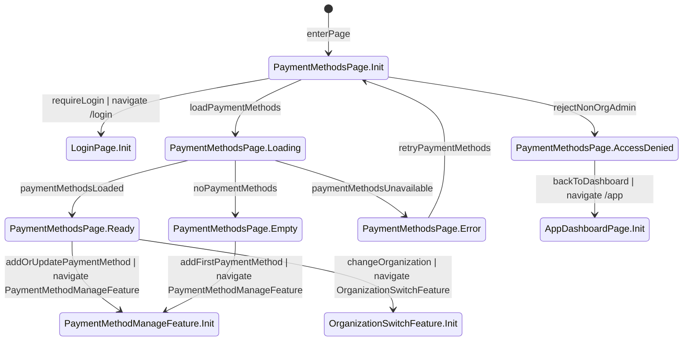
```mermaid
%% role: Org Admin
stateDiagram-v2
    [*] --> PaymentMethodsPage.Init: enterPage
    %% verify: entering /app/billing/payment-methods requires authenticated session and Org Admin authorization, payment method data is not exposed before both checks pass, and page is not listed for non-Org Admin navigation

    PaymentMethodsPage.Init --> LoginPage.Init: requireLogin | navigate /login
    %% verify: unauthenticated request returns 401 or redirects to /login, no payment method metadata is exposed, and protected route target remains payment methods after login

    PaymentMethodsPage.Init --> PaymentMethodsPage.AccessDenied: rejectNonOrgAdmin
    %% verify: authenticated non-Org Admin user receives 403 or access denied state, Add or Update Payment Method CTA is hidden or disabled with reason, and backend permission check is enforced beyond UI visibility

    PaymentMethodsPage.Init --> PaymentMethodsPage.Loading: loadPaymentMethods
    %% verify: Org Admin request starts one organization-scoped payment method fetch, loading state prevents repeated actions, and only methods for the selected organization_id are queried

    PaymentMethodsPage.Loading --> PaymentMethodsPage.Ready: paymentMethodsLoaded
    %% verify: API returns 200 with payment method list and default flag for the selected organization, UI shows manageable methods, and Add or Update CTA appears once for Org Admin

    PaymentMethodsPage.Loading --> PaymentMethodsPage.Empty: noPaymentMethods
    %% verify: empty payment method response renders explicit empty state, no stale card entry remains visible, and page still offers the first add-payment action only to Org Admin

    PaymentMethodsPage.Loading --> PaymentMethodsPage.Error: paymentMethodsUnavailable
    %% verify: failed payment method fetch shows understandable error state with retry, sensitive payment metadata is not partially rendered, and organization scope remains unchanged

    PaymentMethodsPage.Ready --> PaymentMethodManageFeature.Init: addOrUpdatePaymentMethod | navigate PaymentMethodManageFeature
    %% verify: only Org Admin can start add or update flow, selected organization's payment method context is passed into feature, and CTA is not duplicated elsewhere on the page

    PaymentMethodsPage.Ready --> OrganizationSwitchFeature.Init: changeOrganization | navigate OrganizationSwitchFeature
    %% verify: organization switcher is available only to users with multiple organizations, current payment method list remains tied to the active organization until switch is applied, and other organizations' methods are not exposed

    PaymentMethodsPage.Empty --> PaymentMethodManageFeature.Init: addFirstPaymentMethod | navigate PaymentMethodManageFeature
    %% verify: empty state CTA opens the same Org Admin-only payment method feature, no payment method exists yet for the selected organization, and first-add action appears once

    PaymentMethodsPage.AccessDenied --> AppDashboardPage.Init: backToDashboard | navigate /app
    %% verify: denied user can return to dashboard, protected payment method page is exited, and dashboard content remains limited to authenticated permissions for that user

    PaymentMethodsPage.Error --> PaymentMethodsPage.Init: retryPaymentMethods
    %% verify: retry clears payment method error state, issues a new organization-scoped fetch, and does not duplicate stored payment method rows
```

## ⑩ Members Page State Machine
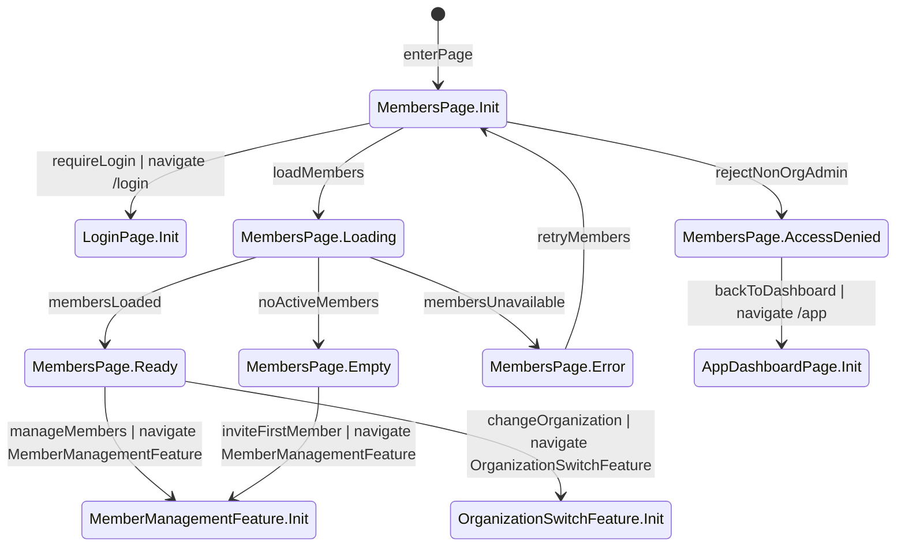
```mermaid
%% role: Org Admin
stateDiagram-v2
    [*] --> MembersPage.Init: enterPage
    %% verify: entering /app/org/members requires authenticated session and Org Admin authorization, member data is not shown before both checks pass, and page is not exposed in navigation for non-Org Admin users

    MembersPage.Init --> LoginPage.Init: requireLogin | navigate /login
    %% verify: unauthenticated request returns 401 or redirects to /login, no organization member list is disclosed, and protected route target remains members page after login

    MembersPage.Init --> MembersPage.AccessDenied: rejectNonOrgAdmin
    %% verify: authenticated non-Org Admin user receives 403 or access denied state, Invite, Remove, and Change Role actions are hidden or disabled with reason, and backend RBAC enforcement is applied beyond UI hiding

    MembersPage.Init --> MembersPage.Loading: loadMembers
    %% verify: member list request starts once for the selected organization_id, loading state prevents duplicate fetch actions, and only members of that organization are queried to prevent IDOR exposure

    MembersPage.Loading --> MembersPage.Ready: membersLoaded
    %% verify: API returns 200 with member list, roles, and statuses scoped to the selected organization, UI renders management actions only for Org Admin, and no unrelated organization member appears

    MembersPage.Loading --> MembersPage.Empty: noActiveMembers
    %% verify: empty member response renders explicit empty state rather than error, no stale member row remains visible, and Invite Member CTA stays Org Admin-only

    MembersPage.Loading --> MembersPage.Error: membersUnavailable
    %% verify: failed member fetch shows understandable error state with retry, role-management controls are not treated as active data, and organization scope remains unchanged

    MembersPage.Ready --> MemberManagementFeature.Init: manageMembers | navigate MemberManagementFeature
    %% verify: only Org Admin can enter member management flow, current organization context is passed to feature, and invite or role change actions are not duplicated in header and page body

    MembersPage.Ready --> OrganizationSwitchFeature.Init: changeOrganization | navigate OrganizationSwitchFeature
    %% verify: organization switch flow is available only for users with multiple organizations, current member list stays tied to the active organization until switch is applied, and other organizations' memberships are not exposed

    MembersPage.Empty --> MemberManagementFeature.Init: inviteFirstMember | navigate MemberManagementFeature
    %% verify: empty-state invite opens Org Admin-only member management flow, current organization context is preserved, and first-invite CTA appears once

    MembersPage.AccessDenied --> AppDashboardPage.Init: backToDashboard | navigate /app
    %% verify: denied user can return to dashboard, member-management route is exited, and dashboard shows only actions allowed for the current membership

    MembersPage.Error --> MembersPage.Init: retryMembers
    %% verify: retry clears member error state, reissues organization-scoped member fetch, and does not duplicate member entries or role changes
```

## ⑪ Admin Dashboard Page State Machine

```mermaid
%% role: Platform Admin
stateDiagram-v2
    [*] --> AdminDashboardPage.Init: enterPage
    %% verify: entering /admin requires authenticated session and Platform Admin authorization, admin analytics are not exposed before both checks pass, and admin header is shown only for platform admins

    AdminDashboardPage.Init --> LoginPage.Init: requireLogin | navigate /login
    %% verify: unauthenticated request to /admin returns 401 or redirects to /login, no admin metrics are disclosed, and protected route target remains admin dashboard after login

    AdminDashboardPage.Init --> AdminDashboardPage.AccessDenied: rejectNonPlatformAdmin
    %% verify: authenticated non-Platform Admin receives 403 or access denied state, admin navigation items remain hidden, and backend authorization is enforced beyond UI visibility

    AdminDashboardPage.Init --> AdminDashboardPage.Loading: loadAdminOverview
    %% verify: admin overview request starts once for platform-level metrics, loading state prevents repeated fetch actions, and page does not render revenue or risk cards before authorized data returns

    AdminDashboardPage.Loading --> AdminDashboardPage.Ready: overviewLoaded
    %% verify: API returns 200 with MRR, churn, risk overview, and admin dashboard summary, and admin header shows Dashboard, Plans, Subscriptions, Revenue Metrics, Usage Ranking, Risk Accounts, and Audit Log

    AdminDashboardPage.Loading --> AdminDashboardPage.Error: overviewUnavailable
    %% verify: failed admin overview fetch shows understandable error state with retry, no stale platform metrics are treated as current, and authorized session remains unchanged

    AdminDashboardPage.Ready --> AdminPlansPage.Init: openPlans | navigate /admin/plans
    %% verify: navigation to admin plans succeeds only for Platform Admin, plan management page keeps platform scope, and no organization member permissions are substituted for platform authorization

    AdminDashboardPage.Ready --> AdminSubscriptionsPage.Init: openSubscriptions | navigate /admin/subscriptions
    %% verify: navigation to subscription overview succeeds only for Platform Admin, platform-wide subscription search remains available, and protected admin scope is preserved

    AdminDashboardPage.Ready --> AdminRevenueMetricsPage.Init: openRevenueMetrics | navigate /admin/metrics/revenue
    %% verify: revenue metrics route is reachable only for Platform Admin, platform-wide revenue data remains protected, and admin navigation remains consistent

    AdminDashboardPage.Ready --> AdminUsageRankingPage.Init: openUsageRanking | navigate /admin/metrics/usage
    %% verify: usage ranking route is reachable only for Platform Admin, ranking data remains platform-scoped, and no non-admin user can access this route by guessing URL

    AdminDashboardPage.Ready --> AdminRiskAccountsPage.Init: openRiskAccounts | navigate /admin/risk
    %% verify: risk accounts route is reachable only for Platform Admin, risk queue stays protected, and admin authorization is enforced by route and backend guard

    AdminDashboardPage.Ready --> AdminAuditLogPage.Init: openAuditLog | navigate /admin/audit
    %% verify: audit log route is reachable only for Platform Admin, who, when, what, and why fields remain protected, and admin scope is preserved

    AdminDashboardPage.AccessDenied --> PricingPage.Init: backToPricing | navigate /pricing
    %% verify: denied user can exit admin area to public pricing page, admin metrics are no longer visible, and guest-safe navigation replaces admin navigation

    AdminDashboardPage.Error --> AdminDashboardPage.Init: retryAdminOverview
    %% verify: retry clears admin overview error state, reissues platform-level metrics fetch, and does not duplicate revenue or risk cards
```

## ⑫ Admin Plans Page State Machine
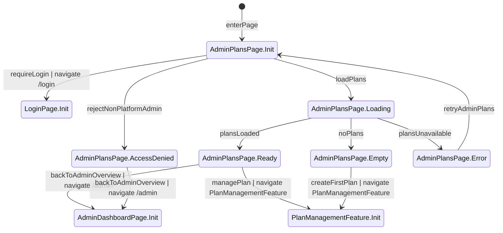
```mermaid
%% role: Platform Admin
stateDiagram-v2
    [*] --> AdminPlansPage.Init: enterPage
    %% verify: entering /admin/plans requires authenticated Platform Admin session, plan definitions are not exposed before authorization, and admin header remains visible only for platform admins

    AdminPlansPage.Init --> LoginPage.Init: requireLogin | navigate /login
    %% verify: unauthenticated request returns 401 or redirects to /login, plan management data is not disclosed, and protected route target remains admin plans after login

    AdminPlansPage.Init --> AdminPlansPage.AccessDenied: rejectNonPlatformAdmin
    %% verify: authenticated non-Platform Admin receives 403 or access denied state, Create, Edit, Disable, and Enable Plan actions are hidden, and backend permission checks block access beyond UI hiding

    AdminPlansPage.Init --> AdminPlansPage.Loading: loadPlans
    %% verify: platform plan list request starts once, loading state prevents repeated fetch actions, and page waits for data-driven plan payload rather than hard-coded plan definitions

    AdminPlansPage.Loading --> AdminPlansPage.Ready: plansLoaded
    %% verify: API returns 200 with plan name, billing cycle, price, limits, features, and active flag, and UI shows only active or inactive states defined in backend data

    AdminPlansPage.Loading --> AdminPlansPage.Empty: noPlans
    %% verify: empty plan response renders explicit empty state, no stale plan row remains visible, and Create Plan CTA appears once for Platform Admin

    AdminPlansPage.Loading --> AdminPlansPage.Error: plansUnavailable
    %% verify: failed plan fetch shows understandable error state with retry, no stale plan definition is treated as current, and platform scope remains unchanged

    AdminPlansPage.Ready --> PlanManagementFeature.Init: managePlan | navigate PlanManagementFeature
    %% verify: only Platform Admin can enter plan management feature, selected plan data is passed from backend-driven source, and plan-edit CTA is not duplicated elsewhere on the page

    AdminPlansPage.Ready --> AdminDashboardPage.Init: backToAdminOverview | navigate /admin
    %% verify: navigation back to admin overview succeeds, admin metrics remain protected, and no plan-edit state persists as active after leaving page

    AdminPlansPage.Empty --> PlanManagementFeature.Init: createFirstPlan | navigate PlanManagementFeature
    %% verify: empty-state CTA opens Platform Admin-only plan creation flow, plan catalog is currently empty, and create action appears once

    AdminPlansPage.AccessDenied --> AdminDashboardPage.Init: backToAdminOverview | navigate /admin
    %% verify: denied user is returned to authorized admin overview only if they still have admin access, restricted plan data stays hidden, and access-denied state is cleared on navigation

    AdminPlansPage.Error --> AdminPlansPage.Init: retryAdminPlans
    %% verify: retry clears plans error state, issues a new platform plan fetch, and does not duplicate plan rows
```

## ⑬ Admin Subscriptions Page State Machine
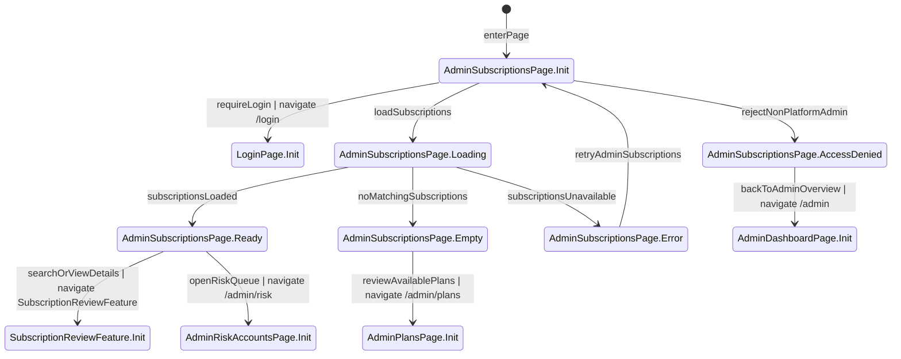
```mermaid
%% role: Platform Admin
stateDiagram-v2
    [*] --> AdminSubscriptionsPage.Init: enterPage
    %% verify: entering /admin/subscriptions requires authenticated Platform Admin session, platform subscription data is not exposed before authorization, and admin header remains visible only for platform admins

    AdminSubscriptionsPage.Init --> LoginPage.Init: requireLogin | navigate /login
    %% verify: unauthenticated request returns 401 or redirects to /login, subscription overview data is not disclosed, and protected route target remains admin subscriptions after login

    AdminSubscriptionsPage.Init --> AdminSubscriptionsPage.AccessDenied: rejectNonPlatformAdmin
    %% verify: authenticated non-Platform Admin receives 403 or access denied state, search and detail actions are hidden, and backend authorization blocks access beyond UI hiding

    AdminSubscriptionsPage.Init --> AdminSubscriptionsPage.Loading: loadSubscriptions
    %% verify: platform subscription query starts once, loading state prevents repeated fetch actions, and page waits for authorized search results before showing tenant data

    AdminSubscriptionsPage.Loading --> AdminSubscriptionsPage.Ready: subscriptionsLoaded
    %% verify: API returns 200 with organization subscription states, billing cycles, and recent invoice signals for platform-wide review, and results remain available only to Platform Admin

    AdminSubscriptionsPage.Loading --> AdminSubscriptionsPage.Empty: noMatchingSubscriptions
    %% verify: empty search result renders explicit no-match state rather than error, no stale organization row remains visible, and filters stay available to Platform Admin

    AdminSubscriptionsPage.Loading --> AdminSubscriptionsPage.Error: subscriptionsUnavailable
    %% verify: failed subscription overview fetch shows understandable error state with retry, no stale subscription status is treated as current, and platform scope remains unchanged

    AdminSubscriptionsPage.Ready --> SubscriptionReviewFeature.Init: searchOrViewDetails | navigate SubscriptionReviewFeature
    %% verify: only Platform Admin can enter subscription review flow, selected search context is passed to feature, and search or detail CTA is not duplicated elsewhere on the page

    AdminSubscriptionsPage.Ready --> AdminRiskAccountsPage.Init: openRiskQueue | navigate /admin/risk
    %% verify: navigation to risk queue preserves platform admin scope, risk state for matching subscriptions remains consistent, and protected access is enforced by backend authorization

    AdminSubscriptionsPage.Empty --> AdminPlansPage.Init: reviewAvailablePlans | navigate /admin/plans
    %% verify: from empty results user can review plan catalog, admin scope remains protected, and no subscription result is fabricated

    AdminSubscriptionsPage.AccessDenied --> AdminDashboardPage.Init: backToAdminOverview | navigate /admin
    %% verify: denied user leaves restricted subscription overview, protected subscription data remains hidden, and admin overview access is re-evaluated on navigation

    AdminSubscriptionsPage.Error --> AdminSubscriptionsPage.Init: retryAdminSubscriptions
    %% verify: retry clears subscription overview error state, issues a new platform-wide query, and does not duplicate result rows
```

## ⑭ Admin Revenue Metrics Page State Machine
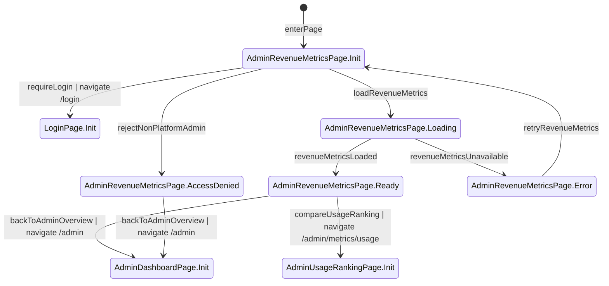
```mermaid
%% role: Platform Admin
stateDiagram-v2
    [*] --> AdminRevenueMetricsPage.Init: enterPage
    %% verify: entering /admin/metrics/revenue requires authenticated Platform Admin session, revenue metrics are not exposed before authorization, and admin header remains visible only for platform admins

    AdminRevenueMetricsPage.Init --> LoginPage.Init: requireLogin | navigate /login
    %% verify: unauthenticated request returns 401 or redirects to /login, revenue metrics are not disclosed, and protected route target remains revenue metrics after login

    AdminRevenueMetricsPage.Init --> AdminRevenueMetricsPage.AccessDenied: rejectNonPlatformAdmin
    %% verify: authenticated non-Platform Admin receives 403 or access denied state, revenue analytics remain hidden, and backend authorization blocks route access beyond UI hiding

    AdminRevenueMetricsPage.Init --> AdminRevenueMetricsPage.Loading: loadRevenueMetrics
    %% verify: revenue metrics request starts once, loading state prevents repeated fetch actions, and page waits for authorized metric payload before rendering charts or totals

    AdminRevenueMetricsPage.Loading --> AdminRevenueMetricsPage.Ready: revenueMetricsLoaded
    %% verify: API returns 200 with MRR, churn, and revenue statistics for the requested period, and UI renders platform-level metrics only for Platform Admin

    AdminRevenueMetricsPage.Loading --> AdminRevenueMetricsPage.Error: revenueMetricsUnavailable
    %% verify: failed revenue metrics fetch shows understandable error state with retry, no stale platform totals are treated as current, and platform scope remains unchanged

    AdminRevenueMetricsPage.Ready --> AdminUsageRankingPage.Init: compareUsageRanking | navigate /admin/metrics/usage
    %% verify: navigation to usage ranking preserves Platform Admin authorization, metric comparison remains within admin scope, and route stays inaccessible to non-admin users

    AdminRevenueMetricsPage.Ready --> AdminDashboardPage.Init: backToAdminOverview | navigate /admin
    %% verify: navigation back to admin overview succeeds, revenue metrics page is exited cleanly, and admin summary remains protected

    AdminRevenueMetricsPage.AccessDenied --> AdminDashboardPage.Init: backToAdminOverview | navigate /admin
    %% verify: denied user leaves restricted revenue page, revenue analytics remain hidden, and admin overview access is re-evaluated on navigation

    AdminRevenueMetricsPage.Error --> AdminRevenueMetricsPage.Init: retryRevenueMetrics
    %% verify: retry clears revenue metrics error state, issues a new authorized metrics request, and does not duplicate rendered totals
```

## ⑮ Admin Usage Ranking Page State Machine
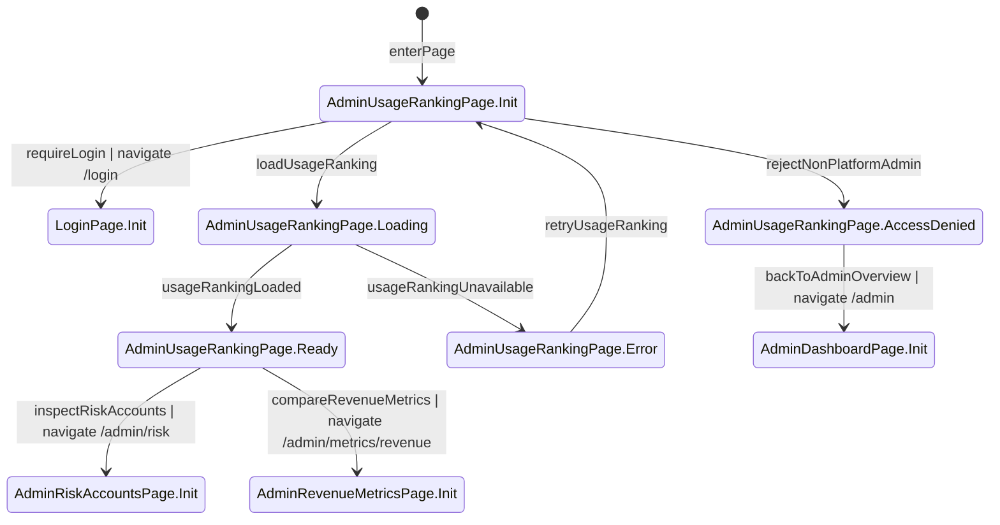
```mermaid
%% role: Platform Admin
stateDiagram-v2
    [*] --> AdminUsageRankingPage.Init: enterPage
    %% verify: entering /admin/metrics/usage requires authenticated Platform Admin session, usage ranking data is not exposed before authorization, and admin header remains visible only for platform admins

    AdminUsageRankingPage.Init --> LoginPage.Init: requireLogin | navigate /login
    %% verify: unauthenticated request returns 401 or redirects to /login, usage ranking data is not disclosed, and protected route target remains usage ranking after login

    AdminUsageRankingPage.Init --> AdminUsageRankingPage.AccessDenied: rejectNonPlatformAdmin
    %% verify: authenticated non-Platform Admin receives 403 or access denied state, ranking metrics remain hidden, and backend authorization blocks route access beyond UI hiding

    AdminUsageRankingPage.Init --> AdminUsageRankingPage.Loading: loadUsageRanking
    %% verify: usage ranking request starts once, loading state prevents repeated fetch actions, and page waits for authorized metric payload before rendering ranks

    AdminUsageRankingPage.Loading --> AdminUsageRankingPage.Ready: usageRankingLoaded
    %% verify: API returns 200 with usage ranking by meter and period, ranking remains platform-scoped, and UI renders results only for Platform Admin

    AdminUsageRankingPage.Loading --> AdminUsageRankingPage.Error: usageRankingUnavailable
    %% verify: failed usage ranking fetch shows understandable error state with retry, no stale ranking is treated as current, and platform scope remains unchanged

    AdminUsageRankingPage.Ready --> AdminRiskAccountsPage.Init: inspectRiskAccounts | navigate /admin/risk
    %% verify: navigation to risk accounts preserves Platform Admin authorization, risk review stays within admin scope, and route remains inaccessible to non-admin users

    AdminUsageRankingPage.Ready --> AdminRevenueMetricsPage.Init: compareRevenueMetrics | navigate /admin/metrics/revenue
    %% verify: navigation to revenue metrics preserves Platform Admin authorization, comparison stays within admin analytics scope, and protected access remains enforced

    AdminUsageRankingPage.AccessDenied --> AdminDashboardPage.Init: backToAdminOverview | navigate /admin
    %% verify: denied user leaves restricted ranking page, usage analytics remain hidden, and admin overview access is re-evaluated on navigation

    AdminUsageRankingPage.Error --> AdminUsageRankingPage.Init: retryUsageRanking
    %% verify: retry clears usage ranking error state, issues a new authorized ranking request, and does not duplicate ranking rows
```

## ⑯ Admin Risk Accounts Page State Machine
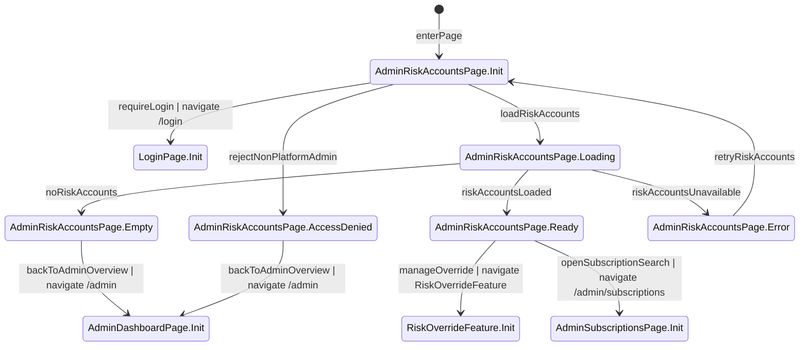
```mermaid
%% role: Platform Admin
stateDiagram-v2
    [*] --> AdminRiskAccountsPage.Init: enterPage
    %% verify: entering /admin/risk requires authenticated Platform Admin session, risk account data is not exposed before authorization, and admin header remains visible only for platform admins

    AdminRiskAccountsPage.Init --> LoginPage.Init: requireLogin | navigate /login
    %% verify: unauthenticated request returns 401 or redirects to /login, risk account data is not disclosed, and protected route target remains risk accounts after login

    AdminRiskAccountsPage.Init --> AdminRiskAccountsPage.AccessDenied: rejectNonPlatformAdmin
    %% verify: authenticated non-Platform Admin receives 403 or access denied state, Force Suspended and Force Expired actions remain hidden, and backend authorization blocks route access beyond UI hiding

    AdminRiskAccountsPage.Init --> AdminRiskAccountsPage.Loading: loadRiskAccounts
    %% verify: risk account query starts once, loading state prevents repeated fetch actions, and page waits for authorized risk payload before rendering any organization row

    AdminRiskAccountsPage.Loading --> AdminRiskAccountsPage.Ready: riskAccountsLoaded
    %% verify: API returns 200 with PastDue, Suspended, and near-over-limit accounts, and UI renders only platform-authorized risk items with consistent subscription state indicators

    AdminRiskAccountsPage.Loading --> AdminRiskAccountsPage.Empty: noRiskAccounts
    %% verify: empty risk response renders explicit no-risk state rather than error, no stale risk row remains visible, and admin scope is preserved

    AdminRiskAccountsPage.Loading --> AdminRiskAccountsPage.Error: riskAccountsUnavailable
    %% verify: failed risk fetch shows understandable error state with retry, no stale override target is treated as current, and platform scope remains unchanged

    AdminRiskAccountsPage.Ready --> RiskOverrideFeature.Init: manageOverride | navigate RiskOverrideFeature
    %% verify: only Platform Admin can enter override feature, selected organization risk context is passed to feature, and force-status CTA is not duplicated elsewhere on the page

    AdminRiskAccountsPage.Ready --> AdminSubscriptionsPage.Init: openSubscriptionSearch | navigate /admin/subscriptions
    %% verify: navigation to subscription overview preserves Platform Admin authorization, reviewed organization remains searchable there, and protected access stays enforced

    AdminRiskAccountsPage.Empty --> AdminDashboardPage.Init: backToAdminOverview | navigate /admin
    %% verify: navigation back to admin overview succeeds from empty risk state, no risk data is fabricated, and admin summary remains protected

    AdminRiskAccountsPage.AccessDenied --> AdminDashboardPage.Init: backToAdminOverview | navigate /admin
    %% verify: denied user leaves restricted risk page, override actions remain hidden, and admin overview access is re-evaluated on navigation

    AdminRiskAccountsPage.Error --> AdminRiskAccountsPage.Init: retryRiskAccounts
    %% verify: retry clears risk error state, issues a new authorized risk query, and does not duplicate organization rows
```

## ⑰ Admin Audit Log Page State Machine
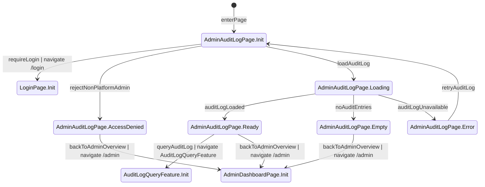
```mermaid
%% role: Platform Admin
stateDiagram-v2
    [*] --> AdminAuditLogPage.Init: enterPage
    %% verify: entering /admin/audit requires authenticated Platform Admin session, audit records are not exposed before authorization, and admin header remains visible only for platform admins

    AdminAuditLogPage.Init --> LoginPage.Init: requireLogin | navigate /login
    %% verify: unauthenticated request returns 401 or redirects to /login, audit log data is not disclosed, and protected route target remains audit log after login

    AdminAuditLogPage.Init --> AdminAuditLogPage.AccessDenied: rejectNonPlatformAdmin
    %% verify: authenticated non-Platform Admin receives 403 or access denied state, audit query controls remain hidden, and backend authorization blocks route access beyond UI hiding

    AdminAuditLogPage.Init --> AdminAuditLogPage.Loading: loadAuditLog
    %% verify: audit log query starts once, loading state prevents repeated fetch actions, and page waits for authorized audit payload before rendering entries

    AdminAuditLogPage.Loading --> AdminAuditLogPage.Ready: auditLogLoaded
    %% verify: API returns 200 with who, when, what, why, actor role context, and optional organization reference, and audit entries are visible only to Platform Admin

    AdminAuditLogPage.Loading --> AdminAuditLogPage.Empty: noAuditEntries
    %% verify: empty audit response renders explicit empty state rather than error, no stale audit row remains visible, and query controls remain available to Platform Admin

    AdminAuditLogPage.Loading --> AdminAuditLogPage.Error: auditLogUnavailable
    %% verify: failed audit fetch shows understandable error state with retry, no stale audit entry is treated as current, and platform scope remains unchanged

    AdminAuditLogPage.Ready --> AuditLogQueryFeature.Init: queryAuditLog | navigate AuditLogQueryFeature
    %% verify: only Platform Admin can enter audit query feature, current filter context is passed to feature, and query CTA is not duplicated elsewhere on the page

    AdminAuditLogPage.Ready --> AdminDashboardPage.Init: backToAdminOverview | navigate /admin
    %% verify: navigation back to admin overview succeeds, audit page is exited cleanly, and protected audit data is no longer in active view

    AdminAuditLogPage.Empty --> AdminDashboardPage.Init: backToAdminOverview | navigate /admin
    %% verify: navigation back to admin overview succeeds from empty audit state, no audit entry is fabricated, and admin summary remains protected

    AdminAuditLogPage.AccessDenied --> AdminDashboardPage.Init: backToAdminOverview | navigate /admin
    %% verify: denied user leaves restricted audit page, audit data remains hidden, and admin overview access is re-evaluated on navigation

    AdminAuditLogPage.Error --> AdminAuditLogPage.Init: retryAuditLog
    %% verify: retry clears audit error state, issues a new authorized audit query, and does not duplicate audit rows
```

## ⑱ App Dashboard Role-specific Page State Machine
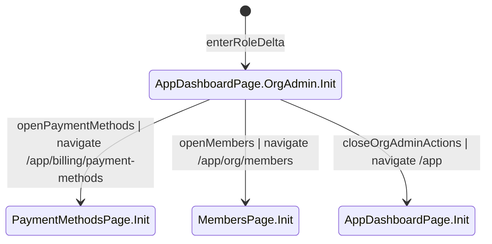
```mermaid
%% role: Org Admin
%% extends: AppDashboardPage
stateDiagram-v2
    [*] --> AppDashboardPage.OrgAdmin.Init: enterRoleDelta
    %% verify: Org Admin delta opens only when current membership role is ORG_ADMIN, Payment Methods and Members actions become visible, and these management CTAs are not shown to regular End User

    AppDashboardPage.OrgAdmin.Init --> PaymentMethodsPage.Init: openPaymentMethods | navigate /app/billing/payment-methods
    %% verify: only Org Admin can navigate from dashboard delta to payment methods, target page enforces same organization scope, and non-Org Admin users cannot reach this route through UI or backend

    AppDashboardPage.OrgAdmin.Init --> MembersPage.Init: openMembers | navigate /app/org/members
    %% verify: only Org Admin can navigate from dashboard delta to members page, target page enforces organization isolation, and non-Org Admin users receive 403 if they try direct access

    AppDashboardPage.OrgAdmin.Init --> AppDashboardPage.Init: closeOrgAdminActions | navigate /app
    %% verify: closing Org Admin delta returns to base dashboard without mutating subscription or organization context, and Org Admin-only shortcuts collapse from the page-specific action area
```

## ⑲ Subscription Role-specific Page State Machine
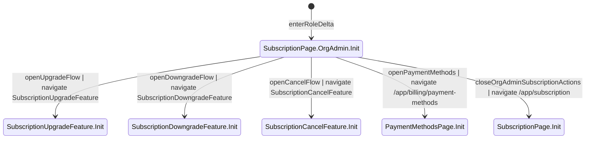
```mermaid
%% role: Org Admin
%% extends: SubscriptionPage
stateDiagram-v2
    [*] --> SubscriptionPage.OrgAdmin.Init: enterRoleDelta
    %% verify: Org Admin subscription delta opens only for ORG_ADMIN membership, Upgrade, Downgrade, Cancel, and Payment Methods actions become visible, and these management actions stay hidden or disabled for non-Org Admin users

    SubscriptionPage.OrgAdmin.Init --> SubscriptionUpgradeFeature.Init: openUpgradeFlow | navigate SubscriptionUpgradeFeature
    %% verify: only Org Admin can start upgrade flow, current subscription and organization context are passed to feature, and backend authorization blocks non-Org Admin users from invoking upgrade

    SubscriptionPage.OrgAdmin.Init --> SubscriptionDowngradeFeature.Init: openDowngradeFlow | navigate SubscriptionDowngradeFeature
    %% verify: only Org Admin can start downgrade flow, current subscription and organization context are passed to feature, and backend authorization blocks non-Org Admin users from invoking downgrade

    SubscriptionPage.OrgAdmin.Init --> SubscriptionCancelFeature.Init: openCancelFlow | navigate SubscriptionCancelFeature
    %% verify: only Org Admin can start cancellation flow, current subscription context is passed to feature, and backend authorization blocks non-Org Admin users from canceling subscription

    SubscriptionPage.OrgAdmin.Init --> PaymentMethodsPage.Init: openPaymentMethods | navigate /app/billing/payment-methods
    %% verify: only Org Admin can navigate to payment methods from subscription management area, target page remains organization-scoped, and payment-method management stays inaccessible to non-Org Admin users

    SubscriptionPage.OrgAdmin.Init --> SubscriptionPage.Init: closeOrgAdminSubscriptionActions | navigate /app/subscription
    %% verify: closing Org Admin subscription delta returns to base subscription page without mutating current plan, pending change, or organization context
```

## ⑳ Auth Login Feature State Machine
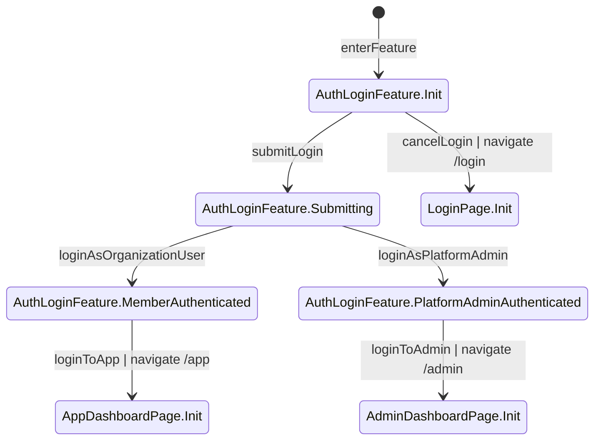
```mermaid
%% role: none
stateDiagram-v2
    [*] --> AuthLoginFeature.Init: enterFeature
    %% verify: login feature opens from public auth entry, no protected app data is fetched before credentials submit, and auth feature remains reachable only through defined login path

    AuthLoginFeature.Init --> AuthLoginFeature.Submitting: submitLogin
    %% verify: credential submit sends authentication request once, submit control prevents duplicate posts, and backend session handling starts without assuming role from client state

    AuthLoginFeature.Submitting --> AuthLoginFeature.MemberAuthenticated: loginAsOrganizationUser
    %% verify: auth API returns 200 with non-platform-admin session, session is created, organization memberships are available for app scope, and no Platform Admin-only route is granted

    AuthLoginFeature.Submitting --> AuthLoginFeature.PlatformAdminAuthenticated: loginAsPlatformAdmin
    %% verify: auth API returns 200 with platform admin identity, session marks is_platform_admin true, and admin routes become available without granting arbitrary organization Org Admin rights

    AuthLoginFeature.MemberAuthenticated --> AppDashboardPage.Init: loginToApp | navigate /app
    %% verify: post-login navigation to /app succeeds for authenticated organization user, authenticated app header is shown, and dashboard data is fetched only after session creation

    AuthLoginFeature.PlatformAdminAuthenticated --> AdminDashboardPage.Init: loginToAdmin | navigate /admin
    %% verify: post-login navigation to /admin succeeds only for platform admin, admin header appears, and protected admin overview loads after authorized session creation

    AuthLoginFeature.Init --> LoginPage.Init: cancelLogin | navigate /login
    %% verify: cancel returns to login page without creating session, login form becomes active again, and no protected route is entered
```

## ㉑ Auth Sign Up Feature State Machine
```mermaid
%% role: Guest
stateDiagram-v2
    [*] --> AuthSignUpFeature.Init: enterFeature
    %% verify: sign-up feature opens from public onboarding entry, no protected app data is fetched before registration submit, and guest-safe navigation remains active

    AuthSignUpFeature.Init --> AuthSignUpFeature.Submitting: submitSignUp
    %% verify: registration submit sends one onboarding request, submit control prevents duplicate posts, and backend starts user, organization, and initial subscription provisioning through the defined flow

    AuthSignUpFeature.Submitting --> AuthSignUpFeature.Provisioned: createUserOrganizationAndSubscription
    %% verify: signup API returns 200 or created result with new user, initial organization, membership, and subscription record, and resulting entities are linked consistently for the same organization scope

    AuthSignUpFeature.Provisioned --> AppDashboardPage.Init: signUpToApp | navigate /app
    %% verify: after provisioning, authenticated app navigation succeeds, dashboard opens for the new organization, and subscription summary reflects the initial created subscription state

    AuthSignUpFeature.Init --> SignUpPage.Init: cancelSignUp | navigate /signup
    %% verify: cancel returns to sign-up page without creating user, organization, or subscription records, and public onboarding view becomes active again
```

## ㉒ Organization Switch Feature State Machine
Source Pages: AppDashboardPage, SubscriptionPage, UsagePage, InvoicesPage, PaymentMethodsPage, MembersPage
```mermaid
%% role: End User|Org Admin
stateDiagram-v2
    [*] --> OrganizationSwitchFeature.Init: enterFeature
    %% verify: organization switch feature opens only for authenticated users with multiple memberships, current page data remains bound to active organization until switch completes, and no unrelated organization data is exposed

    OrganizationSwitchFeature.Init --> OrganizationSwitchFeature.Selecting: openOrganizationSwitcher
    %% verify: switcher lists only organizations the current user belongs to, selected organization options are derived from membership data, and no guessed organization_id can appear

    OrganizationSwitchFeature.Selecting --> OrganizationSwitchFeature.Applied: chooseOrganization
    %% verify: selected organization is validated against current user memberships, active organization context updates once, and subsequent data fetches use the new organization_id consistently

    OrganizationSwitchFeature.Applied --> AppDashboardPage.Init: switchForDashboard | navigate /app
    %% verify: dashboard reloads using the newly selected organization_id, subscription, usage summary, and invoice preview reflect that organization, and prior organization data is replaced

    OrganizationSwitchFeature.Applied --> SubscriptionPage.Init: switchForSubscription | navigate /app/subscription
    %% verify: subscription page reloads using the newly selected organization_id, plan and status belong to that organization, and cross-org data isolation is preserved

    OrganizationSwitchFeature.Applied --> UsagePage.Init: switchForUsage | navigate /app/usage
    %% verify: usage page reloads using the newly selected organization_id and current billing period, meter values and limits belong to that organization, and no stale values from prior organization remain visible

    OrganizationSwitchFeature.Applied --> InvoicesPage.Init: switchForInvoices | navigate /app/billing/invoices
    %% verify: invoice page reloads using the newly selected organization_id, invoice rows belong only to that organization, and totals from prior organization are cleared

    OrganizationSwitchFeature.Applied --> PaymentMethodsPage.Init: switchForPaymentMethods | navigate /app/billing/payment-methods
    %% verify: payment methods page reloads using the newly selected organization_id, access still requires Org Admin in that organization, and no payment method from the prior organization remains visible

    OrganizationSwitchFeature.Applied --> MembersPage.Init: switchForMembers | navigate /app/org/members
    %% verify: members page reloads using the newly selected organization_id, access still requires Org Admin in that organization, and no member record from the prior organization remains visible
```

## ㉓ Subscription Upgrade Feature State Machine
```mermaid
%% role: Org Admin
stateDiagram-v2
    [*] --> SubscriptionUpgradeFeature.Init: enterFeature
    %% verify: upgrade feature opens only for Org Admin, current subscription and eligible target plans are scoped to the selected organization, and non-Org Admin users cannot enter this feature

    SubscriptionUpgradeFeature.Init --> SubscriptionUpgradeFeature.Reviewing: selectHigherPlan
    %% verify: selectable target plans are active plans with higher tier or price context defined by backend data, current and target billing cycle details are shown, and ineligible plans are not offered

    SubscriptionUpgradeFeature.Reviewing --> SubscriptionUpgradeFeature.ProrationInvoiceOpen: confirmUpgrade
    %% verify: confirming upgrade updates subscription plan immediately, creates one Open proration invoice, recalculates entitlement to unlock new features at once, and writes auditable subscription change timestamps

    SubscriptionUpgradeFeature.ProrationInvoiceOpen --> SubscriptionUpgradeFeature.ActiveApplied: paymentSucceeded
    %% verify: payment success marks proration invoice Paid, subscription stays Active, entitlement remains upgraded, and duplicate payment callbacks do not create extra charges or duplicate state transitions

    SubscriptionUpgradeFeature.ProrationInvoiceOpen --> SubscriptionUpgradeFeature.PastDueApplied: paymentFailed
    %% verify: payment failure marks proration invoice Failed or unpaid Open outcome per billing flow, subscription moves to PastDue with grace_period_end_at set, and upgraded entitlement follows payment-failure rules consistently

    SubscriptionUpgradeFeature.ActiveApplied --> SubscriptionPage.Init: returnActiveSubscription | navigate /app/subscription
    %% verify: returning to subscription page shows upgraded plan, Active status, current billing cycle, and proration invoice result consistently for the selected organization

    SubscriptionUpgradeFeature.PastDueApplied --> InvoicesPage.Init: reviewFailedProrationInvoice | navigate /app/billing/invoices
    %% verify: invoice history shows the failed or open proration invoice for the selected organization, payment result is visible, and subscription PastDue state matches billing outcome

    SubscriptionUpgradeFeature.Reviewing --> SubscriptionPage.Init: cancelUpgrade | navigate /app/subscription
    %% verify: cancel exits upgrade flow without changing current plan, entitlement, or invoice data, and subscription page still shows pre-upgrade state
```

## ㉔ Subscription Downgrade Feature State Machine
```mermaid
%% role: Org Admin
stateDiagram-v2
    [*] --> SubscriptionDowngradeFeature.Init: enterFeature
    %% verify: downgrade feature opens only for Org Admin, current subscription and eligible lower plans are scoped to the selected organization, and non-Org Admin users cannot enter this feature

    SubscriptionDowngradeFeature.Init --> SubscriptionDowngradeFeature.Reviewing: selectLowerPlan
    %% verify: selectable target plans are valid downgrade options from backend data, current and target billing cycle details are shown, and inactive plans cannot be chosen as downgrade target

    SubscriptionDowngradeFeature.Reviewing --> SubscriptionDowngradeFeature.PendingChangeScheduled: confirmDowngrade
    %% verify: confirming downgrade stores pending_plan_id and pending_effective_at for next billing cycle, current subscription remains unchanged until effective date, and soon-to-expire features or limits are flagged in UI

    SubscriptionDowngradeFeature.PendingChangeScheduled --> SubscriptionPage.Init: returnPendingDowngrade | navigate /app/subscription
    %% verify: returning to subscription page shows current plan unchanged plus pending downgrade details and effective date, and downgrade has not yet changed active entitlement except future warning indicators

    SubscriptionDowngradeFeature.PendingChangeScheduled --> UsagePage.Init: reviewOverLimitRisk | navigate /app/usage
    %% verify: usage page highlights current usage against upcoming lower limits, over-limit risk is shown according to Block, Throttle, or Overage policy, and values remain scoped to the selected organization

    SubscriptionDowngradeFeature.Reviewing --> SubscriptionPage.Init: cancelDowngrade | navigate /app/subscription
    %% verify: cancel exits downgrade flow without setting pending_plan_id or pending_effective_at, current plan remains unchanged, and no upcoming feature-loss warning is persisted
```

## ㉕ Subscription Cancel Feature State Machine
```mermaid
%% role: Org Admin
stateDiagram-v2
    [*] --> SubscriptionCancelFeature.Init: enterFeature
    %% verify: cancellation feature opens only for Org Admin, current subscription context is scoped to the selected organization, and non-Org Admin users cannot enter this feature

    SubscriptionCancelFeature.Init --> SubscriptionCancelFeature.Reviewing: openCancelConfirmation
    %% verify: cancel confirmation shows current subscription status and consequence summary, irreversible rules are made clear, and confirmation action is shown once

    SubscriptionCancelFeature.Reviewing --> SubscriptionCancelFeature.Canceled: confirmCancellation
    %% verify: confirming cancellation sets subscription status to Canceled with canceled_at timestamp, audit trail is written for the organization action, and subscription does not auto-return to Active afterward

    SubscriptionCancelFeature.Canceled --> SubscriptionPage.Init: returnCanceledSubscription | navigate /app/subscription
    %% verify: subscription page shows Canceled status and cancellation timestamp for the selected organization, current plan remains readable, and reactivation is not offered as automatic status reversal

    SubscriptionCancelFeature.Reviewing --> SubscriptionPage.Init: abortCancellation | navigate /app/subscription
    %% verify: abort exits cancellation flow without changing subscription status or timestamps, and subscription page still shows the prior non-canceled state
```

## ㉖ Payment Method Manage Feature State Machine
```mermaid
%% role: Org Admin
stateDiagram-v2
    [*] --> PaymentMethodManageFeature.Init: enterFeature
    %% verify: payment method management feature opens only for Org Admin, selected organization context is preserved, and non-Org Admin users cannot enter this feature

    PaymentMethodManageFeature.Init --> PaymentMethodManageFeature.Editing: openPaymentMethodForm
    %% verify: payment method form renders for add or update mode, editable fields are shown once, and current default method context is loaded only for the selected organization

    PaymentMethodManageFeature.Editing --> PaymentMethodManageFeature.Saving: submitPaymentMethod
    %% verify: submit sends one payment method create or update request, save action prevents duplicate submission, and backend enforces organization_id isolation for the payment method record

    PaymentMethodManageFeature.Saving --> PaymentMethodManageFeature.Saved: paymentMethodSaved
    %% verify: payment method API returns success and persists provider reference plus default flag for the selected organization, list consistency is maintained, and no duplicate method is created by repeated callbacks

    PaymentMethodManageFeature.Saved --> PaymentMethodsPage.Init: returnPaymentMethods | navigate /app/billing/payment-methods
    %% verify: returning page shows updated payment method list for the selected organization, default state is reflected correctly, and Org Admin management CTA remains available once

    PaymentMethodManageFeature.Editing --> PaymentMethodsPage.Init: cancelPaymentMethodEdit | navigate /app/billing/payment-methods
    %% verify: cancel exits form without persisting payment method changes, payment methods page still shows prior saved data only, and organization scope remains unchanged
```

## ㉗ Member Management Feature State Machine
```mermaid
%% role: Org Admin
stateDiagram-v2
    [*] --> MemberManagementFeature.Init: enterFeature
    %% verify: member management feature opens only for Org Admin, selected organization context is preserved, and non-Org Admin users cannot enter this feature

    MemberManagementFeature.Init --> MemberManagementFeature.Editing: openMemberAction
    %% verify: invite, remove, or role-change form renders with organization-scoped member context, editable action appears once, and no external organization member is loaded

    MemberManagementFeature.Editing --> MemberManagementFeature.Applying: submitMemberChange
    %% verify: submit sends one organization-scoped member management request, action prevents duplicate submission, and backend enforces RBAC plus organization_id isolation to prevent IDOR

    MemberManagementFeature.Applying --> MemberManagementFeature.Updated: membershipUpdated
    %% verify: API returns success with updated member list or role state for the selected organization, membership status and role remain consistent, and auditability requirements for management action are preserved

    MemberManagementFeature.Updated --> MembersPage.Init: returnMembers | navigate /app/org/members
    %% verify: returning members page shows updated member list, role, and status for the selected organization, and removed or changed members no longer appear with stale values

    MemberManagementFeature.Editing --> MembersPage.Init: cancelMemberChange | navigate /app/org/members
    %% verify: cancel exits member management without persisting invite, removal, or role-change action, and members page still shows prior saved state only
```

## ㉘ Plan Management Feature State Machine
```mermaid
%% role: Platform Admin
stateDiagram-v2
    [*] --> PlanManagementFeature.Init: enterFeature
    %% verify: plan management feature opens only for Platform Admin, selected plan context is loaded from backend-driven plan data, and non-admin users cannot enter this feature

    PlanManagementFeature.Init --> PlanManagementFeature.Editing: openPlanForm
    %% verify: plan form renders editable price, billing cycle, limits, features, and active flag fields, form action appears once, and UI does not hard-code plan definitions

    PlanManagementFeature.Editing --> PlanManagementFeature.Saving: submitPlanDefinition
    %% verify: submit sends one plan create or update request, save action prevents duplicate submission, and backend validates data-driven limits and features instead of client-only assumptions

    PlanManagementFeature.Saving --> PlanManagementFeature.Updated: planSaved
    %% verify: plan API returns success with persisted plan name, billing cycle, price, limits, features, and active state, audit log records who changed the plan and when, and updated plan becomes available or unavailable per is_active rule

    PlanManagementFeature.Updated --> AdminPlansPage.Init: returnPlans | navigate /admin/plans
    %% verify: returning plan list shows new or updated plan values from backend data, disabled plans remain non-selectable for new subscription changes, and no duplicate plan row is created

    PlanManagementFeature.Editing --> AdminPlansPage.Init: cancelPlanEdit | navigate /admin/plans
    %% verify: cancel exits plan form without persisting changes, plan list remains at prior saved state, and platform scope remains unchanged
```

## ㉙ Subscription Review Feature State Machine
```mermaid
%% role: Platform Admin
stateDiagram-v2
    [*] --> SubscriptionReviewFeature.Init: enterFeature
    %% verify: subscription review feature opens only for Platform Admin, platform-wide search context is preserved, and non-admin users cannot enter this feature

    SubscriptionReviewFeature.Init --> SubscriptionReviewFeature.Filtering: openSearchAndFilters
    %% verify: search and filter controls render for platform subscription review, filter action appears once, and no organization-specific data is shown before query is applied

    SubscriptionReviewFeature.Filtering --> SubscriptionReviewFeature.Results: applySubscriptionFilters
    %% verify: filter request returns 200 with matching subscriptions, statuses, billing cycles, and organization identifiers permitted for platform review, and results remain consistent with current filters

    SubscriptionReviewFeature.Results --> AdminSubscriptionsPage.Init: returnSubscriptionList | navigate /admin/subscriptions
    %% verify: returning to subscription overview preserves last review context appropriately, platform authorization remains enforced, and results stay protected from non-admin access

    SubscriptionReviewFeature.Results --> AdminRiskAccountsPage.Init: inspectRiskFromResult | navigate /admin/risk
    %% verify: navigating to risk queue carries platform admin scope, selected risky subscription can be found there consistently, and protected risk access remains enforced

    SubscriptionReviewFeature.Filtering --> AdminSubscriptionsPage.Init: cancelSubscriptionReview | navigate /admin/subscriptions
    %% verify: cancel exits review feature without mutating subscription data, overview list returns to prior saved results or default query state, and platform scope remains unchanged
```

## ㉚ Risk Override Feature State Machine
```mermaid
%% role: Platform Admin
stateDiagram-v2
    [*] --> RiskOverrideFeature.Init: enterFeature
    %% verify: override feature opens only for Platform Admin, selected organization risk context is preserved, and non-admin users cannot enter this feature

    RiskOverrideFeature.Init --> RiskOverrideFeature.Reviewing: openOverrideDialog
    %% verify: override dialog shows current subscription status, existing forced_status if any, and reason input, and force-status actions appear once for the selected organization

    RiskOverrideFeature.Reviewing --> RiskOverrideFeature.ForcedSuspended: confirmForceSuspended
    %% verify: override API records forced_status as Suspended with reason and actor identity, entitlement recalculates using admin override priority, and audit log stores who, when, what, and why

    RiskOverrideFeature.Reviewing --> RiskOverrideFeature.ForcedExpired: confirmForceExpired
    %% verify: override API records forced_status as Expired with reason and actor identity, entitlement recalculates using expired override priority, Expired becomes irreversible, and audit log stores who, when, what, and why

    RiskOverrideFeature.ForcedSuspended --> AdminRiskAccountsPage.Init: returnRiskQueue | navigate /admin/risk
    %% verify: risk queue reload shows selected organization in suspended override state, entitlement reflects forced suspension, and override remains traceable in audit history

    RiskOverrideFeature.ForcedExpired --> AdminRiskAccountsPage.Init: returnExpiredQueue | navigate /admin/risk
    %% verify: risk queue reload shows selected organization in expired override state, entitlement remains blocked with no restoration path to usable status, and override remains traceable in audit history

    RiskOverrideFeature.Reviewing --> AdminRiskAccountsPage.Init: cancelOverride | navigate /admin/risk
    %% verify: cancel exits override dialog without changing forced_status or entitlement, and risk queue still shows the prior persisted override state only
```

## ㉛ Audit Log Query Feature State Machine
```mermaid
%% role: Platform Admin
stateDiagram-v2
    [*] --> AuditLogQueryFeature.Init: enterFeature
    %% verify: audit query feature opens only for Platform Admin, existing audit filter context is preserved, and non-admin users cannot enter this feature

    AuditLogQueryFeature.Init --> AuditLogQueryFeature.Filtering: openAuditFilters
    %% verify: filter controls for actor, role, organization, action, and time range render, query action appears once, and no additional audit rows are loaded until filter is applied

    AuditLogQueryFeature.Filtering --> AuditLogQueryFeature.Results: applyAuditFilters
    %% verify: audit query API returns 200 with matching who, when, what, why records for the selected filters, results remain platform-authorized, and entries reflect stored actor and target metadata consistently

    AuditLogQueryFeature.Results --> AdminAuditLogPage.Init: returnAuditLog | navigate /admin/audit
    %% verify: returning to audit page shows filtered or refreshed audit entries consistently, audit access remains restricted to Platform Admin, and no unauthorized user can view results by direct route access

    AuditLogQueryFeature.Filtering --> AdminAuditLogPage.Init: cancelAuditQuery | navigate /admin/audit
    %% verify: cancel exits audit query flow without mutating audit data, audit page returns to prior saved query state or default state, and platform scope remains unchanged
```