全體結構說明
[Entry State]
        ↓
[Page State Machine]
        ↓
[Role-specific Page State]
        ↓
[Feature / Function State Machine]
        ↓
[回到 Page 或跳轉其他 Page，或跳轉到其他 Feature]

以下將照這個層級排序。

## ① Entry State Machine
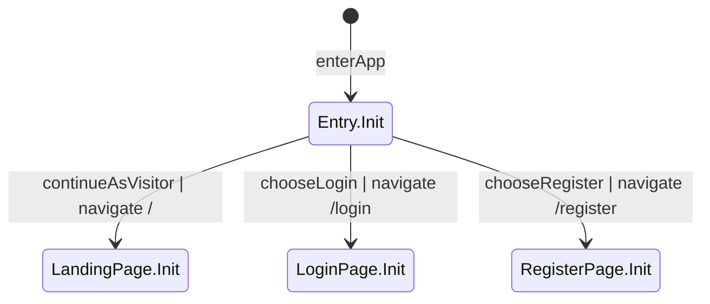
```mermaid
%% role: none
stateDiagram-v2
    [*] --> Entry.Init : enterApp
    %% verify: app boot reaches a neutral entry state, no existing session is assumed, and no protected project data request is sent before the user chooses an identity path

    Entry.Init --> LandingPage.Init : continueAsVisitor | navigate /
    %% verify: route changes to /, Landing content renders, Header shows only login and register, and no project or admin navigation is visible to Visitor

    Entry.Init --> LoginPage.Init : chooseLogin | navigate /login
    %% verify: route changes to /login, login form fields and submit action are visible, and no authenticated navigation is shown

    Entry.Init --> RegisterPage.Init : chooseRegister | navigate /register
    %% verify: route changes to /register, registration form fields and submit action are visible, and no protected project data is loaded
```

## ② Page State Machine

### LandingPage
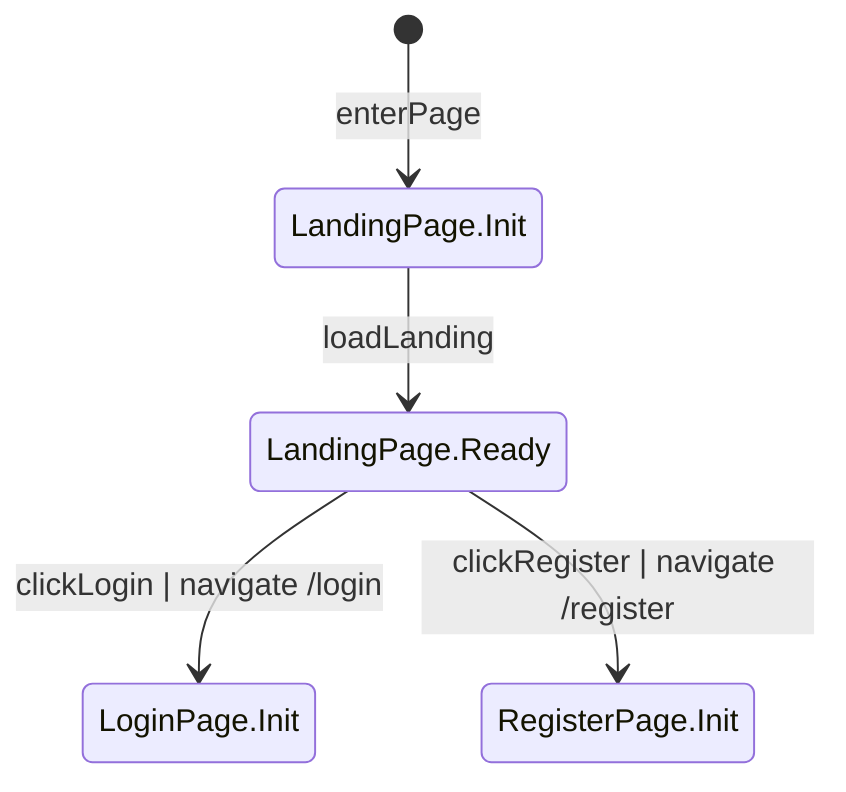
```mermaid
%% role: none
stateDiagram-v2
    [*] --> LandingPage.Init : enterPage
    %% verify: entering / creates the Landing entry state, no project API is requested, and Visitor-only navigation is preserved

    LandingPage.Init --> LandingPage.Ready : loadLanding
    %% verify: landing UI finishes rendering, login and register CTAs are visible once each, and no duplicate authenticated CTA appears on the page

    LandingPage.Ready --> LoginPage.Init : clickLogin | navigate /login
    %% verify: clicking login routes to /login, the login form becomes the active UI, and the Landing page no longer shows a second login entry

    LandingPage.Ready --> RegisterPage.Init : clickRegister | navigate /register
    %% verify: clicking register routes to /register, the registration form becomes the active UI, and the Landing page no longer shows a second register entry
```

### LoginPage
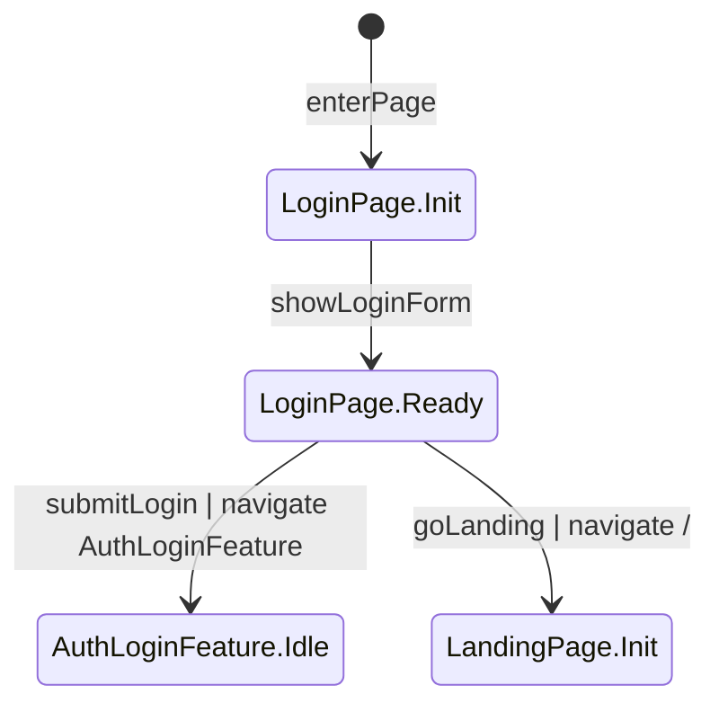
```mermaid
%% role: none
stateDiagram-v2
    [*] --> LoginPage.Init : enterPage
    %% verify: route /login is entered explicitly, no protected project data is requested yet, and only guest-safe navigation is visible

    LoginPage.Init --> LoginPage.Ready : showLoginForm
    %% verify: login inputs, submit control, and validation messaging area are visible, and Header still hides projects/logout until authentication succeeds

    LoginPage.Ready --> AuthLoginFeature.Idle : submitLogin | navigate AuthLoginFeature
    %% verify: one login request is initiated, submit becomes non-repeatable while pending, credentials are sent to auth API, and the flow moves into the login feature instead of directly creating project access

    LoginPage.Ready --> LandingPage.Init : goLanding | navigate /
    %% verify: route returns to /, guest navigation remains visible, and no authenticated state is retained on the page
```

### RegisterPage
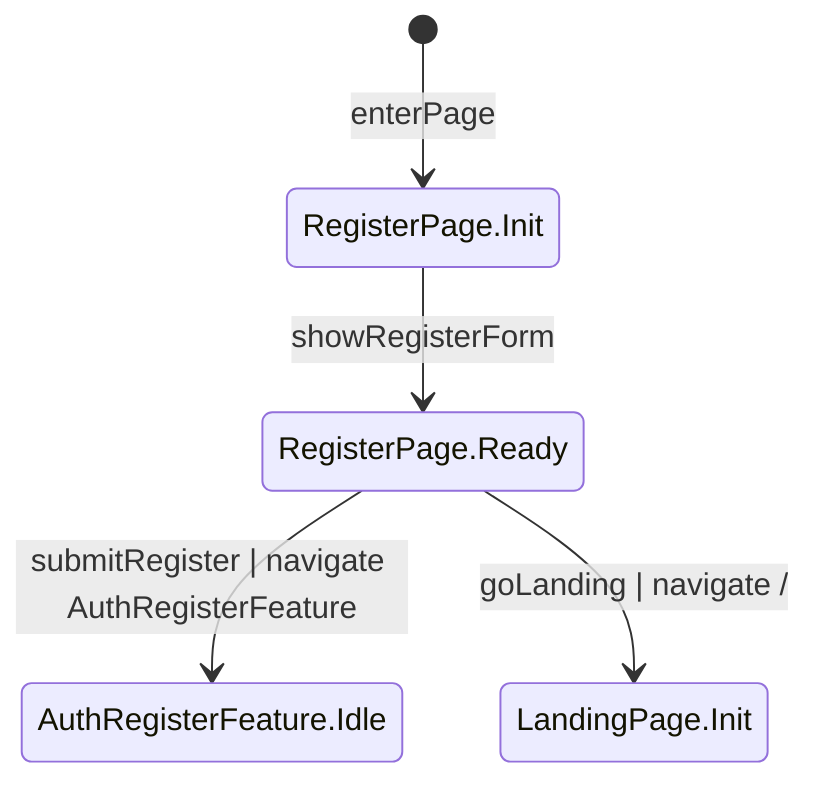
```mermaid
%% role: none
stateDiagram-v2
    [*] --> RegisterPage.Init : enterPage
    %% verify: route /register is entered explicitly, guest-safe navigation remains visible, and no project data request occurs before registration

    RegisterPage.Init --> RegisterPage.Ready : showRegisterForm
    %% verify: registration inputs, submit control, and validation messaging area are visible, and no authenticated project navigation is shown

    RegisterPage.Ready --> AuthRegisterFeature.Idle : submitRegister | navigate AuthRegisterFeature
    %% verify: one registration request is initiated, submit becomes non-repeatable while pending, and account creation is handled by the auth registration feature

    RegisterPage.Ready --> LandingPage.Init : goLanding | navigate /
    %% verify: route returns to /, guest navigation remains visible, and partially entered registration data does not expose any authenticated UI
```

### ProjectListPage

```mermaid
%% role: User
stateDiagram-v2
    [*] --> ProjectListPage.Init : enterPage
    %% verify: entering /projects requires authenticated User state, Header shows projects and logout, and Visitor-only login/register links are hidden

    ProjectListPage.Init --> ProjectListPage.Loading : fetchProjects
    %% verify: a projects API request is sent with valid auth, loading UI is shown, and the page prevents duplicate initial fetch actions

    ProjectListPage.Loading --> ProjectListPage.Empty : projectListLoadedEmpty
    %% verify: projects API returns 200 with an empty collection, the empty-state UI is shown, create-project CTA is visible once, and invitations can still be accessed without duplicate entry points

    ProjectListPage.Loading --> ProjectListPage.Ready : projectListLoaded
    %% verify: projects API returns 200 with accessible projects, each listed project reflects current membership visibility, and only projects with valid membership are shown

    ProjectListPage.Loading --> ProjectListPage.Error : projectListFailed
    %% verify: failed load keeps the user on /projects, error UI appears with retry, and stale data is not presented as the latest authoritative list

    ProjectListPage.Empty --> ProjectCreateFeature.Idle : clickCreateProject | navigate ProjectCreateFeature
    %% verify: create-project entry is available only to authenticated User, the create flow opens once, and no duplicate create CTA remains active in the empty state

    ProjectListPage.Empty --> InvitationResponseFeature.Idle : openInvitations | navigate InvitationResponseFeature
    %% verify: invitation inbox opens from the list page, only invitations bound to the current user are loaded, and no separate invitation page route is introduced

    ProjectListPage.Ready --> ProjectCreateFeature.Idle : clickCreateProject | navigate ProjectCreateFeature
    %% verify: create-project flow opens from the ready list, authenticated user context is preserved, and the page does not render duplicate create entries during the transition

    ProjectListPage.Ready --> InvitationResponseFeature.Idle : openInvitations | navigate InvitationResponseFeature
    %% verify: pending invitations for the current authenticated user are loaded, acceptance or rejection remains page-scoped, and unrelated project records are not modified

    ProjectListPage.Ready --> ProjectBoardPage.OwnerAdmin.Init : openProjectAsOwnerAdmin | navigate /projects/:projectId/board
    %% verify: board route resolves for a project where the user role is owner or admin, board access API does not return 403 or 404, and owner/admin management navigation becomes available on the next page

    ProjectListPage.Ready --> ProjectBoardPage.Member.Init : openProjectAsMember | navigate /projects/:projectId/board
    %% verify: board route resolves for a project where the user role is member, write-capable task controls are allowed, and owner-only settings navigation stays hidden

    ProjectListPage.Ready --> ProjectBoardPage.Viewer.Init : openProjectAsViewer | navigate /projects/:projectId/board
    %% verify: board route resolves for a project where the user role is viewer, board data is readable, and task creation, drag, comment, assignment, and member-management controls remain hidden

    ProjectListPage.Error --> ProjectListPage.Loading : retryLoad
    %% verify: retry issues one fresh projects request, loading state reappears, and previous error messaging is replaced only after the new response arrives

    ProjectListPage.Empty --> LandingPage.Init : logout | navigate /
    %% verify: logout invalidates authenticated access, route returns to /, Header switches back to login/register, and a subsequent /projects request returns 401 or redirects to login

    ProjectListPage.Ready --> LandingPage.Init : logout | navigate /
    %% verify: logout removes projects/logout navigation, project data is no longer accessible, and auth refresh for the signed-out session is rejected by the server

    ProjectListPage.Error --> LandingPage.Init : logout | navigate /
    %% verify: logout still succeeds from an error state, authenticated UI is cleared, and no protected project data remains visible after returning to /
```

### ActivityLogPage
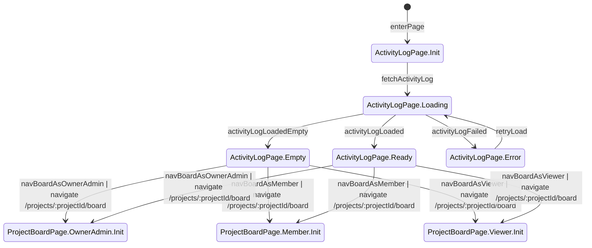
```mermaid
%% role: Owner|Admin|Member|Viewer
stateDiagram-v2
    [*] --> ActivityLogPage.Init : enterPage
    %% verify: entering /projects/:projectId/activity is allowed only for project members, the route does not expose another project's log, and project navigation is limited to member-visible items

    ActivityLogPage.Init --> ActivityLogPage.Loading : fetchActivityLog
    %% verify: activity log API request is issued for the current project, loading UI appears, and the request carries authenticated membership context

    ActivityLogPage.Loading --> ActivityLogPage.Empty : activityLogLoadedEmpty
    %% verify: API returns 200 with no events, empty-state messaging is shown, and realtime subscription remains available for future appended events

    ActivityLogPage.Loading --> ActivityLogPage.Ready : activityLogLoaded
    %% verify: API returns 200 with append-only events, entries belong to the current project only, and the list order matches the defined activity ordering

    ActivityLogPage.Loading --> ActivityLogPage.Error : activityLogFailed
    %% verify: failed load shows retryable error UI, no unauthorized project events are displayed, and the page does not mutate log data locally

    ActivityLogPage.Empty --> ProjectBoardPage.OwnerAdmin.Init : navBoardAsOwnerAdmin | navigate /projects/:projectId/board
    %% verify: route returns to the same project's board for owner/admin, management controls remain available, and no cross-project navigation occurs

    ActivityLogPage.Empty --> ProjectBoardPage.Member.Init : navBoardAsMember | navigate /projects/:projectId/board
    %% verify: route returns to the same project's board for member, task collaboration controls remain available, and owner-only settings stay hidden

    ActivityLogPage.Empty --> ProjectBoardPage.Viewer.Init : navBoardAsViewer | navigate /projects/:projectId/board
    %% verify: route returns to the same project's board for viewer, the board remains read-only, and write controls do not appear

    ActivityLogPage.Ready --> ProjectBoardPage.OwnerAdmin.Init : navBoardAsOwnerAdmin | navigate /projects/:projectId/board
    %% verify: returning from a populated log preserves the same project context, owner/admin actions remain visible, and the activity view does not duplicate board CTAs

    ActivityLogPage.Ready --> ProjectBoardPage.Member.Init : navBoardAsMember | navigate /projects/:projectId/board
    %% verify: returning from a populated log preserves member task permissions, same-project board data loads, and settings access stays blocked

    ActivityLogPage.Ready --> ProjectBoardPage.Viewer.Init : navBoardAsViewer | navigate /projects/:projectId/board
    %% verify: returning from a populated log preserves viewer read-only state, same-project board data loads, and no editing CTA becomes visible

    ActivityLogPage.Error --> ActivityLogPage.Loading : retryLoad
    %% verify: retry issues a fresh activity-log request for the same project, loading UI replaces the error state, and no local append mutates the authoritative log order
```

### ArchivedViewPage
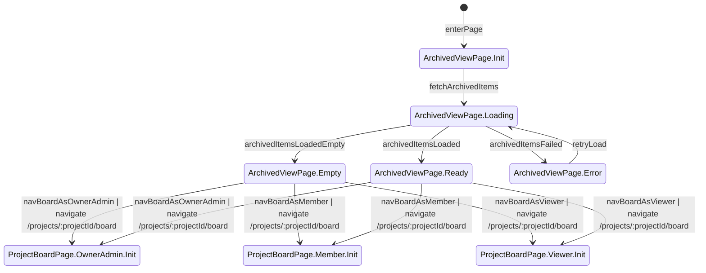
```mermaid
%% role: Owner|Admin|Member|Viewer
stateDiagram-v2
    [*] --> ArchivedViewPage.Init : enterPage
    %% verify: entering /projects/:projectId/archived is allowed only for project members, archived content is scoped to the current project, and the page is rendered as read-only

    ArchivedViewPage.Init --> ArchivedViewPage.Loading : fetchArchivedItems
    %% verify: archived-items request is sent for the current project, loading UI is shown, and no edit controls are activated during load

    ArchivedViewPage.Loading --> ArchivedViewPage.Empty : archivedItemsLoadedEmpty
    %% verify: API returns 200 with no archived items, empty-state UI appears, and the page remains read-only without create or restore controls

    ArchivedViewPage.Loading --> ArchivedViewPage.Ready : archivedItemsLoaded
    %% verify: API returns 200 with archived task or board/list records for the current project, archived status is visible, and all items remain non-editable

    ArchivedViewPage.Loading --> ArchivedViewPage.Error : archivedItemsFailed
    %% verify: error UI is shown, no writable fallback UI is displayed, and stale archived data is not treated as current authoritative state

    ArchivedViewPage.Empty --> ProjectBoardPage.OwnerAdmin.Init : navBoardAsOwnerAdmin | navigate /projects/:projectId/board
    %% verify: route returns to the same project's owner/admin board, management controls reappear there, and archived view stays closed

    ArchivedViewPage.Empty --> ProjectBoardPage.Member.Init : navBoardAsMember | navigate /projects/:projectId/board
    %% verify: route returns to the same project's member board, member task actions reappear there, and archived records remain unchanged

    ArchivedViewPage.Empty --> ProjectBoardPage.Viewer.Init : navBoardAsViewer | navigate /projects/:projectId/board
    %% verify: route returns to the same project's viewer board, board remains read-only, and no write controls appear

    ArchivedViewPage.Ready --> ProjectBoardPage.OwnerAdmin.Init : navBoardAsOwnerAdmin | navigate /projects/:projectId/board
    %% verify: leaving a populated archived view restores the same project board route for owner/admin, and archived items remain unaffected by the navigation

    ArchivedViewPage.Ready --> ProjectBoardPage.Member.Init : navBoardAsMember | navigate /projects/:projectId/board
    %% verify: leaving a populated archived view restores the same project board route for member, and archived items are still excluded from active task lanes

    ArchivedViewPage.Ready --> ProjectBoardPage.Viewer.Init : navBoardAsViewer | navigate /projects/:projectId/board
    %% verify: leaving a populated archived view restores the same project board route for viewer, and write actions stay hidden

    ArchivedViewPage.Error --> ArchivedViewPage.Loading : retryLoad
    %% verify: retry issues one fresh archived-items request, the page remains read-only during reload, and no local mutation is applied to archived records
```

## ③ Role-specific Page State

### ProjectBoardPage.OwnerAdmin

```mermaid
%% role: Owner|Admin
stateDiagram-v2
    [*] --> ProjectBoardPage.OwnerAdmin.Init : enterPage
    %% verify: owner/admin board route is entered for the current project, membership check passes, and owner/admin navigation including members and activity is available while non-member access stays blocked

    ProjectBoardPage.OwnerAdmin.Init --> ProjectBoardPage.OwnerAdmin.Loading : fetchBoardSnapshot
    %% verify: board snapshot request includes boards, lists, tasks, ordering, and current membership context for the selected project, and loading UI blocks duplicate initial writes

    ProjectBoardPage.OwnerAdmin.Loading --> ProjectBoardPage.OwnerAdmin.Empty : boardSnapshotLoadedEmpty
    %% verify: API returns 200 with no active board or list content, empty-state UI appears, and board/list creation controls remain visible to owner/admin only

    ProjectBoardPage.OwnerAdmin.Loading --> ProjectBoardPage.OwnerAdmin.Ready : boardSnapshotLoaded
    %% verify: API returns 200 with the authoritative board snapshot, list order and task positions match server state, and owner/admin controls for structure and WIP are visible

    ProjectBoardPage.OwnerAdmin.Loading --> ProjectBoardPage.OwnerAdmin.Error : boardSnapshotFailed
    %% verify: board load failure shows retryable error UI, stale ordering is not treated as current, and no write action is silently applied

    ProjectBoardPage.OwnerAdmin.Empty --> BoardStructureFeature.Idle : createBoardOrList | navigate BoardStructureFeature
    %% verify: only owner/admin can enter board-structure management from the empty state, structure mutation starts from a dedicated feature flow, and no duplicate creation entry is shown

    ProjectBoardPage.OwnerAdmin.Ready --> TaskDetailPanel.Editor.Init : openTask | navigate TaskDetailPanel
    %% verify: selected task detail opens for the current project, editor-capable controls are available because the role is owner/admin, and task data is loaded from the authoritative source

    ProjectBoardPage.OwnerAdmin.Ready --> TaskCreateFeature.Idle : clickCreateTask | navigate TaskCreateFeature
    %% verify: create-task action is available on writable lists only, the action does not appear twice for the same lane, and owner/admin role can proceed even when WIP override may later be required

    ProjectBoardPage.OwnerAdmin.Ready --> TaskMoveFeature.Idle : dragTask | navigate TaskMoveFeature
    %% verify: drag action is enabled only for non-archived tasks inside non-archived board or list scope, move feature receives current list and position context, and owner/admin may later override WIP if needed

    ProjectBoardPage.OwnerAdmin.Ready --> BoardStructureFeature.Idle : manageBoardsLists | navigate BoardStructureFeature
    %% verify: board/list create, reorder, and archive controls are visible only to owner/admin, current board structure context is passed into the feature, and viewer/member-only UI remains unchanged

    ProjectBoardPage.OwnerAdmin.Ready --> WipRuleFeature.Idle : configureWip | navigate WipRuleFeature
    %% verify: WIP configuration controls are visible only to owner/admin, current list WIP settings are loaded, and no member-level action can open this feature

    ProjectBoardPage.OwnerAdmin.Ready --> MembersPage.OwnerAdmin.Init : navMembers | navigate /projects/:projectId/members
    %% verify: route changes to the same project's members page, member-management controls remain available, and the page is not accessible for non-members

    ProjectBoardPage.OwnerAdmin.Ready --> ActivityLogPage.Init : navActivity | navigate /projects/:projectId/activity
    %% verify: route changes to the same project's activity page, append-only events can be reviewed, and project scope stays consistent

    ProjectBoardPage.OwnerAdmin.Ready --> ArchivedViewPage.Init : navArchived | navigate /projects/:projectId/archived
    %% verify: route changes to the same project's archived view, archived entities remain read-only, and active board data is left unchanged

    ProjectBoardPage.OwnerAdmin.Ready --> ProjectSettingsPage.Init : navSettings | navigate /projects/:projectId/settings
    %% verify: owner-only settings route is entered only when the acting role is owner, settings controls appear, and admin users do not receive this transition in their visible navigation

    ProjectBoardPage.OwnerAdmin.Ready --> ProjectBoardPage.OwnerAdmin.Reconnecting : realtimeDisconnected
    %% verify: disconnect banner or status appears, write operations pause until resync, and the current board snapshot remains visibly stale rather than silently diverging

    ProjectBoardPage.OwnerAdmin.Reconnecting --> ProjectBoardPage.OwnerAdmin.Loading : reconnectAndResync
    %% verify: reconnect triggers a fresh snapshot request, server-authoritative board/list/task ordering replaces local stale state, and unsent local edits are not applied without conflict handling

    ProjectBoardPage.OwnerAdmin.Error --> ProjectBoardPage.OwnerAdmin.Loading : retryLoad
    %% verify: retry issues one new snapshot request for the same project, loading state replaces the error state, and no duplicate write action is fired during recovery

    ProjectBoardPage.OwnerAdmin.Empty --> ProjectListPage.Init : navProjects | navigate /projects
    %% verify: navigation returns to the authenticated project list, owner/admin project visibility remains intact there, and board-specific controls disappear outside the project scope

    ProjectBoardPage.OwnerAdmin.Ready --> ProjectListPage.Init : navProjects | navigate /projects
    %% verify: navigation returns to the authenticated project list, realtime board subscription is released, and no project-internal write control remains visible on the list page
```

### ProjectBoardPage.Member

```mermaid
%% role: Member
stateDiagram-v2
    [*] --> ProjectBoardPage.Member.Init : enterPage
    %% verify: member board route is entered for the current project, membership check passes, and member-visible navigation appears without owner-only settings or admin-only management controls

    ProjectBoardPage.Member.Init --> ProjectBoardPage.Member.Loading : fetchBoardSnapshot
    %% verify: board snapshot request is sent with member auth, loading UI appears, and no duplicate initial task mutation is allowed during load

    ProjectBoardPage.Member.Loading --> ProjectBoardPage.Member.Empty : boardSnapshotLoadedEmpty
    %% verify: API returns 200 with no active board or list content, empty-state UI is shown, and structure-management controls remain hidden from member role

    ProjectBoardPage.Member.Loading --> ProjectBoardPage.Member.Ready : boardSnapshotLoaded
    %% verify: API returns 200 with authoritative boards, lists, tasks, and ordering, member task collaboration controls are visible, and owner/admin-only WIP configuration remains hidden

    ProjectBoardPage.Member.Loading --> ProjectBoardPage.Member.Error : boardSnapshotFailed
    %% verify: error UI appears with retry, current stale ordering is not treated as authoritative, and member cannot write through the error state

    ProjectBoardPage.Member.Empty --> ProjectListPage.Init : navProjects | navigate /projects
    %% verify: route returns to /projects, authenticated user navigation remains visible, and no project-internal control remains on the list page

    ProjectBoardPage.Member.Ready --> TaskDetailPanel.Editor.Init : openTask | navigate TaskDetailPanel
    %% verify: selected task opens in editor-capable detail view for member, write actions remain limited to allowed task operations, and no admin-only structure controls are introduced

    ProjectBoardPage.Member.Ready --> TaskCreateFeature.Idle : clickCreateTask | navigate TaskCreateFeature
    %% verify: create-task action is visible only on writable lists, duplicate create entries are not shown on the same board lane, and member proceeds without WIP override privilege

    ProjectBoardPage.Member.Ready --> TaskMoveFeature.Idle : dragTask | navigate TaskMoveFeature
    %% verify: drag is available only for non-archived tasks in writable board/list scope, list_id and position context are passed into the move feature, and member cannot invoke override-WIP-only behavior

    ProjectBoardPage.Member.Ready --> MembersPage.MemberViewer.Init : navMembers | navigate /projects/:projectId/members
    %% verify: route changes to the same project's members page, member can inspect members, and invitation or role-management controls remain hidden

    ProjectBoardPage.Member.Ready --> ActivityLogPage.Init : navActivity | navigate /projects/:projectId/activity
    %% verify: route changes to the same project's activity page, member can read append-only events, and project scope stays unchanged

    ProjectBoardPage.Member.Ready --> ArchivedViewPage.Init : navArchived | navigate /projects/:projectId/archived
    %% verify: route changes to the same project's archived view, archived entities remain read-only, and member cannot restore or edit archived content

    ProjectBoardPage.Member.Ready --> ProjectBoardPage.Member.Reconnecting : realtimeDisconnected
    %% verify: disconnect state is visible, realtime updates pause, and the member sees that the current board may be stale until resync completes

    ProjectBoardPage.Member.Reconnecting --> ProjectBoardPage.Member.Loading : reconnectAndResync
    %% verify: reconnect triggers a fresh board snapshot request, server-authoritative ordering replaces stale local state, and unsent local edits require explicit conflict resolution before reuse

    ProjectBoardPage.Member.Error --> ProjectBoardPage.Member.Loading : retryLoad
    %% verify: retry sends one new board snapshot request, loading UI replaces the error state, and no duplicate task mutation is fired while reloading

    ProjectBoardPage.Member.Ready --> ProjectListPage.Init : navProjects | navigate /projects
    %% verify: route returns to /projects, member project list remains accessible, and project-specific task controls disappear outside the board scope
```

### ProjectBoardPage.Viewer

```mermaid
%% role: Viewer
stateDiagram-v2
    [*] --> ProjectBoardPage.Viewer.Init : enterPage
    %% verify: viewer board route is entered for the current project, membership check passes, and the page loads in read-only mode with no create, drag, assign, comment, or management controls

    ProjectBoardPage.Viewer.Init --> ProjectBoardPage.Viewer.Loading : fetchBoardSnapshot
    %% verify: board snapshot request is sent with viewer auth, loading UI appears, and no writable action is made available during load

    ProjectBoardPage.Viewer.Loading --> ProjectBoardPage.Viewer.Empty : boardSnapshotLoadedEmpty
    %% verify: API returns 200 with no active board or list content, empty-state UI is shown, and create or structure-management controls remain hidden for viewer

    ProjectBoardPage.Viewer.Loading --> ProjectBoardPage.Viewer.Ready : boardSnapshotLoaded
    %% verify: API returns 200 with authoritative boards, lists, tasks, and ordering, all data is readable, and every write control stays hidden for viewer role

    ProjectBoardPage.Viewer.Loading --> ProjectBoardPage.Viewer.Error : boardSnapshotFailed
    %% verify: error UI appears with retry, no stale write control is revealed, and the viewer cannot mutate board state through the error state

    ProjectBoardPage.Viewer.Empty --> ProjectListPage.Init : navProjects | navigate /projects
    %% verify: route returns to /projects, authenticated user navigation remains visible, and viewer-specific board context is cleared

    ProjectBoardPage.Viewer.Ready --> TaskDetailPanel.Viewer.Init : openTask | navigate TaskDetailPanel
    %% verify: selected task opens in read-only detail view, title or description and assignees are visible, and edit, assignment, comment, status-change, and archive actions remain hidden

    ProjectBoardPage.Viewer.Ready --> MembersPage.MemberViewer.Init : navMembers | navigate /projects/:projectId/members
    %% verify: route changes to the same project's members page, viewer can inspect membership, and role-change or invite controls remain hidden

    ProjectBoardPage.Viewer.Ready --> ActivityLogPage.Init : navActivity | navigate /projects/:projectId/activity
    %% verify: route changes to the same project's activity page, viewer can inspect append-only events, and no write control appears

    ProjectBoardPage.Viewer.Ready --> ArchivedViewPage.Init : navArchived | navigate /projects/:projectId/archived
    %% verify: route changes to the same project's archived view, archived content is readable, and all write actions remain hidden

    ProjectBoardPage.Viewer.Ready --> ProjectBoardPage.Viewer.Reconnecting : realtimeDisconnected
    %% verify: disconnect state is visible, realtime updates pause, and the viewer clearly sees that the current snapshot may be stale until reload completes

    ProjectBoardPage.Viewer.Reconnecting --> ProjectBoardPage.Viewer.Loading : reconnectAndResync
    %% verify: reconnect triggers a fresh snapshot request, server-authoritative order replaces local stale order, and viewer still receives read-only state after resync

    ProjectBoardPage.Viewer.Error --> ProjectBoardPage.Viewer.Loading : retryLoad
    %% verify: retry issues one new snapshot request, loading UI replaces the error state, and no mutation path appears during reload

    ProjectBoardPage.Viewer.Ready --> ProjectListPage.Init : navProjects | navigate /projects
    %% verify: route returns to /projects, viewer project visibility remains intact there, and no board write control follows the user outside the project scope
```

### TaskDetailPanel.Editor

```mermaid
%% role: Owner|Admin|Member
stateDiagram-v2
    [*] --> TaskDetailPanel.Editor.Init : enterPage
    %% verify: task detail panel opens in editor-capable mode only for owner, admin, or member, the panel is tied to the current project task, and no unrelated task data is exposed

    TaskDetailPanel.Editor.Init --> TaskDetailPanel.Editor.Loading : fetchTaskDetail
    %% verify: task detail API request includes current task identity, loading UI appears, and version plus assignee/comment context are requested for conflict-safe editing

    TaskDetailPanel.Editor.Loading --> TaskDetailPanel.Editor.Ready : taskDetailLoaded
    %% verify: API returns 200 with title, description, due date, priority, status, assignees, comments, and version for the selected task, and editor-only controls appear because role allows writing

    TaskDetailPanel.Editor.Loading --> TaskDetailPanel.Editor.Error : taskDetailFailed
    %% verify: error UI appears with retry, task data is not mutated locally, and the panel does not pretend to hold current authoritative task state

    TaskDetailPanel.Editor.Ready --> TaskEditFeature.Idle : editTask | navigate TaskEditFeature
    %% verify: edit flow is available only while the task and its board/list scope are writable, current version is preserved for conflict checks, and duplicate edit entry points are not shown

    TaskDetailPanel.Editor.Ready --> TaskAssignmentFeature.Idle : changeAssignees | navigate TaskAssignmentFeature
    %% verify: assignment flow is available only for writable tasks, assignee selection is limited to current project members, and non-member assignment is prevented before submit

    TaskDetailPanel.Editor.Ready --> TaskStatusFeature.Idle : changeTaskStatus | navigate TaskStatusFeature
    %% verify: status-change flow is available only for writable tasks, current task status is loaded for legal-transition checks, and archived tasks cannot enter this path

    TaskDetailPanel.Editor.Ready --> TaskCommentFeature.Idle : addComment | navigate TaskCommentFeature
    %% verify: comment flow is available only for owner, admin, or member on writable task scope, comment entry appears once, and viewer-only read mode is not mixed into this panel

    TaskDetailPanel.Editor.Ready --> TaskArchiveFeature.Idle : archiveTask | navigate TaskArchiveFeature
    %% verify: archive flow is available only while the task is not already archived and the surrounding project/board/list scope is writable, and no duplicate archive CTA appears

    TaskDetailPanel.Editor.Ready --> ProjectBoardPage.OwnerAdmin.Init : closePanelToOwnerAdminBoard | navigate /projects/:projectId/board
    %% verify: closing the panel returns owner/admin to the same project board, structure-management navigation becomes visible again there, and task detail state is dismissed

    TaskDetailPanel.Editor.Ready --> ProjectBoardPage.Member.Init : closePanelToMemberBoard | navigate /projects/:projectId/board
    %% verify: closing the panel returns member to the same project board, member task actions become visible again there, and owner-only settings stay hidden

    TaskDetailPanel.Editor.Error --> TaskDetailPanel.Editor.Loading : retryLoad
    %% verify: retry issues one new task detail request, loading UI replaces the panel error state, and no duplicate write is submitted while recovering
```

### TaskDetailPanel.Viewer
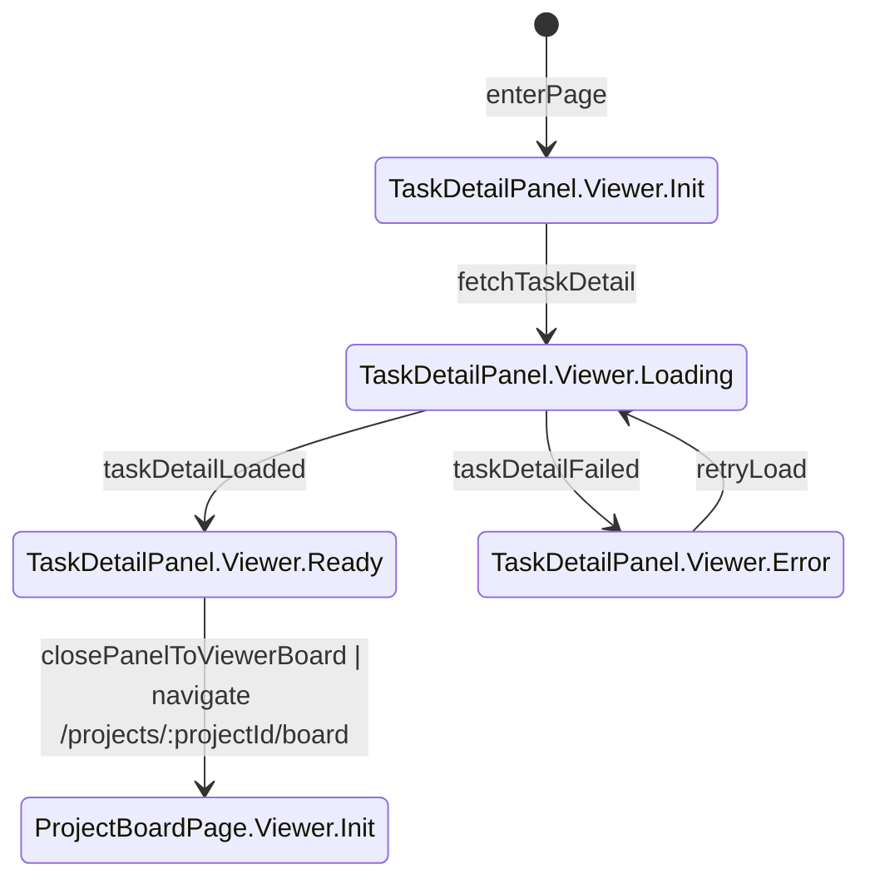
```mermaid
%% role: Viewer
stateDiagram-v2
    [*] --> TaskDetailPanel.Viewer.Init : enterPage
    %% verify: task detail panel opens in viewer mode only, the selected task belongs to the current project, and no editor controls appear

    TaskDetailPanel.Viewer.Init --> TaskDetailPanel.Viewer.Loading : fetchTaskDetail
    %% verify: read-only task detail request is sent for the current task, loading UI appears, and no writable state is exposed while loading

    TaskDetailPanel.Viewer.Loading --> TaskDetailPanel.Viewer.Ready : taskDetailLoaded
    %% verify: API returns 200 with readable task fields and comments for the selected task, viewer can inspect details, and edit, assignment, comment, status-change, and archive controls remain hidden

    TaskDetailPanel.Viewer.Loading --> TaskDetailPanel.Viewer.Error : taskDetailFailed
    %% verify: error UI appears with retry, no task mutation occurs, and the panel does not display stale writable affordances

    TaskDetailPanel.Viewer.Ready --> ProjectBoardPage.Viewer.Init : closePanelToViewerBoard | navigate /projects/:projectId/board
    %% verify: closing the panel returns viewer to the same project board, board remains read-only, and no write controls appear after navigation

    TaskDetailPanel.Viewer.Error --> TaskDetailPanel.Viewer.Loading : retryLoad
    %% verify: retry issues one new task detail request, loading UI replaces the error state, and viewer stays in read-only mode throughout recovery
```

### MembersPage.OwnerAdmin
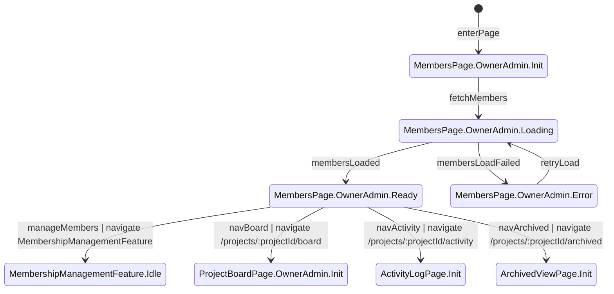
```mermaid
%% role: Owner|Admin
stateDiagram-v2
    [*] --> MembersPage.OwnerAdmin.Init : enterPage
    %% verify: owner/admin members page is entered for the current project, current membership is validated, and invite or role-management controls are visible only to allowed roles

    MembersPage.OwnerAdmin.Init --> MembersPage.OwnerAdmin.Loading : fetchMembers
    %% verify: members API request is sent for the current project, loading UI appears, and current roles are requested for permission-aware rendering

    MembersPage.OwnerAdmin.Loading --> MembersPage.OwnerAdmin.Ready : membersLoaded
    %% verify: API returns 200 with current member list and roles, owner/admin management controls are visible, and the single-owner constraint is reflected in available role actions

    MembersPage.OwnerAdmin.Loading --> MembersPage.OwnerAdmin.Error : membersLoadFailed
    %% verify: error UI appears with retry, no local membership mutation is treated as committed, and unrelated project membership data is not shown

    MembersPage.OwnerAdmin.Ready --> MembershipManagementFeature.Idle : manageMembers | navigate MembershipManagementFeature
    %% verify: invitation, role change, and member removal flow is available only to owner/admin, management context is scoped to the current project, and member/viewer pages do not expose this transition

    MembersPage.OwnerAdmin.Ready --> ProjectBoardPage.OwnerAdmin.Init : navBoard | navigate /projects/:projectId/board
    %% verify: route returns to the same project's owner/admin board, management navigation remains available, and membership view state is dismissed

    MembersPage.OwnerAdmin.Ready --> ActivityLogPage.Init : navActivity | navigate /projects/:projectId/activity
    %% verify: route changes to the same project's activity page, subsequent membership actions can be audited there, and project scope stays consistent

    MembersPage.OwnerAdmin.Ready --> ArchivedViewPage.Init : navArchived | navigate /projects/:projectId/archived
    %% verify: route changes to the same project's archived view, archived content remains read-only, and member-management controls are no longer shown there

    MembersPage.OwnerAdmin.Error --> MembersPage.OwnerAdmin.Loading : retryLoad
    %% verify: retry issues one new members request, loading UI replaces the error state, and no duplicate membership mutation is fired during recovery
```

### MembersPage.MemberViewer
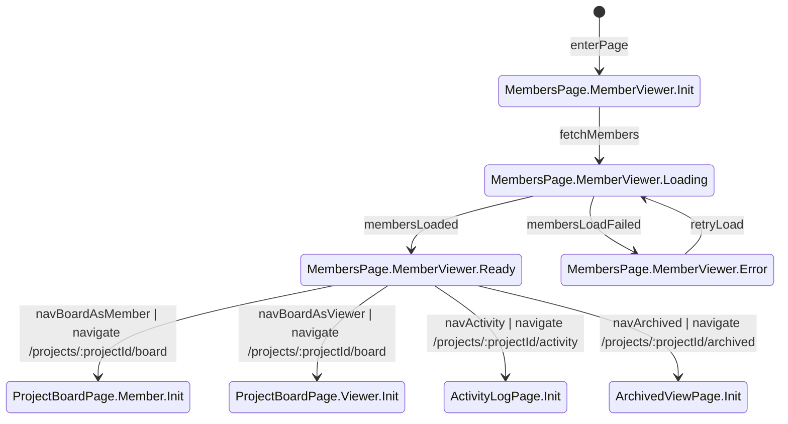
```mermaid
%% role: Member|Viewer
stateDiagram-v2
    [*] --> MembersPage.MemberViewer.Init : enterPage
    %% verify: member or viewer members page is entered for the current project, membership is validated, and the page renders in inspection-only mode without invite or role-management controls

    MembersPage.MemberViewer.Init --> MembersPage.MemberViewer.Loading : fetchMembers
    %% verify: members API request is sent for the current project, loading UI appears, and the page remains read-only while loading

    MembersPage.MemberViewer.Loading --> MembersPage.MemberViewer.Ready : membersLoaded
    %% verify: API returns 200 with current member list and roles, membership can be inspected, and invite, role-change, and remove actions remain hidden

    MembersPage.MemberViewer.Loading --> MembersPage.MemberViewer.Error : membersLoadFailed
    %% verify: error UI appears with retry, no management controls appear as fallback, and unrelated project membership data is not shown

    MembersPage.MemberViewer.Ready --> ProjectBoardPage.Member.Init : navBoardAsMember | navigate /projects/:projectId/board
    %% verify: member navigation returns to the same project's board, member task controls reappear there, and owner/admin structure controls remain hidden

    MembersPage.MemberViewer.Ready --> ProjectBoardPage.Viewer.Init : navBoardAsViewer | navigate /projects/:projectId/board
    %% verify: viewer navigation returns to the same project's board, board stays read-only, and no task write control appears

    MembersPage.MemberViewer.Ready --> ActivityLogPage.Init : navActivity | navigate /projects/:projectId/activity
    %% verify: route changes to the same project's activity page, append-only events remain readable, and no membership-management action is introduced

    MembersPage.MemberViewer.Ready --> ArchivedViewPage.Init : navArchived | navigate /projects/:projectId/archived
    %% verify: route changes to the same project's archived view, archived entities remain read-only, and membership inspection mode does not leak write controls

    MembersPage.MemberViewer.Error --> MembersPage.MemberViewer.Loading : retryLoad
    %% verify: retry issues one new members request, loading UI replaces the error state, and the page stays read-only throughout recovery
```

### ProjectSettingsPage
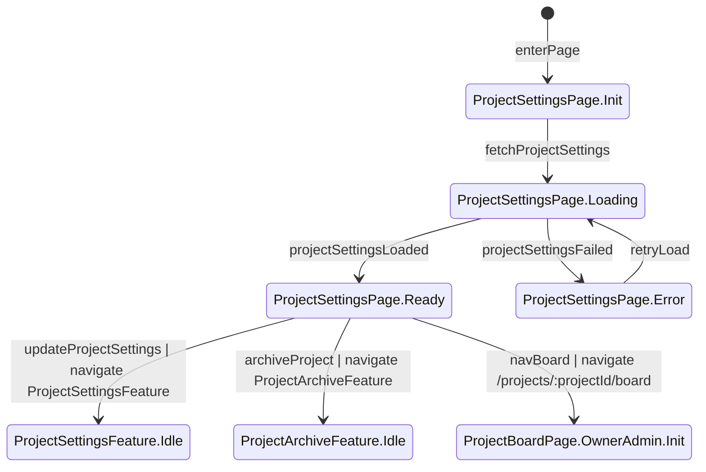
```mermaid
%% role: Owner
stateDiagram-v2
    [*] --> ProjectSettingsPage.Init : enterPage
    %% verify: owner settings page is entered for the current project, only owner can reach this route, and non-owner navigation does not expose this entry

    ProjectSettingsPage.Init --> ProjectSettingsPage.Loading : fetchProjectSettings
    %% verify: project settings API request is sent for the current project, loading UI appears, and current visibility or archive state is requested from the authoritative source

    ProjectSettingsPage.Loading --> ProjectSettingsPage.Ready : projectSettingsLoaded
    %% verify: API returns 200 with project name, description, visibility, and status, owner-only settings controls are visible, and no other role can modify them here

    ProjectSettingsPage.Loading --> ProjectSettingsPage.Error : projectSettingsFailed
    %% verify: error UI appears with retry, settings are not locally treated as saved, and no project mutation occurs from the error state

    ProjectSettingsPage.Ready --> ProjectSettingsFeature.Idle : updateProjectSettings | navigate ProjectSettingsFeature
    %% verify: only owner can open settings-update flow, editable fields are scoped to project basics and visibility, and no duplicate save entry is shown

    ProjectSettingsPage.Ready --> ProjectArchiveFeature.Idle : archiveProject | navigate ProjectArchiveFeature
    %% verify: only owner can open project-archive flow, current project must still be active to proceed, and archiving action appears once with clear scope

    ProjectSettingsPage.Ready --> ProjectBoardPage.OwnerAdmin.Init : navBoard | navigate /projects/:projectId/board
    %% verify: route returns to the same project's board, owner/admin board controls reappear, and settings UI is dismissed without mutating data

    ProjectSettingsPage.Error --> ProjectSettingsPage.Loading : retryLoad
    %% verify: retry issues one new project-settings request, loading UI replaces the error state, and no duplicate save or archive action is triggered during recovery
```

## ④ Feature / Function State Machine

### AuthLoginFeature
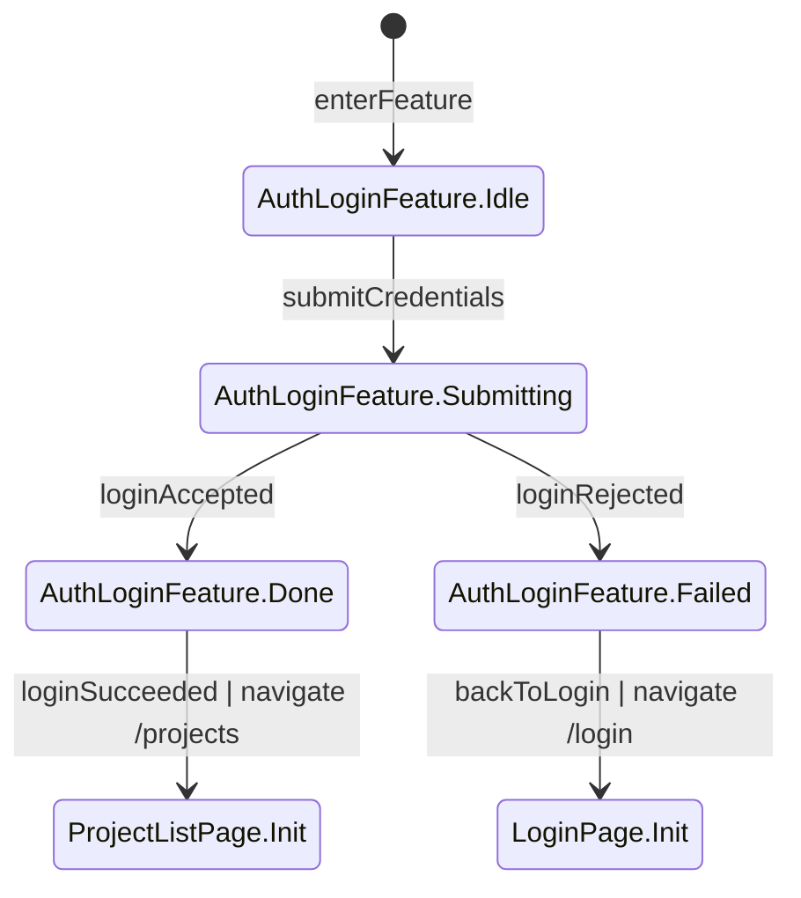
```mermaid
%% role: none
stateDiagram-v2
    [*] --> AuthLoginFeature.Idle : enterFeature
    %% verify: login feature starts only after explicit login submission, no project data is granted yet, and the flow waits for auth API completion

    AuthLoginFeature.Idle --> AuthLoginFeature.Submitting : submitCredentials
    %% verify: one auth request is sent with the submitted credentials, submit remains non-repeatable while pending, and no session is considered active before success

    AuthLoginFeature.Submitting --> AuthLoginFeature.Done : loginAccepted
    %% verify: auth API returns 200, access token and refresh path become usable, and the authenticated identity changes from Visitor to User

    AuthLoginFeature.Submitting --> AuthLoginFeature.Failed : loginRejected
    %% verify: auth API returns 401 or other rejection, no authenticated session is established, and field or form-level error messaging becomes available

    AuthLoginFeature.Done --> ProjectListPage.Init : loginSucceeded | navigate /projects
    %% verify: route changes to /projects, projects request can now succeed without 401, Header shows projects and logout, and login/register links are hidden

    AuthLoginFeature.Failed --> LoginPage.Init : backToLogin | navigate /login
    %% verify: route stays on /login, submitted credentials do not create project access, and the user can retry after seeing the specific failure message
```

### AuthRegisterFeature
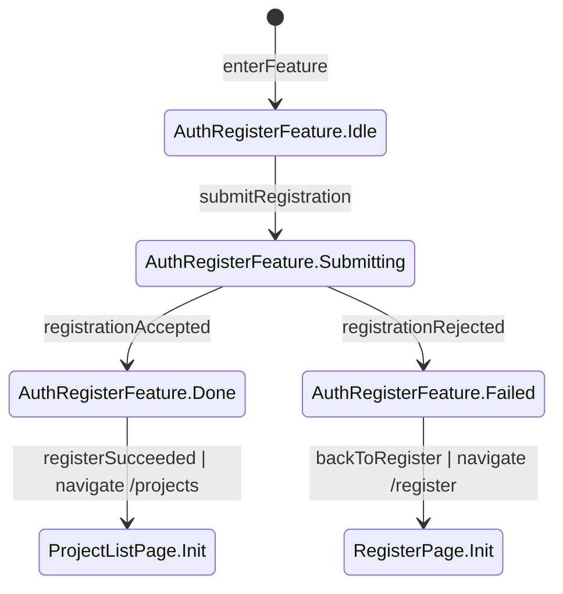
```mermaid
%% role: none
stateDiagram-v2
    [*] --> AuthRegisterFeature.Idle : enterFeature
    %% verify: registration feature starts only after explicit registration submission, and no authenticated project access is granted before account creation succeeds

    AuthRegisterFeature.Idle --> AuthRegisterFeature.Submitting : submitRegistration
    %% verify: one registration request is sent, submit stays non-repeatable while pending, and account creation is scoped to the submitted identity data

    AuthRegisterFeature.Submitting --> AuthRegisterFeature.Done : registrationAccepted
    %% verify: registration API returns 200 or equivalent success, a new user record is created, and authenticated user context becomes available

    AuthRegisterFeature.Submitting --> AuthRegisterFeature.Failed : registrationRejected
    %% verify: registration API returns validation or server rejection, no user session is established, and field or form-level error messaging becomes available

    AuthRegisterFeature.Done --> ProjectListPage.Init : registerSucceeded | navigate /projects
    %% verify: route changes to /projects, authenticated User navigation becomes visible, and follow-up project list loading does not return 401

    AuthRegisterFeature.Failed --> RegisterPage.Init : backToRegister | navigate /register
    %% verify: route stays on /register, no authenticated project access is exposed, and the user can correct invalid registration data
```

### ProjectCreateFeature
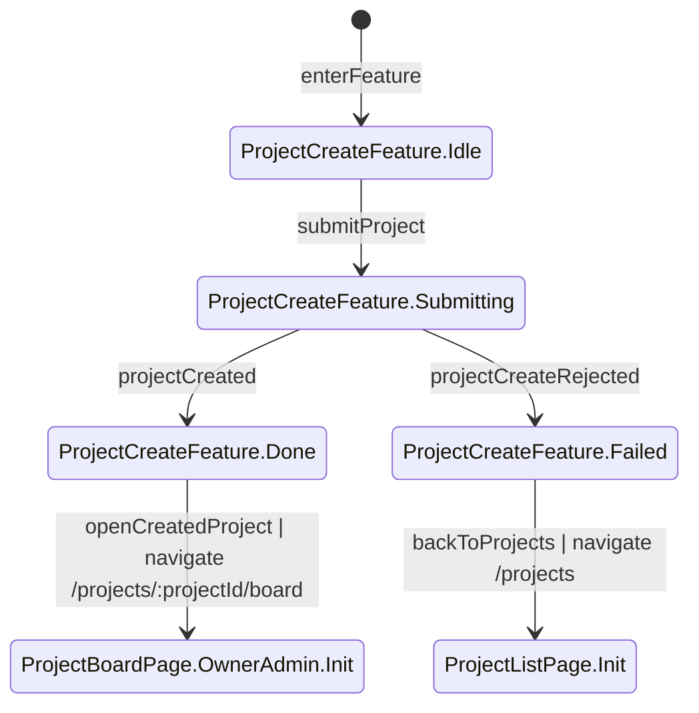
```mermaid
%% role: User
stateDiagram-v2
    [*] --> ProjectCreateFeature.Idle : enterFeature
    %% verify: project-create flow starts only for authenticated User, the feature is scoped to one pending project draft, and no project record exists yet

    ProjectCreateFeature.Idle --> ProjectCreateFeature.Submitting : submitProject
    %% verify: one project-create request is sent with required name, default visibility is private, default status is active, and duplicate submit is prevented while pending

    ProjectCreateFeature.Submitting --> ProjectCreateFeature.Done : projectCreated
    %% verify: API returns 200, project record is created with owner membership for the creator, and an append-only activity log entry for project creation is stored

    ProjectCreateFeature.Submitting --> ProjectCreateFeature.Failed : projectCreateRejected
    %% verify: API rejects invalid or failed creation, no project record is created, and no project-create activity log entry is appended

    ProjectCreateFeature.Done --> ProjectBoardPage.OwnerAdmin.Init : openCreatedProject | navigate /projects/:projectId/board
    %% verify: route opens the newly created project board, creator enters as owner with owner/admin controls visible, and the new project appears in subsequent project-list loads

    ProjectCreateFeature.Failed --> ProjectListPage.Init : backToProjects | navigate /projects
    %% verify: route returns to /projects, error state can be shown there, and the authoritative project list remains unchanged
```

### InvitationResponseFeature
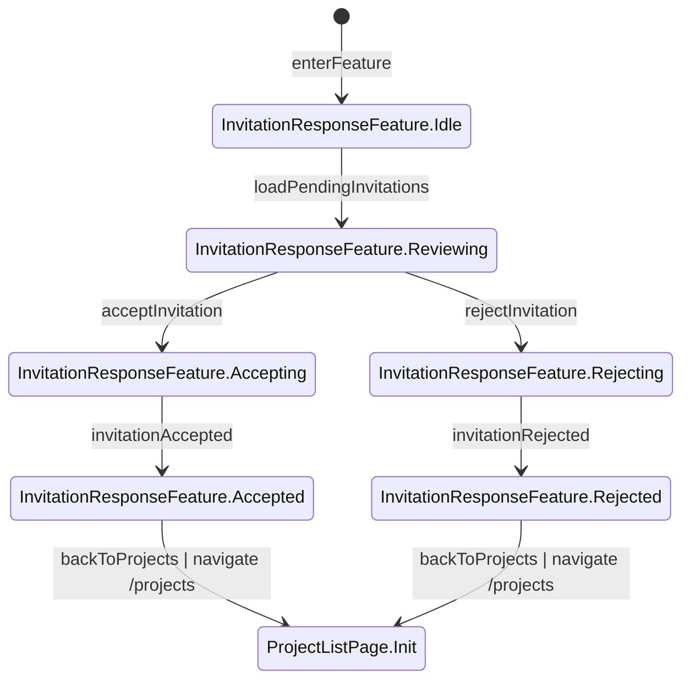
```mermaid
%% role: User
stateDiagram-v2
    [*] --> InvitationResponseFeature.Idle : enterFeature
    %% verify: invitation-response flow opens inside the projects page context, only invitations belonging to the current user identity are in scope, and no separate invitation route is created

    InvitationResponseFeature.Idle --> InvitationResponseFeature.Reviewing : loadPendingInvitations
    %% verify: pending invitations API returns invitations bound to the current user or email binding rule, invitation status is visible, and unrelated invitations are excluded

    InvitationResponseFeature.Reviewing --> InvitationResponseFeature.Accepting : acceptInvitation
    %% verify: accept action targets one pending invitation, duplicate accept submits are blocked while pending, and membership is not created until the server confirms success

    InvitationResponseFeature.Reviewing --> InvitationResponseFeature.Rejecting : rejectInvitation
    %% verify: reject action targets one pending invitation, duplicate reject submits are blocked while pending, and membership is not created by this path

    InvitationResponseFeature.Accepting --> InvitationResponseFeature.Accepted : invitationAccepted
    %% verify: API returns 200, invitation status becomes accepted, project membership is created with the invited role, and an append-only activity log entry reflects the acceptance

    InvitationResponseFeature.Rejecting --> InvitationResponseFeature.Rejected : invitationRejected
    %% verify: API returns 200, invitation status becomes rejected, no project membership is created, and invitation state remains auditable

    InvitationResponseFeature.Accepted --> ProjectListPage.Init : backToProjects | navigate /projects
    %% verify: route returns to /projects, the accepted project is now available in the current user's accessible project list, and role-based visibility matches the invited role

    InvitationResponseFeature.Rejected --> ProjectListPage.Init : backToProjects | navigate /projects
    %% verify: route returns to /projects, rejected invitation is no longer actionable, and the accessible project list remains unchanged by membership
```

### MembershipManagementFeature

```mermaid
%% role: Owner|Admin
stateDiagram-v2
    [*] --> MembershipManagementFeature.Idle : enterFeature
    %% verify: membership-management flow opens only for owner or admin within the current project, and the feature does not expose controls to member or viewer users

    MembershipManagementFeature.Idle --> MembershipManagementFeature.SubmittingInvite : submitInvitation
    %% verify: invitation request targets a specific email and invited role, invited role is limited to admin, member, or viewer through normal invite flow, and duplicate pending invites are handled by server rules

    MembershipManagementFeature.Idle --> MembershipManagementFeature.UpdatingRole : submitRoleChange
    %% verify: role-change request targets an existing membership in the current project, owner/admin permission is checked server-side, and the single-owner rule is preserved unless explicit ownership transfer rules are satisfied

    MembershipManagementFeature.Idle --> MembershipManagementFeature.RemovingMember : confirmRemoveMember
    %% verify: remove-member request targets an existing membership in the current project, owner-only restrictions are enforced where applicable, and pending removal is not committed before server success

    MembershipManagementFeature.SubmittingInvite --> MembershipManagementFeature.Done : invitationStored
    %% verify: invitation API returns 200, pending invitation is created or updated for the target email, and an append-only activity log entry records the invitation action

    MembershipManagementFeature.UpdatingRole --> MembershipManagementFeature.Done : membershipUpdated
    %% verify: role-update API returns 200, the target membership role changes in project data, and an append-only activity log entry records the role adjustment

    MembershipManagementFeature.RemovingMember --> MembershipManagementFeature.Done : memberRemoved
    %% verify: remove-member API returns 200, the target membership is removed from the project, any task assignments for that user in the project are automatically cleared or invalidated, and an append-only activity log entry records the removal

    MembershipManagementFeature.SubmittingInvite --> MembershipManagementFeature.Failed : invitationRejected
    %% verify: invite API rejects invalid or unauthorized invite input, no invitation record is committed, and no invite activity log entry is appended

    MembershipManagementFeature.UpdatingRole --> MembershipManagementFeature.Failed : membershipUpdateRejected
    %% verify: role-update API rejects invalid, unauthorized, or owner-constraint-breaking changes, membership data remains unchanged, and no invalid role change is recorded as successful

    MembershipManagementFeature.RemovingMember --> MembershipManagementFeature.Failed : memberRemoveRejected
    %% verify: remove-member API rejects unauthorized or invalid removal, membership and assignee consistency remain unchanged, and no successful removal log entry is appended

    MembershipManagementFeature.Done --> MembersPage.OwnerAdmin.Init : backToMembers | navigate /projects/:projectId/members
    %% verify: route returns to the same project's owner/admin members page, refreshed member data reflects the successful invite, role change, or removal, and management controls remain visible

    MembershipManagementFeature.Failed --> MembersPage.OwnerAdmin.Init : backToMembers | navigate /projects/:projectId/members
    %% verify: route returns to the same members page, current membership state remains authoritative and unchanged by the failed action, and error feedback can be displayed there
```

### BoardStructureFeature
```mermaid
%% role: Owner|Admin
stateDiagram-v2
    [*] --> BoardStructureFeature.Idle : enterFeature
    %% verify: board-structure feature opens only for owner/admin, current board and list scope belongs to the active project, and no member or viewer can enter this feature

    BoardStructureFeature.Idle --> BoardStructureFeature.Submitting : createOrReorderOrArchive
    %% verify: one structure mutation request is sent for board or list create, reorder, or archive, duplicate submits are blocked while pending, and affected order data is scoped to the current project

    BoardStructureFeature.Submitting --> BoardStructureFeature.Done : structureUpdated
    %% verify: API returns 200, board or list records and order values are updated authoritatively, archived board or list scope becomes read-only, and an append-only activity log entry records the structural change

    BoardStructureFeature.Submitting --> BoardStructureFeature.Failed : structureUpdateRejected
    %% verify: API rejects invalid or unauthorized structure mutation, board or list order remains unchanged, and no successful structural activity entry is appended

    BoardStructureFeature.Done --> ProjectBoardPage.OwnerAdmin.Init : backToBoard | navigate /projects/:projectId/board
    %% verify: route returns to the same project board, refreshed snapshot reflects the authoritative board/list structure and ordering, and owner/admin controls remain visible

    BoardStructureFeature.Failed --> ProjectBoardPage.OwnerAdmin.Init : backToBoard | navigate /projects/:projectId/board
    %% verify: route returns to the same board, previously authoritative board/list structure remains intact, and the failed mutation is not shown as committed
```

### WipRuleFeature
```mermaid
%% role: Owner|Admin
stateDiagram-v2
    [*] --> WipRuleFeature.Idle : enterFeature
    %% verify: WIP-rule feature opens only for owner/admin on the current project's list scope, and member or viewer cannot access this configuration path

    WipRuleFeature.Idle --> WipRuleFeature.Submitting : submitWipRule
    %% verify: one WIP configuration request is sent, is_wip_limited and positive wip_limit constraints are validated, and duplicate submit is blocked while pending

    WipRuleFeature.Submitting --> WipRuleFeature.Done : wipRuleUpdated
    %% verify: API returns 200, list WIP settings persist for the target list, current WIP enforcement state is updated, and an append-only activity log entry records the WIP rule change

    WipRuleFeature.Submitting --> WipRuleFeature.Failed : wipRuleRejected
    %% verify: API rejects invalid WIP data such as non-positive limit, list WIP settings remain unchanged, and no successful WIP-change activity entry is appended

    WipRuleFeature.Done --> ProjectBoardPage.OwnerAdmin.Init : backToBoard | navigate /projects/:projectId/board
    %% verify: route returns to the same project board, refreshed list state shows the updated WIP setting, and owner/admin controls remain available

    WipRuleFeature.Failed --> ProjectBoardPage.OwnerAdmin.Init : backToBoard | navigate /projects/:projectId/board
    %% verify: route returns to the same board, prior WIP settings remain authoritative, and the failed configuration is not shown as applied
```

### TaskCreateFeature
```mermaid
%% role: Owner|Admin|Member
stateDiagram-v2
    [*] --> TaskCreateFeature.Idle : enterFeature
    %% verify: task-create feature opens only from writable board context, target list belongs to the current project, and viewer cannot reach this feature

    TaskCreateFeature.Idle --> TaskCreateFeature.Submitting : submitTask
    %% verify: one task-create request is sent with required title and current list context, duplicate submit is blocked while pending, and member path does not request WIP override

    TaskCreateFeature.Idle --> TaskCreateFeature.SubmittingOverride : submitTaskWithWipOverride
    %% verify: override create path is available only to owner/admin, override reason is captured for audit, and the request is scoped to a WIP-limited list in the current project

    TaskCreateFeature.Submitting --> TaskCreateFeature.Done : taskCreated
    %% verify: API returns 200, task record is created with list_id and position in the target list, task status starts in a valid non-archived state, and an append-only activity log entry records task creation

    TaskCreateFeature.Submitting --> TaskCreateFeature.WipRejected : wipBlocked
    %% verify: API rejects task creation because the target list exceeds WIP and the actor lacks override privilege, no task record is created, and UI can show a specific WIP limit message

    TaskCreateFeature.Submitting --> TaskCreateFeature.Failed : taskCreateRejected
    %% verify: API rejects invalid or unauthorized task creation, no task record is created, and no successful task-create activity entry is appended

    TaskCreateFeature.SubmittingOverride --> TaskCreateFeature.Done : taskCreatedWithOverride
    %% verify: API returns 200, task record is created despite WIP limit, override is recorded in append-only activity metadata with reason and result, and authoritative list ordering includes the new task

    TaskCreateFeature.SubmittingOverride --> TaskCreateFeature.Failed : taskCreateRejected
    %% verify: override create request fails, no task record is created, and no successful override activity entry is appended

    TaskCreateFeature.Done --> ProjectBoardPage.OwnerAdmin.Init : backToBoardAsOwnerAdmin | navigate /projects/:projectId/board
    %% verify: route returns to the same project board for owner/admin, refreshed list shows the new task in authoritative order, and writable controls remain available

    TaskCreateFeature.Done --> ProjectBoardPage.Member.Init : backToBoardAsMember | navigate /projects/:projectId/board
    %% verify: route returns to the same project board for member, refreshed list shows the new task in authoritative order, and member still cannot configure WIP or structure

    TaskCreateFeature.WipRejected --> ProjectBoardPage.Member.Init : backToBoardAsMember | navigate /projects/:projectId/board
    %% verify: route returns to the same member board, no new task appears in the target list, and a specific WIP rejection message can be shown without altering task counts

    TaskCreateFeature.Failed --> ProjectBoardPage.OwnerAdmin.Init : backToBoardAsOwnerAdmin | navigate /projects/:projectId/board
    %% verify: route returns to the same owner/admin board, no unauthorized or invalid task appears, and authoritative task counts remain unchanged

    TaskCreateFeature.Failed --> ProjectBoardPage.Member.Init : backToBoardAsMember | navigate /projects/:projectId/board
    %% verify: route returns to the same member board, no invalid task appears in the list, and the failed create does not change task ordering or counts
```

### TaskMoveFeature
```mermaid
%% role: Owner|Admin|Member
stateDiagram-v2
    [*] --> TaskMoveFeature.Idle : enterFeature
    %% verify: task-move feature opens only from writable board context for a non-archived task, current list_id, target list, and position context belong to the same project, and viewer cannot enter this feature

    TaskMoveFeature.Idle --> TaskMoveFeature.SubmittingMove : submitTaskMove
    %% verify: one task-move request is sent with source list, target list, and target position, duplicate move submit is blocked while pending, and member path does not request WIP override

    TaskMoveFeature.Idle --> TaskMoveFeature.SubmittingOverrideMove : submitTaskMoveWithWipOverride
    %% verify: override move path is available only to owner/admin, override reason is captured for audit, and the request targets a WIP-limited destination list in the same project

    TaskMoveFeature.SubmittingMove --> TaskMoveFeature.Done : moveApplied
    %% verify: API returns 200, task list_id and position are updated authoritatively, affected source and destination list ordering are recalculated server-side, and an append-only activity log entry records the move or reorder

    TaskMoveFeature.SubmittingMove --> TaskMoveFeature.WipRejected : moveBlockedByWip
    %% verify: API rejects move because the destination list exceeds WIP and the actor lacks override privilege, task list_id and position remain unchanged, and UI can show a specific WIP message

    TaskMoveFeature.SubmittingMove --> TaskMoveFeature.Conflict : moveConflict
    %% verify: API reports a concurrent ordering or version conflict, server returns the latest authoritative task ordering, and the local pending move is not treated as committed

    TaskMoveFeature.SubmittingOverrideMove --> TaskMoveFeature.Done : moveAppliedWithOverride
    %% verify: API returns 200, task list_id and position update despite WIP limit, source and destination ordering are recalculated server-side, and an append-only activity log entry records the override reason and result

    TaskMoveFeature.SubmittingOverrideMove --> TaskMoveFeature.Conflict : moveConflict
    %% verify: API reports an ordering or version conflict on override move, authoritative ordering from the server wins, and no override result is shown as committed without success

    TaskMoveFeature.Done --> ProjectBoardPage.OwnerAdmin.Init : backToBoardAsOwnerAdmin | navigate /projects/:projectId/board
    %% verify: route returns to the same owner/admin board, refreshed snapshot shows authoritative list_id and position values, and owner/admin controls remain available

    TaskMoveFeature.Done --> ProjectBoardPage.Member.Init : backToBoardAsMember | navigate /projects/:projectId/board
    %% verify: route returns to the same member board, refreshed snapshot shows authoritative list_id and position values, and member still cannot access WIP configuration or board structure controls

    TaskMoveFeature.WipRejected --> ProjectBoardPage.Member.Init : backToBoardAsMember | navigate /projects/:projectId/board
    %% verify: route returns to the same member board, the task stays in its previous authoritative location, and WIP counts for both lists remain unchanged

    TaskMoveFeature.Conflict --> ProjectBoardPage.OwnerAdmin.Init : backToBoardAsOwnerAdmin | navigate /projects/:projectId/board
    %% verify: route returns to the same owner/admin board, latest authoritative ordering from the server is displayed, and no conflicting local ordering is preserved as current truth

    TaskMoveFeature.Conflict --> ProjectBoardPage.Member.Init : backToBoardAsMember | navigate /projects/:projectId/board
    %% verify: route returns to the same member board, latest authoritative ordering from the server is displayed, and the member must reapply the move explicitly if desired
```

### TaskEditFeature
```mermaid
%% role: Owner|Admin|Member
stateDiagram-v2
    [*] --> TaskEditFeature.Idle : enterFeature
    %% verify: task-edit feature opens only for writable task scope, current task version is available for conflict detection, and viewer cannot enter this feature

    TaskEditFeature.Idle --> TaskEditFeature.Submitting : submitTaskEdit
    %% verify: one task-update request is sent with editable fields such as title, description, due date, or priority, duplicate submit is blocked while pending, and task identity stays within the current project

    TaskEditFeature.Submitting --> TaskEditFeature.Done : taskUpdated
    %% verify: API returns 200, updated task fields persist, task version increments, and an append-only activity log entry records the task update

    TaskEditFeature.Submitting --> TaskEditFeature.Conflict : taskEditConflict
    %% verify: API reports version conflict, latest task payload is returned, local stale edit is not committed, and UI can prompt the user to reapply changes intentionally

    TaskEditFeature.Submitting --> TaskEditFeature.Failed : taskEditRejected
    %% verify: API rejects invalid or unauthorized edits, task fields and version remain unchanged, and no successful task-update activity entry is appended

    TaskEditFeature.Done --> TaskDetailPanel.Editor.Init : refreshTaskPanel | navigate TaskDetailPanel
    %% verify: task detail panel reloads the same task, updated fields and incremented version are visible, and writable controls remain consistent with role and scope

    TaskEditFeature.Conflict --> TaskDetailPanel.Editor.Init : refreshTaskPanel | navigate TaskDetailPanel
    %% verify: task detail panel reloads the latest authoritative task payload, conflict information can be shown, and stale local edits are not displayed as saved

    TaskEditFeature.Failed --> TaskDetailPanel.Editor.Init : refreshTaskPanel | navigate TaskDetailPanel
    %% verify: task detail panel reloads without applying the rejected edit, current authoritative fields remain visible, and the user can retry with corrected input if allowed
```

### TaskAssignmentFeature
```mermaid
%% role: Owner|Admin|Member
stateDiagram-v2
    [*] --> TaskAssignmentFeature.Idle : enterFeature
    %% verify: task-assignment feature opens only for writable task scope, candidate assignees are limited to current project members, and viewer cannot enter this feature

    TaskAssignmentFeature.Idle --> TaskAssignmentFeature.Submitting : submitAssignmentChange
    %% verify: one assignment-change request is sent with selected assignee_ids, duplicate submit is blocked while pending, and non-member user ids are rejected by validation

    TaskAssignmentFeature.Submitting --> TaskAssignmentFeature.Done : assignmentUpdated
    %% verify: API returns 200, task assignee_ids are updated to current project members only, removed members are not retained, and an append-only activity log entry records assign or unassign changes

    TaskAssignmentFeature.Submitting --> TaskAssignmentFeature.Failed : assignmentRejected
    %% verify: API rejects invalid or unauthorized assignment changes, task assignee_ids remain unchanged, and no successful assignment activity entry is appended

    TaskAssignmentFeature.Done --> TaskDetailPanel.Editor.Init : refreshTaskPanel | navigate TaskDetailPanel
    %% verify: task detail panel reloads the same task, updated assignee list is visible, and assignee data matches current project membership exactly

    TaskAssignmentFeature.Failed --> TaskDetailPanel.Editor.Init : refreshTaskPanel | navigate TaskDetailPanel
    %% verify: task detail panel reloads without changing assignee data, invalid assignee selections are not shown as committed, and the user can retry only with valid members
```

### TaskStatusFeature
```mermaid
%% role: Owner|Admin|Member
stateDiagram-v2
    [*] --> TaskStatusFeature.Idle : enterFeature
    %% verify: task-status feature opens only for writable task scope, current task status is loaded for legal-transition checks, and viewer cannot enter this feature

    TaskStatusFeature.Idle --> TaskStatusFeature.Submitting : submitStatusChange
    %% verify: one status-change request is sent with the intended target status, duplicate submit is blocked while pending, and archived tasks cannot be targeted for further transitions

    TaskStatusFeature.Submitting --> TaskStatusFeature.Done : statusUpdated
    %% verify: API returns 200, task status changes only along allowed transitions such as open to in_progress, blocked, done, or archived, and an append-only activity log entry records the status update

    TaskStatusFeature.Submitting --> TaskStatusFeature.Rejected : statusChangeRejected
    %% verify: API rejects illegal transition such as done back to in_progress or any change from archived, task status remains unchanged, and UI can show the specific transition rule violation

    TaskStatusFeature.Submitting --> TaskStatusFeature.Failed : statusChangeFailed
    %% verify: API rejects invalid or unauthorized status update for reasons other than transition legality, task status remains unchanged, and no successful status-change activity entry is appended

    TaskStatusFeature.Done --> TaskDetailPanel.Editor.Init : refreshTaskPanel | navigate TaskDetailPanel
    %% verify: task detail panel reloads the same task, updated status is visible, and related writable controls reflect the new state restrictions immediately

    TaskStatusFeature.Rejected --> TaskDetailPanel.Editor.Init : refreshTaskPanel | navigate TaskDetailPanel
    %% verify: task detail panel reloads without changing status, the illegal transition is not shown as committed, and the user sees the current authoritative status

    TaskStatusFeature.Failed --> TaskDetailPanel.Editor.Init : refreshTaskPanel | navigate TaskDetailPanel
    %% verify: task detail panel reloads without changing status, authoritative task data remains visible, and the user can retry only if the failure condition is resolved
```

### TaskCommentFeature
```mermaid
%% role: Owner|Admin|Member
stateDiagram-v2
    [*] --> TaskCommentFeature.Idle : enterFeature
    %% verify: task-comment feature opens only for owner, admin, or member on writable task scope, and viewer cannot enter this feature

    TaskCommentFeature.Idle --> TaskCommentFeature.Submitting : submitComment
    %% verify: one comment-create request is sent for the current task, duplicate submit is blocked while pending, and comment input is scoped to append-only creation rather than edit or delete

    TaskCommentFeature.Submitting --> TaskCommentFeature.Done : commentCreated
    %% verify: API returns 200, new comment is stored with the current task and author, realtime update can be delivered to project members, and an append-only activity log entry records comment creation

    TaskCommentFeature.Submitting --> TaskCommentFeature.Failed : commentRejected
    %% verify: API rejects invalid or unauthorized comment creation, no comment record is created, and no successful comment activity entry is appended

    TaskCommentFeature.Done --> TaskDetailPanel.Editor.Init : refreshTaskPanel | navigate TaskDetailPanel
    %% verify: task detail panel reloads the same task, the new comment appears in chronological order, and the refreshed comment list matches the authoritative server state

    TaskCommentFeature.Failed --> TaskDetailPanel.Editor.Init : refreshTaskPanel | navigate TaskDetailPanel
    %% verify: task detail panel reloads without adding the rejected comment, authoritative comment history remains unchanged, and the user can retry only if still authorized
```

### TaskArchiveFeature
```mermaid
%% role: Owner|Admin|Member
stateDiagram-v2
    [*] --> TaskArchiveFeature.Idle : enterFeature
    %% verify: task-archive feature opens only for writable task scope on a non-archived task, and viewer cannot enter this feature

    TaskArchiveFeature.Idle --> TaskArchiveFeature.Submitting : submitTaskArchive
    %% verify: one archive request is sent for the current task, duplicate submit is blocked while pending, and archived target state is treated as terminal for further edits or moves

    TaskArchiveFeature.Submitting --> TaskArchiveFeature.Done : taskArchived
    %% verify: API returns 200, task status becomes archived, the task is removed from active writable lanes or rendered archived there as designed, and an append-only activity log entry records task archiving

    TaskArchiveFeature.Submitting --> TaskArchiveFeature.Failed : taskArchiveRejected
    %% verify: API rejects invalid or unauthorized archiving, task status remains unchanged, and no successful archive activity entry is appended

    TaskArchiveFeature.Done --> ArchivedViewPage.Init : openArchivedView | navigate /projects/:projectId/archived
    %% verify: route changes to the same project's archived view, the archived task appears there in read-only form, and it no longer appears as an active writable task on the board snapshot

    TaskArchiveFeature.Failed --> TaskDetailPanel.Editor.Init : refreshTaskPanel | navigate TaskDetailPanel
    %% verify: task detail panel reloads without archiving the task, authoritative non-archived status remains visible, and writable controls remain subject to the unchanged current state
```

### ProjectSettingsFeature
```mermaid
%% role: Owner
stateDiagram-v2
    [*] --> ProjectSettingsFeature.Idle : enterFeature
    %% verify: project-settings update feature opens only for owner on the current project, and no non-owner can access this mutation path

    ProjectSettingsFeature.Idle --> ProjectSettingsFeature.Submitting : submitProjectSettings
    %% verify: one project-settings request is sent with editable fields such as name, description, or visibility, duplicate submit is blocked while pending, and the update is scoped to the current project only

    ProjectSettingsFeature.Submitting --> ProjectSettingsFeature.Done : projectSettingsUpdated
    %% verify: API returns 200, updated project basic fields or visibility persist, current project data reflects the new settings, and an append-only activity log entry records the settings update

    ProjectSettingsFeature.Submitting --> ProjectSettingsFeature.Failed : projectSettingsRejected
    %% verify: API rejects invalid or unauthorized settings update, project fields remain unchanged, and no successful settings-update activity entry is appended

    ProjectSettingsFeature.Done --> ProjectSettingsPage.Init : refreshSettingsPage | navigate /projects/:projectId/settings
    %% verify: route returns to the same project settings page, refreshed fields show the authoritative updated values, and owner-only controls remain visible

    ProjectSettingsFeature.Failed --> ProjectSettingsPage.Init : refreshSettingsPage | navigate /projects/:projectId/settings
    %% verify: route returns to the same settings page, authoritative previous values remain visible, and the rejected update is not shown as saved
```

### ProjectArchiveFeature
```mermaid
%% role: Owner
stateDiagram-v2
    [*] --> ProjectArchiveFeature.Idle : enterFeature
    %% verify: project-archive feature opens only for owner on an active project, and no admin, member, or viewer can access this mutation path

    ProjectArchiveFeature.Idle --> ProjectArchiveFeature.Submitting : submitProjectArchive
    %% verify: one project-archive request is sent for the current project, duplicate submit is blocked while pending, and the request clearly targets project-level archive scope

    ProjectArchiveFeature.Submitting --> ProjectArchiveFeature.Done : projectArchived
    %% verify: API returns 200, project status becomes archived, all board, list, task, and comment write actions become read-only across the project, and an append-only activity log entry records project archiving

    ProjectArchiveFeature.Submitting --> ProjectArchiveFeature.Failed : projectArchiveRejected
    %% verify: API rejects invalid or unauthorized archiving, project status remains active, and no successful project-archive activity entry is appended

    ProjectArchiveFeature.Done --> ArchivedViewPage.Init : openArchivedView | navigate /projects/:projectId/archived
    %% verify: route changes to the same project's archived view, archived project scope is read-only, and subsequent create, edit, drag, assign, comment, or archive actions are rejected server-side and hidden or disabled in UI

    ProjectArchiveFeature.Failed --> ProjectSettingsPage.Init : refreshSettingsPage | navigate /projects/:projectId/settings
    %% verify: route returns to the same settings page, project remains active, and owner can see that archive did not commit while current settings stay authoritative
```